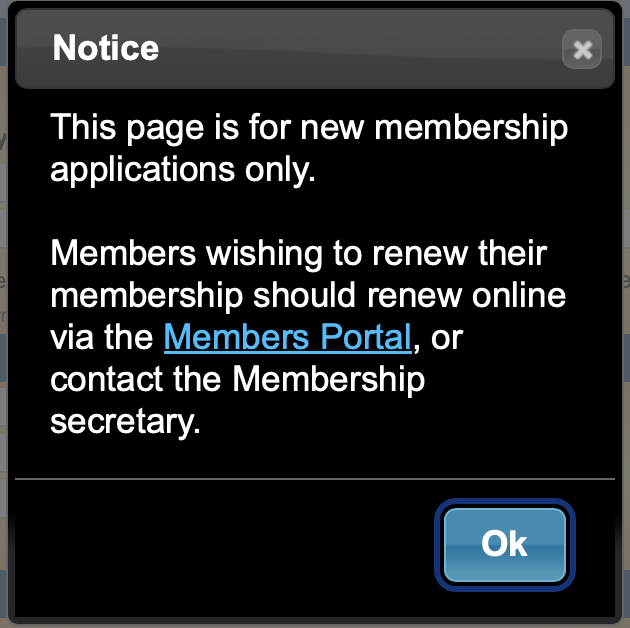
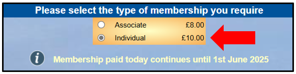
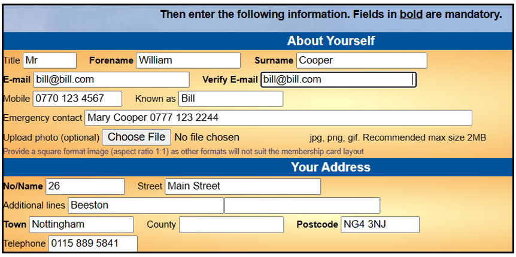
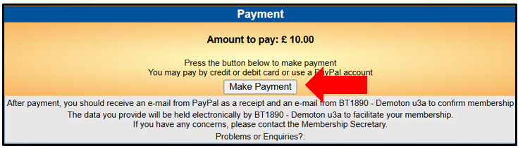
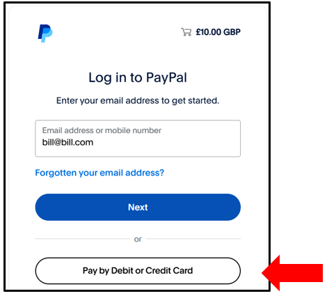
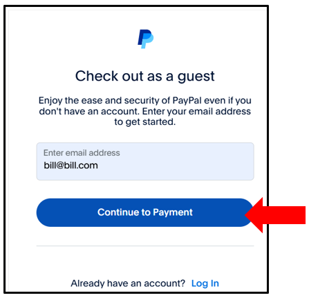
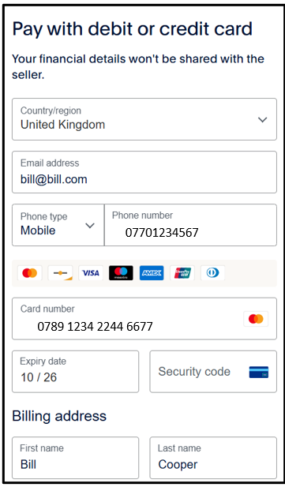
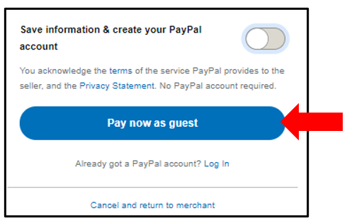
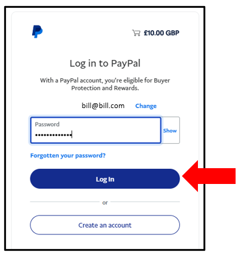
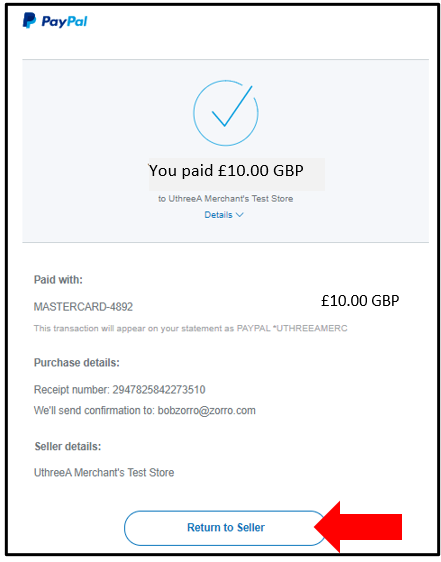

**10.1** **Online** **Joining**

> Back

Please note that the new joining screen with link to Membership joining
will be implemented early in January 2026

This page describes how to apply for a ***NEW*** membership of a u3a and
pay using a credit/debit card or PayPal (if the u3a has enabled Online
Membership applications).

If you are an **existing** **u3a** **member** wishing to renew, please
refer to [<u>10.2.1 Online
Renewals</u>](https://u3abeacon.zendesk.com/hc/en-gb/articles/360007368158-10-2-1-Online-Renewals).

**N.B.** **The** **Trust** **states** **that** **a** **Privacy**
**Policy** **is** **essential** **and** **having** **one** **is**
**also** **part** **of** **the** **Beacon** **Terms** **and**
**Conditions.**

**It** **is** **important** **that** **both** **new** **people**
**joining** **your** **u3a** **and** **existing** **members**
**renewing** **are** **reminded** **of** **this** **and** **that**
**you** **will** **only** **use** **it** **in** **accordance** **with**
**this** **policy.**

*Note:*

*Online* *payments* *are* *processed* *through* *your* *u3a's* *PayPal*
*account.* *You* *do* *not* *need* *your* *own* *PayPal* *account* *to*
*use* *this* *facility.*

*You* *will* *not* *be* *charged* *for* *using* *online* *membership*
*services,* *although* *you* *u3a* *will* *have* *a* *small*
*commission* *fee* *deducted* *from* *your* *payment* *by* *PayPal.*
*The* *types* *of* *membership* *and* *membership* *fees* *shown* *in*
*the* *pictures* *below* *are* *unlikely* *to* *be* *the* *same* *as*
*you* *will* *see* *–* *they* *are* *for* *example* *only.*

**Joining** **Online**

> 1\. The application process is usually initiated by clicking a link on
> your u3a’s website.
>
> For new members they will proceed with OK
>
> For Existing Members they can select to go to the Membership Portal :

2\. Select the type of membership that you require at the top of the
page:

3\. Fill in the details about yourself and your address using any
guidelines that have been supplied by your local u3a:

4\. Read the information about *Gift* *Aid* (if it has been enabled by
your u3a) before ticking one of the boxes to indicate whether or not you
would like your u3a to claim tax relief on your subscription:

> *Note:* *For* *Gift* *Aid* *claims* *to* *be* *processed,* *you*
> *must* *fill* *in* *a* ***Title*** *as* *this* *is* *required* *by*
> *HMRC.*
>
> 5\. Press the **Make** **Payment** button:
>
> If you did not select a box in the Gift Aid section you will be
> prompted to do so:

At this point you have 2 payment options:

Pay by **Debit** or **Credit** card (see **A** below), or Pay by
**PayPal** (see **B** below)

A\) Paying with your Debit/Credit Card

1\. To pay with a Debit or Credit card, enter your email address and
press **Pay** **by** **Debit** **or** **Credit** **Card**

2\. Enter your email address again at the next screen. Ignore the
options to Log in to PayPal and press **Continue** **to** **Payment**
followed by **Continue** **as** **a** **guest**

3\. Enter the details of your payment card and your contact details

4\. Press **Pay** **now** **as** **guest**

*Note:* *there* *is* *also* *the* *option* *of* *using* *the* *details*
*that* *you* *have* *entered* *to* *create* *and* *pay* *with* *a* *new*
*PayPal* *account* *by*

5\. Now skip **Section** **B** and continue to **Section** **C**
(**Confirmation** **of** **Payment**) below

B\) Paying with PayPal

1\. To pay with you own PayPal account, enter your email address and
press **Next**

*Note:* *if* *you* *don't* *have* *a* *PayPal* *account,* *but* *would*
*like* *to* *create* *a* *new* *one* *-* *follow* *the* *steps*
*described* *in* *section* *A* *above* *until* *the* *final* *step*
*when* *there* *is* *an* *option* *to* *create* *a* *PayPal* *account*
*using* *the* *details* *that* *you* *have* *already* *entered.*

2\. Enter your PayPal password and press **Log** **in**

3\. Select one of your stored credit cards or click **Add** **debit**
**or** **credit** **card** if you wish to use a different card, before
pressing **Complete** **Purchase**

C\) Confirmation of Payment

After receiving confirmation of payment, click **Return** **to**
**Seller** to return to your local u3a website

You will receive 2 confirmation emails:

A confirmation of payment from PayPal

A confirmation from your u3a. This may have your membership card
attached (if your u3a has chosen to use this facility)

*\[Note* *for* *System* *admins* *-* *The* *email* *from* *the* *u3a*
*is* *set* *in* *System* *Messages.* *If* *you* *are* *using* *the*
*Members* *Portal* *then* *we* *suggest* *that* *this* *email* *directs*
*new* *members* *to* *register* *for* *the* *Portal.* *You* *can* *use*
*the* *Tokens* *in* *this* *email* *to* *remind* *them* *of* *their*
*email* *address* *used* *and* *membership* *number.* *It* *can* *also*
*be* *helpful* *to* *remind* *them* *of* *the* *pieces* *of*
*information* *needed* *to* *register\]*

Revision History

||
||
||
||
||
||
||
||
||
||
||
||
