**10.2** **Members** **Portal**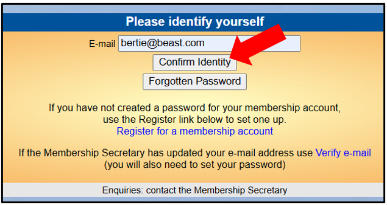

> Back

If you are a u3a member you can access the **Members** **Portal** where
you can typically see information about your u3a’s Interest Groups and
Calendar, view and update your contact details and renew your membership
online (as long as your u3a has enabled these features).

**The** **first** **time** **that** **you** **access** **the**
**Portal** **you** **will** **need** **to** **register** **for** **an**
**account** **as** **described** **in** **section** **b)** **below.**
**This** **is** **a** **one-off** **requirement** **-** **thereafter**
**signing** **in** **to** **the** **Members** **Portal** **is** **by**
**entering** **your** **email** **address** **and** **a** **password**
**only.**

a\) Signing-in to the Portal

Your u3a should have provided a link to access the Members Portal
sign-in page (probably on your u3a website or in an email to members).
If you have already registered for a Portal account:

> 1\. Enter your email address and press **Confirm** **Identity**:
>
> 2\. Enter your password and press **Confirm** **Identity**:

After signing in you will be able to do some or all of the following
depending on what your u3a has enabled:

> Renew and pay for your Membership, as described in
> [<u>10.2.1</u>](https://u3abeacon.zendesk.com/hc/en-gb/articles/360007368158)
>
> View information about your u3a's Interest Groups and add or remove
> yourself to/from Groups, as described in
> [<u>10.2.2</u>](https://u3abeacon.zendesk.com/hc/en-gb/articles/10378170759069) style="width:7.88704in;height:3.85716in" /> style="width:4.08744in;height:2.16845in" />
>
> View your u3a's Calendar of meetings & events and create your own
> personalised calendar for the Groups that you belong to, as described
> in
> [<u>10.2.3</u>](https://u3abeacon.zendesk.com/hc/en-gb/articles/10378393427997)
>
> View and update your Personal Details. Upload your photo (to be used
> on your membership card), as described in
> [<u>10.2.4</u>](https://u3abeacon.zendesk.com/hc/en-gb/articles/10378443378717)
>
> Order a replacement Membership Card, as described in
> [<u>10.2.5</u>](https://u3abeacon.zendesk.com/hc/en-gb/articles/10622099586461)

b\) Registering to use the Portal

The first time you access the Portal you will need to register as
follows:

> 1\. Before you start make sure you have your membership number to
> hand - it is shown on your Membership Card, or contact your Membership
> Secretary. Your u3a should have provided a link to access the Members
> Portal sign-in page (probably on your u3a website or in an email to
> members). Enter your email address and press **Confirm** **Identity**:
>
> *If* *you* *email* *address* *does* *not* *match* *that* *held* *on*
> *your* *u3a's* *records,* *you* *will* *be* *asked* *to* *check*
> *your* *email* *address* *and* *try* *again:*

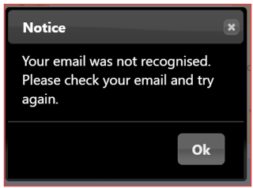

> *If* *your* *email* *address* *is* *still* *not* *recognised* *you*
> *will* *need* *to* *contact* *your* *Membership* *Secretary* *to*
> *check* *the* *email* *address* *held* *on* *the* *system.*
>
> *If* *your* *email* *address* *is* *shared* *with* *another* *u3a*
> *member* *who* *has* *previously* *registered* *for* *an* *account,*
> *refer* *to* *section* *c)* *below.*

2\. Type in your Membership number, Forename (or Familiar Name),
Surname, Post Code and Email Address, then press

> 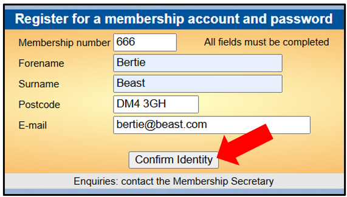 style="width:4.11623in;height:2.34116in" />**Confirm** **Identity**:
>
> 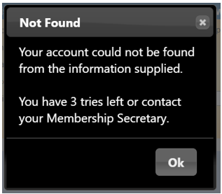 style="width:2.59063in;height:2.2644in" />*Note:* *The* *details*
> *entered* *have* *to* *exactly* *match* *those* *held* *by* *your*
> *u3a,* *otherwise* *you* *will* *be* *prompted* *to* *try* *again*
> *or* *contact* *your* *Membership* *Secretary:*
>
> After correctly entering the required 5 pieces of data you will be
> asked to create a password of between 10 and 72 characters including
> at least one upper case, one lower case and one numeric character.
> Enter your password in the 2
>
> boxes and press **Update** **Account**:

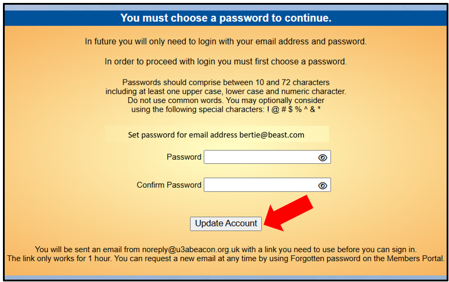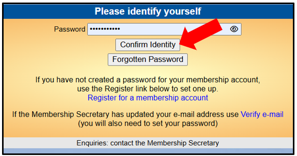

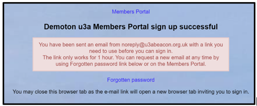3. You will see the following
screen confirming that you have been sent an email with a link and that
you can close this browser window because clicking the link in the email
will open a new browser:

> If the email doesn't arrive within a few minutes, check your Spam
> folder.
>
> *Note:* *The* *confirmation* *email* *will* *expire* *after* *1*
> *hour,* *although* *you* *can* *return* *to* *the* *Members* *Portal*
> *sign-in* *page* *and* *press* ***Forgotten*** ***Password*** *to*
> *request* *a* *new* *confirmation* *email.*

4\. After clicking the link in the email, enter your password and press
**Confirm** **Identity**:

> *If* *the* *details* *that* *you* *entered* *do* *not* *match* *those*
> *held* *on* *the* *system,* *you* *will* *be* *prompted* *to* *use*
> *the* ***Forgotten*** ***Password***
>
> 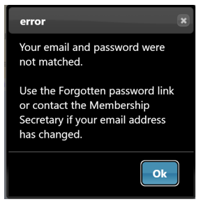 style="width:2.76334in;height:2.80172in" />*link* *or* *to* *contact*
> *your* *Membership* *Secretary:*
>
> *Note* *that* *your* *Membership* *Secretary* *can* *neither* *see*
> *nor* *set* *your* *password.*
>
> 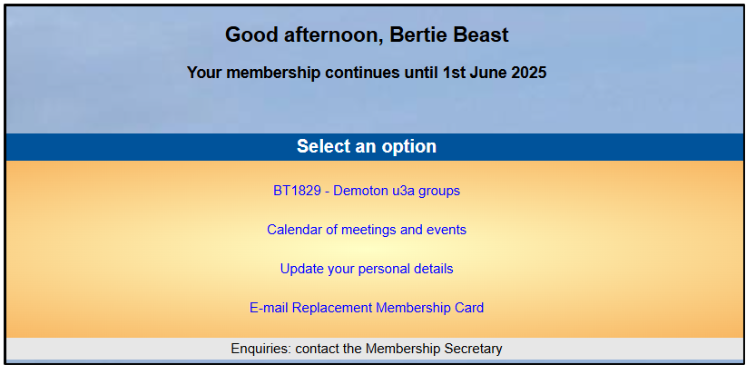 style="width:7.88704in;height:3.85716in" />5. After a successful
> sign-in you will be taken to the Members Portal Home page. The menu
> choices that you see on the Home screen may vary depending on which
> options your u3a has enabled.:

c\) Members that share an Email Address & Password

<u>Shared email address</u>

When 2 members share an email address, the 1st member may register as
described in section b) above. However, when the 2nd member wishes to
register, they must click the **Register** **for** **a** **membership**
**account** link rather than pressing the **Confirm** **Identity**
button:

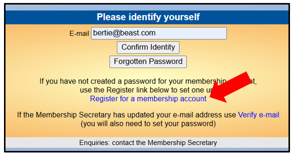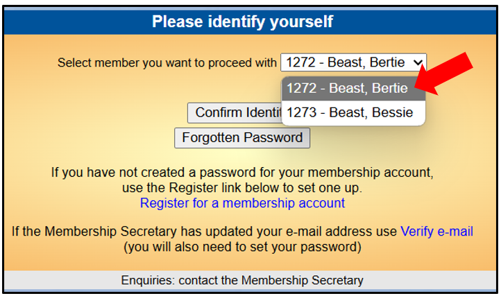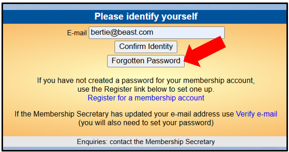

After that the registration process continues as described in section b)
above.

<u>Shared password</u>

When 2 registered members share an email address and use the same
password, they will be asked to identify which member is signing in by
selecting from a drop-down list:

*Note:* *it* *is* *not* *good* *practice* *to* *share* *a* *password*
*from* *a* *security* *point* *of* *view,* *so* *it* *is* *recommended*
*that* *members* *use* *different* *passwords* *when* *registering* *to*
*use* *the* *Members* *Portal.*

d\) Changing your Password

If you forget your password or wish to change it, click **Forgotten**
**Password** on the sign-in page

Enter your email address and press **Reset** **Password**

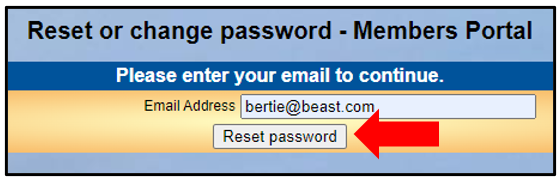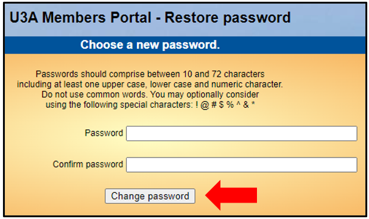

You should receive an email asking you to click a link to re-set your
password. If nothing arrives within a few minutes, check your Spam
folder.

Clicking the link in the email will take you to a screen where you can
specify a new password, before pressing **Change** **Password**

e\) Changing your Email Address

If you wish to change your email address you have 2 options:

Sign in to the Members Portal using your old email address, select
**Update** **your** **personal** **details** and update the email
address as described in
[<u>10.2.4</u>,](https://u3abeacon.zendesk.com/hc/en-gb/articles/10378443378717)
You will be sent an email with a link you will need to click to verify
that you have the correct email address. Your password will remain
unchanged, or

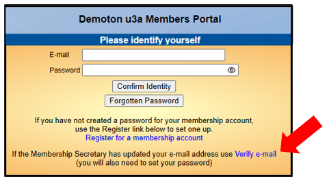Ask your Membership Secretary
to update your details on the system. The next time that you wish to
sign in to the Portal you will need to click the **Verify** **e-mail**
link on the sign-in page.

This will take you to a **Re-set** **password** screen and you will need
to continue as described in section d) above.

Revision History

||
||
||
||
||
||
||
||
||
||
||
||
||
