**10.2.1** **Online** **Renewals**

> Back

If your u3a has enabled online membership renewal you may renew and pay
for your membership via the **Members** **Portal** [(<u>see
10.2</u>](https://u3abeacon.zendesk.com/hc/en-gb/articles/360007368138-10-2-Members-Portal)).

If another member shares your address you may renew both memberships at
the same time (*but* *read* *the* *notes* *about* *Gift* *Aid* *claims*
*below* *first*).

*Note:* *The* *types* *of* *membership* *and* *membership* *fees*
*shown* *in* *the* *pictures* *below* *are* *unlikely* *to* *be* *the*
*same* *as* *you* *will* *see* *–* *they* *are* *for* *example* *only.*

**N.B.** **The** **Trust** **states** **that** **a** **Privacy**
**Policy** **is** **essential** **and** **having** **one** **is**
**also** **part** **of** **the** **Beacon** **Terms** **and**
**Conditions.**

**It** **is** **important** **that** **both** **new** **people**
**joining** **your** **u3a** **and** **existing** **members**
**renewing** **are** **reminded** **of** **this** **and** **that**
**you** **will** **only** **use** **it** **in** **accordance** **with**
**this** **policy.**

**IMPORTANT:** **Notes** **about** **Gift** **Aid** **Claims**

*Claiming* *Gift* *Aid* *does* *not* *reduce* *the* *amount* *of* *your*
*payment* *–* *it* *allows* *your* *u3a* *to* *claim* *money* *back*
*from* *HMRC.*

*Your* *u3a* *may* *not* *have* *registered* *to* *claim* *Gift* *Aid.*
*If* *this* *is* *the* *case,* *ticking* *the* *Gift* *Aid* *box* *will*
*have* *no* *effect* *on* *your* *payment.*

*If* *you* *have* *an* ***Individual*** *membership* *and* *you* *pay*
*online* *for* *yourself* *and* *another* *member* *at* *the* *same*
*address,* *only* *your* *subscription* *will* *be* *used* *for* *a*
*Gift* *Aid* *claim.* *Therefore,* *if* *the* *other* *member* *is*
*eligible* *to* *claim* *Gift* *Aid* *and* *wishes* *to* *allow* *a*
*claim,* *it* *is* *better* *for* *their* *membership* *to* *be*
*renewed* *separately.*

*If* *you* *have* *a* ***Joint*** *membership* *with* *another*
*member,* *you* *may* *claim* *Gift* *Aid* *on* *both* *subscriptions,*
*even* *if* *the* *other* *members* *is* *not* *a* *UK* *tax* *payer*
*but* *there* *are* *restrictions,* *principally* *depending* *on* *the*
*source* *of* *the* *money.*

*You* *will* *not* *be* *charged* *for* *using* *online* *membership*
*renewal,* *although* *you* *u3a* *will* *have* *a* *small* *commission*
*fee* *deducted* *from* *your* *payment* *by* *PayPal.*

When can I renew my membership?

You can renew your membership in the period from the start of the
advanced renewal period onwards.

If you are in the time period when you can renew you will see a screen
like this:

If you are not in this period when you can renew you will see a screen
like this one:

If your membership has Lapsed then you cannot renew using this method
and will need to contact the membership Secretary for your u3a.

Renewing Your Membership

> 1\. Log-in to the Members Portal as described in
> [<u>10.2</u>](https://u3abeacon.zendesk.com/hc/en-gb/articles/360007368138-10-2-Members-Portal)
> and click **Renew** **your** **membership**.
>
> 2\. Read the information about Gift Aid before ticking one of the
> boxes to indicate whether or not you would like your u3a to claim tax
> relief on your subscription in the current year:

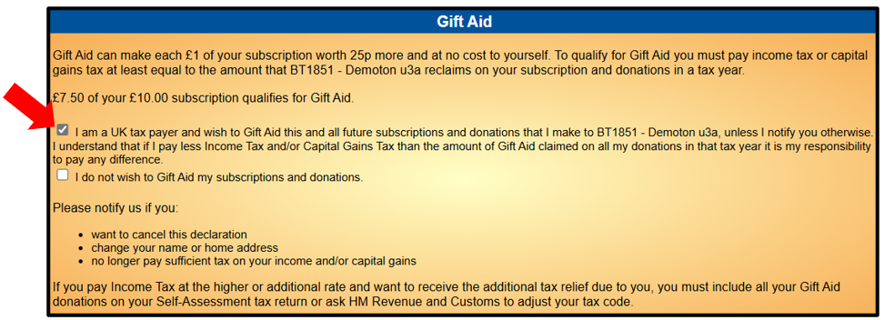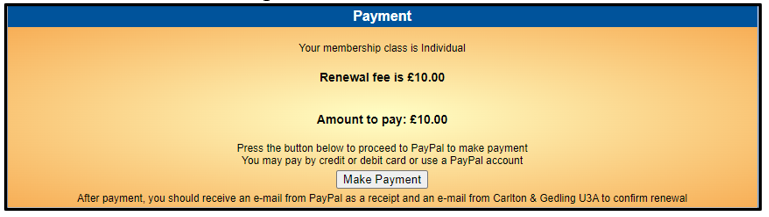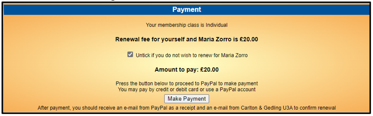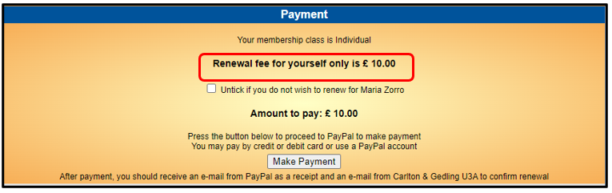

3\. What you see next depends on the type of membership that you have.

> This is a typical screen that you will see if you are an
> **Individual** member:
>
> If another u3a member lives at your address, you have the option to
> pay the other member’s subscription at the same time:
>
> If you don’t wish to pay for the other member, untick the box and the
> amount to pay will update:
>
> 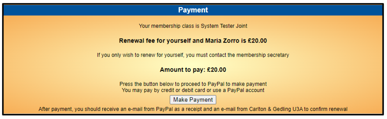 style="width:5.33333in;height:1.65278in" />If you are in a **Joint**
> membership category you can only renew and pay the total fee for both
> members:
>
> If you don't wish to pay for the other member you will need to contact
> your Membership Secretary and pay by other
> means. style="width:5.15278in;height:1.07639in" />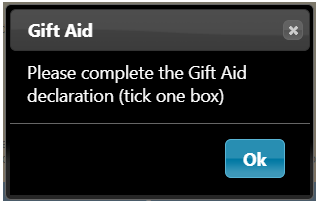 style="width:1.74306in;height:1.11806in" /> style="width:2.39583in;height:2.16667in" />
>
> 4\. Press the **Make** **Payment** button:
>
> If you did not select a box in the Gift Aid section you will be
> prompted to do so:

At this point you have 2 payment options:

Pay by **Debit** or **Credit** card (see **A** below), or Pay by
**PayPal** (see **B** below)

A\) Paying with your Debit/Credit Card

1\. To pay with a Debit or Credit card, enter your email address and
press **Pay** **by** **Debit** **or** **Credit** **Card**

2. Enter your email address
again at the next screen. Ignore the options to Log in to PayPal and
press **Continue** **to** **Payment** followed by **Continue** **as**
**a** **guest**

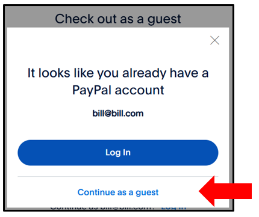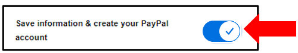

3\. Enter the details of your payment card and your contact details

4\. Press **Pay** **now** **as** **guest**

*Note:* *there* *is* *also* *the* *option* *of* *using* *the* *details*
*that* *you* *have* *entered* *to* *create* *and* *pay* *with* *a* *new*
*PayPal* *account* *by*

5\. Now skip **Section** **B** and continue to **Section** **C**
(**Confirmation** **of** **Payment**) below

B\) Paying with PayPal

1\. To pay with you own PayPal account, enter your email address and
press **Next**

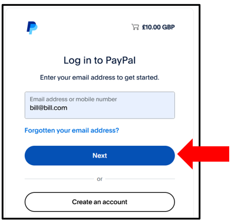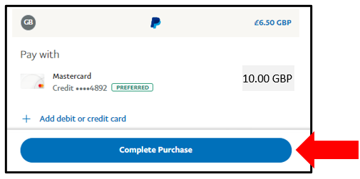

*Note:* *if* *you* *don't* *have* *a* *PayPal* *account,* *but* *would*
*like* *to* *create* *a* *new* *one* *-* *follow* *the* *steps*
*described* *in* *section* *A* *above* *until* *the* *final* *step*
*when* *there* *is* *an* *option* *to* *create* *a* *PayPal* *account*
*using* *the* *details* *that* *you* *have* *already* *entered.*

2\. Enter your PayPal password and press **Log** **in**

3\. Select one of your stored credit cards or click **Add** **debit**
**or** **credit** **card** if you wish to use a different card, before
pressing **Complete** **Purchase**

C\) Confirmation of Payment

Press **Return** **to**
**Seller** to return to the to the Members Portal where you will see
your updated "membership continues to" date.

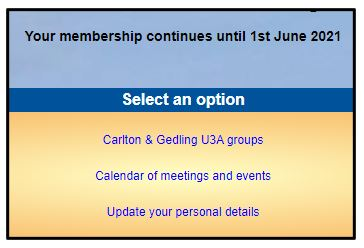

You will receive 2 confirmation emails:

A confirmation of payment from PayPal

A confirmation from your u3a. This may have your membership card
attached (if your u3a has chosen to use this facility)

**Revision** **History**

||
||
||
||
||
||
||
||
||
||
||
||
