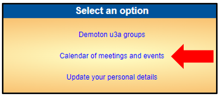
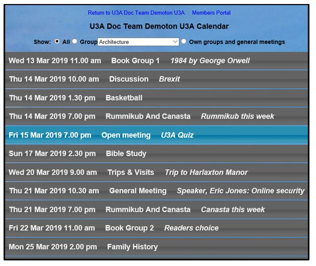
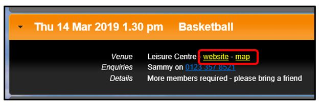
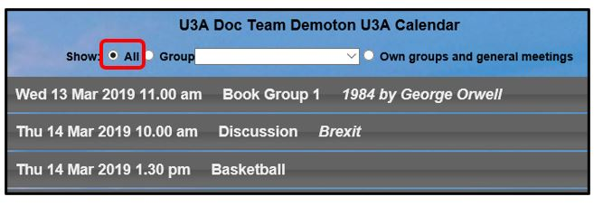
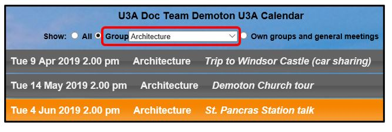
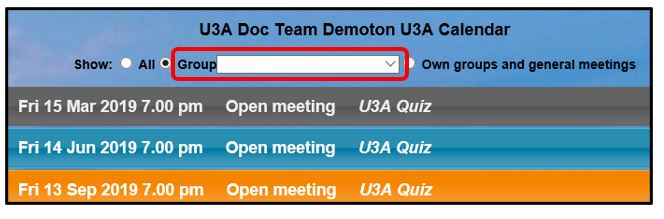
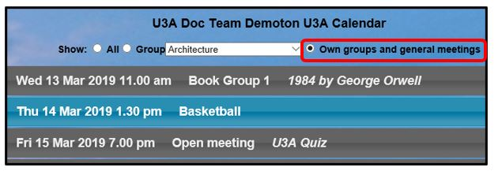
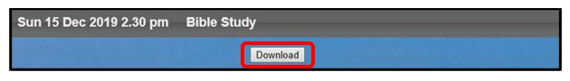
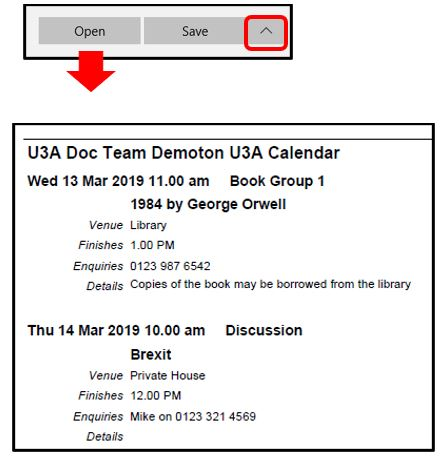

[u3a Beacon](https://u3abeacon.zendesk.com/hc/en-gb) \> [User
Guide](https://u3abeacon.zendesk.com/hc/en-gb/categories/360001240017-User-Guide)
\> [10. Online
Services](https://u3abeacon.zendesk.com/hc/en-gb/sections/360002163717-10-Online-Services)
Search

**Articles** **in** **this** **section**

**10.2.3** **Viewing** **your** **Calendar**

>  style="width:0.41667in;height:0.41667in" /> style="width:0.15625in;height:0.15625in" />Graeme Bunting Follow 3
> years ago · Updated

If your u3a has enabled it, you may view the Calendar for your u3a by
signing in to the **Members** **Portal** as described in
[10.2](https://u3abeacon.zendesk.com/hc/en-gb/articles/360007368138) and
clicking **Calendar** **of** **meetings** **and** **events**

The Calendar includes meetings from the current date to the end of the
year. The information displayed in this "Members" Calendar may be more
detailed than that in the "Public" Calendar, and is personal to you.

>  style="width:1.125in;height:0.47892in" />**Help**

Click on any Calendar entry to view additional details about the event.
Some venues may have yellow links that can be clicked to open a map of
the venue and/or the website.

Creating your own Personal Calendar

You may personalise the Calendar in a number of ways:

Selecting **All** displays every Calendar
entry:

Selecting a specific **Group** from the drop-down list displays only the
entries for that Group:

Selecting the blank space at
the top of the drop-down list displays only General/Open Meetings (those
not related to a specific Group):

Selecting **Own** **groups** **and** **general** **meetings** displays
only the Groups that you belong to, plus any Open meetings.

Downloading the Calendar

When viewing any version of the Calendar, press the **Download** button
below the table to open or save a pdf file with details about the
meetings that are displayed on screen.

You
will be given the choice of **Opening** the file onscreen or **Saving**
the file in your default download location (folder). Clicking the arrow
next to **Save** gives the option of doing a **Save-as** to a specified
location.

Revision History

||
||
||

> Was this article helpful?
>
> Yes No
>
> 0 out of 0 found this helpful
>
> Have more questions? [<u>Submit a
> request</u>](https://u3abeacon.zendesk.com/hc/en-gb/requests/new)

Return to top

**Recently** **viewed** **articles** [10.2.2 Viewing your Interest
Groups](https://u3abeacon.zendesk.com/hc/en-gb/articles/10378170759069-10-2-2-Viewing-your-Interest-Groups)

[10.2.1 Online
Renewals](https://u3abeacon.zendesk.com/hc/en-gb/articles/360007368158-10-2-1-Online-Renewals)

[10.2 Members
Portal](https://u3abeacon.zendesk.com/hc/en-gb/articles/360007368138-10-2-Members-Portal)

[10.1 Online
Joining](https://u3abeacon.zendesk.com/hc/en-gb/articles/360007304577-10-1-Online-Joining)

[9.9 Officers Notification of people Joining
Online](https://u3abeacon.zendesk.com/hc/en-gb/articles/24586976983837-9-9-Officers-Notification-of-people-Joining-Online)

**Related** **articles** [10.2 Members
Portal](https://u3abeacon.zendesk.com/hc/en-gb/related/click?data=BAh7CjobZGVzdGluYXRpb25fYXJ0aWNsZV9pZGwrCMp9HNJTADoYcmVmZXJyZXJfYXJ0aWNsZV9pZGwrCB0gdGhwCToLbG9jYWxlSSIKZW4tZ2IGOgZFVDoIdXJsSSI4L2hjL2VuLWdiL2FydGljbGVzLzM2MDAwNzM2ODEzOC0xMC0yLU1lbWJlcnMtUG9ydGFsBjsIVDoJcmFua2kG--8e3bc3df5224508a7bdaadd7c902d934cff437ef)

[10.2.4 Updating your Personal
Details](https://u3abeacon.zendesk.com/hc/en-gb/related/click?data=BAh7CjobZGVzdGluYXRpb25fYXJ0aWNsZV9pZGwrCB1QbmtwCToYcmVmZXJyZXJfYXJ0aWNsZV9pZGwrCB0gdGhwCToLbG9jYWxlSSIKZW4tZ2IGOgZFVDoIdXJsSSJML2hjL2VuLWdiL2FydGljbGVzLzEwMzc4NDQzMzc4NzE3LTEwLTItNC1VcGRhdGluZy15b3VyLVBlcnNvbmFsLURldGFpbHMGOwhUOglyYW5raQc%3D--cc56d23962e95116052afc24bbc1503abbefc3bf)

[5.3 Group Record:
Schedule](https://u3abeacon.zendesk.com/hc/en-gb/related/click?data=BAh7CjobZGVzdGluYXRpb25fYXJ0aWNsZV9pZGwrCLJ8HNJTADoYcmVmZXJyZXJfYXJ0aWNsZV9pZGwrCB0gdGhwCToLbG9jYWxlSSIKZW4tZ2IGOgZFVDoIdXJsSSI%2BL2hjL2VuLWdiL2FydGljbGVzLzM2MDAwNzM2Nzg1OC01LTMtR3JvdXAtUmVjb3JkLVNjaGVkdWxlBjsIVDoJcmFua2kI--e6ec47df6a935936c96a0e1474ccbe7846dc7e28)

[10.1 Online
Joining](https://u3abeacon.zendesk.com/hc/en-gb/related/click?data=BAh7CjobZGVzdGluYXRpb25fYXJ0aWNsZV9pZGwrCIGFG9JTADoYcmVmZXJyZXJfYXJ0aWNsZV9pZGwrCB0gdGhwCToLbG9jYWxlSSIKZW4tZ2IGOgZFVDoIdXJsSSI4L2hjL2VuLWdiL2FydGljbGVzLzM2MDAwNzMwNDU3Ny0xMC0xLU9ubGluZS1Kb2luaW5nBjsIVDoJcmFua2kJ--8d5c77e78b7161d05534bf5cb42d0ecba1d81268)

[5.9 The
Calendar](https://u3abeacon.zendesk.com/hc/en-gb/related/click?data=BAh7CjobZGVzdGluYXRpb25fYXJ0aWNsZV9pZGwrCEaJHNJTADoYcmVmZXJyZXJfYXJ0aWNsZV9pZGwrCB0gdGhwCToLbG9jYWxlSSIKZW4tZ2IGOgZFVDoIdXJsSSI1L2hjL2VuLWdiL2FydGljbGVzLzM2MDAwNzM3MTA3OC01LTktVGhlLUNhbGVuZGFyBjsIVDoJcmFua2kK--cd1d04619a7ce79f7f0ec039acec6874238c6730)

**Comments** 0 comments

Please [<u>sign
in</u>](https://u3abeacon.zendesk.com/access?locale=en-gb&brand_id=360000694158&return_to=https%3A%2F%2Fu3abeacon.zendesk.com%2Fhc%2Fen-gb%2Farticles%2F10378393427997-10-2-3-Viewing-your-Calendar)
to leave a comment.

[u3a Beacon](https://u3abeacon.zendesk.com/hc/en-gb)

> [<u>Powered by
> Zendesk</u>](https://www.zendesk.co.uk/service/help-center/?utm_source=helpcenter&utm_medium=poweredbyzendesk&utm_campaign=text&utm_content=u3a+Beacon+Support)
