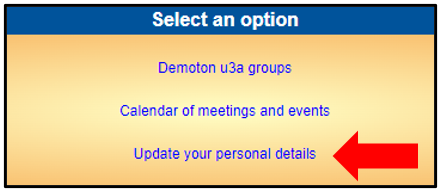
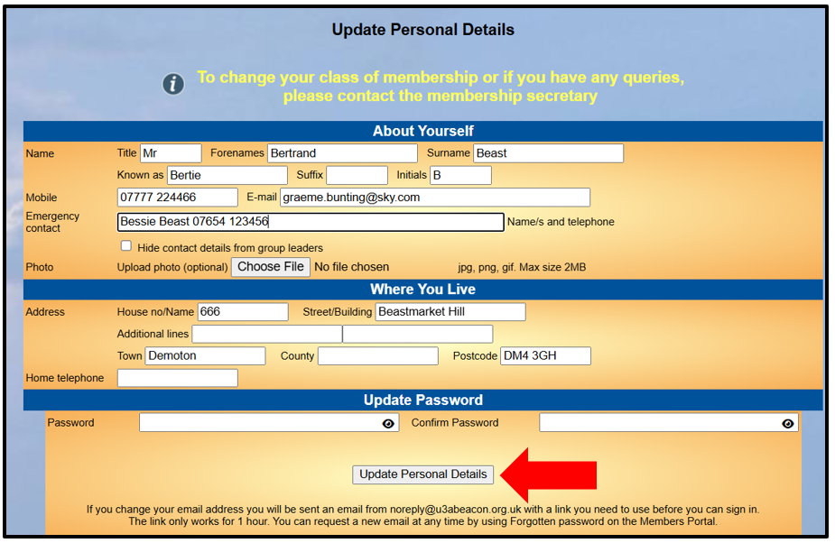
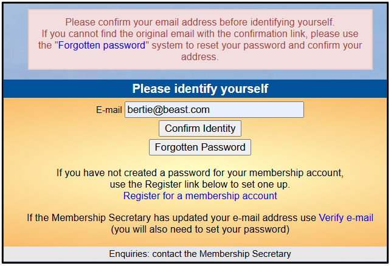
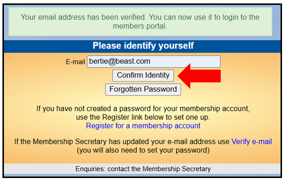

[u3a Beacon](https://u3abeacon.zendesk.com/hc/en-gb) \> [User
Guide](https://u3abeacon.zendesk.com/hc/en-gb/categories/360001240017-User-Guide)
\> [10. Online
Services](https://u3abeacon.zendesk.com/hc/en-gb/sections/360002163717-10-Online-Services)
Search

**Articles** **in** **this** **section**

**10.2.4** **Updating** **your** **Personal** **Details**

>  style="width:0.41667in;height:0.41667in" /> style="width:0.15625in;height:0.15625in" />Graeme Bunting Follow 6
> months ago · Updated

If your u3a has enabled it, you may view or update the personal details
that your u3a holds by signing in to the **Members** **Portal** as
described in
[10.2](https://u3abeacon.zendesk.com/hc/en-gb/articles/360007368138) and
clicking **Update** **your** **personal** **details**

You may update the following details about yourself:

> Title, Forename & Surname
>
> Known as (e.g. William may be known as Bill). Suffix: an honour, e.g.
> MBE
>
> Initials, Mobile phone number and Email address (see below \*)
>
> Emergency Contact – the name and phone number of a friend or relative
> (make sure that you have permission to share their details).
>
> There is a box which you can tick if you don’t wish to allow the
> Leader of any Group that you are a member of to see your contact
> details.
>
>  style="width:1.125in;height:0.47892in" />There is also the option of
> uploading your photo which will then appear on your next membership
> card. The picture must be saved as jpg, png, or gif, maximum file size
> 2MB. A square format photo (aspect ratio 1:1) is advised to suit the
> space on the membership card. Photos can be cropped to a square using
> a smartphone app or other photo editing software (if you are unsure
> how to re-size a photo, send it to your Beacon Admin or Membership
> Secretary to upload it for you).

You may update the following details about where you
live:

> House Number/Name & Street
>
> Additional line (for a Village or District name) Town
>
> County (may be blank because a County is not required according to
> Post office address guidance) Home phone number (landline)

You can update your password, and If your u3a has enabled it you may
update your preferences for things such as receiving the TAM magazine or
Newsletter, volunteering to help with things, etc.

After making any changes to your details, press **Update** **Personal**
**Details**:

> You will receive an email confirming your updated details.

**\*** **Changing** **your** **email** **address**

If you changed your email address you will be taken back to the Members
Portal log-in screen where there will be a message saying that you need
to confirm your (new) email address.

**Do** **not** **attempt** **to** **log** **in** **yet** **-**
**follow** **the** **steps** **below:**

> 1\. Close down the log-in screen
>
> 2\. Go to your email account and look for an email titled "**email**
> **confirmation**"
>
>  style="width:4.67708in;height:2.95833in" />3. Open the email and click
> the link. This will take you back to the Members Portal log-in screen
> where there will be a message to say that your email address has been
> verified. Press **Confirm** **Identity**:
>
>  style="width:5.29167in;height:2.79167in" />4. Enter your password and
> press **Confirm** **Identity** to return to the Members Portal Home
> page:

Revision History

||
||
||
||
||
||
||

> Was this article helpful?
>
> Yes No
>
> 1 out of 5 found this helpful
>
> Have more questions? [<u>Submit a
> request</u>](https://u3abeacon.zendesk.com/hc/en-gb/requests/new)

Return to top

**Recently** **viewed** **articles** [10.2.3 Viewing your
Calendar](https://u3abeacon.zendesk.com/hc/en-gb/articles/10378393427997-10-2-3-Viewing-your-Calendar)

[10.2.2 Viewing your Interest
Groups](https://u3abeacon.zendesk.com/hc/en-gb/articles/10378170759069-10-2-2-Viewing-your-Interest-Groups)

[10.2.1 Online
Renewals](https://u3abeacon.zendesk.com/hc/en-gb/articles/360007368158-10-2-1-Online-Renewals)

[10.2 Members
Portal](https://u3abeacon.zendesk.com/hc/en-gb/articles/360007368138-10-2-Members-Portal)

[10.1 Online
Joining](https://u3abeacon.zendesk.com/hc/en-gb/articles/360007304577-10-1-Online-Joining)

**Related** **articles** [10.2 Members
Portal](https://u3abeacon.zendesk.com/hc/en-gb/related/click?data=BAh7CjobZGVzdGluYXRpb25fYXJ0aWNsZV9pZGwrCMp9HNJTADoYcmVmZXJyZXJfYXJ0aWNsZV9pZGwrCB1QbmtwCToLbG9jYWxlSSIKZW4tZ2IGOgZFVDoIdXJsSSI4L2hjL2VuLWdiL2FydGljbGVzLzM2MDAwNzM2ODEzOC0xMC0yLU1lbWJlcnMtUG9ydGFsBjsIVDoJcmFua2kG--5252ea2a4e14d6f4c89b3b962dce2fc89fdcefd9)

[10.2.5 Ordering a new Membership
Card](https://u3abeacon.zendesk.com/hc/en-gb/related/click?data=BAh7CjobZGVzdGluYXRpb25fYXJ0aWNsZV9pZGwrCJ39eCapCToYcmVmZXJyZXJfYXJ0aWNsZV9pZGwrCB1QbmtwCToLbG9jYWxlSSIKZW4tZ2IGOgZFVDoIdXJsSSJML2hjL2VuLWdiL2FydGljbGVzLzEwNjIyMDk5NTg2NDYxLTEwLTItNS1PcmRlcmluZy1hLW5ldy1NZW1iZXJzaGlwLUNhcmQGOwhUOglyYW5raQc%3D--820e8ae8010e1c898f9e02fd7484e7d7fbb599af)

[10.1 Online
Joining](https://u3abeacon.zendesk.com/hc/en-gb/related/click?data=BAh7CjobZGVzdGluYXRpb25fYXJ0aWNsZV9pZGwrCIGFG9JTADoYcmVmZXJyZXJfYXJ0aWNsZV9pZGwrCB1QbmtwCToLbG9jYWxlSSIKZW4tZ2IGOgZFVDoIdXJsSSI4L2hjL2VuLWdiL2FydGljbGVzLzM2MDAwNzMwNDU3Ny0xMC0xLU9ubGluZS1Kb2luaW5nBjsIVDoJcmFua2kI--7ab5922cf81f6971b450d4a4b14abb9dda215dc8)

[10.2.1 Online
Renewals](https://u3abeacon.zendesk.com/hc/en-gb/related/click?data=BAh7CjobZGVzdGluYXRpb25fYXJ0aWNsZV9pZGwrCN59HNJTADoYcmVmZXJyZXJfYXJ0aWNsZV9pZGwrCB1QbmtwCToLbG9jYWxlSSIKZW4tZ2IGOgZFVDoIdXJsSSI7L2hjL2VuLWdiL2FydGljbGVzLzM2MDAwNzM2ODE1OC0xMC0yLTEtT25saW5lLVJlbmV3YWxzBjsIVDoJcmFua2kJ--0d25a7ba7bf1890ed4ea7e441eab7a90dd649014)

[8.7 Membership
Set-up](https://u3abeacon.zendesk.com/hc/en-gb/related/click?data=BAh7CjobZGVzdGluYXRpb25fYXJ0aWNsZV9pZGwrCDGFG9JTADoYcmVmZXJyZXJfYXJ0aWNsZV9pZGwrCB1QbmtwCToLbG9jYWxlSSIKZW4tZ2IGOgZFVDoIdXJsSSI6L2hjL2VuLWdiL2FydGljbGVzLzM2MDAwNzMwNDQ5Ny04LTctTWVtYmVyc2hpcC1TZXQtdXAGOwhUOglyYW5raQo%3D--1eab2f7906b114f6ed779084bc99b0cefd265c55)

**Comments** 0 comments

Article is closed for comments.

[u3a Beacon](https://u3abeacon.zendesk.com/hc/en-gb)

> [<u>Powered b</u>y
> <u>Zendesk</u>](https://www.zendesk.co.uk/service/help-center/?utm_source=helpcenter&utm_medium=poweredbyzendesk&utm_campaign=text&utm_content=u3a+Beacon+Support)
