[u3a Beacon](https://u3abeacon.zendesk.com/hc/en-gb) \> [User
Guide](https://u3abeacon.zendesk.com/hc/en-gb/categories/360001240017-User-Guide)
\> [12. Beacon for
Networks](https://u3abeacon.zendesk.com/hc/en-gb/sections/7929498160785-12-Beacon-for-Networks)
Search

**Articles** **in** **this** **section**

**12** **Beacon** **for** **Networks** **and** **Regions**

>  style="width:0.41667in;height:0.41667in" /> style="width:0.15625in;height:0.15625in" />Graeme Bunting Follow 17
> days ago · Updated

12.1 Introduction

This section is to assist Networks and Regions using Beacon. Any
reference to Network below will usually apply to Regions as well.

It is assumed that readers have a good working knowledge of using
Beacon. Therefore, detailed instructions on the Beacon operations are
not included in this section. Further guidance can be found elsewhere in
the Beacon Help Centre.

We are “bending” the standard Beacon to fit the different needs. No
changes are possible to the software so the integrity is not
compromised.

There are key differences between the way an individual u3a and a
Network uses Beacon:

**<u>Members</u>**

> A u3a has **Members** who are **individuals**.
>
> Networks have **Members** who are typically post holders at **u3a’s**
> or are individuals that have signed up for **Events** such as Summer
> Schools.

**<u>Groups</u>**

A u3a has **Groups** that are **Interest** **Groups**.

Networks use **Group** in its literal meaning; a **group/collection**
**of** **people**. This may be:

> The contacts or officers in a u3a
>
>  style="width:1.125in;height:0.47892in" />A collection of post holders
> such as all Chairs, Secretaries and Treasurers Individuals who have
> booked to attend an Event
>
> **Help**

As we are trying to set each Beacon for Networks to the specific needs
of that organisation, where practical this means there will be
differences between Network sites. Therefore, some of the operations
described in this guide may not be relevant to your
site.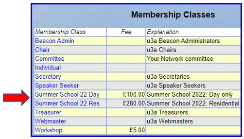

If you find others ways of using Beacon for Networks that you think may
be helpful for other Networks, please contact the Beacon Team by raising
a Support Ticket in the Beacon Help Centre so that this page can be
updated.

12.2 Initial Set-up

Depending on how your Network intends using the Beacon site, some or all
of the following set-up operations may be required.

12.2.1 Membership Classes

Add Membership Classes for roles such as **Committee**, **Chair,**
**Secretary**, etc.

You can also add Membership Classes to manage one-off Events like
**Workshops** and **Summer** **Schools**:

Having different classes for the types of Event bookings, such as “Day”
and “Residential” and associating their "membership" fee with the
appropriate cost is one way that you can record income.

*Note:* *There* *are* *other* *ways* *of* *recording* *payments* *as*
*described* *in12.4.*

12.2.2 Finance Categories

Finance Categories can be added to help manage payments for Event
bookings:

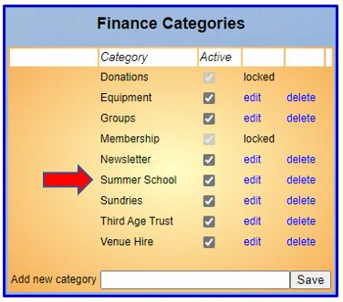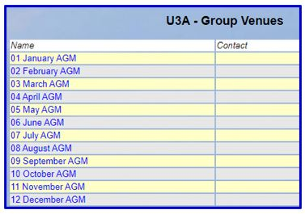

12.2.3 Venues

Venues can be added to show the month that individual u3a’s have their
AGM. Pre-fixing with the number of the month sorts the list in a logical
order.

After an AGM the office holders at a u3a may change and the u3a may
forget to notify the Network of this change so communication goes
astray.

By looking at your Group List you can see which have recently had or are
about to have an AGM and you can contact then to remind then to update
you with names and contacts.

*Note:* *an* *alternative* *way* *of* *recording* *AGM* *months* *is*
*to* *use* *the* ***When*** *field* *in* *the* *Group* *Record.* *This*
*frees* *up* *the* ***Where*** *field* *in* *the* *Group* *Record* *to*
*be* *used* *for* *(say)* *the* *Venue* *that* *a* *u3a* *holds* *their*
*General* *Meetings;* *see* *12.2.5.*

12.2.4 Faculties

Faculties can be added to help you filter your Groups List:

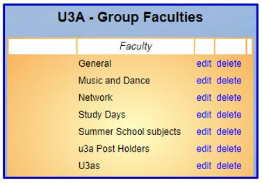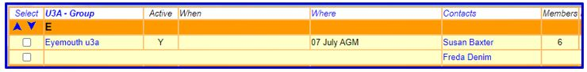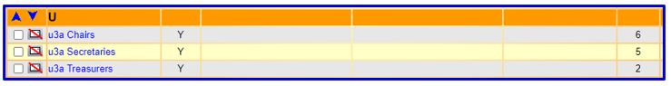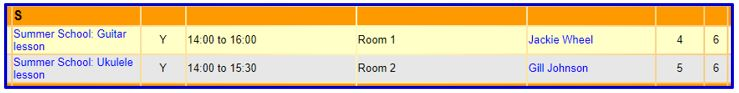

For example, when organising a Summer School you may wish to group some
subjects under a Faculty. This could help with organising attendees and
facilities for a subject.

12.2.5 Groups

Groups can be added to manage a number of things:

> **Individual** **u3a’s** within your Network:
>
> **Posts/Officers** within u3a’s, e.g. Secretaries, Chairs, Treasurers,
> etc:
>
> *Note;* *an* *alternative* *way* *to* *search* *for* *Officers* *is*
> *by* *entering* *the* *appropriate* *Membership* *Class* *in* *the*
> *Quick* *Find* *box* *in* *the* *Members* *List,* *in* *which* *case*
> *you* *won’t* *need* *to* *create* *Officer* *Groups.*
>
> 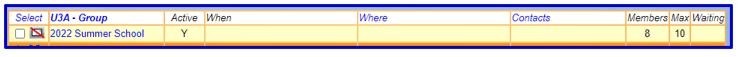 style="width:7.02083in;height:0.55208in" />**Events** such as Summer
> Schools, so you can record and communicate with all who have booked
> and record payments:
>
> **Subjects** within an Event, so you can track and manage numbers:

When adding a new Group enter the following:

> The name of the **U3A** **-** **Group**, e.g. St Andrews, u3a Chairs,
> 2022 Summer School
>
> A **Faculty**, if applicable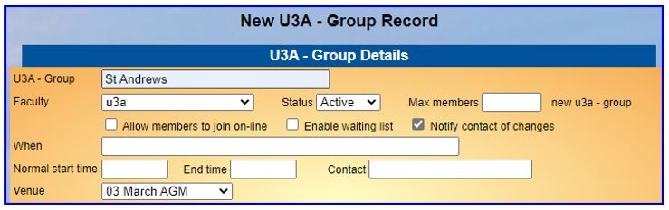 style="width:7.4375in;height:2.34375in" />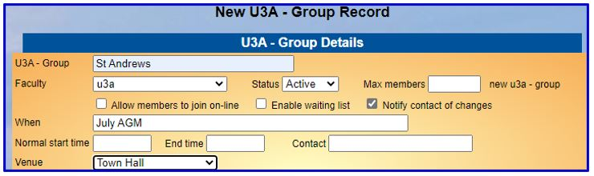 style="width:7.4375in;height:2.21875in" />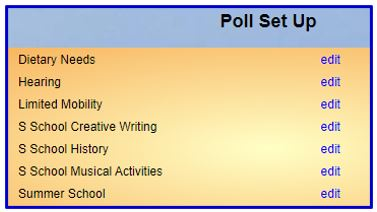 style="width:3.92708in;height:2.20833in" />
>
> A “**Venue**”, if applicable, e.g. the AGM month for u3a Groups
>
> If the Group is for an **Event** you may wish to add a **Contact**
> name/phone number. Adding **Max** **members** and **Enable**
> **waiting** **list** allows waiting lists to be managed.

*Note:* *an* *alternative* *way* *of* *recording* *AGM* *months* *is*
*to* *use* *the* ***When*** *field.* *This* *frees* *up* *the*
***Where*** *a* *field* *to* *be* *used* *for* *(say)* *the* *Venue*
*that* *a* *u3a* *holds* *their* *General* *Meetings.*

12.2.6 Polls

When organising Events you can set a Polls to identify attendees with
special requirements such as Mobility Issues, Dietary Requirements,
Hearing difficulties, etc. This makes it easy to select the Poll to
identify those needing special attention.

You can also use Polls to record the sessions at an Event that a
delegate wishes to attend.

12.2.7 U3A
Officers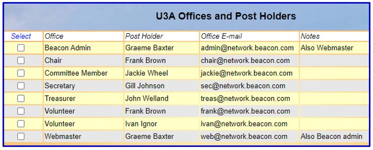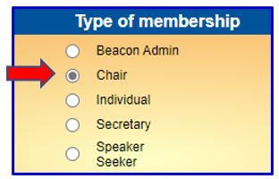

U3A Offices can be added for the post holders within your Network
Committee to enable easy communication by email.

A single person can have several entries for different roles and
different emails. When someone with more than one email listed sends an
email, they will have the option to choose which one is listed to
receive any reply.

12.3 Adding Members

Depending on how your Network intends using the Beacon site, some or all
of the following set-up operations may be required.

12.3.1 u3a Post Holders

To add post holders at individual u3a’s within your Network select
**Add** **New** **Member** from the Home page and pick the applicable
**Type** **of** **Membership**:

You don’t need to fill in most of the boxes on this page other than
those in bold:

**Forename** and **Surname** should have an initial upper case letter.

As most communication is via email you should populate the **Email**
field.

You may not have (or need) the member’s postal address, so the address
fields can be populated with information that can be searched for in
Excel downloads or when performing a “Quick find” Search from the
Members List. For example you may wish to
enter: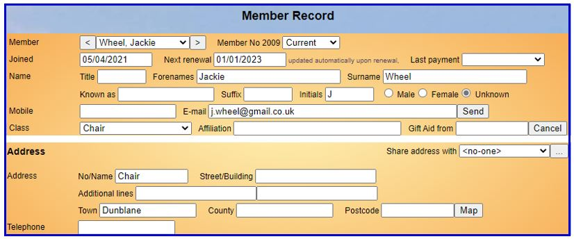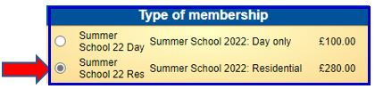

> The name of the member’s u3a in the **Town** field
>
> The member’s role in the **No/Name** field – while this would seem to
> duplicate the type of membership, it is helpful to be able to identify
> a person’s role when viewing the Groups List The **Post** **Code** can
> be a real one or something fictitious in the correct format, e.g. XX1
> 1XX.

In the **Payment** section add the **Amount** **paid** (0.00), before
clicking **Add** **Member**.

The **Post** **Code** and **Last** **payment** can be blanked out after
the Member Record has been created, leaving a completed record like
this:

12.3.2 Event Attendees

To add a new member who will be attending an Event, select **Add**
**New** **Member** from the Home page and pick the applicable **Type**
**of** **Membership**:

You don’t need to fill in most of the boxes on this page other than
those in bold. **Forename** and **Surname** should have an initial upper
case letter.

As most communication is via email you should populate the **Email**
field. The address fields can be populated with information that can be
searched for in Excel downloads or when performing a “Quick find” Search
from the Members List. For example you may wish to enter:

> The name of the member’s u3a in the **Town** field The name of the
> Event in the **No/Name** field
>
> The **Post** **Code** can be a real one or something fictitious in the
> correct format, e.g. XX1 1XX.

In the **Payment** section add the **Amount** **paid** and select the
**Payment** **method** before clicking **Add**
**Member**: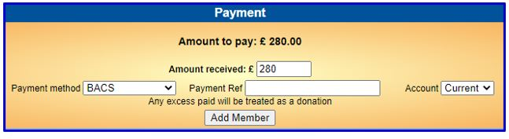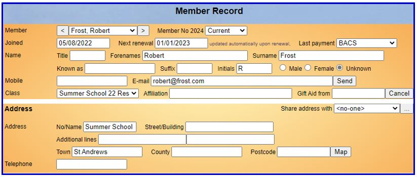

The **Post** **Code** can be blanked out after the Member Record has
been created, leaving a completed record like this:

*Note:* *if* *an* *event* *attendee* *is* *already* *on* *the* *system*
*as* *an* *officer* *at* *a* *u3a* *or* *because* *they* *have*
*attended* *a* *previous* *event,* *you* *do* *not* *need* *to* *create*
*a* *New* *Member* *record* *for* *them.*

*One* *option* *is* *to* *“renew”* *the* *member* *into* *the*
*applicable* *Membership* *Class* *that* *you* *have* *created* *for*
*the* *new* *Event.*

*Or,* *depending* *on* *how* *you* *are* *managing* *payments* *you*
*can* *record* *their* *payment* *by* *adding* *a* *Transaction* *in*
*the* *main* *Finance* *Ledger* *(see* *12.4.2)* *or* *in* *the* *Group*
*Ledger* *(see* *12.4.3).*

12.4 Managing Groups

After adding a new Member, they will probably need adding to one or more
**Groups**. This could be an individual **u3a** Group with an associated
**Officer** Group, or an **Event** Group.

The Groups that a member belongs to and any related Transactions are
shown at the foot of the Member Record:

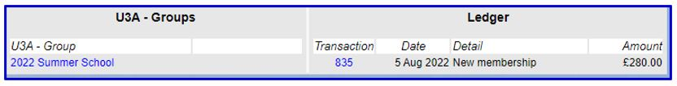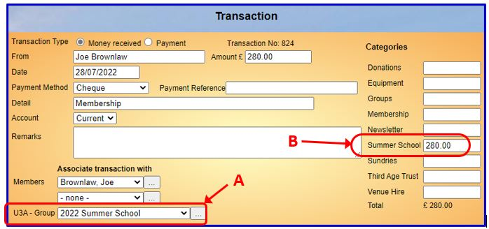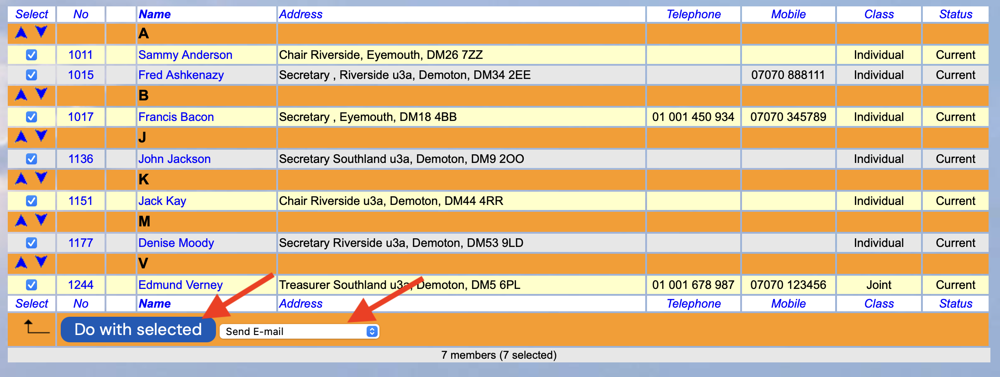

If a Transaction is related to an Event, associating the Transaction
with the **Group** **\[A\]** and/or changing the default **Finance**
**Category** of **Membership** to something more appropriate **\[B\]**
will help keep track of payments for the Event:

12.4.1 Managing Group Members

**<u>Adding Members from the Group Record</u>**

You can add Members to a Group on the **Members** page of the Group
Record, either one at a time by Name from the drop-down list or in
batches by Membership Number

A difference from standard Beacon is that the **Add** **Convenor/Add**
**Leader** option is called **Main** **Contact.** You can use this to
specify the main contact(s) for a u3a; usually the Chair and Secretary.

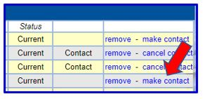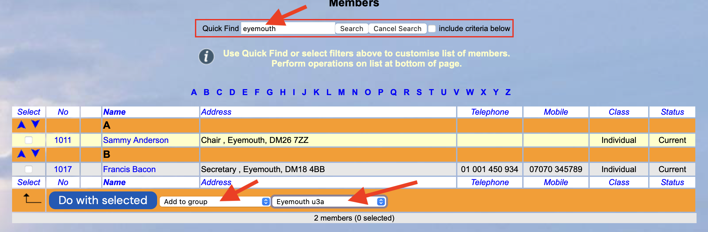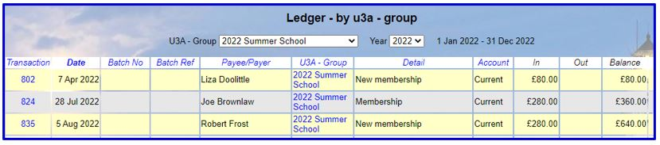

**<u>Adding Members from the Member List</u>**

Another way of adding Members to a (u3a) Group is to search for the u3a
name in the Quick Find box on the Members list. After ticking all the
Members, select **Add** **to** **u3a** **–** **group** in the drop-down
list at foot of page. Then select the name of the u3a before clicking
**Do** **with** **selected.**

12.4.2 Managing Group Payments in the Main Ledger

When a new Member is added and when a Member is Renewed, a Transaction
is automatically added to the main Finance Ledger (even if there is no
fee associated with the Membership Class).

Associating Transactions with a Group (as described above) enables you
to view the Ledger for the Group:

Other payments (both in and out) can be added to the Ledger using the
**Add** **transaction** operation.

12.4.3 Managing Group Payments in the Group Ledger

There is the option of recording payments (both in and out) in the
**Ledger** page of the Group Record:

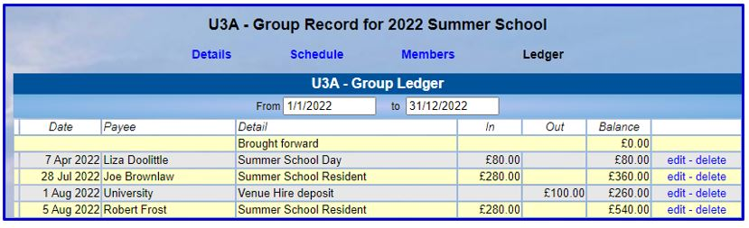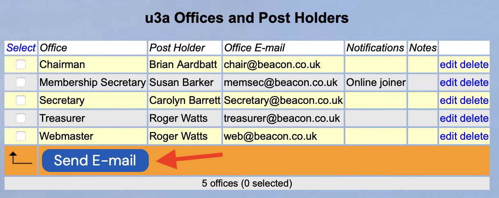

*Note:* *the* *Group* *Ledger* *is* *not* *linked* *to* *the* *main*
*Finance* *Ledger,* *so* *doing* *it* *this* *way* *could* *entail* *a*
*certain* *amount* *of* *duplication.*

12.5 Sending Emails

Emails can be sent from a number of places within Beacon as described
below.

When sending an email it is recommended that you **Tick** **to**
**receive** **a** **copy** as Beacon does not keep a copy of sent
emails.

You can check who emails were sent to and whether they were successfully
delivered by selecting **Email** **delivery** on the Home page.

12.5.1 Emails to the Network Committee

From the **U3A** **Officers** page, some or all of the boxes in the left
column and then select **Send** **E-mail** at the foot of the page:

*Note:* *the* *use* *of* *Tokens* *to* *personalise* *your* *email*
*greeting* *is* *not* *available* *from* *the* *U3A* *Officers* *page.*

12.5.2 Emails to Group Contacts

From the Groups List page, tick some or all of the boxes in the left
column and then at foot of page select **Send** **E-mail** **to**
**contacts** and press **Do** **with** **Selected**:

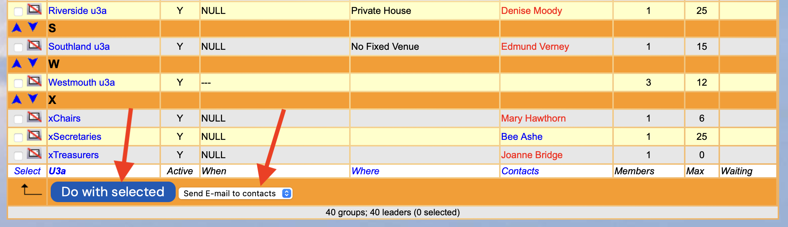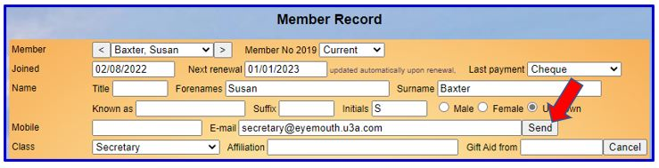

*Note:* *when* *sending* *emails* *to* *u3a* *post* *holders* *you*
*can* *use* *the* ***\#MEMCLASS*** *Token* *to* *personalise* *your*
*greeting* *as* *(say)* *“Dear* *Secretary”.*

12.5.3 Emails from the Members List

From the **Members** page, filter the list according to your
requirements, e.g. on a Membership Class such as Secretary or on a u3a
by using the Quick find box. Tick some or all of the boxes in the left
column and then at foot of page select **Send** **E-mail** and press
**Do** **with** **Selected**:

12.5.4 Emails from the Member Record

From an individual Member record select **Send**:

12.6 Maintenance

12.6.1 Renewing Members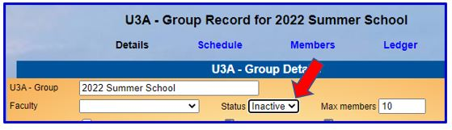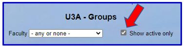

Beacon sites are set for u3a membership to renew annually. In theory you
could ignore this and then the individuals would show in Red in the
Group list of members.

It is strongly recommend that each year you set a renewal time and renew
all members with the exception of any put in specifically for one-off
**Events**. For these you may wish to **Delete** or **Lapse** in line
with GDPR policies.

12.6.2 Changing a person in a u3a role

When a post holder in a member u3a (e.g. Chair, Secretary) changes, the
name and contact details need to be updated.

First locate the existing member in the **Members** **List** or in the
appropriate **Group**.

Open the Member Record and replace the existing **Forename**,
**Initial** and **Surname** with the new post holder. The **email** may
need changing well.

Now select **Save** and the new post holder will be across the system
with no more changes required.

12.6.3 Inactive Groups

When a Group has been created for a one-off event you may wish to hide
the Group after the Event so that the Groups List doesn’t become too
lengthy. This can be done in the Group **Details** page by changing the
Status to **Inactive**:

By default the Groups List only shows active Groups, although this can
be changed by unticking **Show** **Active** **Only**:

Revision History

||
||
||

||
||
||
||

> Was this article helpful?
>
> Yes No
>
> 0 out of 0 found this helpful
>
> Have more questions? [<u>Submit a
> request</u>](https://u3abeacon.zendesk.com/hc/en-gb/requests/new)

Return to top

**Recently** **viewed** **articles**

[10.2.5 Ordering a new Membership
Card](https://u3abeacon.zendesk.com/hc/en-gb/articles/10622099586461-10-2-5-Ordering-a-new-Membership-Card)

[10.2.4 Updating your Personal
Details](https://u3abeacon.zendesk.com/hc/en-gb/articles/10378443378717-10-2-4-Updating-your-Personal-Details)

[10.2.3 Viewing your
Calendar](https://u3abeacon.zendesk.com/hc/en-gb/articles/10378393427997-10-2-3-Viewing-your-Calendar)

[10.2.2 Viewing your Interest
Groups](https://u3abeacon.zendesk.com/hc/en-gb/articles/10378170759069-10-2-2-Viewing-your-Interest-Groups)

[10.2.1 Online
Renewals](https://u3abeacon.zendesk.com/hc/en-gb/articles/360007368158-10-2-1-Online-Renewals)

**Related** **articles** [10.2 Members
Portal](https://u3abeacon.zendesk.com/hc/en-gb/related/click?data=BAh7CjobZGVzdGluYXRpb25fYXJ0aWNsZV9pZGwrCMp9HNJTADoYcmVmZXJyZXJfYXJ0aWNsZV9pZGwrCBHOnYYoBzoLbG9jYWxlSSIKZW4tZ2IGOgZFVDoIdXJsSSI4L2hjL2VuLWdiL2FydGljbGVzLzM2MDAwNzM2ODEzOC0xMC0yLU1lbWJlcnMtUG9ydGFsBjsIVDoJcmFua2kG--030de406eb37476dfaf506f84fd4cb06687e5c53)

[Videos included in this
guide](https://u3abeacon.zendesk.com/hc/en-gb/related/click?data=BAh7CjobZGVzdGluYXRpb25fYXJ0aWNsZV9pZGwrCJGSxdcEBDoYcmVmZXJyZXJfYXJ0aWNsZV9pZGwrCBHOnYYoBzoLbG9jYWxlSSIKZW4tZ2IGOgZFVDoIdXJsSSJDL2hjL2VuLWdiL2FydGljbGVzLzQ0MTg4NDY0Mjk4NDEtVmlkZW9zLWluY2x1ZGVkLWluLXRoaXMtZ3VpZGUGOwhUOglyYW5raQc%3D--e067363a8802367637754256c02f711b515f128d)

[About The Beacon Help
Centre](https://u3abeacon.zendesk.com/hc/en-gb/related/click?data=BAh7CjobZGVzdGluYXRpb25fYXJ0aWNsZV9pZGwrCK01IdJTADoYcmVmZXJyZXJfYXJ0aWNsZV9pZGwrCBHOnYYoBzoLbG9jYWxlSSIKZW4tZ2IGOgZFVDoIdXJsSSJBL2hjL2VuLWdiL2FydGljbGVzLzM2MDAwNzY3NzM1Ny1BYm91dC1UaGUtQmVhY29uLUhlbHAtQ2VudHJlBjsIVDoJcmFua2kI--16bb82f668584507a41e0977d2f1f27bdf5b6f87)

[5.4 Group Record:
Members](https://u3abeacon.zendesk.com/hc/en-gb/related/click?data=BAh7CjobZGVzdGluYXRpb25fYXJ0aWNsZV9pZGwrCMZ8HNJTADoYcmVmZXJyZXJfYXJ0aWNsZV9pZGwrCBHOnYYoBzoLbG9jYWxlSSIKZW4tZ2IGOgZFVDoIdXJsSSI9L2hjL2VuLWdiL2FydGljbGVzLzM2MDAwNzM2Nzg3OC01LTQtR3JvdXAtUmVjb3JkLU1lbWJlcnMGOwhUOglyYW5raQk%3D--5faafa29673dfb5e28e829547bae2f01cb7b6013)

[Best ways to use the User
Guide](https://u3abeacon.zendesk.com/hc/en-gb/related/click?data=BAh7CjobZGVzdGluYXRpb25fYXJ0aWNsZV9pZGwrCPJ6ztJTADoYcmVmZXJyZXJfYXJ0aWNsZV9pZGwrCBHOnYYoBzoLbG9jYWxlSSIKZW4tZ2IGOgZFVDoIdXJsSSJEL2hjL2VuLWdiL2FydGljbGVzLzM2MDAxOTAzMjgxOC1CZXN0LXdheXMtdG8tdXNlLXRoZS1Vc2VyLUd1aWRlBjsIVDoJcmFua2kK--68df3b22735f1ed6a9537783175a569da127dbc7)

**Comments** 0 comments

Please [<u>sign
in</u>](https://u3abeacon.zendesk.com/access?locale=en-gb&brand_id=360000694158&return_to=https%3A%2F%2Fu3abeacon.zendesk.com%2Fhc%2Fen-gb%2Farticles%2F7870638575121-12-Beacon-for-Networks-and-Regions)
to leave a comment.

[u3a Beacon](https://u3abeacon.zendesk.com/hc/en-gb)

> [<u>Powered by
> Zendesk</u>](https://www.zendesk.co.uk/service/help-center/?utm_source=helpcenter&utm_medium=poweredbyzendesk&utm_campaign=text&utm_content=u3a+Beacon+Support)
