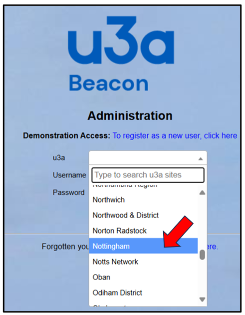
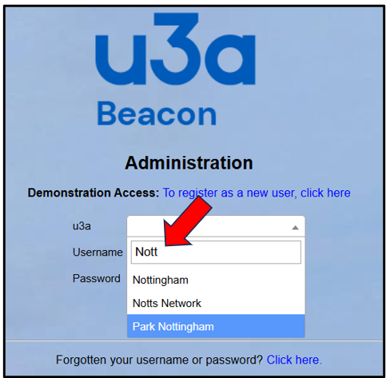
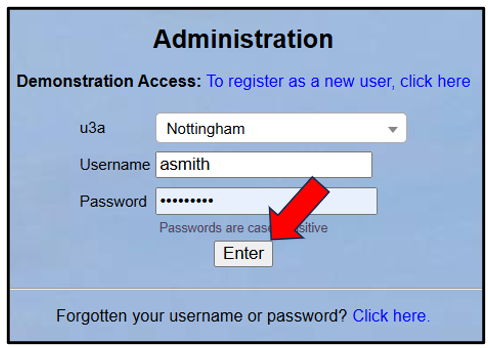
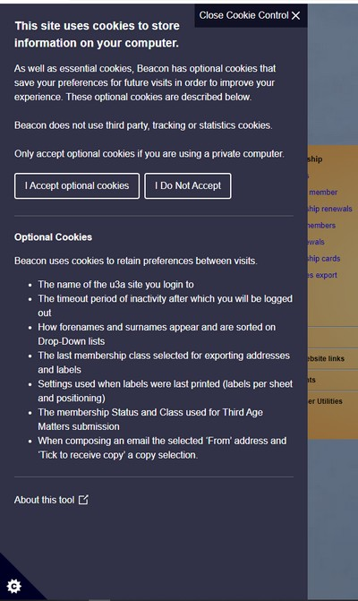
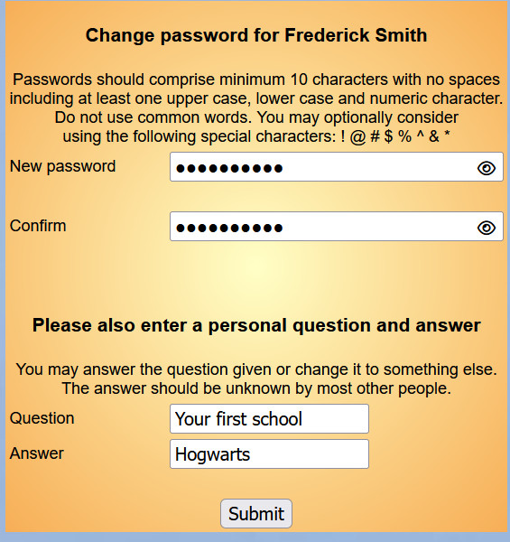

[u3a Beacon](https://u3abeacon.zendesk.com/hc/en-gb) \> [User
Guide](https://u3abeacon.zendesk.com/hc/en-gb/categories/360001240017-User-Guide)
\> [The
Basics](https://u3abeacon.zendesk.com/hc/en-gb/sections/360002083017-The-Basics)
Search

**Articles** **in** **this** **section**

**2.** **Logging** **in** **as** **a** **System** **User**

>  style="width:0.41667in;height:0.41667in" /> style="width:0.15625in;height:0.15625in" />Printable version Graeme
> Bunting Follow 1 year ago · Updated

The Beacon log-in page is located at
[https://u3abeacon.org.uk](https://u3abeacon.org.uk/password.php?logout&froml=1&relogin=1)

After clicking into the **u3a** drop-down list you can scroll down using
the slider on the right to find and select your u3a:

Alternatively, click into the
box where it says *"Type* *to* *search* *u3a* *sites"* and enter part of
your u3a name to show a shortened list of u3a's to select from. This
method is the better one to use with a touch-screen such

as on a tablet or phone:

Having selected your u3a,
enter your **Username** and **Password,** which will have been sent to
you by your Site Administrator, and press the **Enter** button:

> You are allowed four attempts to log in. If the fourth try fails,
> another attempt will not be accepted for 15 minutes. You may be able
> to avoid this delay by closing and re-opening your browser.
>
> With some browser/device combinations you will need to delete your
> browser's cookies. If you wish to selectively delete Beacon's cookies
> look for u3abeacon.org.uk.
>
> If you continue to be unable to log in, seek the assistance of your
> Site Administrator who will confirm your username and may re-set your
> password.

If you have forgotten your username or password, use the **Click**
**here** link at the bottom of the screen or contact your Site
Administrator.

Cookie Control

The fist time you land on this page, and occasionally after that, the
Cookie Control appears. It describes the optional cookies that your
browser can store to remember a range of handy preferences for your next
visit. If you are using a public or shared computer always click "**I**
**Do** **Not** **Accept**". Closing the control without making a choice
is the equivalent of "**I** **Do** **Not** **Accept**".

You can open the cookie control at any time by clicking the cog in the
black triangle located at the bottom left of every Beacon screen.

If you keep seeing the Cookie Control prompt on every page then your
browser is blocking the cookie that remembers your choice. The Norton
Antitrack browser add-on has been reported to do this.

The cookies control can also be used to clear your Beacon cookies. Click
on the cog then "I Do Not Accept". Then click on the cog again and click
"I Accept optional cookies"

Password Management

If you have not used the system before, or if your password has been
re-set by a Site Administrator, you will be prompted to change your
password and set a Security Question and
Answer.

Enter your new password in the **New** **password** box and enter it
again in the **Confirm** box. As you type there will be hints displayed
to tell you whether you have chosen a good password, if it meets the
format requirements and if the 2 entries match.

You can accept the default **Question** (your first school) or change it
to something else. Make sure that the **Answer** is something that you
will remember (including the format) but which is unlikely to be known
to anyone else.

After pressing the **Submit** button you will be taken to the [**Beacon
Home
page**](https://u3abeacon.zendesk.com/hc/en-gb/articles/360007024037-The-Beacon-home-page)

Revision History

||
||
||
||
||
||

||
||
||
||
||

>  style="width:0.1875in;height:0.18726in" />1
>
> Was this article helpful?
>
> Yes No
>
> 5 out of 8 found this helpful
>
> Have more questions? [<u>Submit a
> request</u>](https://u3abeacon.zendesk.com/hc/en-gb/requests/new)

Return to top

**Recently** **viewed** **articles** [1.
Introduction](https://u3abeacon.zendesk.com/hc/en-gb/articles/360007072438-1-Introduction)

[5. Beacon Cookies and Anti-Track
Software](https://u3abeacon.zendesk.com/hc/en-gb/articles/6432020094109-5-Beacon-Cookies-and-Anti-Track-Software)

[7.1 Financial
Ledger](https://u3abeacon.zendesk.com/hc/en-gb/articles/360007367958-7-1-Financial-Ledger)

[8.6 Finance
Set-up](https://u3abeacon.zendesk.com/hc/en-gb/articles/360007304477-8-6-Finance-Set-up)

[7.9.1 Setting up Online Membership
Payments](https://u3abeacon.zendesk.com/hc/en-gb/articles/360007430537-7-9-1-Setting-up-Online-Membership-Payments)

**Comments**

1 comment

**Related** **articles**

[3. The Beacon Home
Page](https://u3abeacon.zendesk.com/hc/en-gb/related/click?data=BAh7CjobZGVzdGluYXRpb25fYXJ0aWNsZV9pZGwrCKU9F9JTADoYcmVmZXJyZXJfYXJ0aWNsZV9pZGwrCBr7F9JTADoLbG9jYWxlSSIKZW4tZ2IGOgZFVDoIdXJsSSI7L2hjL2VuLWdiL2FydGljbGVzLzM2MDAwNzAyNDAzNy0zLVRoZS1CZWFjb24tSG9tZS1QYWdlBjsIVDoJcmFua2kG--b862175ca003d7253165d2c11a9c1de1235acb5f)

[10.2 Members
Portal](https://u3abeacon.zendesk.com/hc/en-gb/related/click?data=BAh7CjobZGVzdGluYXRpb25fYXJ0aWNsZV9pZGwrCMp9HNJTADoYcmVmZXJyZXJfYXJ0aWNsZV9pZGwrCBr7F9JTADoLbG9jYWxlSSIKZW4tZ2IGOgZFVDoIdXJsSSI4L2hjL2VuLWdiL2FydGljbGVzLzM2MDAwNzM2ODEzOC0xMC0yLU1lbWJlcnMtUG9ydGFsBjsIVDoJcmFua2kH--4cc7a2af47307b786092dec68237b52ee203f2e1)

[4. Logging in with a new
password](https://u3abeacon.zendesk.com/hc/en-gb/related/click?data=BAh7CjobZGVzdGluYXRpb25fYXJ0aWNsZV9pZGwrCKLA3dJTADoYcmVmZXJyZXJfYXJ0aWNsZV9pZGwrCBr7F9JTADoLbG9jYWxlSSIKZW4tZ2IGOgZFVDoIdXJsSSJFL2hjL2VuLWdiL2FydGljbGVzLzM2MDAyMDAzMzY5OC00LUxvZ2dpbmctaW4td2l0aC1hLW5ldy1wYXNzd29yZAY7CFQ6CXJhbmtpCA%3D%3D--225efa5191f868ea72aab7c254174f896f57b504)

[Demo System Getting
Started](https://u3abeacon.zendesk.com/hc/en-gb/related/click?data=BAh7CjobZGVzdGluYXRpb25fYXJ0aWNsZV9pZGwrCEK4HtJTADoYcmVmZXJyZXJfYXJ0aWNsZV9pZGwrCBr7F9JTADoLbG9jYWxlSSIKZW4tZ2IGOgZFVDoIdXJsSSJAL2hjL2VuLWdiL2FydGljbGVzLzM2MDAwNzUxNDE3OC1EZW1vLVN5c3RlbS1HZXR0aW5nLVN0YXJ0ZWQGOwhUOglyYW5raQk%3D--3b76aaa805360ec5b03cb8a380f895ef4130ecc2)

[8.1 The Site
Administrator](https://u3abeacon.zendesk.com/hc/en-gb/related/click?data=BAh7CjobZGVzdGluYXRpb25fYXJ0aWNsZV9pZGwrCJKqHdJTADoYcmVmZXJyZXJfYXJ0aWNsZV9pZGwrCBr7F9JTADoLbG9jYWxlSSIKZW4tZ2IGOgZFVDoIdXJsSSI%2FL2hjL2VuLWdiL2FydGljbGVzLzM2MDAwNzQ0NTEzOC04LTEtVGhlLVNpdGUtQWRtaW5pc3RyYXRvcgY7CFQ6CXJhbmtpCg%3D%3D--fdc1b4f5c608b181354dd08d57cd50f0570e3914)

> Sort by
>
>  style="width:0.41667in;height:0.41667in" />Peter Goatly 5 years ago
>
> 0

I suggest that Section 2 of
the User Guide entitled "Logging in as a System User" should be changed.
This is because the words "Passwords should be typed, not pasted.
Correct verification will not take place for pasted passwords." are
relevant to changing passwords, but do not apply when logging in. I have
successfully pasted in passwords when logging in, but I mistakenly
pasted in a 17-character password when changing my password. This
password appeared to have been accepted by Beacon as it produced no
error message. Actually, Beacon only accepted the first 15 characters of
the password (as this is the maximum length it should accept) and this
caused me to get a login failure when I attempted to use the full
17-character password.

Please [<u>sign
in</u>](https://u3abeacon.zendesk.com/access?locale=en-gb&brand_id=360000694158&return_to=https%3A%2F%2Fu3abeacon.zendesk.com%2Fhc%2Fen-gb%2Farticles%2F360007072538-2-Logging-in-as-a-System-User)
to leave a comment.

[u3a Beacon](https://u3abeacon.zendesk.com/hc/en-gb)

> [<u>Powered by
> Zendesk</u>](https://www.zendesk.co.uk/service/help-center/?utm_source=helpcenter&utm_medium=poweredbyzendesk&utm_campaign=text&utm_content=u3a+Beacon+Support)
