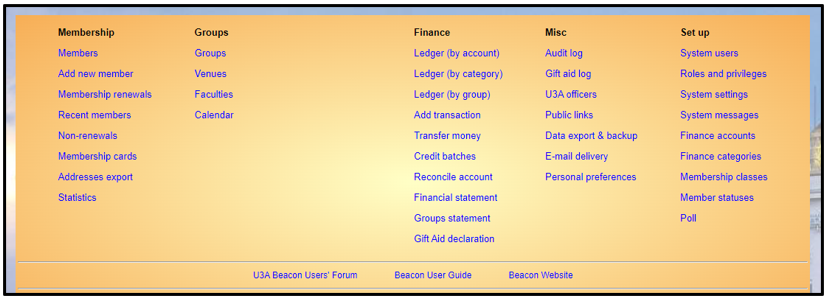

**3.** **The** **Beacon** **Home**
**Page**

> Back

After normal log-in, you be taken to the Beacon **Home** **Page** from
where all of Beacon's functionality may be accessed. Look out for any
site or system messages that may be displayed at the bottom of the page.

The full menu below is the one a Beacon administrator will see.

From any other page in Beacon you can click on the **Home** link at the
top of the page (and sometimes also at the bottom) to return to the Home
page.

The operations are grouped under **Membership**, **Groups**,
**Finance**, **Misc** and **Set** **up**. However, you will only see
those operations for which you have been assigned access rights. This
may mean that for some users, such as the Membership Secretary, some
headings have no or fewer operations beneath them.

It is the case throughout Beacon that operations, links and buttons will
be hidden if you do not have sufficient access rights to use them. If
you feel that you do not have sufficient access rights to do what you
need to do, contact your u3a Site Administrator.

Beacon Navigation Tips

[**<u>Click for tips about navigatin</u>g <u>around
Beacon</u>**](https://u3abeacon.zendesk.com/hc/en-gb/articles/360007072698-Navigation)

Revision History

||
||
||
||
