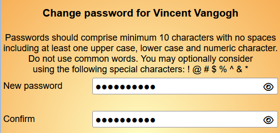
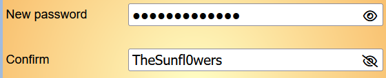
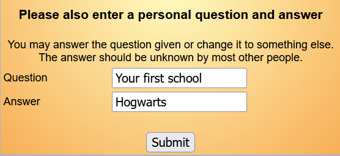

**4.** **Logging** **in** **with** **a** **new**
**password**

> Back

When logging on for the first time with a temporary password, or having
had a password reset, the **Password** **Change** screen is presented
and a new password of at least 10 characters must be typed and
confirmed.

The "eye" icon can be used to reveal the characters typed - this is
especially useful when an invalid character is reported and needs to be
corrected. Valid special characters are shown on the screen.

The upper limit of significant characters is 72.

You will also be asked to enter a **personal** **question** **and**
**answer**. You may answer the default question or you may replace this
with something else. Make sure that the **Answer** is something that you
will remember (including the format) but which is unlikely to be known
to anyone else.

Note that the **Submit** button will be greyed out until a valid
passworded is entered and confirmed and an answer provided.

Revision History

||
||
||
||
