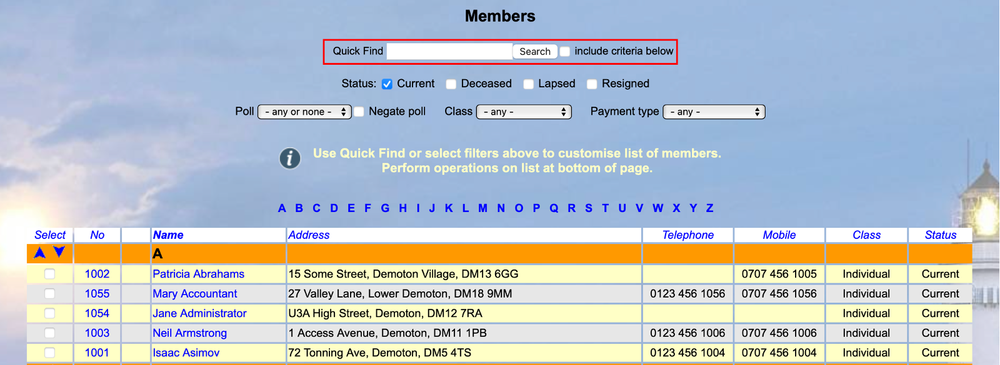
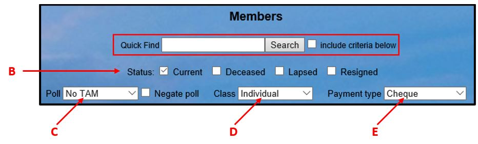
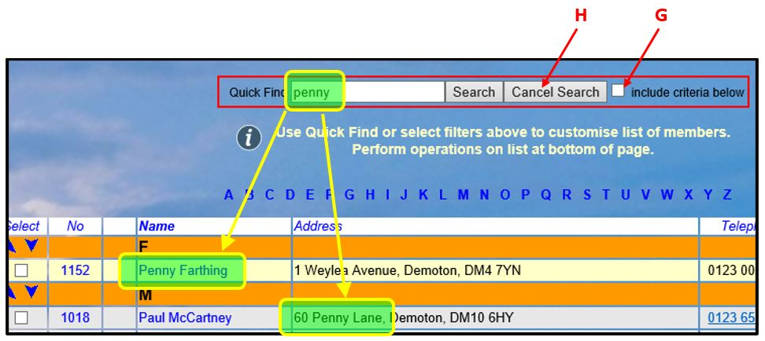
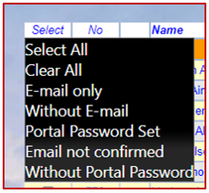
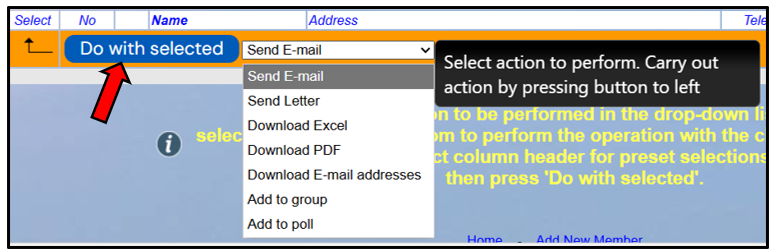
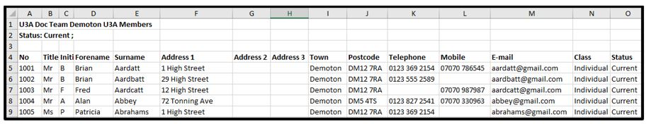
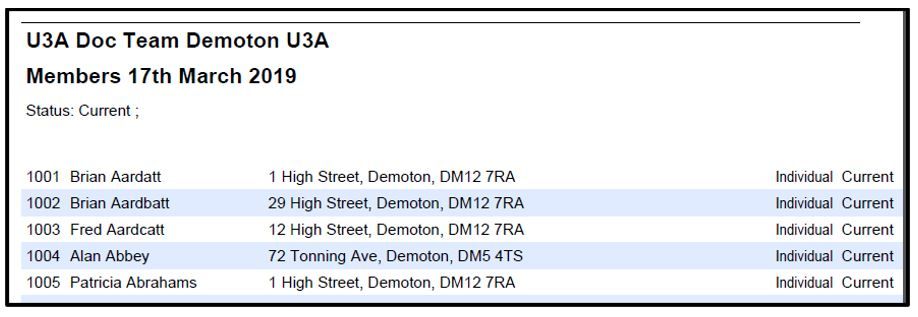
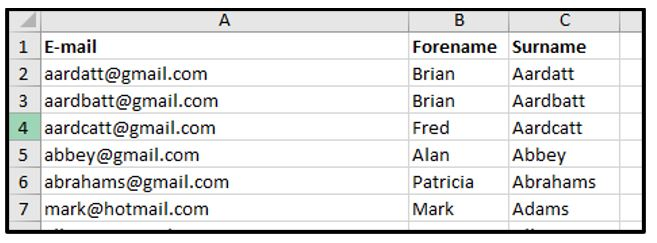

[u3a Beacon](https://u3abeacon.zendesk.com/hc/en-gb) \> [User
Guide](https://u3abeacon.zendesk.com/hc/en-gb/categories/360001240017-User-Guide)
\> [4.
Membership](https://u3abeacon.zendesk.com/hc/en-gb/sections/360002102758-4-Membership)
Search

**Articles** **in** **this** **section**

**4.1** **The** **Membership** **List**

>  style="width:0.41667in;height:0.41667in" /> style="width:0.15625in;height:0.15625in" />Graeme Bunting Follow 1
> month ago · Updated

a\) Viewing the Membership List

Click **Members** from the Home page to view the Membership List page.

There are a couple of features to help quickly navigate around the page:

> Clicking one of the letters in the block above the table will jump to
> members with a surname starting with that letter.
>
> Clicking the ‘down’ arrow in the top right corner of the page will
> scroll to the bottom of the page. There is a similar ‘up’ arrow in the
> bottom right corner to scroll to the top of the page.

b\) Filtering the Membership List

The ‘filters’ at the top of the Membership List page allow you choose
which members are displayed:

> Tick one or more boxes to choose the required membership **Status**
> **\[B\]**.
>
>  style="width:1.125in;height:0.47892in" />Choose from the drop-down
> list **\[C\]** to display members belonging to the selected **Poll**.
> Ticking **Negate** **poll** displays members that do not belong to the
> selected poll.
>
> Choose from the drop-down list **\[D\]** to display members belonging
> to the selected **Class**. style="width:7.4375in;height:2.23958in" />
>
> Choose from the drop-down list **\[E\]** to display members that paid
> for their last membership fee using the selected **Payment**
> **method**.

The **Quick** **Find** box may
be used to search quickly for full or partial matches in any of the
following fields: Member's Name, 'Known as', Street, Town, Postcode,
Telephone, Mobile phone or Membership Number. Enter the text or number
you want to match and press **Search.**

*Note:* *If* *the* ***include*** ***criteria*** ***below*** *box*
***\[G\]*** *is* *ticked,* *the* *search* *will* *only* *find* *members*
*that* *meet* *the* *criteria* *defined* *by* *the* ***\[B\],***
***\[C\],*** ***\[D\]*** *and* ***\[E\]*** *selections.*

*If* *the* *box* *is* *left* *unticked,* *the* *search* *will* *include*
*all* *members.*

When you have finished searching, press **Cancel** **Search** **\[H\]**
to return to normal operation.

c\) Selecting Members from the Membership List

To select one or more members prior to performing one of the operations
described in section (d) below, tick the boxes in the left hand column
next to each member’s name.

Or click **Select** at the top or bottom of the column, followed by
either:

> **Select** **All** for all displayed members
>
> **Clear** **All** to de-select previously selected names **Email**
> **only** for members with an email address **Without** **email** for
> members without an email address
>
> **Portal** **Password** for members that have successfully registered
> for the Members
> Portal style="width:7.4375in;height:2.4375in" />
>
> **Email** **not** **confirmed** for members that have been sent an
> email link to complete Portal registration but haven't clicked the
> link to complete the process
>
> **Without** **Portal** **Password** for members that do not have
> Portal access

d\) Operations with selected Members

After selecting one or more members as described above, the following
operations may be available, depending on the access level that you have
been given.

Choose one of the options from the drop-down list below the table before
pressing the **Do** **with** **selected** button:-

> **Send** **email**: opens a form on which to compose an email (see
> 6.1) **Send** **letter**: opens a form on which to compose a letter
> (see 6.2)
>
> **Download** **Excel**: generates an Excel file containing members’
> addresses, email addresses, phone numbers, etc.
>
> **Download** **PDF**: generates a pdf document containing members’
> addresses **Download** **e-mail** **addresses**: generates an Excel
> file containing email addresses **Add** **to** **group**: presents a
> list of groups that members can be added to
>
> **Add** **to** **poll**: presents a list of polls that members can be
> added to

The **Group** drop-down list is searchable - for example Typing "Walk"
will filter the list to only show Groups that contain the letters
"walk".

Inactive Groups are shown in red with a suffix (inactive).

When downloading a file, you will be given the choice of **Opening** the
file onscreen or **Saving** the file in your default download location.
Clicking the arrow next to **Save** gives the option of doing a
**Save-as** to a specified location.

See below for examples of typical downloads.

**Excel** **Download**

**PDF** **Download**

**Email** **Address** **Download**

Revision History

||
||
||
||
||
||
||

> Was this article helpful?
>
> Yes No
>
> 2 out of 2 found this helpful
>
> Have more questions? [<u>Submit a
> request</u>](https://u3abeacon.zendesk.com/hc/en-gb/requests/new)

Return to top

**Recently** **viewed** **articles**

[6. Some tips when using
Beacon](https://u3abeacon.zendesk.com/hc/en-gb/articles/360007072698-6-Some-tips-when-using-Beacon)

[Best ways to use the User
Guide](https://u3abeacon.zendesk.com/hc/en-gb/articles/360019032818-Best-ways-to-use-the-User-Guide)

[3. The Beacon Home
Page](https://u3abeacon.zendesk.com/hc/en-gb/articles/360007024037-3-The-Beacon-Home-Page)

**Related** **articles** [4.2 Member
Record](https://u3abeacon.zendesk.com/hc/en-gb/related/click?data=BAh7CjobZGVzdGluYXRpb25fYXJ0aWNsZV9pZGwrCLl%2FG9JTADoYcmVmZXJyZXJfYXJ0aWNsZV9pZGwrCMF3G9JTADoLbG9jYWxlSSIKZW4tZ2IGOgZFVDoIdXJsSSI2L2hjL2VuLWdiL2FydGljbGVzLzM2MDAwNzMwMzA5Ny00LTItTWVtYmVyLVJlY29yZAY7CFQ6CXJhbmtpBg%3D%3D--3aafd98c6ff63e5547e12c251d51752e3d9ee1a0)

[4.2.2 Deleting members including GDPR
compliance](https://u3abeacon.zendesk.com/hc/en-gb/related/click?data=BAh7CjobZGVzdGluYXRpb25fYXJ0aWNsZV9pZGwrCCLI2NJTADoYcmVmZXJyZXJfYXJ0aWNsZV9pZGwrCMF3G9JTADoLbG9jYWxlSSIKZW4tZ2IGOgZFVDoIdXJsSSJVL2hjL2VuLWdiL2FydGljbGVzLzM2MDAxOTcwNzkzOC00LTItMi1EZWxldGluZy1tZW1iZXJzLWluY2x1ZGluZy1HRFBSLWNvbXBsaWFuY2UGOwhUOglyYW5raQc%3D--138e34db5d2c0f5c99bce811c1e9e44e4638eb53)

[4.3.1 Addresses & Phone
Numbers](https://u3abeacon.zendesk.com/hc/en-gb/related/click?data=BAh7CjobZGVzdGluYXRpb25fYXJ0aWNsZV9pZGwrCH1V1tJTADoYcmVmZXJyZXJfYXJ0aWNsZV9pZGwrCMF3G9JTADoLbG9jYWxlSSIKZW4tZ2IGOgZFVDoIdXJsSSJCL2hjL2VuLWdiL2FydGljbGVzLzM2MDAxOTU0NzUxNy00LTMtMS1BZGRyZXNzZXMtUGhvbmUtTnVtYmVycwY7CFQ6CXJhbmtpCA%3D%3D--22ed054ba1c80ee7ee8f44e9f49a91a11159cf39)

[8.4 Roles and
Privileges](https://u3abeacon.zendesk.com/hc/en-gb/articles/360007304437-8-4-Roles-and-Privileges)

[8.6 Finance
Set-up](https://u3abeacon.zendesk.com/hc/en-gb/articles/360007304477-8-6-Finance-Set-up)

[8.1 The Site
Administrator](https://u3abeacon.zendesk.com/hc/en-gb/related/click?data=BAh7CjobZGVzdGluYXRpb25fYXJ0aWNsZV9pZGwrCJKqHdJTADoYcmVmZXJyZXJfYXJ0aWNsZV9pZGwrCMF3G9JTADoLbG9jYWxlSSIKZW4tZ2IGOgZFVDoIdXJsSSI%2FL2hjL2VuLWdiL2FydGljbGVzLzM2MDAwNzQ0NTEzOC04LTEtVGhlLVNpdGUtQWRtaW5pc3RyYXRvcgY7CFQ6CXJhbmtpCQ%3D%3D--63ee671e80251955c9443f37bd36c4ebfb82a98e)

[Videos included in this
guide](https://u3abeacon.zendesk.com/hc/en-gb/related/click?data=BAh7CjobZGVzdGluYXRpb25fYXJ0aWNsZV9pZGwrCJGSxdcEBDoYcmVmZXJyZXJfYXJ0aWNsZV9pZGwrCMF3G9JTADoLbG9jYWxlSSIKZW4tZ2IGOgZFVDoIdXJsSSJDL2hjL2VuLWdiL2FydGljbGVzLzQ0MTg4NDY0Mjk4NDEtVmlkZW9zLWluY2x1ZGVkLWluLXRoaXMtZ3VpZGUGOwhUOglyYW5raQo%3D--e8329b254501ca3e5494920832b570f73309d35e)

**Comments** 0 comments

Please [<u>sign
in</u>](https://u3abeacon.zendesk.com/access?locale=en-gb&brand_id=360000694158&return_to=https%3A%2F%2Fu3abeacon.zendesk.com%2Fhc%2Fen-gb%2Farticles%2F360007301057-4-1-The-Membership-List)
to leave a comment.

[u3a Beacon](https://u3abeacon.zendesk.com/hc/en-gb)

> [<u>Powered by
> Zendesk</u>](https://www.zendesk.co.uk/service/help-center/?utm_source=helpcenter&utm_medium=poweredbyzendesk&utm_campaign=text&utm_content=u3a+Beacon+Support)
