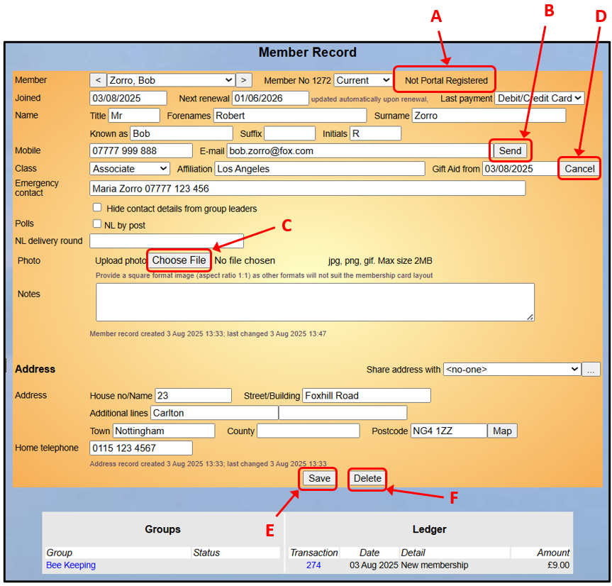
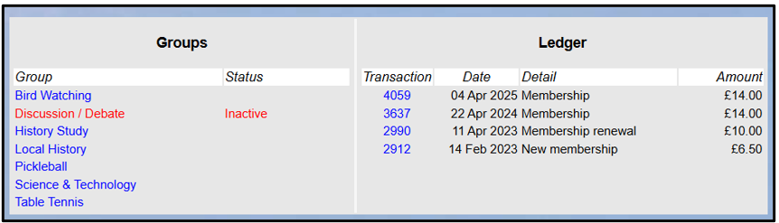
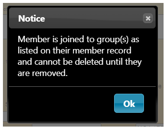

**4.2** **Member** **Record**

> Back

a\) Viewing & Editing a Member Record

Member Records can be accessed by clicking on a member's **Name** or
membership **No** highlighted in blue in the [<u>Members
List</u>](https://u3abeacon.zendesk.com/hc/en-gb/articles/360007301057-4-1-The-Membership-List)
[<u>(see
4.1)</u>](https://u3abeacon.zendesk.com/hc/en-gb/articles/360007301057-4-1-The-Membership-List)
and elsewhere throughout the Beacon system.

The fields in the upper part of the record, including **Mobile**
**number**, relate to that member alone. The address fields at the
bottom, including **Home** **Telephone** (landline), may be shared with
another member that lives at the same address.

An email can be sent to the member by pressing the **Send** button
**\[B\]** adjacent to their email address ([<u>see
6.1</u>)](https://u3abeacon.zendesk.com/hc/en-gb/articles/360007367918)

The **Joined** and **Next** **renewal** dates are set automatically by
the system and will not normally need to be touched. They may, however,
be overridden manually.

**Known** **as** may be used if the member prefers to be known by a
different name, e.g. Bill rather than William. **Suffix** may be used
for honours, e.g. MBE.

The **Hide** **contact** **details** **from** **group** **leaders** tick
box is provided for members who have specified that they don’t wish
Group Leaders to be able to see their contact details

*Note:* *Group* *Leaders* *are* *still* *able* *to* *send* *emails* *to*
*the* *member,* *but* *without* *seeing* *the* *email* *address.*

If your u3a has created any **Polls**, the boxes can be ticked or
unticked to add or remove the member from a poll

*Note:* *after* *consulting* *the* *Trust,* *the* *recording* *of*
*Male,* *Female* *or* *Unknown* *has* *been* *removed* *from* *the*
*system.*

**<u>Members Portal</u>**

The text to the right of the Member Status drop-down list **\[A\]**
shows whether or not the member has registered to use the Members Portal
[(<u>see
10.2</u>](https://u3abeacon.zendesk.com/hc/en-gb/articles/360007368138)).

This helps answer any questions that members raise about not being able
to access the Portal; it can be seen if they have registered and set
their password. The information shown will be one of three things:

> 1\. Not Portal Registered 2. Portal Password Set 3. Email not
> confirmed

No. 3 is only seen if the member has set their password, but not
verified their email address by clicking on the link in the email
received. That link is only valid for one hour. After that, they will
need to use the "Forgotten password" link on the Portal sign-in page to
validate the email address reset their password - the five data pieces
will not work.

**<u>Member Photo</u>**

A photo of the member may be uploaded. Press the **Choose** **File**
button **\[C\]** (the style of which varies between browsers) and select
an image file from your device.

*Note:* *The* *picture* *must* *be* *saved* *as* *jpg,* *png,* *or*
*gif,* *maximum* *file* *size* *2MB.* *A* *square* *format* *photo*
*(aspect* *ratio* *1:1)* *is* *advised* *to* *suit* *the* *space* *on*
*the* *membership* *card.* *Photos* *can* *be* *cropped* *to* *a*
*square* *using* *a* *smartphone* *app* *or* *other* *photo* *editing*
*software.*

**<u>Gift Aid Date</u>**

**Gift** **Aid** **from** is the date from which the member consented
for Gift Aid claims to be made on their membership subscriptions. If the
member becomes ineligible for Gift Aid or withdraws consent, the date
must be removed by pressing the **Cancel** button **\[D\]**.

Entering a Gift Aid date in the future is not possible.

If a date in the past is entered, or a date older than the original
date, a warning is displayed saying that the Gift Aid consent date is
being back dated. The status of any previous Gift Aid eligible
transactions in Beacon for the member will not be changed.

***Note:*** ***When*** ***setting*** ***a*** ***new*** ***members***
***for*** ***Gift*** ***Aid*** ***it*** ***is*** ***important***
***that*** ***you*** ***include*** ***a*** ***title:*** ***e.g.***
***Mr*** ***,*** ***Mrs,*** ***Ms*** ***etc.*** ***This*** ***is***
***necessary*** ***when*** ***making*** ***a*** ***submission***
***to*** ***claim*** ***from*** ***HMRC.*** ***The*** ***system***
***will*** ***now*** ***direct*** ***you*** ***to*** ***have*** ***a***
***title*** ***when*** ***selecting*** ***Gift*** ***Aid.***

*The* *Membership* *Secretary* *can* *change* *the* *Gift* *Aid*
*status* *of* *members* *directly* *from* *the* *Renewals* *screen*
*[(<u>see
4.5</u>](https://u3abeacon.zendesk.com/hc/en-gb/articles/360007367798)).*
*This* *avoids* *having* *to* *update* *individual* *Member* *Records*
*in* *advance* *of* *processing* *the* *renewal.*

*Ticking* *Gift* *Aid* *on* *the* *Renewals* *screen* *sets* *the*
*consent* *date* *to* *today's* *date.* *Ticking* *or* *unticking* *on*
*the* *Renewals* *screen* *updates* *the* *member's* *Gift* *Aid*
*status* *immediately,* *even* *if* *the* *renewal* *is* *not*
*subsequently* *completed.*

**<u>Savin</u>g <u>Chan</u>g<u>es</u>**

After making any changes to a Member Record, press the **Save** button
**\[E\]** to commit the changes.

*Note:* *if* *a* *member* *that* *is* *a* ***System*** ***User*** *has*
*their* *status* *has* *changed* *to* ***Deceased*** *or*
***Resigned,*** *they* *will* *automatically* *be* *removed* *from*
*the* *System* *User* *list* *on* *saving* *the* *Member* *Record.*

**<u>Groups and Led</u>g<u>er</u>**

At the bottom of the Member Record page any Groups that the member
belongs to (or is on the waiting list for) and the financial
Transactions associated with the member are displayed. By clicking the
corresponding links, you may go directly to the associated **Group**
**Record** or **Transaction** **Record**.

Where a Group is not currently active it is displayed in red with a
Status of **Inactive**.

b\) Adding a new Member Record

[<u>Refer to
4.3</u>](https://u3abeacon.zendesk.com/hc/en-gb/articles/360007367058-4-3-Add-New-Member)
for details of how to create a Member Record for a new member.

c\) Deleting a Member Record

When a person ceases to be a current member, rather than deleting the
Member Record straight away, their status needs to be changed to
**Lapsed** or some other non-current value such as **Resigned** or
**Deceased** [(<u>see
4.6</u>)](https://u3abeacon.zendesk.com/hc/en-gb/articles/360007304297-4-6-Non-renewals).

A **Delete** button **\[F\]** is provided to remove a Member Record,
although you may not be able to see this, depending on how your access
rights have been set up.

Before deleting a Member Record the member must be removed from any
Groups that they belonged to. Attempting to delete a member that is
still linked to a Group will generate the following message:

**Note** **1.** Please refer to [<u>4.2.2 Deleting members including
GDPR
com</u>p<u>liance</u>](https://u3abeacon.zendesk.com/hc/en-gb/articles/360019707938)
for information about how long to keep records, and what happens when a
record is deleted.

**Note** **2.** Please refer to [<u>4.2.1 Deleting Duplicate Members</u>
i](https://u3abeacon.zendesk.com/hc/en-gb/articles/360019690518-4-2-1-Deleting-Duplicate-Members)f
duplicate Member Records are inadvertently created.

**Note** **3.** Please refer to [<u>4.2.3 Removing deleted members from
Grou</u>p<u>s</u>](https://u3abeacon.zendesk.com/knowledge/articles/360019721678/en-gb?brand_id=360000694158)
for how to identify and remove members from Groups if they have died,
resigned, or lapsed.

Revision History

||
||
||
||
||
||
||
||
||
||
||
||
||
||

||
||
||
||
||
