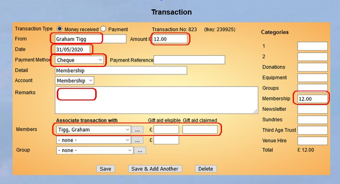

**4.2.1** **Deleting** **Duplicate**
**Members**

> Back

**Duplicate** **Member** **Records**

If duplicate Member Records are inadvertently created, it is recommended
that the Membership Secretary reviews the duplicates and determines
which record to keep and which needs to be removed.

If this is not clear then one clue will be that the record with links to
Ledger transactions will be the more established. If the member to be
deleted has Ledger entries then examine them to determine if they need
to deleted or re-linked to the member record being retained.

Also, check the Groups that the member is associated with and make a
note of them. One way to do this is to download all the Groups
information from *Data* *Export* *&* *Backup* and do a search on the
downloaded spreadsheet.

Login as *admin* and Delete the unwanted Membership Record and then
check they are members of their Groups and re-join them if necessary.
This step is especially important if the member is a Group Leader.

Note that once a membership record is deleted then the membership number
originally associated with that record cannot be reused. If this is
inconvenient the below is an alternative option.

**Alternative** **approach** **to** **preserve** **membership**
**numbers**

If the membership number of a duplicate is needed for any reason then
the details on the duplicate record can be over typed with those of a
new member as long as the associated Ledger transaction has not been
reconciled.

After saving the new member's
details click on the Ledger transaction. Update the highlighted entries
to reflect the changed member as necessary and Save the transaction.

Finally, go back to the member record and check the replacement member
has not inherited any Group memberships.

***Deletion*** ***Privileges:*** ***Note*** ***to*** ***System***
***Administrators***

*It* *is* *recommended* *that* *the* *System* *User* *privilege* *to*
*delete* *members* *is* *tightly* *restricted.*

**Revision** **History**

||
||
||
||
||
||
