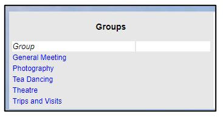

**4.2.3** **Removing** **deleted** **members** **from**
**Groups**

> Back

When a member has Lapsed, Resigned, or Deceased, their name will remain
in the **Members** list of any **Group** that they belonged to.

There is no mechanism by which the Group Leaders are notified that the
person is no longer a member of the U3A.

Therefore, when the Membership Secretary changes a Member Record to a
status such as Lapsed, Resigned or Deceased, it is best for them to also
remove the member from any Groups that they belonged to and consider
whether the Group Leader needs to be notified.

Please note that the default privileges do not give the Membership
Secretary these rights. It is for each committee to decide what
privileges each uses has with the exception of admin which is different.

The Groups that the member belonged to can be seen at the bottom of the
Member Record

***Tip:*** *Click* *on* *each* *Group* *in* *turn* *while* *holding*
*down* *the* ***Ctrl*** *key* *to* *open* *each* *Group* *Record* *in*
*a* *separate* *tab,* *from* *where* *you* *can* *navigate* *to* *the*
*Members* *page.*

***Tip:*** *If* *there* *is* *a* *long* *list* *of* *members,* *the*
*quickest* *way* *of* *finding* *a* *member* *may* *be* *to* *open*
*the* ***Find*** *box* *by* *pressing* *the* ***Ctrl*** ***and***
***F*** *keys* *and* *typing* *part* *of* *the* *member's* *name.* *If*
*there* *are* *several* *members* *to* *find* *it* *may* *be* *better*
*to* *search* *on* *their* *status* *(lapsed,* *resigned,* *etc.).*

||
||
||
||
