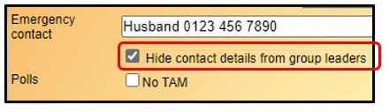
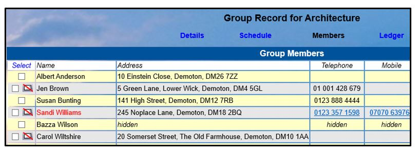
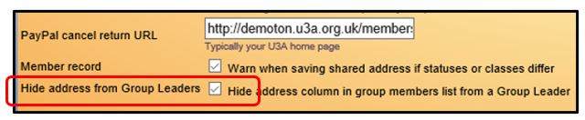
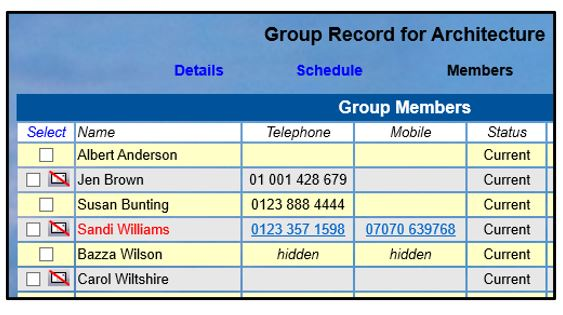

**4.2.4** **Hiding** **Contact** **Details** **from** **Group**
**Leaders**

> Back

Access to data within Beacon is generally controlled by ticking &
unticking the **Privileges** that are associated with each **User**
**Role** [(**<u>see
8.2</u>**)](https://u3abeacon.zendesk.com/hc/en-gb/articles/360007304437-8-2-Roles-and-Privileges).
However, there are 2 other ways of restricting Group Leaders from
viewing member contact details.

a\) Restricting Access on an Individual Basis

The **Hide** **contact** **details** **from** **group** **leaders** tick
box on the **Member** **Record** is provided for members who have
specified that they don’t wish Group Leaders to be able to see their
contact details.

When this is ticked, Group
Leaders are not be able to see the address or phone numbers of the
member (as with Mr Wilson below), although they are still able to send
emails to the member.

Individual members are able to see and change their own 'hide from'
setting by logging in to the **Member's** **Portal** and selecting
**Update** **your** **personal** **details**.

b\) Restricting Access on a Global Level

The **Hide** **Address** **from** **Group** **Leaders** tick box on the
**System** **Settings** page may be ticked if your U3A wishes to hide
the addresses of <u>all</u> members from <u>all</u> group leaders
(except those that have been allocated other Membership privileges).

Group leaders will still be able to see member phone numbers and send
emails to the group members as shown below.

**Revision** **History**

||
||
||
||
||
