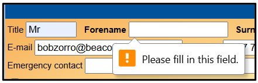
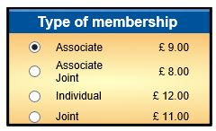
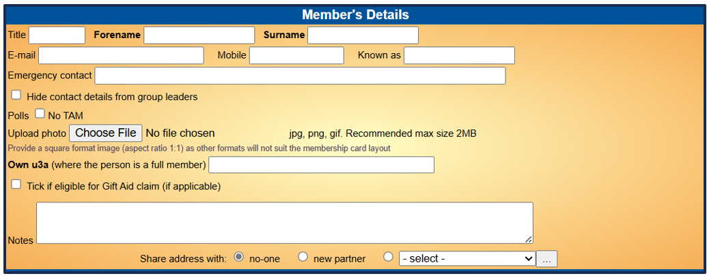
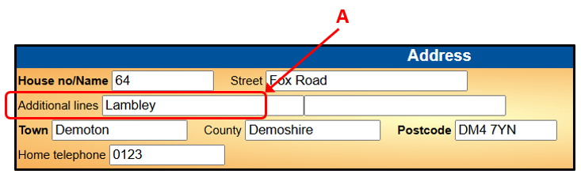
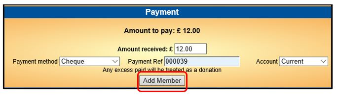
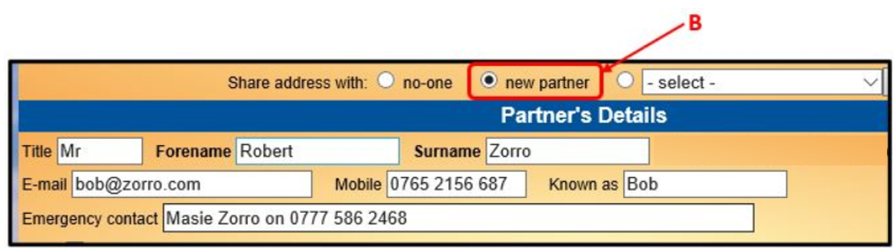
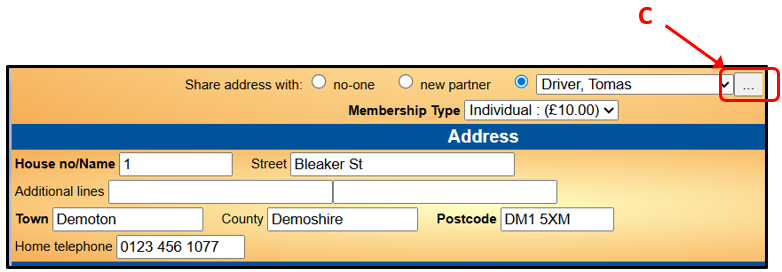
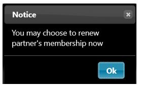
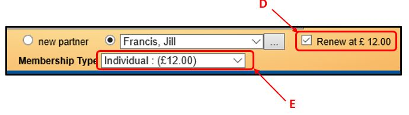
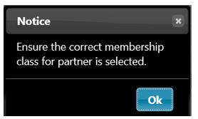

**4.3** **Add** **New** **Member**

> Back

Checking for Former Members

Before adding a new member, check that they are not already in the
system – go to the **Members** **List** and tick all the boxes in the
**Status** row to display all current and past members in surname order.

Also check if there are any other u3a members living at the same address
as the new member. This can be done by clicking on the blue **Address**
heading at the top of the Members List. This will sort the table in
address order (House/Flat No. & Street) and will make it easy to check
whether the new member’s address is already on the system.

*A* *change* *has* *now* *been* *made* *that* *you* *try* *to* *add* *a*
*new* *member* *where* *one* *of* *the* *same* *name* *exists* *you*
*are* *warned* *and* *asked* *if* *you* *want* *to* *create* *a*
*second* *member.*

Members with Shared Addresses

When **2** **new** **members** that live at the same address join at the
same time, the 2 new Member Records can be created together and they
share a single Address Record in the database.

Beacon refers to members that share an address as **Partners**. This is
irrespective of whether the members are in a **Joint** Membership Class
or whether the Membership Class meets the HMRC requirements of Family
membership.

If a new member is joining as a Joint member with an existing member who
is currently in an Individual class, you should update the class of the
existing member before adding the new member (this will save time
later).

Refer to [<u>4.3.2 Shared Addresses & Joint
Members</u>](https://u3abeacon.zendesk.com/hc/en-gb/articles/360019697318)
for further information about how Beacon treats members living at the
same address.

a\) Adding a New Member

Click **Add** **new** **member** on the Home Page or from the top of the
Membership List page.

The 'Add New Member' page for a member that doesn't share an address
with another member consists of 4 sections:

> i\) Type of Membership
>
> ii\) Member’s Details
>
> iii\) Address
>
> iv\) Payment

When a new member shares an address with another member, there is an
additional section for **Partner’s** **Details** as described in
**section** **b)** below.

All fields with a caption in **bold** **text** are **mandatory**. If any
of these are not filled in you will be prompted to do so when you
attempt to save the Member Record:

Refer to [<u>4.2 Member
Record</u>](https://u3abeacon.zendesk.com/hc/en-gb/articles/360007303097-4-2-Member-Record)
for additional details about the information and format required.

**i)** **Type** **of** **Membership** Select the type of membership.

**ii)** **Member’s** **Details**

Enter the member's name and contact details and any notes (if required).
Also tick any of the boxes that are applicable. There is also the option
to upload a photo of the member; follow the guidance in
[<u>4.2</u>.](https://u3abeacon.zendesk.com/hc/en-gb/articles/360007303097)

If the type of membership is an Associate class, there is an additional
field for adding the member's home u3a.

*Note:* ***Email*** ***addresses*** *entered* *in* *upper* *case* *or*
*part* *upper* *case* *are* *converted* *to* *lower* *case* *before*
*they* *are* *saved.*

*The* ***Initials*** *field* *is* *not* *displayed* *at* *this* *stage*
*and* *will* *be* *completed* *automatically* *from* *the* *member’s*
***Forename**(s).* *Additional* *initials* *and* *a* *suffix* *can* *be*
*added* *by* *editing* *the* *Member* *Record* *after* *it* *has* *been*
*saved.*

**iii)** **Address**

Enter the Address details in a consistent manner. Use Upper and Lower
case letters the same as if you were addressing an envelope. Always
entering the District or Village in the first of the ‘**Additional**
**lines’** boxes **\[A\]** will enable ‘sorting’ on District/Village in
Excel downloads of the Membership List. Please be aware that downloads
for TAM mailing and Gift Aid reports to HMRC are dependent on the
required consistent format.

*Please* *refer* *to* [<u>4.3.1 Addresses & Phone
Numbers</u>](https://u3abeacon.zendesk.com/hc/en-gb/articles/360019547517)
*for* *further* *help* *on* *address* *and* *phone* *number* *formats.*

**iv)** **Payment**

Enter the amount paid in **Amount** **received**.

Select the **Payment** **method**, e.g. cash, cheque, BACS. etc.

Select the **Account** to be credited. This is likely to be the
**Current** account or the **Membership** account if you have one set up
(see [<u>7.10
Financial</u>](https://u3abeacon.zendesk.com/hc/en-gb/articles/360007368058)
[<u>Approaches</u>](https://u3abeacon.zendesk.com/hc/en-gb/articles/360007368058)
for guidance on how to manage your membership payments)

Optionally, enter a **Payment** **Ref** (e.g. cheque number).

If the **Amount** **received** is greater than the **Amount** **to**
**pay**, the extra money will be accepted as a donation. If too little
money is entered, you will be warned but can choose to disregard the
warning if you have particular reason for doing so.

After carefully checking that all the entered information is correct,
press **Add** **Member** to create a new Member Record and an associated
Financial Transaction. If any mandatory fields are not filled in, or
information such as Post Code is in an incorrect format you will be
prompted to correct before the form can be saved.

b\) Adding a New Member with a Shared Address

If a Joint membership class is selected or if **Share** **address**
**with** **new** **partner** is selected, a new section for
**Partner's** **Details** opens.

**i)** **Address** **shared** **with** **another** **new** **member**

When another member with a shared address is joining at the same time,
select **new** **partner** **\[B\]** at the bottom of the **Member's**
**Details** section and enter the **Partner’s** **Details**.

**ii)** **Address** **shared** **with** **an** **existing** **member**

When the new member shares an address with an existing member, do not
fill in the **Partner's** **Details** section manually because this
would create a duplicate Member Record for the partner. Select the
partner’s name from the drop-down list at the bottom of the **Member's**
**Details** section. The partner's details, including the shared address
will be populated automatically.

If there are 2 or more potential sharing members with the same name,
make sure to select the correct one. You may click the adjacent button
with 3 dots **\[C\]** to open the other member’s record for further
clarification (doing this with the **Ctrl** key held down will open the
record in a separate tab).

>  style="width:2.22154in;height:1.41443in" />If the partner’s membership
> is due for renewal, there will be a prompt that you may renew the
> partner at the same time, which you can do by ticking the adjacent box
> **\[D\]**. style="width:5.51389in;height:1.55827in" />
>
>  style="width:2.22154in;height:1.33452in" />You may also be prompted to
> check that the partner’s membership class is correct. This can be
> changed to the appropriate membership type and renewal fee by
> selecting from the drop-down list **\[E\]**.

Video

The video below covers the steps to add a new member as a Partner of an
existing member, either during the membership year or at renewal time:

> [**Adding** **a** **partner**
> **2021-12-19**](https://www.youtube.com/watch?v=lUl8DSH0F7M)
>
> **Revision** **History**

||
||
||
||
||
||
||
||
||

||
||
||
||
||
||
