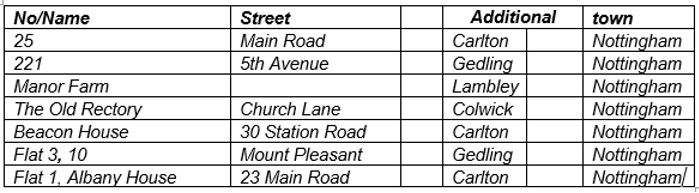
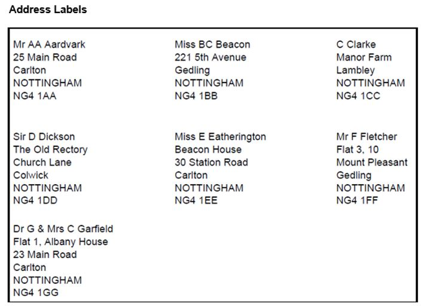
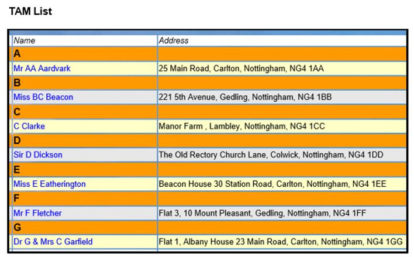
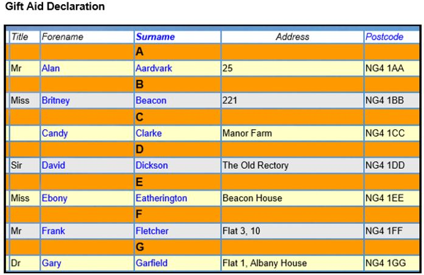

**4.3.1** **Addresses** **&** **Phone**
**Numbers**

> Back

It is recommended that you adopt a consistent approach to the way that
Addresses and Phone Numbers are entered in Member Records.

Address Guidance

**House** **no/Name** is merged with **Street** on the **Address**
**Labels** download when House no/Name is no more than 7 characters
long. If greater than 7 characters they are shown on separate lines so
that the text is not too wide for the label.

You may sometimes wish to add commas in the **House** **no/Name** field
to break up the text and to make the Address Labels look sensible, as
shown in the examples below.

**House** **no/Name** can have at most 25 characters and there are
circumstances where this is not enough and words have to be abbreviated
or other compromises made.

**House** **no/Name** and **Postcode** (only) are used in **Gift**
**Aid** **reports** for HMRC and need to identify the dwelling. Current
HMRC guidance states: *“As* *a* *minimum* *HMRC* *will* *accept* *the*
*number* *(or* *name* *as* *appropriate)* *of* *their* *home* *and*
*their* *full* *postcode”*. It pays to be consistent with the way that
the address fields are filled in. This makes searching and filtering
easier in Excel address exports, e.g. when searching for everyone that
lives in a specific street or district.

An official address can be checked at
[<u>www.royalmail.com/find-a-postcode</u>](https://www.royalmail.com/find-a-postcode)
which will list all the house entries for a Post Code. This will help
with deciding whether, for example, just “Flat 3” is acceptable or “Flat
3, 10” is preferable (see table below).

Typical examples of recommended **House** **no/Name** & **Street**
combinations are shown below, followed by the Address Labels download,
TAM List & Gift Aid submissions generated from these addresses:

Please Note the following with regard to the use of the MAP button next
to the Post Code in Individual Records:

> **Map** **feature** **in** **Beacon**
>
> We are aware of an issue with the map button in some parts of Beacon.
> This is due to an issue with the service we use to deliver this
> feature. We are looking into possible ways to resolve it but please
> bear with us as this is not likely to be a quick fix.

Telephone Number Guidance

It is recommended that Home Telephone numbers are input in a consistent
format. This makes them easier to read and to spot any incorrect numbers
that contain the wrong number of digits. The recommended format varies
depending on the number of digits in the area code, e.g.

**02x** **xxxx** **xxxx**

**01xx** **xxx** **xxxx**

For Cardiff, Coventry, London, Portsmouth, Southampton, N Ireland

For most other major cities

**01xxx** **xxxxx(x)** For smaller cities, provincial towns and rural
areas **01xxxx** **xxxx(x)** For rural North West England and Borders

Mobile numbers are generally shown as **07xxx** **xxxxxx**.

||
||
||
||
