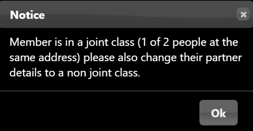

**4.3.2** **Shared** **Addresses** **&** **Joint**
**Members**

> Back

Beacon has two ways of recording that two members share an address and
can be treated as partners.

**The** **first** **way** is that each member does “share address with”
the other (as shown on their Member Record). They share a single Address
Record in the database.

It doesn’t matter if some other member(s) happen to have an identical
address, you can only “share address with” one other member, and they
“share address with” you. Beacon often refers to such members as
**partners**. When adding or updating a member record then members need
to be explicitly shared, just typing in the same address does not create
partners.

*Note:* *It* *is* *true* *that* *if* *you* *try* *very* *hard* *you*
*can* *get* *A* *to* *share* *address* *with* *B* *and* *B* *to* *share*
*address* *with* *C* *a* *third* *person,* *and* *so* *on* *but* *that*
*is* *only* *because* *Beacon* *doesn’t* *trap* *that* *error*.

To identify members who "share address with" then perform a Data Export
& Backup for "Members and addresses". Sorting the download by field
"akey" will pair shared addresses to successive rows. For more
information see [9.5
Data](https://u3abeacon.zendesk.com/hc/en-gb/articles/360007304557)
[Export and
Backup.](https://u3abeacon.zendesk.com/hc/en-gb/articles/360007304557)

**The** **second** **way** is that some membership classes are a
“sharing class”. This has nothing to do with whether the word **Joint**
appears in the Membership Class name (though most u3a's do use those
names for the classes) but simply whether the box “1 of 2 people at the
same address” has been ticked.

IMPORTANT

Beacon does not check if a member who is in a “sharing class” does
actually “share address with” another member, nor does it offer to put
members who “share address with” into “sharing classes”. So it is
possible for one or both of partner members not to be in a “sharing”
class.

*This* *is* *why* *it* *is* *important* *that* *you* *do* *set*
*“**share*** ***address*** ***with**”* *because* *this* *is* *how*
*Beacon* *identifies* *that* *they* *only* *need* *one* *a* *copy* *of*
*TAM* *between* *the* *two* *members,* *and* *similarly* *with* *the*
*printing* *of* *address* *labels.*

How does all this affect paying subscriptions and qualifying for Gift
Aid?

Does it differ whether the payment is done through the Members Portal or
via the Add New Member webpage?

In principle, there is no difference between a member joining online or
being added by the Membership Secretary, but different software is
involved and some cases were considered too complex to handle in the
online Portal.

Renewing

At renewal, a member with a partner can either pay for only themselves
or for themselves and their partner. Remember that partner means “share
address with”. Beacon will ask if it is OK that the partner is in a
different class, but that is allowed.

If paying for both, the fee is the sum of the two fees appropriate to
the class of member and partner.

Joining via the **Add** **Member** page

A new member may only join into a shared class if they “share address
with” either a second new member or an existing member. If the new
member is joining at the same time as the existing member is renewing, a
precise procedure must be followed to get the right payments recorded.
If you have Joint Membership or other “sharing classes”:-

> 1\. The wise first step is to go the Member Record for the existing
> member and change their class to the appropriate sharing class. The
> process is possible but more tricky if you omit this step. Either way,
> **<u>do not</u> g<u>o to the Renewals</u>** **<u>page</u>.**
>
> 2\. Go to the **Add** **Member** page, enter the new member details,
> and on the “share address with” line select their partner from the
> drop-down list of Current members. When you select one, a tick box
> appears to the right of their name and the words “renew at £xx” where
> xx is their renewal fee.
>
> 3\. Tick the box. This will probably be for them as an individual
> member, so if you have lower fees for Joint membership you need to
> change their membership class, using the following steps.
>
> 4\. Do a Ctrl+click on the grey box with three dots next to the
> partner’s name – this will open the partner’s **Member** **Record** in
> a new tab without losing the data already added for the new member.
>
> 5\. Change the existing member’s class and press **Save** to close
> that tab and return to the **Add** **New** **Member** page (which
> still shows the wrong fee).
>
> 6\. At this point, you may be wishing you had changed the partner’s
> membership class first, but luckily there’s a trick. Temporarily,
> choose a different member as the partner and then change it back
> again. Now the renew fee for the partner shows the amount for their
> new membership class. You can now complete the form.

Joining via the Members Portal

Joining online as a partner of an existing member is not currently
supported by Beacon. If a new member attempts to select a “sharing
class” a warning message is displayed;

*“Please* *contact* *the* *membership* *secretary* *if* *your* *partner*
*is* *an* *existing* *member”.*

Gift Aid

Provided a member says that they are eligible for Gift Aid, and the u3a
has enabled Gift Aid, Beacon will compute the amount of a subscription
that is eligible for Gift Aid. The computation rules are:

> 1\. The member’s subscription fee is included.
>
> 2\. Any over-payment is treated as a donation and is included.
>
> 3\. The partner’s subscription is included only if the member’s class
> is a “sharing class”.

Beacon applies the eligibility rules strictly, even if they do not seem
to be in the spirit of Gift Aid. In particular, if a payment is made by
a member for their partner, it is only the member’s eligibility that is
checked, **not** **that** **of** **their** **partner.** Thus if only one
of two partner members is eligible for Gift Aid, the payment must be
made by that partner (using that row on the Membership Renewals page).

Beacon checks the eligibility for Gift Aid at the time that the
Subscription Transaction is created by seeing if there is a non-null
date in the "Gift Aid from" box, or for a new member if there is a tick
in the Gift Aid eligible box.

IMPORTANT

Therefore, if a member stops being eligible for Gift Aid, the "Gift Aid
from" box on the Member Record must be blanked out **BEFORE** **or**
**DURING** processing the renewal payment. Doing this does not affect
the Gift Aid eligibility of Subscription Transactions already in the
system.

With suitable privileges, a user can edit the Subscription Transaction
(or any other financial transaction), changing the member and amount
eligible for Gift Aid, PROVIDED that this Gift Aid has not been marked
as already claimed. This is totally at the discretion of the user and
they are responsible for the validity of any amounts claimed. No checks
are made by Beacon.

Lapsed, Resigned and Deceased Joint members

When the status of a member in a Joint Membership Class is changed to
Lapsed, Resigned or Deceased, Beacon will prompt you that the Membership
Class of the partner needs to be changed to a non-joint class:

**Revision** **History**

||
||
||
||
||
||
