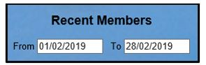
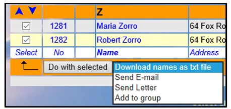

**4.4** **Recent** **Members**

> Back

Select **Recent** **members** on the Home Page to view a list of people
who have become members recently, including those who have joined
online.

The period for which new members are shown is set by the calendar
controls at the top of the page.

After selecting one or more members by ticking the boxes in the left
column, the following operations may be available according to the
access levels that you have been allocated. Choose from the drop-down
list below the table before pressing **Do** **with** **selected**:

**Download** **names** **as** **a** **txt** **file**: generates a list
of members as a string with the names separated by commas.

**Send** **E-mail**: opens a form on which to compose an email
([**<u>see
6.1</u>**)](https://u3abeacon.zendesk.com/hc/en-gb/articles/360007367918-6-1-Emails)

**Send** **Letter**: opens a form on which to compose a letter
([**<u>see
6.2</u>**)](https://u3abeacon.zendesk.com/hc/en-gb/articles/360007367938-6-2-Letters)

**Add** **to** **group**: presents a list of groups that the members can
be added to

Revision History

||
||
||
||
