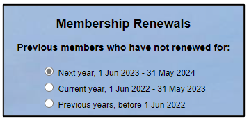
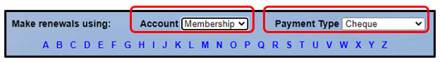
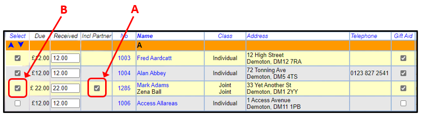
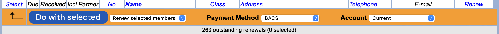
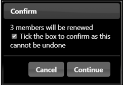
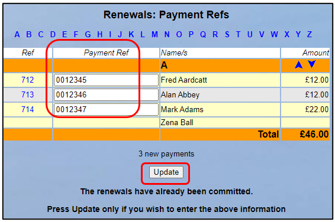

**4.5** **Membership** **Renewals**

> Back

The video may not include recent changes.

This video gives background and context to the topic which is also
documented following:

> [**Membership**
> **renewal**](https://www.youtube.com/watch?v=2oI5t0bC0Po)

**Please** **note** **that** **while** **this** **video** **includes**
**Rolling** **Membership,** **this** **was** **to** **cover** **the**
**very** **few** **existing** **sites.** **It** **is** **not** **an**
**option** **we** **offer** **currently.**

Select **Membership** **renewals** on the Home Page. The membership
Renewals page lists both **Current** and **Lapsed** members, as Beacon
believes they are the members who might renew.

*Note:* *Members* *with* *other* *status* *values* *cannot* *be*
*renewed* *without* *first* *changing* *their* *status* *to*
***Current*** *or* ***Lapsed**.* *For* *example* *a* *former* *member*
*with* *the* *status* ***Resigned*** *needs* *to* *be* *changed* *to*
***Current*** *so* *that* *their* *name* *can* *be* *selected* *on*
*the* *Renewals* *screen,* *as* *demonstrated* *in* *the* *video*
*above.*

For u3a's with <u>rolling membership</u> y<u>ears</u>, all Current and
Lapsed members are shown.

For u3a's with a <u>fixed membership year</u>, depending on the time of
year there are 2 or 3 options that can be selected, all based on the
Next Renewal date for the member:

**Next** **year**: those who have not renewed for next year. This option
is only visible during the Advance Renewals period prior to the start of
a new year.

**Current** **year**: those who have not renewed for the current year,
but did renew the previous year

**Previous** **years**: those who didn't renew for either the current
nor previous year.

After selecting one or more members, the following operations are
available by choosing from the drop-down list below the table and
pressing the **Do** **with** **selected** button:-

**Send** **email**: opens a form on which to compose an email ([<u>see
6.1</u>](https://u3abeacon.zendesk.com/hc/en-gb/articles/360007367918-6-1-Emails))

**Send** **letter**: opens a form on which to compose a letter ([<u>see
6.2</u>](https://u3abeacon.zendesk.com/hc/en-gb/articles/360007367938-6-2-Letters))

**Add** **to** **poll**: presents a list of Polls to add the members to

**Renew** **Selected** **members**: see below

**IMPORTANT**

Members should only be renewed by this facility or online. Do not change
the Member Record or enter a renewal transaction directly.

If a renewing member is changing Membership Class, the class on their
Member Record must be updated BEFORE processing the renewal payment so
that the membership fee will be correct. Please refer to [<u>4.5.1
Changing membership class at
renewal</u>](https://u3abeacon.zendesk.com/knowledge/articles/360019730598/en-gb?brand_id=360000694158)
for more information about changing Membership Class.

If a member has become newly eligible for Gift Aid, this needs to be
reflected by:

Entering a date in the "**Gift** **Aid** **from**" box on the Member
Record **before** processing the renewal payment, or By ticking the
**Gift** **Aid** box while processing the renewal payment,

Making sure that a Title is in for the relevant member.

If a member is no longer eligible for Gift Aid, this needs to be
reflected by:

Blanking out the date in the "**Gift** **Aid** **from**" box on the
Member Record **before** processing the renewal payment, or By unticking
the **Gift** **Aid** box while processing the renewal payment

> Making such changes does not affect the Gift Aid eligibility of
> Transactions already in the system.

To Renew Members

Multiple renewals can be made, but only against one account and payment
method at a time. It is recommended not to do too large a batch at a
time in case an error occurs:

Select the **Account** to be credited. This is likely to be the
**Current** account or the **Membership** account if you have one set up
(see [<u>7.10 Financial
Approaches</u>](https://u3abeacon.zendesk.com/hc/en-gb/articles/360007368058)
for guidance on how to manage your membership
payments)

Select the **Payment** **Type**, e.g. cash, cheque, BACS. etc.

For each member to be renewed:

Locate the member in the list and check that their address and other
details are still correct.

If a member's Gift Aid status has changed this should be updated by
ticking or unticking their Gift Aid box. This does not affect any
previous Gift Aid claims for that member.

If another member lives at the same address, both may be renewed
together by ticking the checkbox in the **Incl** **Partner** column
**\[A\]**. After ticking, both names will be grouped together and the
renewal fee will be adjusted accordingly.

If one of the 2 members is eligible for Gift Aid and the other not, make
sure to tick **Incl** **Partner** for the member that is eligible for
Gift Aid. If the non-eligible member is ticked the Gift Aid for the
eligible member will not be claimed.

Edit the amount received in the **Received** column (if different to
that displayed). Any amount above the expected fee **Due** will be
treated as a donation.

Tick the checkbox in the **Select** column for the member **\[B\]**.

When you are ready to process the batch of renewals select **Renew**
**selected** **members** from the drop-down list below the table and
press the **Do** **with** **selected** button.

Beacon then asks for confirmation.

***IMPORTANT:*** *Exercise* *caution* *if* *experimenting* *with* *the*
*Membership* *Renewals* *command* *–* *once* ***Continue*** *has* *been*
*pressed* *it* *is* *too* *late* *to* *go* *back!*

>  style="width:2.86947in;height:1.90636in" />A confirmation page will be
> displayed. Here you may enter a **Payment** **Reference** for each
> renewal (e.g. cheque number, paying-in slip number, etc.). Press
> **Update** to save this. You do not need to press Update If you do not
> wish to enter Payment References.

**Note** **1.** Please refer to [<u>4.5.2 Members renewed b</u>y
<u>mistake</u>](https://u3abeacon.zendesk.com/hc/en-gb/articles/360019576477)
to see how to reverse a membership renewal.

**Note** **2**. Please refer to [<u>4.5.3 Generate a list of members who
have
renewed</u>](https://u3abeacon.zendesk.com/hc/en-gb/articles/360007562538)
to see a video demonstrating how to create a list of renewed members.

Retention of documents to prove Gift Aid

> **This** **is** **a** **direct** **quote** **from** **Derek**
> **Harwood** **the** **Treasurer** **for** **the** **Third** **Age**
> **Trust** **sent** **in** **an** **email:** Electronic records are
> sufficient. So particularly for those u3as that use Beacon for
> renewals, then Beacon (or any similar system) is sufficient. However
> if a u3a uses a manual form for an initial joining registration, &
> it’s the
>
> Membership Secretary that is then loading that data into Bacon, then
> they should retain the paper form for that first year – until they
> renew online.
>
> Another reason to encourage, even new members, to join through online
> means, eg though Beacon. Hope that helps.
>
> Regards, Derek Harwood Treasurer

**Revision** **History**

||
||
||
||
||

||
||
||
||
||
||
||
||
||
||
