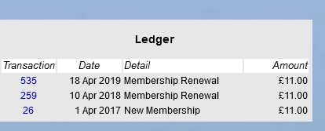
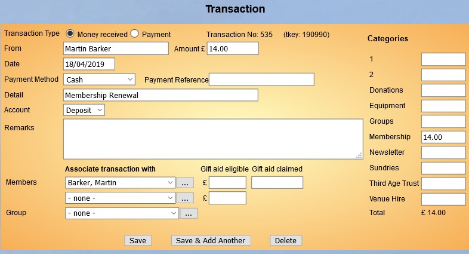

**4.5.1** **Changing** **membership** **class** **at**
**renewal**

> Back

**Note:** If the Membership class of an existing member needs to change
to s sharing Membership class to allow their partner to join, as a new
member, in the sharing class, then please follow the section Joining via
the **Add** **Member** page [**4.3.2**
**Shared**](https://u3abeacon.zendesk.com/hc/en-gb/articles/360019697318-4-3-2-Shared-Addresses-Joint-Members)
[**Addresses** **&** **Joint**
**Members**](https://u3abeacon.zendesk.com/hc/en-gb/articles/360019697318-4-3-2-Shared-Addresses-Joint-Members)

If you need to change a member's Membership Class at renewal time, such
as from *Associate* to *Individual* then do this first before doing the
renewal.

That can be easy to overlook, so if it needs to be changed after renewal
then

> 1\. Do this as soon as possible in case the Treasurer locks the Ledger
> by reconciling it
>
> 2\. Open the record of the member concerned, change the class and save
> it
>
> 3\. At the bottom right you will see the Ledger entry. Inspect the top
> (most recent) transaction for the Amount paid
>
>  style="width:7.50678in;height:4.05901in" />4. If the Amount needs
> adjusting click on the blue Transaction number (535 in this example)
>
> 5\. Change the Amount and the Category for Membership (in this example
> to 14.00) and Save.

**Revision** **History**

||
||
||
||
