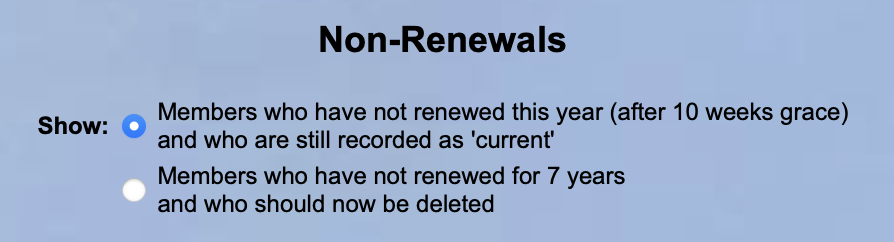

**4.6** **Non-renewals** **(including** **Resigned,** **Lapsed** **and**
**Deceased** **members)**

> Back

Resigned, Lapsed and Deceased Members

When it is known that a member will not be continuing their membership,
their Membership Record should be updated to an appropriate **status**
such as **Lapsed**, **Resigned** or **Deceased** ([**<u>see
4.2</u>**)](https://u3abeacon.zendesk.com/hc/en-gb/articles/360007303097-4-2-Member-Record).

***Resigned*** *should* *be* *used* *when* *it* *is* *known* *that* *a*
*member* *will* *not* *be* *continuing* *their* *membership.*

***Lapsed*** *should* *be* *used* *for* *members* *that* *have* *not*
*renewed* *by* *the* *end* *of* *the* *grace* *renewals* *period,* *but*
*have* *not* *indicated* *that* *they* *wish* *to* *resign.*
*Experience* *has* *shown* *that* *lapsed* *members* *often* *renew*
*at* *a* *later* *date.*

*A* ***Deceased*** *member* *should* *have* *the* *email* *address*
*removed* *from* *the* *Member* *Record* *to* *avoid* *the*
*possibility* *of* *emails* *being* *sent* *to* *the* *deceased*
*member.*

*If* *a* ***Deceased*** *member* *shared* *an* *address* *with*
*another* *member,* *they* *should* *have* *their* *‘Share* *address*
*with’* *changed* *to* ***\<no-one\>.*** *Also,* *check* *the*
*surviving* *partner's* *Member* *Record* *to* *ensure* *it* *does*
*not* *have* *the* *deceased* *partner* *as* *the* *emergency*
*contact.*

*If* *a* ***Lapsed*** *or* ***Resigned*** *member* *shares* *an*
*address* *with* *another* *member,* *it* *is* *recommended* *that*
*you* *do* *not* *change* *the* *‘Share* *address* *with’* *to*
*\<no-one\>* *–* *this* *link* *will* *be* *useful* *if* *the* *member*
*re-joins* *(the* *Lapsed/Resigned* *member* *will* *not* *show* *up*
*in* *an* *Addresses* *Export* *of* *<u>Current</u>* *members).*

*When* *a* *member* *has* *lapsed,* *resigned,* *or* *died,* *their*
*name* *will* *remain* *in* *any* *group* *list* *of* *which* *they*
*were* *a* *member.* *There* *is* *no* *mechanism* *by* *which* *the*
*Group* *Leader* *is* *notified* *that* *the* *member* *has* *left*
*the* *group.* *Therefore,* *remember* *to* *remove* *the* *member*
*from* *any* *Groups* *that* *they* *belonged* *to* *and* *as*
*required,* *notify* *the* *Group* *Leader.*

*It* *is* *also* *sensible* *if* *a* *Deceased,* *Lapsed* *or*
*Resigned* *member* *is* *a* *Joint* *member* *to* *change* *their*
*status* *to* *Individual* *and* *also* *do* *the* *same* *for* *their*
*joint* *member.* *This* *avoid* *possible* *difficulties* *when* *this*
*remaining* *member* *renews.*

Dealing with Non-renewals

Select **Non-renewals** from the Home Page to show a list of members who
have not renewed.

This list operates in 2 modes, according to the option selected by the
**Show** radio button at the top of the page

*Note:* *Selecting* ***Members*** ***who*** ***did*** ***not***
***renew*** ***this*** ***year*** *lists* *Current* *members* *and*
*not* *members* *that* *have* *already* *been* *Lapsed.* *You* *should*
*also* *note* *that* *this* *takes* *effect* *after* *the* *grace*
*period* *set* *in* *System* *settings* *so* *your* *site* *may* *have*
*a* *different* *number* *of* *weeks.*

*Selecting* ***Members*** ***who*** ***have*** ***not*** ***renewed***
***for*** ***7*** ***years*** *lists* *all* *members* *that* *have*
*not* *renewed* *in* *the* *period* *shown.* *The* *default* *period*
*is* *7* *years* *as* *shown* *above* *but* *it* *can* *be* *changed*
*to* *any* *period* *between* *2* *and* *7* *years* *in* *System*
*Settings.* *Your* *site* *may* *show* *a* *different* *period.*
[*(***see**
**8.3***)*](https://u3abeacon.zendesk.com/hc/en-gb/articles/360007304457-8-3-System-Settings)

After selecting one or more members in either of the two modes, the
following operations are available by choosing from the drop-down list
below the table and pressing the **Do** **with** **selected** button:

**Send** **email**: opens a form on which to compose an email ([**<u>see
6.1</u>**)](https://u3abeacon.zendesk.com/hc/en-gb/articles/360007367918-6-1-Emails)

**Send** **letter**: opens a form on which to compose a letter
([**<u>see
6.2</u>**](https://u3abeacon.zendesk.com/hc/en-gb/articles/360007367938-6-2-Letters))

Tip: the members can be sorted by clicking on the blue Address column
heading. This makes is easier to only tick one member of a pair so the
household only receives one email or letter.

Lapsing Non-renewals

Having selected ***Members*** ***who*** ***did*** ***not*** ***renew***
***this*** ***year***, tick the members in the **Select** column. Then
select **Lapse** from the drop-down list at the bottom of the page and
press the **Do** **with** **selected** button. A confirmation dialog
will be displayed. Press **Lapse** to proceed. The selected members will
have their status changed from **Current** to **Lapsed**.

It is important to lapse members who have not renewed as soon as
possible otherwise the u3a Beacon licence, TAT subscription and TAM
magazine mailing cost for those members will still be included in
invoices from Third Age Trust Trading Ltd. This advice also applies to
resigned and deceased members.

Deleting long term Non-renewals

Having selected ***Members*** ***who*** ***have*** ***not***
***renewed*** ***for*** ***7*** ***years***, tick the members in the
**Select** column. Then select **Delete** in the drop-down list below
the table and press the **Do** **with** **selected** button. A
confirmation dialog will be displayed. Press **Delete** to proceed.

Please note that the time of 7 years can be set in System Settings but
care should be taken to not delete details of members who agree to Gift
Aid for 7 years.

*Note:* *depending* *on* *your* *u3a's* *Data* *Protection* *Policy,*
*it* *is* *likely* *that* *long* *term* *non-renewals* *will* *have*
*been* *deleted* *long* *before* *reaching* *7* *the* *years;* *see*
[***4.2.2***](https://u3abeacon.zendesk.com/hc/en-gb/articles/360019707938)
*for* *further* *guidance.*

||
||
||
||
||
||
||
||
||
||
||
||
