**4.7** **Membership**
**Cards**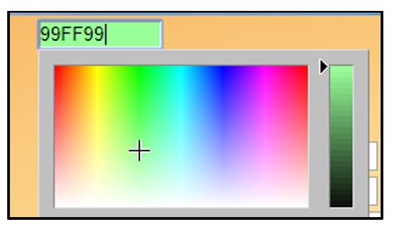

> Back

Beacon Membership Cards can be generated from the **Membership**
**Cards** page and the following options are available:

Download cards in pdf format; see Section b) below Email cards to
members; see Section c) below

Print blank cards; see Section d) below

Download card data in Excel; see Section e) below

The cards are designed to be printed onto standard 85 x 54mm business
cards, 10 per A4 sheet. Avery card numbers include C32011, C32026,
C32070 and C32075. **Please** **check** **that** **the** **print**
**scaling** **is** **set** **to** **100%.**

The barcode on Membership Cards contains the membership number and can
be read by barcode readers.

There is an option to include Membership Cards as an attachment on the
confirmatory email that is sent when a member joins or renews online.
This can be done by an Admin user in **System** **Settings** [(<u>see
8.3</u>](https://u3abeacon.zendesk.com/hc/en-gb/articles/360007304457-8-3-System-Settings)).

a\) Membership Card colour

It is recommended that the colour band shown at the bottom of the
Membership Card is changed each year. This can be done by an Admin user
in **System** **Settings** ([**<u>see
8.3</u>**](https://u3abeacon.zendesk.com/hc/en-gb/articles/360007304457-8-3-System-Settings)).

Click anywhere in the membership card colour box to choose a colour.
Each colour has a unique code, e.g. 99FF99 for the light green shown
below. Entering a known colour code is an alternative method of
recalling a previously used colour.

Press the **Update** button to save the new colour.

b\) Download Membership Cards

To download Membership Cards in pdf format, select **Membership**
**cards** from the Home Page or the Membership Renewals confirmation
page to see a list of members who have recently joined or renewed and
who are therefore flagged as outstanding, in need of a membership card.

By selecting a different radio button near the top of the page, you may
instead show members based on a **Poll**, a combination of
**outstanding** **members** **and** **a** **poll**, or **All**
**current** **members**.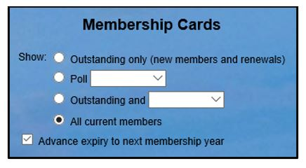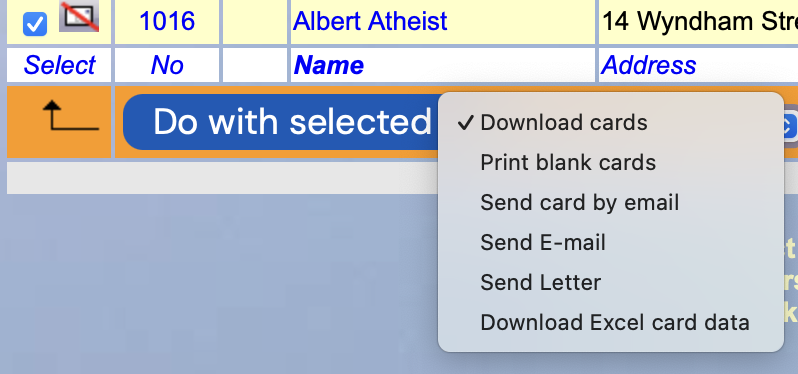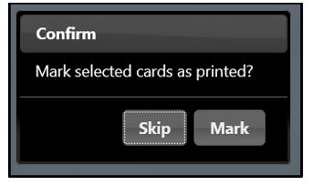

By default, cards are printed for the current membership year.

By ticking **Advance** **expiry** **to** **next** **membership**
**year** you can print cards with the expiry date incremented by one
year. This enables the printing of cards before the start of the next
membership year so that you can have cards ready to give to renewing
members as soon as they renew.

Cards are printed in the same order as displayed in the list, so to
re-order the cards by (say) the Membership Number, first click the blue
‘**No**’ column heading to re-sort the list.

After ticking the required members, select **Download** **cards** in the
drop-down list below the table and press the **Do** **with**
**selected** button.

You will be prompted to ***Mark*** ***selected*** ***cards*** ***as***
***printed?*** or skip:

If you choose **Mark**, those members will not appear in a future list
of outstanding Membership Cards.

You will be given the choice of **Opening** the file onscreen or
**Saving** the file in your default download location. Clicking the
arrow next to **Save** gives the option of doing a **Save-as** to a
specified location.

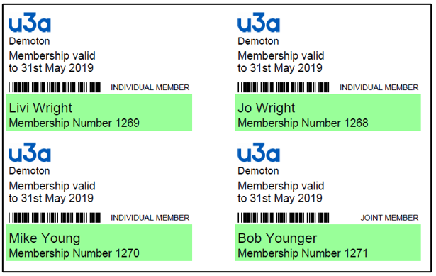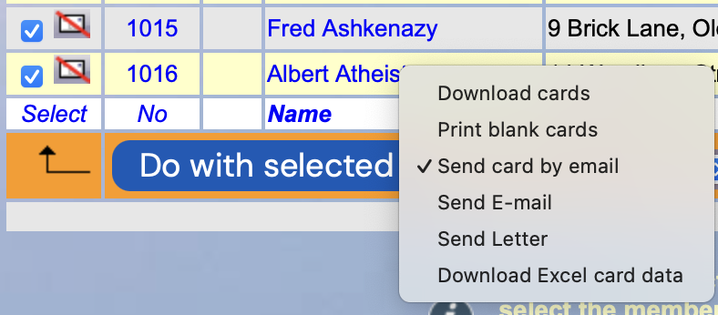

The resulting pdf file will contain all the Membership Cards, 10 to a
page:

*Note:* *There* *can* *sometimes* *be* *a* *difficulty* *with* *the*
*bar* *code* *and* *the* *membership* *class* *overlapping,*
*particularly* *if* *the* *membership* *number* *was* *4* *digits* *and*
*the* *class* *name* *is* *long.* *This* *can* *be* *alleviated* *by*
*using* *a* *shorter* *class* *name* *[(<u>see
8.7</u>](https://u3abeacon.zendesk.com/hc/en-gb/articles/360007304497)).*

c\) Email Cards to Members

To email membership Cards to members, first tick one or more members as
described in Section b) above. Then select **Send** **card** **by**
**email** in the drop-down list below the table and press the **Do**
**with** **selected** button.

The Send email page will open with an attachment called \<u3a name\>
0000.pdf. This represents the personalised attachment of the membership
card that will be attached to each email.

A standard email message can be created to personalise the email.

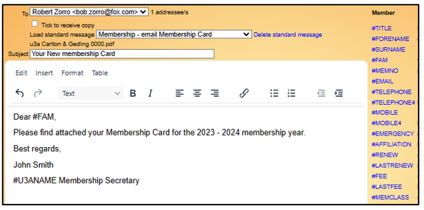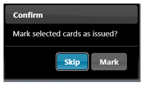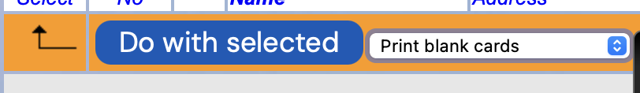

When the email is sent you will be prompted to ***Mark*** ***selected***
***cards*** ***as*** ***issued?*** or skip:

If you choose **Mark**, those members will not appear in a future list
of outstanding Membership Cards.

*Please* *note* *that* *no* *other* *attachments* *can* *be* *sent*
*with* *the* *emailed* *Membership* *card.*

d\) Print Blank Cards

To download a sheet of blank Membership Cards select **Print** **blank**
**cards** in the drop-down list below the table and press the **Do**
**with** **selected** button.

The resulting pdf file will be one page containing 10 blank cards:

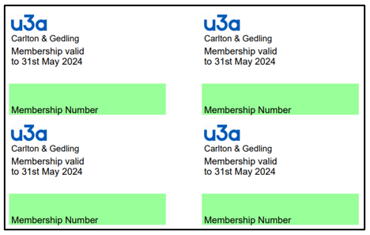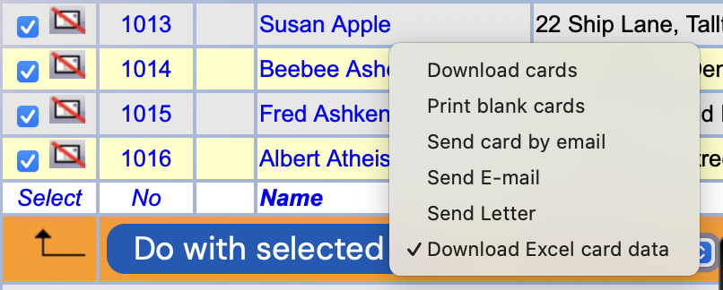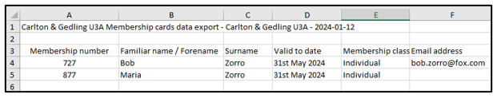

e\) Download Excel card data

To download Membership Card data in Excel, first tick one or more
members as described in Section b) above. Then select **Download**
**Excel** **card** **data** in the drop-down list below the table and
press the **Do** **with** **selected** button.

**Revision** **History**

||
||
||
||
||
||
||
||
||
||
||
||
