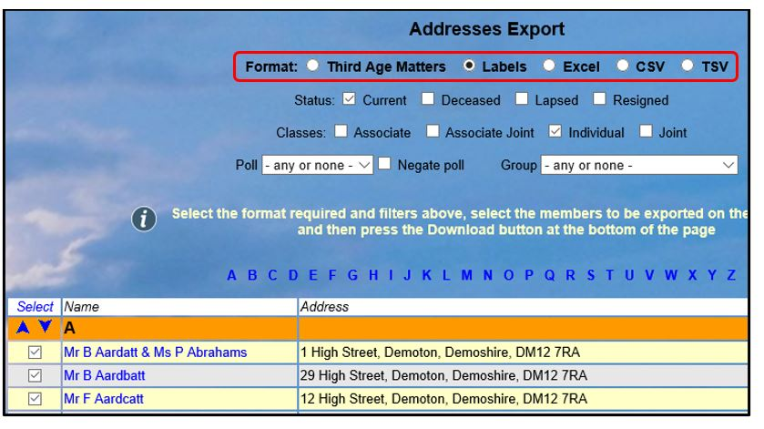
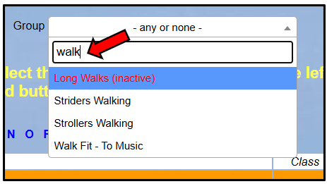
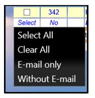
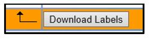
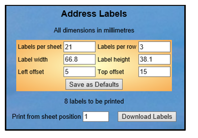
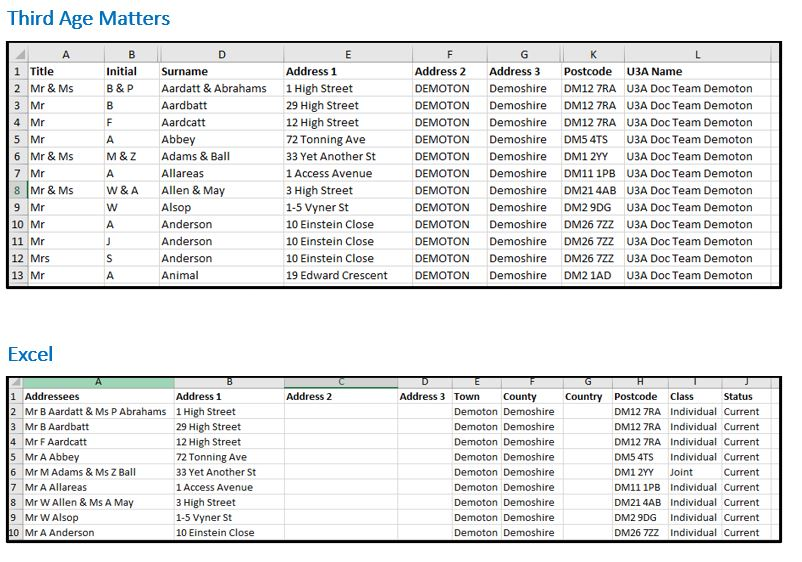
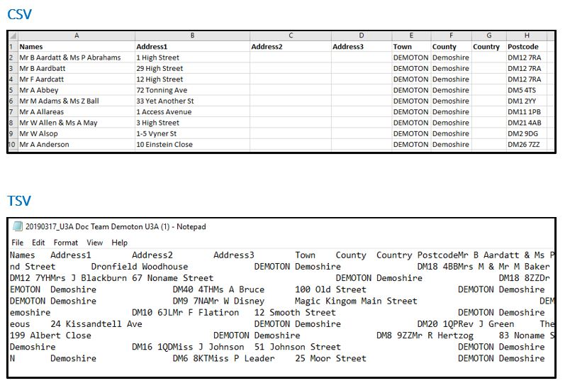
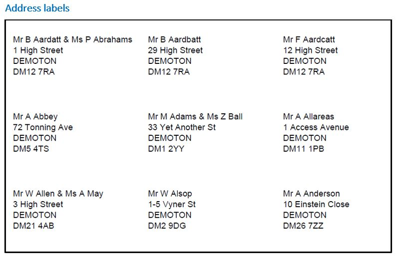

[u3a Beacon](https://u3abeacon.zendesk.com/hc/en-gb) \> [User
Guide](https://u3abeacon.zendesk.com/hc/en-gb/categories/360001240017-User-Guide)
\> [4.
Membership](https://u3abeacon.zendesk.com/hc/en-gb/sections/360002102758-4-Membership)
Search

**Articles** **in** **this** **section**

**4.8** **Addresses** **Export** **(including** **TAM)**

>  style="width:0.41667in;height:0.41667in" /> style="width:0.15625in;height:0.15625in" />Graeme Bunting Follow 1
> month ago · Updated

Select **Addresses** **export** from the Home Page to generate a list of
members' names and addresses in various formats. Members sharing the
same address are combined in the same row.

At the top of the page, select the **Format** of export required (See
the further down the page for typical examples of the different
formats):

> **Third** **Age** **Matters**: for an Excel spreadsheet in the format
> for TAM distribution.
>
> **Labels**: for address labels.
>
>  style="width:1.125in;height:0.47892in" />**Help**
>
> **Excel**: for an Excel spreadsheet containing member names and
> addresses. style="width:3.71875in;height:2.09375in" /> style="width:1.94792in;height:2.02083in" /> style="width:2.625in;height:0.69792in" />
>
> **CSV**: for a comma-separated-values file.
>
> **TSV**: for a tab-separated-values file.

There are three rows of filters at the top of the page which may be used
to help choose the members that are to be exported. These comprise
member **Status** and **Class**, **Polls** and **Groups** filters. By
ticking **Negate** **poll**, members not assigned to the chosen poll
will be selected.

The **Group** drop-down list is searchable - for example Typing "Walk"
will filter the list to only show Groups that contain the letters
"walk".

**Inactive** Groups are shown in red with a suffix (inactive).

After applying the filters, select one or more members by ticking the
boxes in the left hand column next to each member’s name. Or click
**Select** at the top or bottom of the column, followed by either:

To download the selected Addresses, press the button below the list (the
name on the button will vary depending on the type of export chosen
above):

If the **Labels** format was selected, options are displayed for
changing the number and size of the labels. Finding the best options can
involve some trial and error.

Pressing the **Save** **as** **defaults** button will save the choices
made <u>on the current computer</u>. These will be lost if you clear
your cookies or use a different browser, so make a note of them.

**Labels** download as PDF files. When printing make sure they are
printed Actual Size with no scaling (100%) - depending on your computer
this may need opening "extra print options".

There is another guide to printing labels in [4.8.1 Adjusting Beacon
Printer Settings to print
labels](https://u3abeacon.zendesk.com/hc/en-gb/articles/4731024504593)

Typical Downloads

**Revision** **History**

||
||
||
||
||
||

> Was this article helpful?
>
> Yes No
>
> 3 out of 3 found this helpful
>
> Have more questions? [<u>Submit a
> request</u>](https://u3abeacon.zendesk.com/hc/en-gb/requests/new)

Return to top

**Recently** **viewed** **articles** [4.7 Membership
Cards](https://u3abeacon.zendesk.com/hc/en-gb/articles/360007304197-4-7-Membership-Cards)

[4.6 Non-renewals (including Resigned, Lapsed
and](https://u3abeacon.zendesk.com/hc/en-gb/articles/360007304297-4-6-Non-renewals-including-Resigned-Lapsed-and-Deceased-members)
[Deceased
members)](https://u3abeacon.zendesk.com/hc/en-gb/articles/360007304297-4-6-Non-renewals-including-Resigned-Lapsed-and-Deceased-members)

[4.5.4 An easy way to send a batch of
Renewal](https://u3abeacon.zendesk.com/hc/en-gb/articles/360019919197-4-5-4-An-easy-way-to-send-a-batch-of-Renewal-Confirmation-messages-to-Renewed-Members)
[Confirmation messages to Renewed
Members](https://u3abeacon.zendesk.com/hc/en-gb/articles/360019919197-4-5-4-An-easy-way-to-send-a-batch-of-Renewal-Confirmation-messages-to-Renewed-Members)

[4.5.3 Generate a list of members who
have](https://u3abeacon.zendesk.com/hc/en-gb/articles/360007562538-4-5-3-Generate-a-list-of-members-who-have-renewed)
[renewed](https://u3abeacon.zendesk.com/hc/en-gb/articles/360007562538-4-5-3-Generate-a-list-of-members-who-have-renewed)

**Related** **articles**

[4.8.1 Adjusting Beacon Printer settings to print
labels](https://u3abeacon.zendesk.com/hc/en-gb/related/click?data=BAh7CjobZGVzdGluYXRpb25fYXJ0aWNsZV9pZGwrCBH3CIdNBDoYcmVmZXJyZXJfYXJ0aWNsZV9pZGwrCIp8HNJTADoLbG9jYWxlSSIKZW4tZ2IGOgZFVDoIdXJsSSJdL2hjL2VuLWdiL2FydGljbGVzLzQ3MzEwMjQ1MDQ1OTMtNC04LTEtQWRqdXN0aW5nLUJlYWNvbi1QcmludGVyLXNldHRpbmdzLXRvLXByaW50LWxhYmVscwY7CFQ6CXJhbmtpBg%3D%3D--44f847d622d29ff89cc29960fefe4563ec4d6d69)

[7.8 Gift
Aid](https://u3abeacon.zendesk.com/hc/en-gb/related/click?data=BAh7CjobZGVzdGluYXRpb25fYXJ0aWNsZV9pZGwrCM2EG9JTADoYcmVmZXJyZXJfYXJ0aWNsZV9pZGwrCIp8HNJTADoLbG9jYWxlSSIKZW4tZ2IGOgZFVDoIdXJsSSIxL2hjL2VuLWdiL2FydGljbGVzLzM2MDAwNzMwNDM5Ny03LTgtR2lmdC1BaWQGOwhUOglyYW5raQc%3D--abc7c28e673e821c7b92ef29d1f777cb732ca327)

[4.3.1 Addresses & Phone
Numbers](https://u3abeacon.zendesk.com/hc/en-gb/related/click?data=BAh7CjobZGVzdGluYXRpb25fYXJ0aWNsZV9pZGwrCH1V1tJTADoYcmVmZXJyZXJfYXJ0aWNsZV9pZGwrCIp8HNJTADoLbG9jYWxlSSIKZW4tZ2IGOgZFVDoIdXJsSSJCL2hjL2VuLWdiL2FydGljbGVzLzM2MDAxOTU0NzUxNy00LTMtMS1BZGRyZXNzZXMtUGhvbmUtTnVtYmVycwY7CFQ6CXJhbmtpCA%3D%3D--8227aeea9b9507d2766aefb38bfd67964c541d66)

[4.5.3 Generate a list of members who have
renewed](https://u3abeacon.zendesk.com/hc/en-gb/related/click?data=BAh7CjobZGVzdGluYXRpb25fYXJ0aWNsZV9pZGwrCCp1H9JTADoYcmVmZXJyZXJfYXJ0aWNsZV9pZGwrCIp8HNJTADoLbG9jYWxlSSIKZW4tZ2IGOgZFVDoIdXJsSSJWL2hjL2VuLWdiL2FydGljbGVzLzM2MDAwNzU2MjUzOC00LTUtMy1HZW5lcmF0ZS1hLWxpc3Qtb2YtbWVtYmVycy13aG8taGF2ZS1yZW5ld2VkBjsIVDoJcmFua2kJ--efa7a6591053c1ea4cf0e059de5d1f3d1f336f0a)

[10.2.4 Updating your Personal
Details](https://u3abeacon.zendesk.com/hc/en-gb/related/click?data=BAh7CjobZGVzdGluYXRpb25fYXJ0aWNsZV9pZGwrCB1QbmtwCToYcmVmZXJyZXJfYXJ0aWNsZV9pZGwrCIp8HNJTADoLbG9jYWxlSSIKZW4tZ2IGOgZFVDoIdXJsSSJML2hjL2VuLWdiL2FydGljbGVzLzEwMzc4NDQzMzc4NzE3LTEwLTItNC1VcGRhdGluZy15b3VyLVBlcnNvbmFsLURldGFpbHMGOwhUOglyYW5raQo%3D--8e13aaecd80eb5fdabe723455f379dec4d60d166)

[4.5.2 Members renewed by
mistake](https://u3abeacon.zendesk.com/hc/en-gb/articles/360019576477-4-5-2-Members-renewed-by-mistake)

**Comments** 0 comments

Please [<u>sign
in</u>](https://u3abeacon.zendesk.com/access?locale=en-gb&brand_id=360000694158&return_to=https%3A%2F%2Fu3abeacon.zendesk.com%2Fhc%2Fen-gb%2Farticles%2F360007367818-4-8-Addresses-Export-including-TAM)
to leave a comment.

[u3a Beacon](https://u3abeacon.zendesk.com/hc/en-gb)

> [<u>Powered b</u>y
> <u>Zendesk</u>](https://www.zendesk.co.uk/service/help-center/?utm_source=helpcenter&utm_medium=poweredbyzendesk&utm_campaign=text&utm_content=u3a+Beacon+Support)
