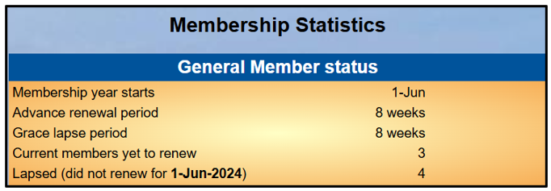
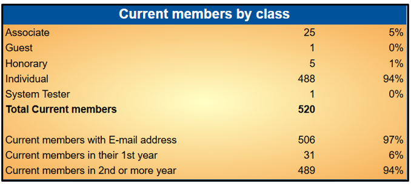
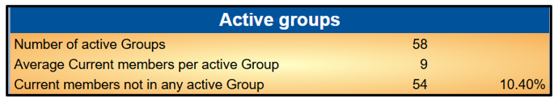
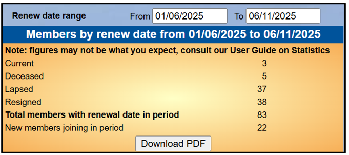
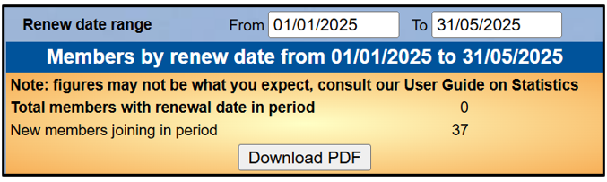
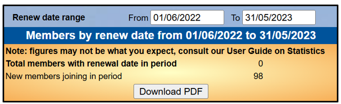

**4.9** **Statistics**

> Back

Select **Statistics** from the Home Page to display the following
Membership and Group statistics:

**1.** **General** **Member** **Status**

The Membership Year start date

The Advance Renewals and Grace Lapse periods

The number of Current members that have not renewed

The Number of Lapsed members who did not renew in the previous
Membership Year

**2.** **Current** **Members** **by** **Class**

Numbers and percentages by Membership Class Members with email

Members in their first year

Members in a least their second year

**3.** **Active** **Groups**

Number of Active Groups Average Group membership Members not in any
Groups

**4.** **Members** **by** **Renew** **Date**

By default, this shows the number of members (by Class) that were due to
renew between the start of the current Membership Year and today, that
have not done so.

It also shows the number of new members joining in that time.

The **From** and **To** dates
can be changed – useful for checking how many members joined in previous
months or years.

**Downloads**

Press the button at the foot of the page to download the displayed
statistics in a pdf file.

**Revision** **History**

||
||
||
||
||
