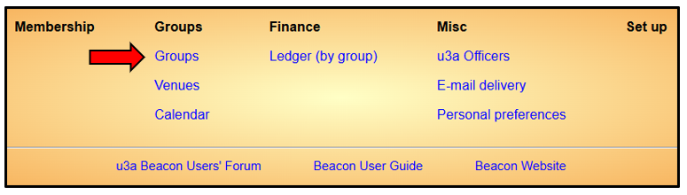

[u3a Beacon](https://u3abeacon.zendesk.com/hc/en-gb) \> [User
Guide](https://u3abeacon.zendesk.com/hc/en-gb/categories/360001240017-User-Guide)
\> [5.
Groups](https://u3abeacon.zendesk.com/hc/en-gb/sections/360002083037-5-Groups)
Search

**Articles** **in** **this** **section**

**5.1** **Groups** **List**

>  style="width:0.41667in;height:0.41667in" /> style="width:0.15625in;height:0.15625in" />Graeme Bunting Follow 9
> days ago · Updated

The operations described on this page are typically available to Group
Leaders, Groups Co-ordinators and some Committee members.

a\) The Groups List

As a Group Leader your Home Page will look similar to that shown below,
depending on the extent of system access given to you by your u3a
committee.

Click the **Groups** link to view the Groups List

The Groups List initially shows all active Groups and Group Leaders. To
include non-active Groups, untick the **Show** **active** **only** box.

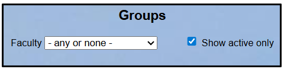Your u3a may use the option to
categorise similar Groups into **Faculties** such as ‘Art & Literature’,
‘Food & Drink’, ‘Walking’, etc. To display only the Groups assigned to a
particular Faculty, select the Faculty from the drop-down list.

> **Help**

**Your** **Groups**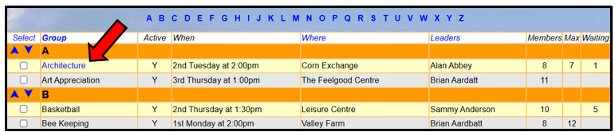

Groups for which you are a Leader or you have viewing or editing rights
are highlighted blue:

**Navigation**

There are several features to help quickly navigate around the Groups
List page:

> Clicking any **letter** in the block above the table will jump to
> Groups starting with that letter Clicking the **down** **arrow** in
> the top right corner of the page will scroll to the end of the list at
> the bottom of the page
>
> 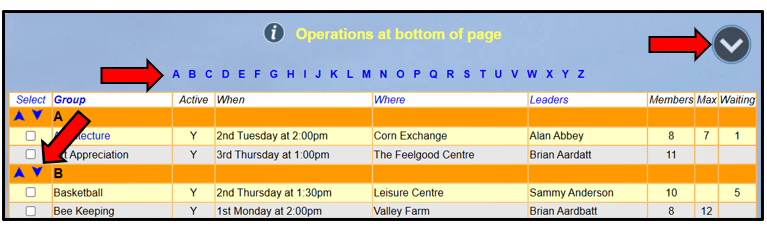 style="width:7.02083in;height:2.07292in" />Clicking the **up**
> **arrow** in the bottom right corner to scroll back to the top of the
> page The up and down arrows in the left column perform a similar
> function

b\) Group Records

To view the **Group** **Record** for your Group, click the Group name in
the Groups List, or elsewhere where Group names are shown.

Each Group Record comprises 4
pages; **Details,** **Schedule,** **Members** and **Ledger**. You can
select between these on the row beneath the Group Record name. The
active sub-page has its name in black.

For details of how to view and edit your 4 Group Record pages, refer to:

> [5.2 Group Record:
> Details](https://u3abeacon.zendesk.com/hc/en-gb/articles/360007367838)
>
> [5.3 Group Record:
> Schedule](https://u3abeacon.zendesk.com/hc/en-gb/articles/360007367858)
>
> [5.4 Group Record:
> Members](https://u3abeacon.zendesk.com/hc/en-gb/articles/360007367878)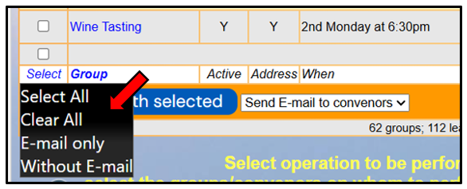 style="width:4.79167in;height:1.9375in" />
>
> [5.5 Group Record:
> Ledger](https://u3abeacon.zendesk.com/hc/en-gb/articles/360007367898)

c\) Emailing Group Leaders

To send an email to one or more Group Leaders either tick the
appropriate boxes next to the required Group Leaders in the left hand
column . . .

. . . or click ‘**Select’** at the bottom of the column, followed by one
of the choices from the list that is presented:

> **Select** **All** for all displayed Group Leaders
>
> **E-mail** **only** for Group Leaders with an email address
> **Without** **E-mail** for Group Leaders without an email address

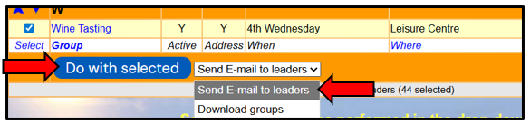Then select **Send**
**E-mail** **to** **leaders** from the drop-down list below the table
and press the **Do** **with** **selected** button:

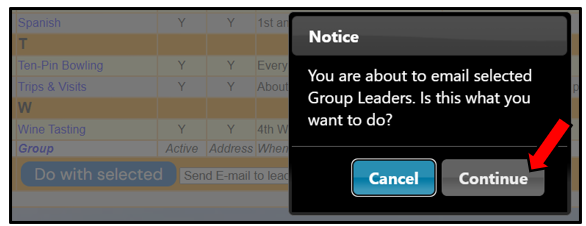You will be prompted to
confirm that it is your intention to send an email to Group Leaders by
pressing **Continue** (or **Cancel** if that was not your intention):

Pressing **Continue** opens a form to compose the email, see [6.1.1
Sending
Emails](https://u3abeacon.zendesk.com/hc/en-gb/articles/360007380438).

d\) Downloading Groups

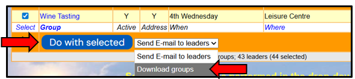To download an Excel file
showing details about Groups, select the required Groups as described in
section c) above. Then select **Download** **groups** from the drop-down
list below the table and press the **Do** **with** **selected**
button: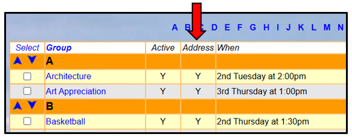

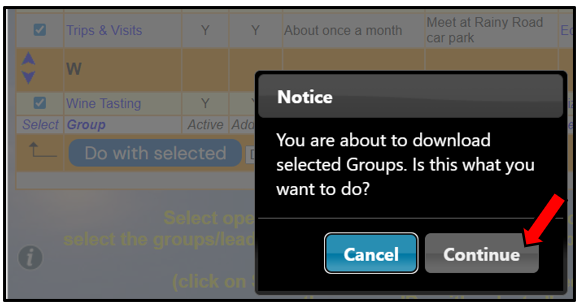You will be prompted to
confirm that it is your intention to download Group details by pressing
**Continue** (or **Cancel** if that was not your intention):

e\) Adding and Removing Groups

Users with roles such as Groups Co-ordinator or Committee Member may be
able to add & remove Groups, depending on the extent of system access
allocated to them.

Refer to [5.6 Adding & Removing
Groups](https://u3abeacon.zendesk.com/hc/en-gb/articles/360007316877)
for more information.

f\) Address Column

Administrators will see an additional Address column:

"**Y**" indicates that the Group Leaders will be able to view the
addresses of Group members. This is controlled by Administrators who
have extra options to **Hide** **addresses** and **Show** **addresses**
for selected Groups:

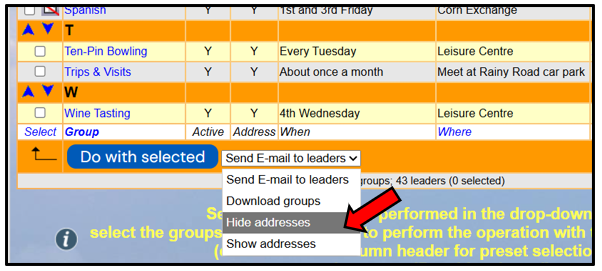

g\) Groups Coordinator is not a Leader

If a Groups Coordinator does not lead a Group they will not receive
emails sent to all Group Leaders.

A way around this is to create a dummy Group called (say) **zGroup**
**Coordinator** where the Groups Coordinator is the only member and they
are made the Leader.

Revision History

||
||
||
||
||
||
||
||

> Was this article helpful?
>
> Yes No
>
> 1 out of 2 found this helpful
>
> Have more questions? [<u>Submit a
> request</u>](https://u3abeacon.zendesk.com/hc/en-gb/requests/new)

Return to top

**Recently** **viewed** **articles** [8.7 Membership
Set-up](https://u3abeacon.zendesk.com/hc/en-gb/articles/360007304497-8-7-Membership-Set-up)

[4.1 The Membership
List](https://u3abeacon.zendesk.com/hc/en-gb/articles/360007301057-4-1-The-Membership-List)

[4.3 Add New
Member](https://u3abeacon.zendesk.com/hc/en-gb/articles/360007367058-4-3-Add-New-Member)

[4.2 Member
Record](https://u3abeacon.zendesk.com/hc/en-gb/articles/360007303097-4-2-Member-Record)

[6. Some tips when using
Beacon](https://u3abeacon.zendesk.com/hc/en-gb/articles/360007072698-6-Some-tips-when-using-Beacon)

**Related** **articles**

[5.2 Group Records:
Details](https://u3abeacon.zendesk.com/hc/en-gb/related/click?data=BAh7CjobZGVzdGluYXRpb25fYXJ0aWNsZV9pZGwrCJ58HNJTADoYcmVmZXJyZXJfYXJ0aWNsZV9pZGwrCBmEG9JTADoLbG9jYWxlSSIKZW4tZ2IGOgZFVDoIdXJsSSI%2BL2hjL2VuLWdiL2FydGljbGVzLzM2MDAwNzM2NzgzOC01LTItR3JvdXAtUmVjb3Jkcy1EZXRhaWxzBjsIVDoJcmFua2kG--e433e09f7dc85079d346c4067f3195004f009b06)

[5.4 Group Record:
Members](https://u3abeacon.zendesk.com/hc/en-gb/related/click?data=BAh7CjobZGVzdGluYXRpb25fYXJ0aWNsZV9pZGwrCMZ8HNJTADoYcmVmZXJyZXJfYXJ0aWNsZV9pZGwrCBmEG9JTADoLbG9jYWxlSSIKZW4tZ2IGOgZFVDoIdXJsSSI9L2hjL2VuLWdiL2FydGljbGVzLzM2MDAwNzM2Nzg3OC01LTQtR3JvdXAtUmVjb3JkLU1lbWJlcnMGOwhUOglyYW5raQc%3D--7a314b67c05edaa510b7b83a2f7a5d646b5913e2)

[5.6 Adding & Removing
Groups](https://u3abeacon.zendesk.com/hc/en-gb/related/click?data=BAh7CjobZGVzdGluYXRpb25fYXJ0aWNsZV9pZGwrCI21G9JTADoYcmVmZXJyZXJfYXJ0aWNsZV9pZGwrCBmEG9JTADoLbG9jYWxlSSIKZW4tZ2IGOgZFVDoIdXJsSSI%2FL2hjL2VuLWdiL2FydGljbGVzLzM2MDAwNzMxNjg3Ny01LTYtQWRkaW5nLVJlbW92aW5nLUdyb3VwcwY7CFQ6CXJhbmtpCA%3D%3D--d2c27f778258d64dda6001795715a8c590bdc6de)

[6.1.1 Sending
Emails](https://u3abeacon.zendesk.com/hc/en-gb/related/click?data=BAh7CjobZGVzdGluYXRpb25fYXJ0aWNsZV9pZGwrCNatHNJTADoYcmVmZXJyZXJfYXJ0aWNsZV9pZGwrCBmEG9JTADoLbG9jYWxlSSIKZW4tZ2IGOgZFVDoIdXJsSSI5L2hjL2VuLWdiL2FydGljbGVzLzM2MDAwNzM4MDQzOC02LTEtMS1TZW5kaW5nLUVtYWlscwY7CFQ6CXJhbmtpCQ%3D%3D--f8bc92019543549dcb4b8ccc2b5cf437ac2e9418)

[10.2 Members
Portal](https://u3abeacon.zendesk.com/hc/en-gb/related/click?data=BAh7CjobZGVzdGluYXRpb25fYXJ0aWNsZV9pZGwrCMp9HNJTADoYcmVmZXJyZXJfYXJ0aWNsZV9pZGwrCBmEG9JTADoLbG9jYWxlSSIKZW4tZ2IGOgZFVDoIdXJsSSI4L2hjL2VuLWdiL2FydGljbGVzLzM2MDAwNzM2ODEzOC0xMC0yLU1lbWJlcnMtUG9ydGFsBjsIVDoJcmFua2kK--7da03c61680416d98d9770f077815cdee97412dc)

**Comments** 0 comments

Please [<u>sign
in</u>](https://u3abeacon.zendesk.com/access?locale=en-gb&brand_id=360000694158&return_to=https%3A%2F%2Fu3abeacon.zendesk.com%2Fhc%2Fen-gb%2Farticles%2F360007304217-5-1-Groups-List)
to leave a comment.

[u3a Beacon](https://u3abeacon.zendesk.com/hc/en-gb)

> [<u>Powered by
> Zendesk</u>](https://www.zendesk.co.uk/service/help-center/?utm_source=helpcenter&utm_medium=poweredbyzendesk&utm_campaign=text&utm_content=u3a+Beacon+Support)
