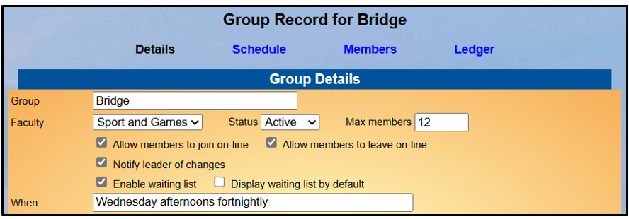
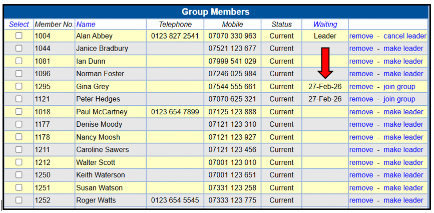
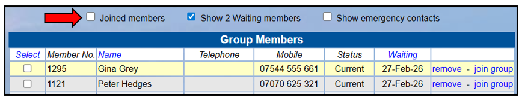
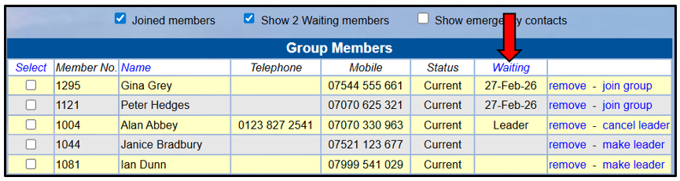
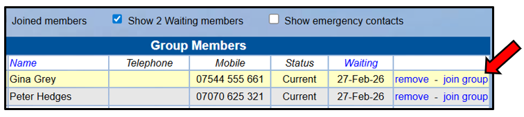
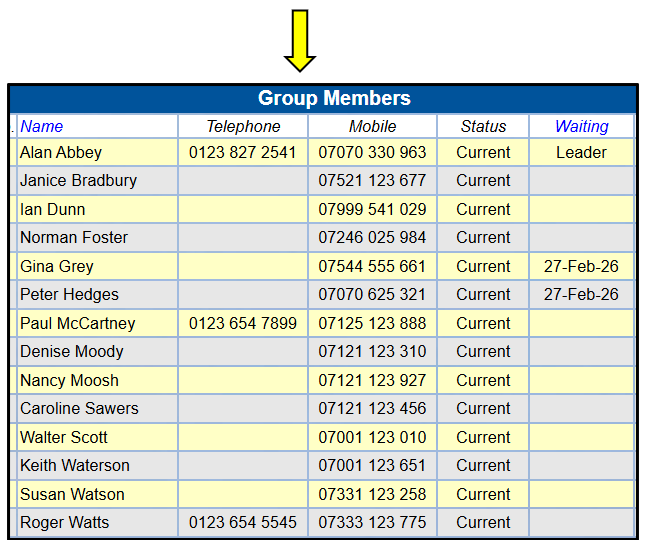
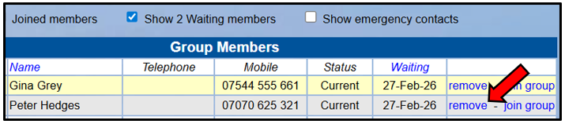

[u3a Beacon](https://u3abeacon.zendesk.com/hc/en-gb) \> [User
Guide](https://u3abeacon.zendesk.com/hc/en-gb/categories/360001240017-User-Guide)
\> [5.
Groups](https://u3abeacon.zendesk.com/hc/en-gb/sections/360002083037-5-Groups)
Search

**Articles** **in** **this** **section**

**5.10** **Dealing** **with** **a** **waiting** **list**

>  style="width:0.41667in;height:0.41667in" />Permanently deleted user
> Follow 17 days ago · Updated

The **Details** page of a Group Record has options to specify the
maximum number of members, to enable a Waiting List and choose whether
or not waiting members are displayed by default. These act more as a
guide than imposing restrictions.

Not a Separate List

When the maximum number in the group has been reached, Beacon doesn't
create a separate Waiting List of new applicants. Instead, they are
listed in the **Group** **Members** page alongside existing members with

>  style="width:1.125in;height:0.47892in" />**Help**

the date that they were added to the Waiting
List.

You can choose to display **Joined** **Members** and/or **Waiting**
**List** **Members** using the tick boxes at the top of the page.

To view waiting members only, untick the **Joined** **members** box at
the top of the page:

Alternatively, clicking the
blue **Waiting** column heading sorts the list by length of time waiting
with the oldest waiting first:

These options can be helpful when sending an email to Group members as
you may want to vary the email content for Waiting List members.

No Automation

When someone leaves the group, Beacon doesn't automatically add the
person who has been waiting the longest to the group. This gives Group
Leaders the freedom to choose whom to promote. For example, you might
want to give priority to someone with particular skills.

> To move someone from the Waiting List to the Group, click **join**
> **group**: style="width:5.27083in;height:1.1875in" /> style="width:5.58333in;height:4.6875in" />
>
>  style="width:5.27083in;height:1.16667in" />If someone on the Waiting
> List decides that they no longer wish to wait, remove them from the
> Group by clicking remove.

Changing the Maximum Number

Changing the **Max**
**members** field in the **Group** **Details** page has no effect on the
way members are listed in the **Group** **Members** page.

Revision History

||
||
||
||
||
||
||
||

> Was this article helpful?
>
> Yes No
>
> 0 out of 0 found this helpful
>
> Have more questions? [<u>Submit a
> request</u>](https://u3abeacon.zendesk.com/hc/en-gb/requests/new)

Return to top

**Recently** **viewed** **articles** [5.9 The
Calendar](https://u3abeacon.zendesk.com/hc/en-gb/articles/360007371078-5-9-The-Calendar)

[5.8 Group
Faculties](https://u3abeacon.zendesk.com/hc/en-gb/articles/360007376138-5-8-Group-Faculties)

[5.7 Group
Venues](https://u3abeacon.zendesk.com/hc/en-gb/articles/360007304237-5-7-Group-Venues)

[5.5 Group Record:
Ledger](https://u3abeacon.zendesk.com/hc/en-gb/articles/360007367898-5-5-Group-Record-Ledger)

[5.3 Group Record:
Schedule](https://u3abeacon.zendesk.com/hc/en-gb/articles/360007367858-5-3-Group-Record-Schedule)

**Related** **articles**

[5.4 Group Record:
Members](https://u3abeacon.zendesk.com/hc/en-gb/related/click?data=BAh7CjobZGVzdGluYXRpb25fYXJ0aWNsZV9pZGwrCMZ8HNJTADoYcmVmZXJyZXJfYXJ0aWNsZV9pZGwrCCYV4tJTADoLbG9jYWxlSSIKZW4tZ2IGOgZFVDoIdXJsSSI9L2hjL2VuLWdiL2FydGljbGVzLzM2MDAwNzM2Nzg3OC01LTQtR3JvdXAtUmVjb3JkLU1lbWJlcnMGOwhUOglyYW5raQY%3D--a4504c5444fb9b354ead57fba3e07fef8164d383)

[5.11 Groups for one-off
events](https://u3abeacon.zendesk.com/hc/en-gb/related/click?data=BAh7CjobZGVzdGluYXRpb25fYXJ0aWNsZV9pZGwrCOaOHNJTADoYcmVmZXJyZXJfYXJ0aWNsZV9pZGwrCCYV4tJTADoLbG9jYWxlSSIKZW4tZ2IGOgZFVDoIdXJsSSJDL2hjL2VuLWdiL2FydGljbGVzLzM2MDAwNzM3MjUxOC01LTExLUdyb3Vwcy1mb3Itb25lLW9mZi1ldmVudHMGOwhUOglyYW5raQc%3D--cb3784d97fc91b2716c10d4c41e045dc5c9961d1)

[5.2 Group Records:
Details](https://u3abeacon.zendesk.com/hc/en-gb/related/click?data=BAh7CjobZGVzdGluYXRpb25fYXJ0aWNsZV9pZGwrCJ58HNJTADoYcmVmZXJyZXJfYXJ0aWNsZV9pZGwrCCYV4tJTADoLbG9jYWxlSSIKZW4tZ2IGOgZFVDoIdXJsSSI%2BL2hjL2VuLWdiL2FydGljbGVzLzM2MDAwNzM2NzgzOC01LTItR3JvdXAtUmVjb3Jkcy1EZXRhaWxzBjsIVDoJcmFua2kI--f887edf7c7bd5e7d04c0169e597fd7a4133d2d09)

[5.5 Group Record:
Ledger](https://u3abeacon.zendesk.com/hc/en-gb/related/click?data=BAh7CjobZGVzdGluYXRpb25fYXJ0aWNsZV9pZGwrCNp8HNJTADoYcmVmZXJyZXJfYXJ0aWNsZV9pZGwrCCYV4tJTADoLbG9jYWxlSSIKZW4tZ2IGOgZFVDoIdXJsSSI8L2hjL2VuLWdiL2FydGljbGVzLzM2MDAwNzM2Nzg5OC01LTUtR3JvdXAtUmVjb3JkLUxlZGdlcgY7CFQ6CXJhbmtpCQ%3D%3D--f53da516b1ff483ed6be375f4877faeee78761ee)

[6.1.1 Sending
Emails](https://u3abeacon.zendesk.com/hc/en-gb/related/click?data=BAh7CjobZGVzdGluYXRpb25fYXJ0aWNsZV9pZGwrCNatHNJTADoYcmVmZXJyZXJfYXJ0aWNsZV9pZGwrCCYV4tJTADoLbG9jYWxlSSIKZW4tZ2IGOgZFVDoIdXJsSSI5L2hjL2VuLWdiL2FydGljbGVzLzM2MDAwNzM4MDQzOC02LTEtMS1TZW5kaW5nLUVtYWlscwY7CFQ6CXJhbmtpCg%3D%3D--915030e4713d47b864f7d31562cc2ce8086119da)

**Comments** 0 comments

Please [<u>sign
in</u>](https://u3abeacon.zendesk.com/access?locale=en-gb&brand_id=360000694158&return_to=https%3A%2F%2Fu3abeacon.zendesk.com%2Fhc%2Fen-gb%2Farticles%2F360020317478-5-10-Dealing-with-a-waiting-list)
to leave a comment.

[u3a Beacon](https://u3abeacon.zendesk.com/hc/en-gb)

> [<u>Powered b</u>y
> <u>Zendesk</u>](https://www.zendesk.co.uk/service/help-center/?utm_source=helpcenter&utm_medium=poweredbyzendesk&utm_campaign=text&utm_content=u3a+Beacon+Support)
