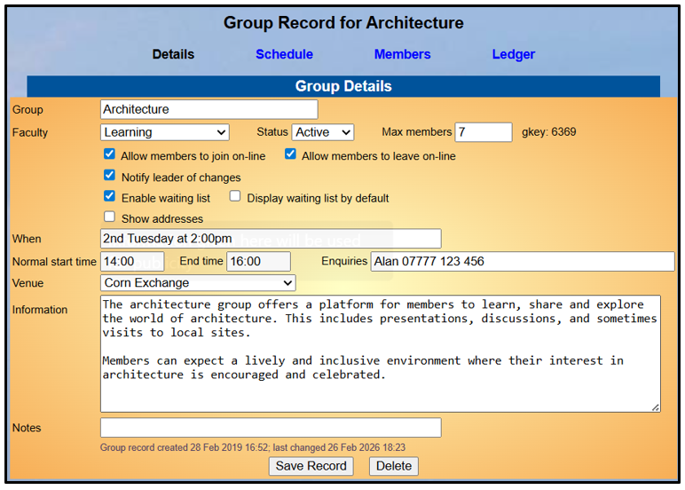
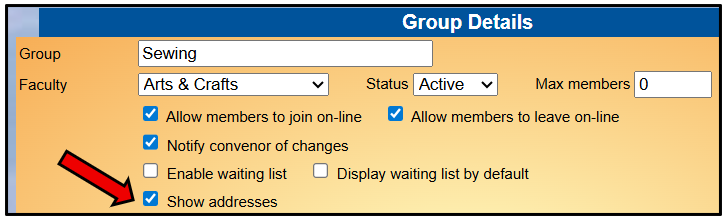

[u3a Beacon](https://u3abeacon.zendesk.com/hc/en-gb) \> [User
Guide](https://u3abeacon.zendesk.com/hc/en-gb/categories/360001240017-User-Guide)
\> [5.
Groups](https://u3abeacon.zendesk.com/hc/en-gb/sections/360002083037-5-Groups)
Search

**Articles** **in** **this** **section**

**5.2** **Group** **Records:** **Details**

>  style="width:0.41667in;height:0.41667in" /> style="width:0.15625in;height:0.15625in" />Graeme Bunting Follow 10
> days ago · Updated

Viewing your Group Record

To view the **Group** **Record** for your Group, click on the Group name
in the Groups List (see [5.1 Groups
List](https://u3abeacon.zendesk.com/hc/en-gb/articles/360007304217)), or
elsewhere where Group names are shown. Groups for which you are a Leader
or for which you have editing rights are highlighted blue.

Each Group Record comprises four sub-pages:

> **Details** see below
>
> **Schedule** see [5.3 Group Record:
> Schedule](https://u3abeacon.zendesk.com/hc/en-gb/articles/360007367858)
>
> **Members** see [5.4 Group Record:
> Members](https://u3abeacon.zendesk.com/hc/en-gb/articles/360007367878)
>
> **Ledger** see [5.5 Group Record:
> Ledger](https://u3abeacon.zendesk.com/hc/en-gb/articles/360007367898)

You can select between these
on the row beneath the Group Record title. The active sub-page has its
name in black.

*Note:* *The* *things* *that* *you* *can* *view* *and* *the*
*operations* *that* *you* *can* *perform* *may* *differ* *from* *those*
*described* *below,* *according* *to* *the* *System* *Access* *and*
*Privileges* *allocated* *to* *your* *Role* *by* *your* *u3a*
*Committee.*

>  style="width:1.125in;height:0.47892in" />**Help**

Editing your Group Details

The Group **Details** page holds basic information about the Group,
including **Faculty** (optional) and **Status** (Active or Inactive).

Some of the details on this page are used to:

> Populate fields when Events are created on the **Group** **Schedule**
> page (see [5.3 Group
> Record:](https://u3abeacon.zendesk.com/hc/en-gb/articles/360007367858)
> [Schedule)](https://u3abeacon.zendesk.com/hc/en-gb/articles/360007367858)
>
> Will display in the **Groups** **List** (see [5.1 Groups
> List)](https://u3abeacon.zendesk.com/hc/en-gb/articles/360007304217)
> Will display in the **Calendar** (see [5.9 The
> Calendar](https://u3abeacon.zendesk.com/hc/en-gb/articles/360007371078)).

Hover the cursor over a field to display details about what to enter in
the field. Also refer to the guidance below:

> The **Group** **Name** is best kept simple without apostrophes,
> ampersands or other symbols.
>
> The **When** field is free text and used only to give general
> information about when the Group meets, e.g. “2nd Thursday at 2:00pm”,
> or “Every Wednesday at 10:00” or “Once a month at a local pub”. The
> contents of this field are displayed in the Groups Lists on the Public
> Groups webpage (see [9.4
> Public](https://u3abeacon.zendesk.com/hc/en-gb/articles/360007304537)
> [Links)](https://u3abeacon.zendesk.com/hc/en-gb/articles/360007304537)
> and the Members Portal (see [10.2 Members
> Portal)](https://u3abeacon.zendesk.com/hc/en-gb/articles/360007368138).
>
> The **Start** **time**, **End** **time** and **Venue** are optional
> and are used as defaults when **Events** are created. The
> **Enquiries** field can be used to give a person's name, phone number
> for enquirers to make contact, e.g. Be aware that this information may
> be visible to u3a members or the public, depending on how the Public
> Links are configured so it is recommended that private email addresses
> are not shown (see [9.4 Public
> Links](https://u3abeacon.zendesk.com/hc/en-gb/articles/360007304537)).
>
> **Max** **members** can be used if there is a limit on the number of
> members that the Group can accommodate. When the limit is reached,
> members may still be added via the Group’s **Members** page and are
> shown with a *“waiting* *since”* (see [5.10 Dealing with a Waiting
> List](https://u3abeacon.zendesk.com/hc/en-gb/articles/360020317478)). style="width:5.45833in;height:1.66667in" />
>
> Ticking **Allow** **members** **to** **join/leave** **online** lets
> members join/leave the Group (or waiting list, if enabled) via the
> Members Portal. Members are not able to join a full Group via the
> Members Portal. Ticking **Enable** **waiting** **list** lets members
> join a waiting list via the Members Portal if the Max members figure
> has been reached. Even if the box is not ticked and a maximum group
> number has been reached, members may still be added to the waiting
> list via the Group’s Members page.
>
> If **Notify** **Leader** is ticked the Group Leader will be notified
> by email when a member joins or leaves the Group or the waiting list.
>
> Ticking **Display** **waiting** **list** **by** **default** means that
> any members on the waiting list are displayed when viewing the the
> Group Members page. Such members may be be hidden by unticking *Show*
> *waiting* *members* on the Group Members page (see [5.4 Group Record:
> Member](https://u3abeacon.zendesk.com/hc/en-gb/articles/360007367878)[s<u>).</u>](https://u3abeacon.zendesk.com/hc/en-gb/articles/360007367878-5-4-Group-Record-Members)
>
> When populating the **Information** field, be aware that this
> information may be visible to u3a members or the public, depending on
> how your u3a’s *Public* *Links* are configured (see [9.4
> Public](https://u3abeacon.zendesk.com/hc/en-gb/articles/360007304537)
> [Links)](https://u3abeacon.zendesk.com/hc/en-gb/articles/360007304537).
>
> The **Notes** field is for private notes that are not displayed the
> public.
>
> After editing any of the details press the **Save** **Record** button.

Show Addresses

A temporary change introduced in February 2026 was to add a **Show**
**Addresses** tick box:

When ticked Group Leaders can see the addresses of members of the group.

This tick box will be removed in the future. It has been replaced by a
Site Administrator being able to set this from the [Groups List
5.1](https://u3abeacon.zendesk.com/hc/en-gb/articles/360007304217).

**Revision** **History**

||
||
||
||
||

> Was this article helpful?
>
> Yes No
>
> 0 out of 0 found this helpful
>
> Have more questions? [<u>Submit a
> request</u>](https://u3abeacon.zendesk.com/hc/en-gb/requests/new)

Return to top

**Recently** **viewed** **articles** [5.1 Groups
List](https://u3abeacon.zendesk.com/hc/en-gb/articles/360007304217-5-1-Groups-List)

[8.7 Membership
Set-up](https://u3abeacon.zendesk.com/hc/en-gb/articles/360007304497-8-7-Membership-Set-up)

[4.1 The Membership
List](https://u3abeacon.zendesk.com/hc/en-gb/articles/360007301057-4-1-The-Membership-List)

[4.3 Add New
Member](https://u3abeacon.zendesk.com/hc/en-gb/articles/360007367058-4-3-Add-New-Member)

[4.2 Member
Record](https://u3abeacon.zendesk.com/hc/en-gb/articles/360007303097-4-2-Member-Record)

**Related** **articles**

[5.4 Group Record:
Members](https://u3abeacon.zendesk.com/hc/en-gb/related/click?data=BAh7CjobZGVzdGluYXRpb25fYXJ0aWNsZV9pZGwrCMZ8HNJTADoYcmVmZXJyZXJfYXJ0aWNsZV9pZGwrCJ58HNJTADoLbG9jYWxlSSIKZW4tZ2IGOgZFVDoIdXJsSSI9L2hjL2VuLWdiL2FydGljbGVzLzM2MDAwNzM2Nzg3OC01LTQtR3JvdXAtUmVjb3JkLU1lbWJlcnMGOwhUOglyYW5raQY%3D--4026fd4584c2752f7d2775b846fa926e5a5d6e9b)

[5.3 Group Record:
Schedule](https://u3abeacon.zendesk.com/hc/en-gb/related/click?data=BAh7CjobZGVzdGluYXRpb25fYXJ0aWNsZV9pZGwrCLJ8HNJTADoYcmVmZXJyZXJfYXJ0aWNsZV9pZGwrCJ58HNJTADoLbG9jYWxlSSIKZW4tZ2IGOgZFVDoIdXJsSSI%2BL2hjL2VuLWdiL2FydGljbGVzLzM2MDAwNzM2Nzg1OC01LTMtR3JvdXAtUmVjb3JkLVNjaGVkdWxlBjsIVDoJcmFua2kH--e24a4374b274b421fdd22623bf76d4a712a6553a)

[5.1 Groups
List](https://u3abeacon.zendesk.com/hc/en-gb/related/click?data=BAh7CjobZGVzdGluYXRpb25fYXJ0aWNsZV9pZGwrCBmEG9JTADoYcmVmZXJyZXJfYXJ0aWNsZV9pZGwrCJ58HNJTADoLbG9jYWxlSSIKZW4tZ2IGOgZFVDoIdXJsSSI0L2hjL2VuLWdiL2FydGljbGVzLzM2MDAwNzMwNDIxNy01LTEtR3JvdXBzLUxpc3QGOwhUOglyYW5raQg%3D--7c93b8cd8c03c4a2a0cff0a14c11bc9e8d57b2e9)

[5.5 Group Record:
Ledger](https://u3abeacon.zendesk.com/hc/en-gb/related/click?data=BAh7CjobZGVzdGluYXRpb25fYXJ0aWNsZV9pZGwrCNp8HNJTADoYcmVmZXJyZXJfYXJ0aWNsZV9pZGwrCJ58HNJTADoLbG9jYWxlSSIKZW4tZ2IGOgZFVDoIdXJsSSI8L2hjL2VuLWdiL2FydGljbGVzLzM2MDAwNzM2Nzg5OC01LTUtR3JvdXAtUmVjb3JkLUxlZGdlcgY7CFQ6CXJhbmtpCQ%3D%3D--ecb6e25a29e2383b62db484716ea91e33058aa8a)

[5.10 Dealing with a waiting
list](https://u3abeacon.zendesk.com/hc/en-gb/related/click?data=BAh7CjobZGVzdGluYXRpb25fYXJ0aWNsZV9pZGwrCCYV4tJTADoYcmVmZXJyZXJfYXJ0aWNsZV9pZGwrCJ58HNJTADoLbG9jYWxlSSIKZW4tZ2IGOgZFVDoIdXJsSSJFL2hjL2VuLWdiL2FydGljbGVzLzM2MDAyMDMxNzQ3OC01LTEwLURlYWxpbmctd2l0aC1hLXdhaXRpbmctbGlzdAY7CFQ6CXJhbmtpCg%3D%3D--b6b778562bde2d2eae558634a20fc111d97f6b51)

**Comments** 0 comments

Please [<u>sign
in</u>](https://u3abeacon.zendesk.com/access?locale=en-gb&brand_id=360000694158&return_to=https%3A%2F%2Fu3abeacon.zendesk.com%2Fhc%2Fen-gb%2Farticles%2F360007367838-5-2-Group-Records-Details)
to leave a comment.

[u3a Beacon](https://u3abeacon.zendesk.com/hc/en-gb)

> [<u>Powered by
> Zendesk</u>](https://www.zendesk.co.uk/service/help-center/?utm_source=helpcenter&utm_medium=poweredbyzendesk&utm_campaign=text&utm_content=u3a+Beacon+Support)
