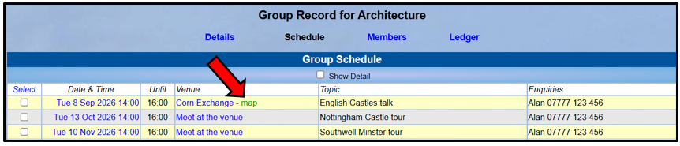
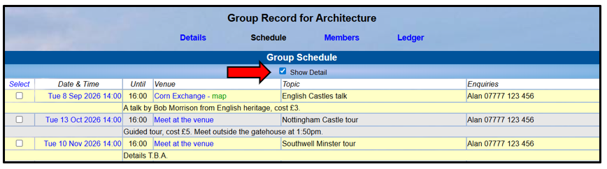
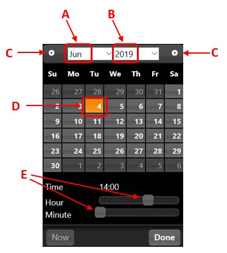
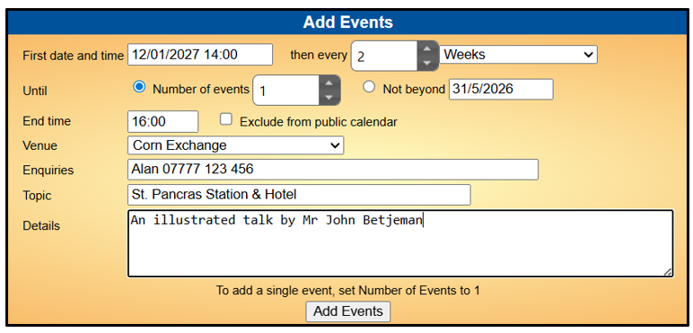
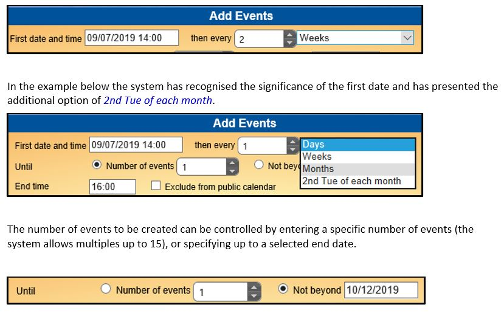
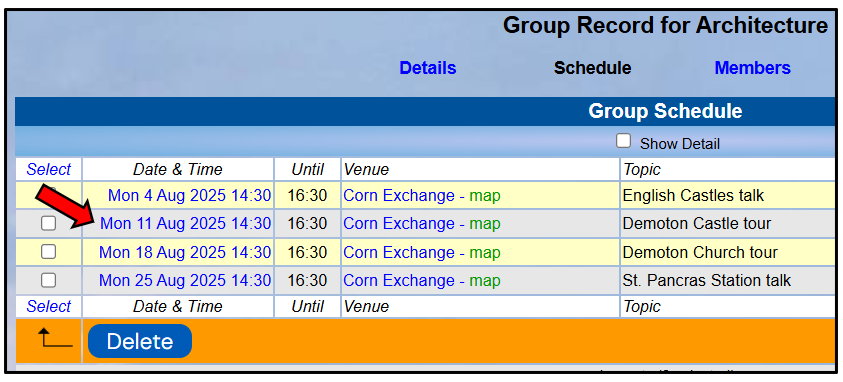
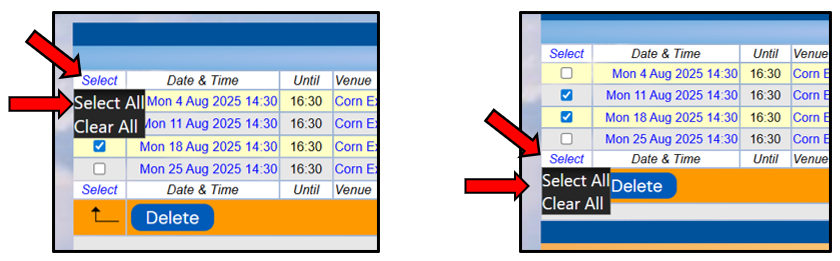
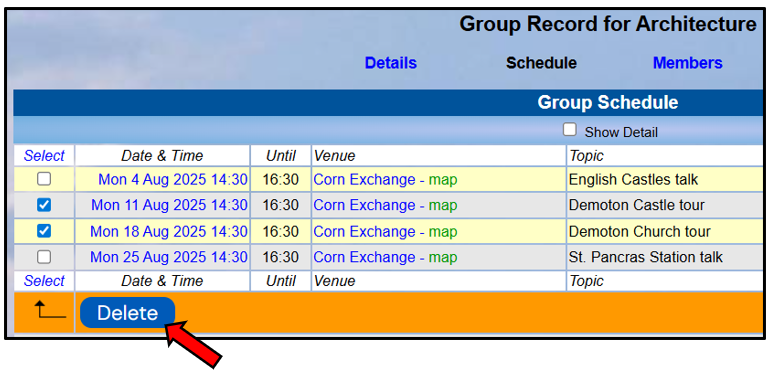

[u3a Beacon](https://u3abeacon.zendesk.com/hc/en-gb) \> [User
Guide](https://u3abeacon.zendesk.com/hc/en-gb/categories/360001240017-User-Guide)
\> [5.
Groups](https://u3abeacon.zendesk.com/hc/en-gb/sections/360002083037-5-Groups)
Search

**Articles** **in** **this** **section**

**5.3** **Group** **Record:** **Schedule**

>  style="width:0.41667in;height:0.41667in" /> style="width:0.15625in;height:0.15625in" />Graeme Bunting Follow 18
> days ago · Updated

Viewing your Group Record

To view the **Group** **Record** for your Group, click on the Group name
in the Groups List (see [5.1 Groups
List](https://u3abeacon.zendesk.com/hc/en-gb/articles/360007304217)), or
elsewhere where Group names are shown. Groups for which you are a Leader
or for which you have editing rights are highlighted blue.

Each Group Record comprises four sub-pages:

> **Details** see [5.2 Group Record:
> Details](https://u3abeacon.zendesk.com/hc/en-gb/articles/360007367838)
>
> **Schedule** see below
>
> **Members** see [5.4 Group Record:
> Members](https://u3abeacon.zendesk.com/hc/en-gb/articles/360007367878)
>
> **Ledger** see [5.5 Group Record:
> Ledger](https://u3abeacon.zendesk.com/hc/en-gb/articles/360007367898)

You can select between these
on the row beneath the Group Record title. The active sub-page has its
name in black.

*Note:* *The* *things* *that* *you* *can* *view* *and* *the*
*operations* *that* *you* *can* *perform* *may* *differ* *from* *those*
*described* *below,* *according* *to* *the* *System* *Access* *and*
*Privileges* *allocated* *to* *your* *Role* *by* *your* *u3a*
*Committee.*

>  style="width:1.125in;height:0.47892in" />**Help**

Editing your Group Schedule

The Group **Schedule** page holds details about future meetings and
events. The meetings on your Group Schedule will also be displayed on
your U3A’s main **Calendar** ([<u>s</u>ee 5.9 The
Calendar](https://u3abeacon.zendesk.com/hc/en-gb/articles/360007371078)).

Clicking any green **map** text (if shown) will open a map of the venue
in *Streetmap*.

To show additional details about events tick **Show** **Detail**.

Adding a new Event

To add a single meeting/event, click in the **First** **date** **&**
**time** field to open the calendar showing the current month, from
where you can select the required date and time:

Click on the drop-down lists to change the **Month** \[A\] and **Year**
\[B\], or use the right and left arrows \[C\] to go forward or back by
one month at a time.

Select the required **Day**
\[D\].

The **Start** **Time** displayed will be copied from the default time on
the Details page. The **Hour** and **Minute** can be changed by dragging
the sliders \[E\] to the left or right.

When the required date and time have been chosen, press the **Done**
button.

> The **End** **time**, **Venue** and **Contact** fields will be copied
> from the default time on the Details page, but can be changed if
> required.
>
> The contents of the **Details** field may be visible to U3A members or
> the public, depending on how your U3A’s *Public* *Links* are
> configured (see [9.4 Public
> Links)](https://u3abeacon.zendesk.com/hc/en-gb/articles/360007304537),
> so be aware of this if wishing to include personal information. There
> is also a box that you can tick to exclude the event from your U3A’s
> Public Calendar.
>
>  style="width:7.02083in;height:3.375in" />You don’t need to do anything
> with the other fields on this page – they have no effect when creating
> a single event.
>
> After completing the required fields, press the **Add** **Events**
> button to create the single event.

Adding Multiple Events

If your meetings are held on a regular basis, you can create multiple
events covering the forthcoming months at the same time, e.g. every 4
weeks, every 2 months, etc.

After choosing the date and time for the first event, you may specify
the frequency of following events by entering a number in the **then**
**every** field (or use the up and down arrows to increase/decrease the
displayed number) and then select days, weeks or months from the
drop-down list:

When you have completed all the required fields, press the **Add**
**Events** button to create the new events.

If the details for all the events are not exactly the same or some of
the dates need to be changed, you may have to edit the individual events
as described below.

Changing Events

To
change an Event, click the blue **Date** **&** **Time** field to open up
the details form, make the changes and then press the **Update** button:

Deleting Events

To delete one or more Events, tick the appropriate boxes in the left
hand column individually, or click **Select** at the top or bottom of
the column and **Select** **all** . . .

> . . . then press the **Delete** button:

Revision History

||
||
||
||
||

> Was this article helpful?
>
> Yes No
>
> 0 out of 0 found this helpful
>
> Have more questions? [<u>Submit a
> request</u>](https://u3abeacon.zendesk.com/hc/en-gb/requests/new)

Return to top

**Recently** **viewed** **articles** [4.9
Statistics](https://u3abeacon.zendesk.com/hc/en-gb/articles/360007304617-4-9-Statistics)

[4.8.1 Adjusting Beacon Printer settings to
print](https://u3abeacon.zendesk.com/hc/en-gb/articles/4731024504593-4-8-1-Adjusting-Beacon-Printer-settings-to-print-labels)
[labels](https://u3abeacon.zendesk.com/hc/en-gb/articles/4731024504593-4-8-1-Adjusting-Beacon-Printer-settings-to-print-labels)

[4.8 Addresses Export (including
TAM)](https://u3abeacon.zendesk.com/hc/en-gb/articles/360007367818-4-8-Addresses-Export-including-TAM)

[4.7 Membership
Cards](https://u3abeacon.zendesk.com/hc/en-gb/articles/360007304197-4-7-Membership-Cards)

[4.6 Non-renewals (including Resigned, Lapsed
and](https://u3abeacon.zendesk.com/hc/en-gb/articles/360007304297-4-6-Non-renewals-including-Resigned-Lapsed-and-Deceased-members)
[Deceased
members)](https://u3abeacon.zendesk.com/hc/en-gb/articles/360007304297-4-6-Non-renewals-including-Resigned-Lapsed-and-Deceased-members)

**Related** **articles**

[5.4 Group Record:
Members](https://u3abeacon.zendesk.com/hc/en-gb/related/click?data=BAh7CjobZGVzdGluYXRpb25fYXJ0aWNsZV9pZGwrCMZ8HNJTADoYcmVmZXJyZXJfYXJ0aWNsZV9pZGwrCLJ8HNJTADoLbG9jYWxlSSIKZW4tZ2IGOgZFVDoIdXJsSSI9L2hjL2VuLWdiL2FydGljbGVzLzM2MDAwNzM2Nzg3OC01LTQtR3JvdXAtUmVjb3JkLU1lbWJlcnMGOwhUOglyYW5raQY%3D--9a13fa322384b72f9a4b2607fc0d602d5bc57712)

[5.5 Group Record:
Ledger](https://u3abeacon.zendesk.com/hc/en-gb/related/click?data=BAh7CjobZGVzdGluYXRpb25fYXJ0aWNsZV9pZGwrCNp8HNJTADoYcmVmZXJyZXJfYXJ0aWNsZV9pZGwrCLJ8HNJTADoLbG9jYWxlSSIKZW4tZ2IGOgZFVDoIdXJsSSI8L2hjL2VuLWdiL2FydGljbGVzLzM2MDAwNzM2Nzg5OC01LTUtR3JvdXAtUmVjb3JkLUxlZGdlcgY7CFQ6CXJhbmtpBw%3D%3D--5f5f1893dfaace526614ec12f554b949e9078370)

[5.9 The
Calendar](https://u3abeacon.zendesk.com/hc/en-gb/related/click?data=BAh7CjobZGVzdGluYXRpb25fYXJ0aWNsZV9pZGwrCEaJHNJTADoYcmVmZXJyZXJfYXJ0aWNsZV9pZGwrCLJ8HNJTADoLbG9jYWxlSSIKZW4tZ2IGOgZFVDoIdXJsSSI1L2hjL2VuLWdiL2FydGljbGVzLzM2MDAwNzM3MTA3OC01LTktVGhlLUNhbGVuZGFyBjsIVDoJcmFua2kI--be567b68ca76bb9ddc2a8374df225a324005a087)

[10.2 Members
Portal](https://u3abeacon.zendesk.com/hc/en-gb/related/click?data=BAh7CjobZGVzdGluYXRpb25fYXJ0aWNsZV9pZGwrCMp9HNJTADoYcmVmZXJyZXJfYXJ0aWNsZV9pZGwrCLJ8HNJTADoLbG9jYWxlSSIKZW4tZ2IGOgZFVDoIdXJsSSI4L2hjL2VuLWdiL2FydGljbGVzLzM2MDAwNzM2ODEzOC0xMC0yLU1lbWJlcnMtUG9ydGFsBjsIVDoJcmFua2kJ--5b80f90e940b33a946d77a7a51004321d6305303)

[Best ways to use the User
Guide](https://u3abeacon.zendesk.com/hc/en-gb/related/click?data=BAh7CjobZGVzdGluYXRpb25fYXJ0aWNsZV9pZGwrCPJ6ztJTADoYcmVmZXJyZXJfYXJ0aWNsZV9pZGwrCLJ8HNJTADoLbG9jYWxlSSIKZW4tZ2IGOgZFVDoIdXJsSSJEL2hjL2VuLWdiL2FydGljbGVzLzM2MDAxOTAzMjgxOC1CZXN0LXdheXMtdG8tdXNlLXRoZS1Vc2VyLUd1aWRlBjsIVDoJcmFua2kK--be4eef24721f6134ee4016e9ffd1ce9fd7a884d7)

**Comments** 0 comments

Please [<u>sign
in</u>](https://u3abeacon.zendesk.com/access?locale=en-gb&brand_id=360000694158&return_to=https%3A%2F%2Fu3abeacon.zendesk.com%2Fhc%2Fen-gb%2Farticles%2F360007367858-5-3-Group-Record-Schedule)
to leave a comment.

[u3a Beacon](https://u3abeacon.zendesk.com/hc/en-gb)

> [<u>Powered by
> Zendesk</u>](https://www.zendesk.co.uk/service/help-center/?utm_source=helpcenter&utm_medium=poweredbyzendesk&utm_campaign=text&utm_content=u3a+Beacon+Support)
