[u3a Beacon](https://u3abeacon.zendesk.com/hc/en-gb) \> [User
Guide](https://u3abeacon.zendesk.com/hc/en-gb/categories/360001240017-User-Guide)
\> [5.
Groups](https://u3abeacon.zendesk.com/hc/en-gb/sections/360002083037-5-Groups)
Search

**Articles** **in** **this** **section**

**5.4** **Group** **Record:** **Members**

>  style="width:0.41667in;height:0.41667in" /> style="width:0.15625in;height:0.15625in" />Graeme Bunting Follow 9
> days ago · Updated

Viewing your Group Record

To view the **Group** **Record** for your Group, click on the Group name
in the Groups List (see [5.1 Groups
List](https://u3abeacon.zendesk.com/hc/en-gb/articles/360007304217)), or
elsewhere where Group names are shown. Groups for which you are a Leader
or for which you have editing rights are highlighted blue.

Each Group Record comprises four sub-pages:

> **Details** see [5.2 Group Record:
> Details](https://u3abeacon.zendesk.com/hc/en-gb/articles/360007367838)
>
> **Schedule** see [5.3 Group Record:
> Schedule](https://u3abeacon.zendesk.com/hc/en-gb/articles/360007367858)
>
> **Members** see below
>
> **Ledger** see [5.5 Group Record:
> Ledger](https://u3abeacon.zendesk.com/hc/en-gb/articles/360007367898)

You can select between these
on the row beneath the Group Record title. The active sub-page has its
name in black.

*Note:* *The* *things* *that* *you* *can* *view* *and* *the*
*operations* *that* *you* *can* *perform* *may* *differ* *from* *those*
*described* *below,* *according* *to* *the* *System* *Access* *and*
*Privileges* *allocated* *to* *your* *Role* *by* *your* *u3a*
*Committee.*

>  style="width:1.125in;height:0.47892in" />**Help**

Viewing your Group Members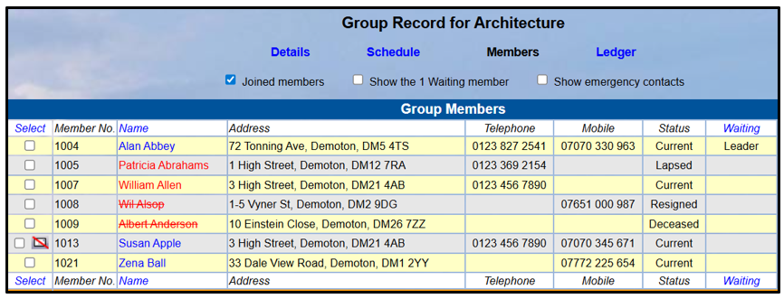

The Group **Members** page holds contact information for the members of
your Group.

> Members are shown in red if they are **Lapsed** (Patricia Abrahams) or
> **Current**, but **due** **for** **renewal** (William Allen)
>
> Members are shown in red strikethrough if they are **Resigned** (Wil
> Alsop) or **Deceased** (Albert Anderson).
>
> *Note:* *you* *should* *always* *remove* *Resigned* *and* *Deceased*
> *members* *from* *your* *Group*
>
> Members **without** **email** are denoted by an envelope icon with a
> red diagonal line (Susan Apple)

**Waiting** **Lists**

If your Group has a limit on numbers, it is possible to enable a
**waiting** **list** (see [5.10 Dealing with a
Waiting](https://u3abeacon.zendesk.com/hc/en-gb/articles/360020317478)
[List)](https://u3abeacon.zendesk.com/hc/en-gb/articles/360020317478).

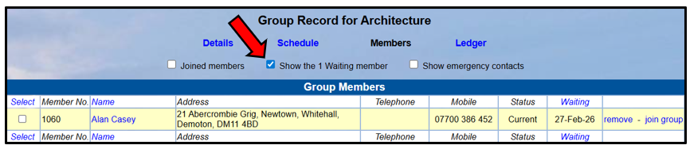You can choose to display
**Joined** **Members** and/or **Waiting** **List** **Members** using the
tick boxes at the top of the page. To see members on a waiting list with
the date since which they have been waiting, tick the **Show** **the**
**x** **Waiting** **Members** box:

**Hidden** **Details**

Group Leaders are not able to see the address or phone numbers of any
member that has chosen to **hide**

**their** **details** from Group Leaders (Zena Ball), although you will
still be able to send emails to
them: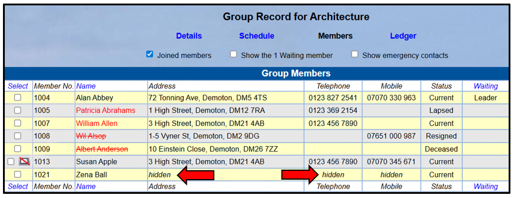

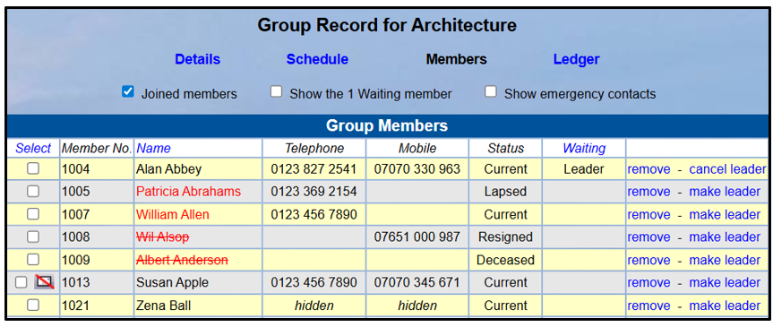If your u3a has opted to hide
the addresses of Group members from Group Leaders ([as described in
5.1)](https://u3abeacon.zendesk.com/hc/en-gb/articles/360007304217), the
**Address** column will not be displayed:

**Emergency** **Contacts**

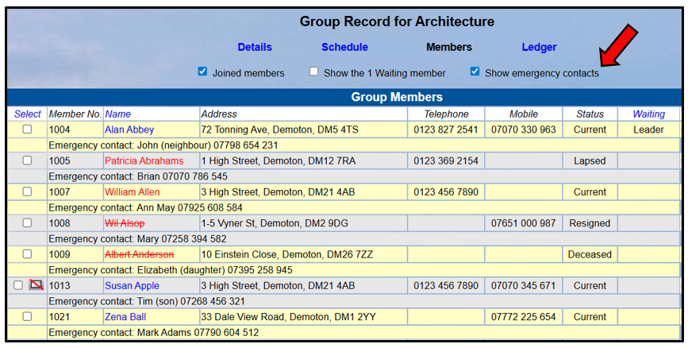To see Emergency Contact
details for members (if held), tick the **Show** **emergency**
**contacts** box:

Managing Members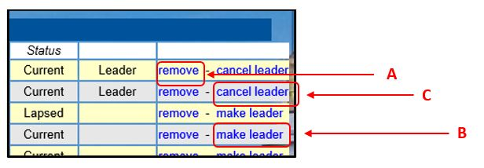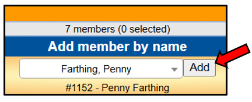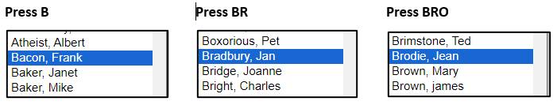

Click the blue links on the right of the page to:

> Remove a member from the Group **\[A\]**
>
> Make a member a Group Leader **\[B\]** - you may have more than 1
> leader
>
> Remove a member from the Leader role **\[C\]**

Adding a Member by Name

To add a member to the Group select their name from the **Add**
**member** **by** **name** drop-down list below the table and press the
**Add** button.

After selecting, the member's Membership Number is displayed under the
field - this can be helpful if there are 2 or more members with the same
name and you need to choose the right one.

*Tip:* *If* *a* *drop-down* *list* *is* *long,* *you* *can* *jump*
*quickly* *to* *the* *first* *entry* *starting* *with* *any*
*particular* *letter(s)* *by* *focusing* *the* *list* *(just* *click*
*on* *it)* *and* *then* *pressing* *the* *letter(s)* *on* *the*
*keyboard.*

Adding Members by Number

Enter a member's Membership Number in the **Add** **member** **by**
**membership** **number** field below the table

and press the **Add** button.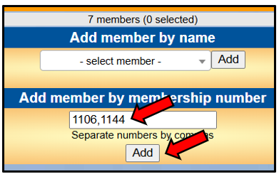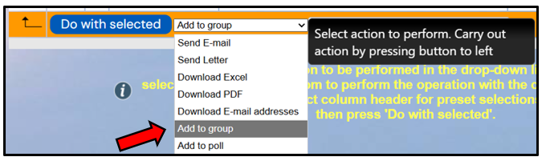

Members may be added in batches by entering their membership numbers
separated by commas.

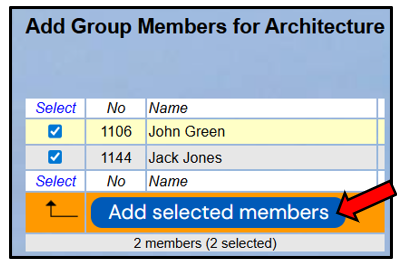You will be prompted to
confirm that the name(s) of the members are correct by pressing the
**Add** **selected** **members** button.

Adding from the Members List

This option is only available to users that have access to the main
**Membership** **List**, such as the Membership Secretary and perhaps
some Committee Members. If there are a lot of members to add to your
group, it may be better to ask the Membership Secretary to do it for you
as follows.

In the Membership List, select the members to be added to the group by
ticking the boxes in the left column.

Click in the drop-down list below the table and pick **Add** **to**
**group**

This opens up another drop-down list where you can pick the name of the
group before pressing the **Do** **with** **Selected** button.

The **Group** drop-down list is searchable - for example Typing "Walk"
will filter the list to only show Groups that contain the letters
"walk".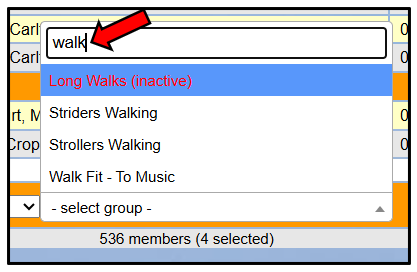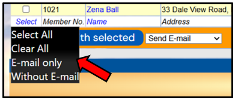

**Inactive** Groups are shown in red with a suffix (inactive).

Selecting Members

To select one or more members prior to performing one of the operations
described below, tick the required box(es) in the left hand column next
to each member’s name. Or click **Select** at the top or bottom of the
column, followed by any of the choices from the drop-down list that
appears:

> **Select** **All** for all displayed Group members
>
> **E-mail** **only** for members with an email address **Without**
> **E-mail** for members without an email address

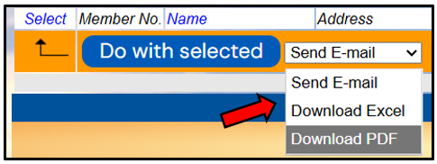The following operations with
the selected members are available by choosing from the drop-down list
below the table and pressing the **Do** **with** **selected** button:

> **Send** **E-mail** (see [6.1
> Emails](https://u3abeacon.zendesk.com/hc/en-gb/articles/360007367918))
>
> **Download** **Excel** file containing member contact details, if not
> hidden **Download** **PDF** file containing member contact details and
> photo, if available

Sending emails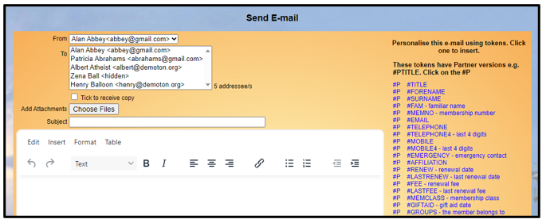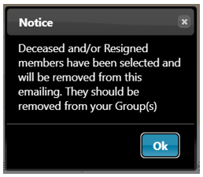

Selecting **Send** **E-mail** opens the following page:

If **Deceased** or **Resigned** members were selected there will be a
warning message that those members should be removed from the Group:

Refer to [6.1.1 Sending
Emails](https://u3abeacon.zendesk.com/hc/en-gb/articles/360007380438-6-1-1-Sending-Emails)
for further information on composing and sending emails.

File Downloads

For **Excel** and **pdf** downloads you will be asked to tick the fields
to include, before pressing the **Download** button

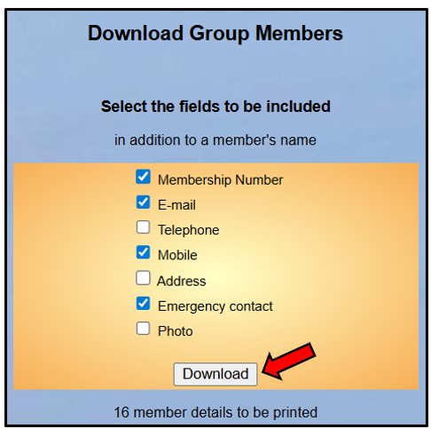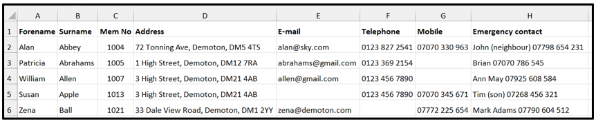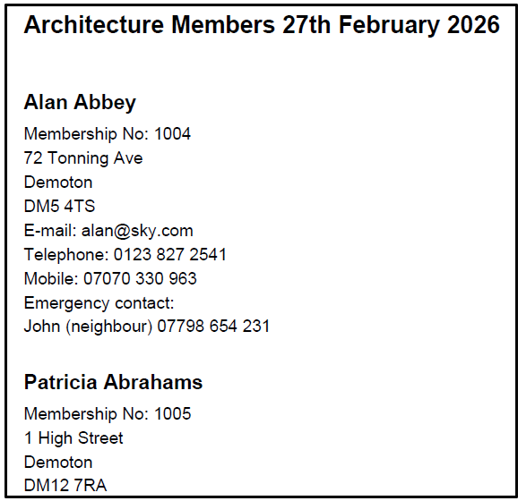

**Deceased** or **Resigned** members are not displayed in the downloads.

Here are typical Excel and pdf downloads:

Revision History

||
||
||
||

||
||
||
||
||
||
||
||
||
||
||
||
||

> Was this article helpful?
>
> Yes No
>
> 3 out of 5 found this helpful
>
> Have more questions? [<u>Submit a
> request</u>](https://u3abeacon.zendesk.com/hc/en-gb/requests/new)

Return to top

**Recently** **viewed** **articles** [5.2 Group Records:
Details](https://u3abeacon.zendesk.com/hc/en-gb/articles/360007367838-5-2-Group-Records-Details)

[5.1 Groups
List](https://u3abeacon.zendesk.com/hc/en-gb/articles/360007304217-5-1-Groups-List)

[8.7 Membership
Set-up](https://u3abeacon.zendesk.com/hc/en-gb/articles/360007304497-8-7-Membership-Set-up)

[4.1 The Membership
List](https://u3abeacon.zendesk.com/hc/en-gb/articles/360007301057-4-1-The-Membership-List)

**Related** **articles** [5.1 Groups
List](https://u3abeacon.zendesk.com/hc/en-gb/related/click?data=BAh7CjobZGVzdGluYXRpb25fYXJ0aWNsZV9pZGwrCBmEG9JTADoYcmVmZXJyZXJfYXJ0aWNsZV9pZGwrCMZ8HNJTADoLbG9jYWxlSSIKZW4tZ2IGOgZFVDoIdXJsSSI0L2hjL2VuLWdiL2FydGljbGVzLzM2MDAwNzMwNDIxNy01LTEtR3JvdXBzLUxpc3QGOwhUOglyYW5raQY%3D--86599cff543061ceae667586ada72413fc64348b)

[5.2 Group Records:
Details](https://u3abeacon.zendesk.com/hc/en-gb/related/click?data=BAh7CjobZGVzdGluYXRpb25fYXJ0aWNsZV9pZGwrCJ58HNJTADoYcmVmZXJyZXJfYXJ0aWNsZV9pZGwrCMZ8HNJTADoLbG9jYWxlSSIKZW4tZ2IGOgZFVDoIdXJsSSI%2BL2hjL2VuLWdiL2FydGljbGVzLzM2MDAwNzM2NzgzOC01LTItR3JvdXAtUmVjb3Jkcy1EZXRhaWxzBjsIVDoJcmFua2kH--0c3c9a597e965d224fdd9ff4186c91b163ea2d4f)

[5.5 Group Record:
Ledger](https://u3abeacon.zendesk.com/hc/en-gb/related/click?data=BAh7CjobZGVzdGluYXRpb25fYXJ0aWNsZV9pZGwrCNp8HNJTADoYcmVmZXJyZXJfYXJ0aWNsZV9pZGwrCMZ8HNJTADoLbG9jYWxlSSIKZW4tZ2IGOgZFVDoIdXJsSSI8L2hjL2VuLWdiL2FydGljbGVzLzM2MDAwNzM2Nzg5OC01LTUtR3JvdXAtUmVjb3JkLUxlZGdlcgY7CFQ6CXJhbmtpCA%3D%3D--f92c445a239f227b9353f9f8232ed8b3eddb6795)

[5.10 Dealing with a waiting
list](https://u3abeacon.zendesk.com/hc/en-gb/related/click?data=BAh7CjobZGVzdGluYXRpb25fYXJ0aWNsZV9pZGwrCCYV4tJTADoYcmVmZXJyZXJfYXJ0aWNsZV9pZGwrCMZ8HNJTADoLbG9jYWxlSSIKZW4tZ2IGOgZFVDoIdXJsSSJFL2hjL2VuLWdiL2FydGljbGVzLzM2MDAyMDMxNzQ3OC01LTEwLURlYWxpbmctd2l0aC1hLXdhaXRpbmctbGlzdAY7CFQ6CXJhbmtpCQ%3D%3D--4c7e333b4c32b363c4dc35e147a6acd9f0adb7b4)

[4.3 Add New
Member](https://u3abeacon.zendesk.com/hc/en-gb/articles/360007367058-4-3-Add-New-Member)
[6.1.1 Sending
Emails](https://u3abeacon.zendesk.com/hc/en-gb/related/click?data=BAh7CjobZGVzdGluYXRpb25fYXJ0aWNsZV9pZGwrCNatHNJTADoYcmVmZXJyZXJfYXJ0aWNsZV9pZGwrCMZ8HNJTADoLbG9jYWxlSSIKZW4tZ2IGOgZFVDoIdXJsSSI5L2hjL2VuLWdiL2FydGljbGVzLzM2MDAwNzM4MDQzOC02LTEtMS1TZW5kaW5nLUVtYWlscwY7CFQ6CXJhbmtpCg%3D%3D--f5896aeaa47bbf563f48fc80c3a7d8502632aef2)

**Comments** 0 comments

Please [<u>sign
in</u>](https://u3abeacon.zendesk.com/access?locale=en-gb&brand_id=360000694158&return_to=https%3A%2F%2Fu3abeacon.zendesk.com%2Fhc%2Fen-gb%2Farticles%2F360007367878-5-4-Group-Record-Members)
to leave a comment.

[u3a Beacon](https://u3abeacon.zendesk.com/hc/en-gb)

> [<u>Powered by
> Zendesk</u>](https://www.zendesk.co.uk/service/help-center/?utm_source=helpcenter&utm_medium=poweredbyzendesk&utm_campaign=text&utm_content=u3a+Beacon+Support)
