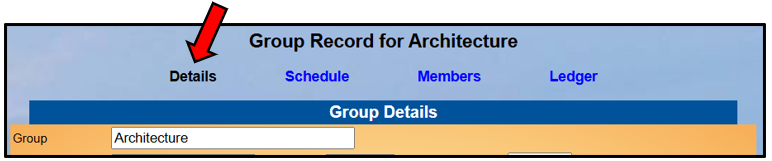
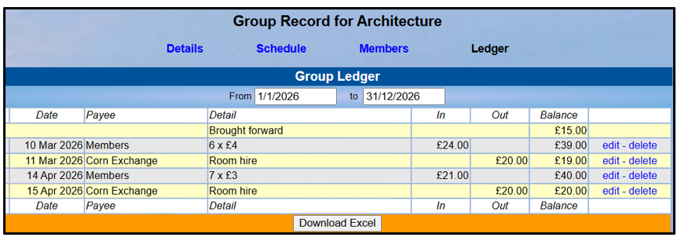
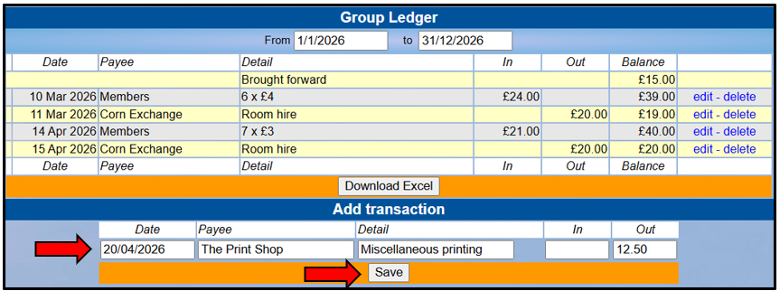
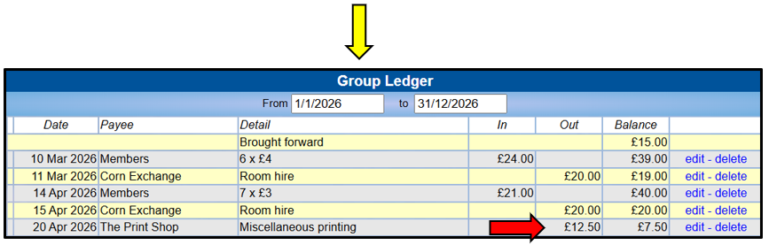

[u3a Beacon](https://u3abeacon.zendesk.com/hc/en-gb) \> [User
Guide](https://u3abeacon.zendesk.com/hc/en-gb/categories/360001240017-User-Guide)
\> [5.
Groups](https://u3abeacon.zendesk.com/hc/en-gb/sections/360002083037-5-Groups)
Search

**Articles** **in** **this** **section**

**5.5** **Group** **Record:** **Ledger**

>  style="width:0.41667in;height:0.41667in" /> style="width:0.15625in;height:0.15625in" />Graeme Bunting Follow 17
> days ago · Updated

Viewing your Group Record

To view the **Group** **Record** for your Group, click on the Group name
in the Groups List (see [5.1 Groups
List](https://u3abeacon.zendesk.com/hc/en-gb/articles/360007304217)), or
elsewhere where Group names are shown. Groups for which you are a Leader
or for which you have editing rights are highlighted blue.

Each Group Record comprises four sub-pages:

> **Details** see [<u>5.2 Group Record:
> Details</u>](https://u3abeacon.zendesk.com/hc/en-gb/articles/360007367838)
>
> **Schedule** see [<u>5.3 Group Record:
> Schedule</u>](https://u3abeacon.zendesk.com/hc/en-gb/articles/360007367858)
>
> **Members** see [<u>5.4 Group Record:
> Members</u>](https://u3abeacon.zendesk.com/hc/en-gb/articles/360007367878)
>
> **Ledger** see below

You can select between these
on the row beneath the Group Record title. The active sub-page has its
name in black.

*Note:* *The* *things* *that* *you* *can* *view* *and* *the*
*operations* *that* *you* *can* *perform* *may* *differ* *from* *those*
*described* *below,* *according* *to* *the* *System* *Access* *and*
*Privileges* *allocated* *to* *your* *Role* *by* *your* *u3a*
*Committee.*

>  style="width:1.125in;height:0.47892in" />**Help**

Viewing your Group Ledger

The Group **Ledger** can be used as a basic facility to record monies
paid out and received by your group.

All Transactions are shown for
the Group between the selected **From** and **To** dates (which default
to the current financial year), together with the incremental current
balance.

Transactions can be edited or deleted by clicking the blue links on the
right of the page.

An Excel copy of the ledger can be downloaded by pressing the
**Download** **Excel** button (according to your access privileges).

*Note:* *There* *is* *no* *connection* *between* *this* *Ledger* *and*
*the* *main* *Treasurer's* *Ledger,* *however:*

> *The* *Treasurer* *is* *able* *to* *see* *an* *overview* *of* *your*
> *Ledger* *and* *add* *the* *income* *and* *expenditure* *to* *the*
> *main* *Ledger.*
>
> *Any* *Group* *Leader* *that* *has* *been* *given* *the* *privilege*
> *to* *view* ***Group*** ***ledger*** ***(as*** ***leader)*** *can*
> *view* *(but* *not* *edit)* *Transactions* *related* *to* *their*
> *Group* *in* *the* *Treasurer's* ***Ledger*** ***by*** ***Group***
> *page* *(see* [*7.1.1
> Group*](https://u3abeacon.zendesk.com/hc/en-gb/articles/22264919953821)
> *[Leaders Viewing of transactions in the Main Finance
> Ledger](https://u3abeacon.zendesk.com/hc/en-gb/articles/22264919953821))*

Adding to your Group Ledger

To add a new **Transaction** fill in the boxes below the Ledger:

> **Date**
>
> **Payee** (can refer to both a person to whom money is paid and a
> person paying money to you) **Detail** (the reason for the
> transaction)
>
> Amount **In** or **Out**

Then press the **Save** button.

Revision History

||
||
||
||
||
||
||

>  style="width:0.1875in;height:0.18726in" />2
>
> Was this article helpful?
>
> Yes No
>
> 0 out of 1 found this helpful
>
> Have more questions? [<u>Submit a
> request</u>](https://u3abeacon.zendesk.com/hc/en-gb/requests/new)

Return to top

**Recently** **viewed** **articles** [5.3 Group Record:
Schedule](https://u3abeacon.zendesk.com/hc/en-gb/articles/360007367858-5-3-Group-Record-Schedule)

[4.9
Statistics](https://u3abeacon.zendesk.com/hc/en-gb/articles/360007304617-4-9-Statistics)

[4.8.1 Adjusting Beacon Printer settings to
print](https://u3abeacon.zendesk.com/hc/en-gb/articles/4731024504593-4-8-1-Adjusting-Beacon-Printer-settings-to-print-labels)
[labels](https://u3abeacon.zendesk.com/hc/en-gb/articles/4731024504593-4-8-1-Adjusting-Beacon-Printer-settings-to-print-labels)

[4.8 Addresses Export (including
TAM)](https://u3abeacon.zendesk.com/hc/en-gb/articles/360007367818-4-8-Addresses-Export-including-TAM)

[4.7 Membership
Cards](https://u3abeacon.zendesk.com/hc/en-gb/articles/360007304197-4-7-Membership-Cards)

**Comments**

2 comments

**Related** **articles** [7.1 Financial
Ledger](https://u3abeacon.zendesk.com/hc/en-gb/related/click?data=BAh7CjobZGVzdGluYXRpb25fYXJ0aWNsZV9pZGwrCBZ9HNJTADoYcmVmZXJyZXJfYXJ0aWNsZV9pZGwrCNp8HNJTADoLbG9jYWxlSSIKZW4tZ2IGOgZFVDoIdXJsSSI5L2hjL2VuLWdiL2FydGljbGVzLzM2MDAwNzM2Nzk1OC03LTEtRmluYW5jaWFsLUxlZGdlcgY7CFQ6CXJhbmtpBg%3D%3D--9d3612da0818c0572154f8504dcc33891a773bff)

[5.1 Groups
List](https://u3abeacon.zendesk.com/hc/en-gb/related/click?data=BAh7CjobZGVzdGluYXRpb25fYXJ0aWNsZV9pZGwrCBmEG9JTADoYcmVmZXJyZXJfYXJ0aWNsZV9pZGwrCNp8HNJTADoLbG9jYWxlSSIKZW4tZ2IGOgZFVDoIdXJsSSI0L2hjL2VuLWdiL2FydGljbGVzLzM2MDAwNzMwNDIxNy01LTEtR3JvdXBzLUxpc3QGOwhUOglyYW5raQc%3D--1f219ec00a82d3843f298794f5b1d81334c3a061)

[5.2 Group Records:
Details](https://u3abeacon.zendesk.com/hc/en-gb/related/click?data=BAh7CjobZGVzdGluYXRpb25fYXJ0aWNsZV9pZGwrCJ58HNJTADoYcmVmZXJyZXJfYXJ0aWNsZV9pZGwrCNp8HNJTADoLbG9jYWxlSSIKZW4tZ2IGOgZFVDoIdXJsSSI%2BL2hjL2VuLWdiL2FydGljbGVzLzM2MDAwNzM2NzgzOC01LTItR3JvdXAtUmVjb3Jkcy1EZXRhaWxzBjsIVDoJcmFua2kI--d15edb8672ac68ed0c85c0026fb959dd2266bed8)

[5.4 Group Record:
Members](https://u3abeacon.zendesk.com/hc/en-gb/related/click?data=BAh7CjobZGVzdGluYXRpb25fYXJ0aWNsZV9pZGwrCMZ8HNJTADoYcmVmZXJyZXJfYXJ0aWNsZV9pZGwrCNp8HNJTADoLbG9jYWxlSSIKZW4tZ2IGOgZFVDoIdXJsSSI9L2hjL2VuLWdiL2FydGljbGVzLzM2MDAwNzM2Nzg3OC01LTQtR3JvdXAtUmVjb3JkLU1lbWJlcnMGOwhUOglyYW5raQk%3D--a8dfea38351e067655080b4f7558a1a355b4a446)

[7.10.6 Opening Balance for
Groups](https://u3abeacon.zendesk.com/hc/en-gb/related/click?data=BAh7CjobZGVzdGluYXRpb25fYXJ0aWNsZV9pZGwrCJ0SIPd9EToYcmVmZXJyZXJfYXJ0aWNsZV9pZGwrCNp8HNJTADoLbG9jYWxlSSIKZW4tZ2IGOgZFVDoIdXJsSSJIL2hjL2VuLWdiL2FydGljbGVzLzE5MjMyNzE0NjU4NDYxLTctMTAtNi1PcGVuaW5nLUJhbGFuY2UtZm9yLUdyb3VwcwY7CFQ6CXJhbmtpCg%3D%3D--6c37699f2171b3ede1ae46430ada4594a481842c)

> Sort by
>
>  style="width:0.41667in;height:0.41667in" />William E Willoughby 5
> years ago
>
> 0

I've just started using Beacon
as a Group Leader. When editing a line in the group ledger the system
seems to drop off the first digit of the amount being edited, Glitch in
the system?

Regards - Bill Willoughby

>  style="width:0.41667in;height:0.41667in" />John Waddington16 5 years
> ago
>
> 0

I have the same issue.

Now reporting via the ticket
system.

John Waddington

Please [<u>sign
in</u>](https://u3abeacon.zendesk.com/access?locale=en-gb&brand_id=360000694158&return_to=https%3A%2F%2Fu3abeacon.zendesk.com%2Fhc%2Fen-gb%2Farticles%2F360007367898-5-5-Group-Record-Ledger)
to leave a comment.

[u3a Beacon](https://u3abeacon.zendesk.com/hc/en-gb)

> [<u>Powered b</u>y
> <u>Zendesk</u>](https://www.zendesk.co.uk/service/help-center/?utm_source=helpcenter&utm_medium=poweredbyzendesk&utm_campaign=text&utm_content=u3a+Beacon+Support)
