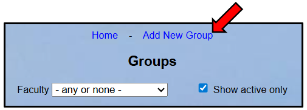
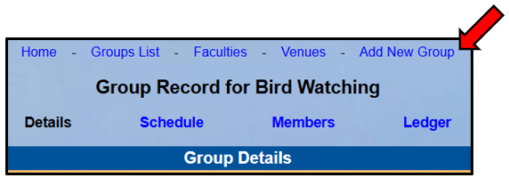
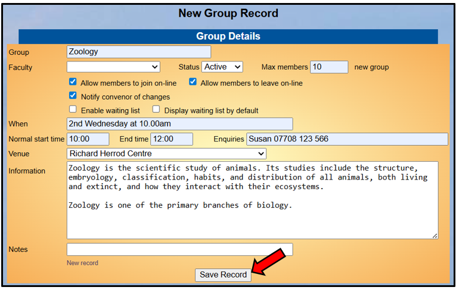
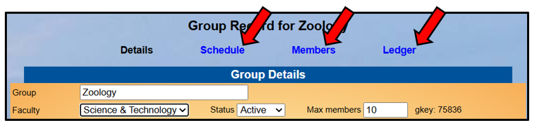
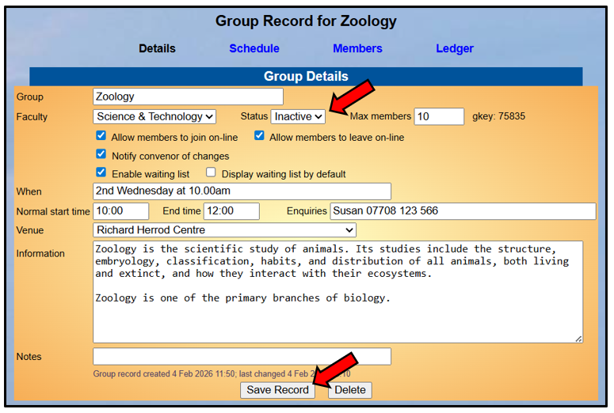
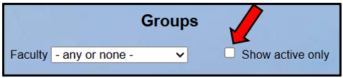
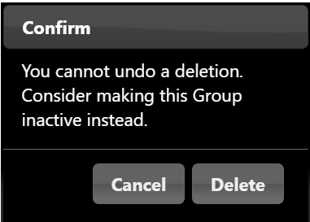
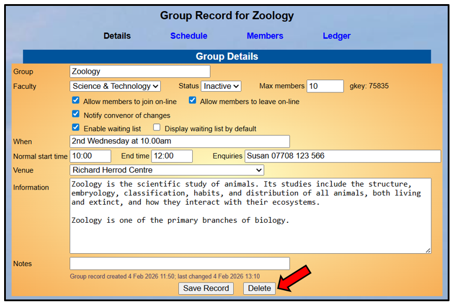
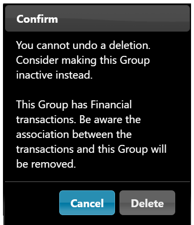
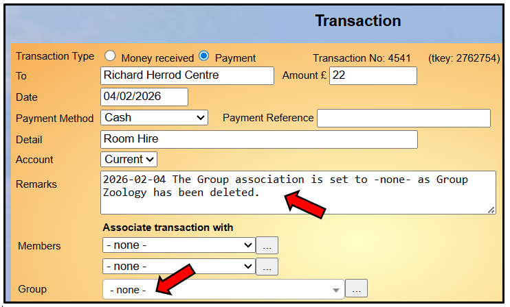

[u3a Beacon](https://u3abeacon.zendesk.com/hc/en-gb) \> [User
Guide](https://u3abeacon.zendesk.com/hc/en-gb/categories/360001240017-User-Guide)
\> [5.
Groups](https://u3abeacon.zendesk.com/hc/en-gb/sections/360002083037-5-Groups)
Search

**Articles** **in** **this** **section**

**5.6** **Adding** **&** **Removing** **Groups**

>  style="width:0.41667in;height:0.41667in" /> style="width:0.15625in;height:0.15625in" />Graeme Bunting Follow 9
> days ago · Updated

*Please* *note* *that* *a* *change* *to* *the* *layout* *of* *the*
*Group* *Details* *screen* *in* *February* *2026* *has* *not* *been*
*updated* *in* *this* *article.*

The functions described on this page are typically only available to
**Groups** **Co-ordinators** and **System** **Administrators,** subject
to the permissions given.

a\) Adding a New Group

To add a new Group Record, either click **Add** **New** **Group** at the
top of the Groups List page:

or, click **Add** **New** **Group** at the top of any other Group
Record:

Fill in the **Group** **Details** as described in [5.2 Group Records:
Details](https://u3abeacon.zendesk.com/hc/en-gb/articles/360007367838)
and then press the **Save** **Record** button:

>  style="width:1.125in;height:0.47892in" />**Help**

Saving the Group Details also creates the **Schedule**, **Members** and
**Ledger** pages:

Go to the **Members** page and add one or more Group Leaders to the
Group as ‘ordinary’ members before elevating them to Leader as described
in [5.4 Group Record:
Members.](https://u3abeacon.zendesk.com/hc/en-gb/articles/360007367878)

Usually Group Leaders will be set up as a **System** **User** and
assigned the *‘Group* *Leader’* **Role** to enable them to view and edit
Group Records. This can only be done by the System Administrator.

It is possible for members to be designated as Group Leaders in Beacon
without being given System User access – perhaps so that they can be
included on emails to Group Leaders sent from the Groups List page.

b\) Making a Group Inactive

To make a Group Inactive change the **Status** to **Inactive** and press
**Save** **Record**:

Making a Group Inactive will retain the Group and allow it to be
reinstated at a later date.

Inactive Groups are not displayed on the main **Groups** **List** unless
the **Show** **active** **only** box in unticked.

c\) Deleting a Group

*Note:* *once* *deleted* *a* *Group* *cannot* *be* *reinstated,* *so*
*you* *may* *wish* *to* *consider* *making* *the* *Group* *Inactive*
*as* *described* *above.*

Group Records may be permanently deleted by pressing the **Delete**
button on the Group **Details** page:

You will be asked to confirm the deletion by pressing **Delete**:

> If there are any Transactions associated with the Group there will be
> a reminder that these will be removed:

d\) Ledgers and Transactions for Deleted Groups Deleting a Group will
also delete the **Group** **Ledger** for the Group.

Transactions that were associated with the Group in the main accounts
Ledger will no longer appear in **Ledger** **(by** **group)**.

The deletion process appends a comment to the **Remark** box for each
Transaction that includes the name of the Group and the date that the
Group was deleted:

*Note* *it* *is* *strongly* *recommended* *that* *all* *Transactions*
*associated* *with* *a* *Group* *use* *the* ***Details*** *box* *to*
*note* *the* *name* *of* *the* *group* *and* *reason* *for*
*payment/money* *received.*

Revision History

||
||
||
||
||
||

> Was this article helpful?
>
> Yes No
>
> 3 out of 3 found this helpful
>
> Have more questions? [<u>Submit a
> request</u>](https://u3abeacon.zendesk.com/hc/en-gb/requests/new)

Return to top

**Recently** **viewed** **articles** [5.4 Group Record:
Members](https://u3abeacon.zendesk.com/hc/en-gb/articles/360007367878-5-4-Group-Record-Members)

[5.2 Group Records:
Details](https://u3abeacon.zendesk.com/hc/en-gb/articles/360007367838-5-2-Group-Records-Details)

**Related** **articles**

[5.4 Group Record:
Members](https://u3abeacon.zendesk.com/hc/en-gb/related/click?data=BAh7CjobZGVzdGluYXRpb25fYXJ0aWNsZV9pZGwrCMZ8HNJTADoYcmVmZXJyZXJfYXJ0aWNsZV9pZGwrCI21G9JTADoLbG9jYWxlSSIKZW4tZ2IGOgZFVDoIdXJsSSI9L2hjL2VuLWdiL2FydGljbGVzLzM2MDAwNzM2Nzg3OC01LTQtR3JvdXAtUmVjb3JkLU1lbWJlcnMGOwhUOglyYW5raQY%3D--7d185e834882cc0560c45b2ce9f784af86f0ce9c)

[5.1 Groups
List](https://u3abeacon.zendesk.com/hc/en-gb/related/click?data=BAh7CjobZGVzdGluYXRpb25fYXJ0aWNsZV9pZGwrCBmEG9JTADoYcmVmZXJyZXJfYXJ0aWNsZV9pZGwrCI21G9JTADoLbG9jYWxlSSIKZW4tZ2IGOgZFVDoIdXJsSSI0L2hjL2VuLWdiL2FydGljbGVzLzM2MDAwNzMwNDIxNy01LTEtR3JvdXBzLUxpc3QGOwhUOglyYW5raQc%3D--8df0286da44ccdfa1e753c56015fceefb57d6b51)

[5.1 Groups
List](https://u3abeacon.zendesk.com/hc/en-gb/articles/360007304217-5-1-Groups-List)

[8.7 Membership
Set-up](https://u3abeacon.zendesk.com/hc/en-gb/articles/360007304497-8-7-Membership-Set-up)

[4.1 The Membership
List](https://u3abeacon.zendesk.com/hc/en-gb/articles/360007301057-4-1-The-Membership-List)

[5.2 Group Records:
Details](https://u3abeacon.zendesk.com/hc/en-gb/related/click?data=BAh7CjobZGVzdGluYXRpb25fYXJ0aWNsZV9pZGwrCJ58HNJTADoYcmVmZXJyZXJfYXJ0aWNsZV9pZGwrCI21G9JTADoLbG9jYWxlSSIKZW4tZ2IGOgZFVDoIdXJsSSI%2BL2hjL2VuLWdiL2FydGljbGVzLzM2MDAwNzM2NzgzOC01LTItR3JvdXAtUmVjb3Jkcy1EZXRhaWxzBjsIVDoJcmFua2kI--256777e25bbee43ffd3fbc98b498c555134ef122)

[5.7 Group
Venues](https://u3abeacon.zendesk.com/hc/en-gb/related/click?data=BAh7CjobZGVzdGluYXRpb25fYXJ0aWNsZV9pZGwrCC2EG9JTADoYcmVmZXJyZXJfYXJ0aWNsZV9pZGwrCI21G9JTADoLbG9jYWxlSSIKZW4tZ2IGOgZFVDoIdXJsSSI1L2hjL2VuLWdiL2FydGljbGVzLzM2MDAwNzMwNDIzNy01LTctR3JvdXAtVmVudWVzBjsIVDoJcmFua2kJ--6b1d2526e30b899c46569f43eab9eb7c65cc0d91)

[5.10 Dealing with a waiting
list](https://u3abeacon.zendesk.com/hc/en-gb/related/click?data=BAh7CjobZGVzdGluYXRpb25fYXJ0aWNsZV9pZGwrCCYV4tJTADoYcmVmZXJyZXJfYXJ0aWNsZV9pZGwrCI21G9JTADoLbG9jYWxlSSIKZW4tZ2IGOgZFVDoIdXJsSSJFL2hjL2VuLWdiL2FydGljbGVzLzM2MDAyMDMxNzQ3OC01LTEwLURlYWxpbmctd2l0aC1hLXdhaXRpbmctbGlzdAY7CFQ6CXJhbmtpCg%3D%3D--4ca13f7fa97535905d1aa6c3eb56d8d10c312541)

**Comments** 0 comments

Please [<u>sign
in</u>](https://u3abeacon.zendesk.com/access?locale=en-gb&brand_id=360000694158&return_to=https%3A%2F%2Fu3abeacon.zendesk.com%2Fhc%2Fen-gb%2Farticles%2F360007316877-5-6-Adding-Removing-Groups)
to leave a comment.

[u3a Beacon](https://u3abeacon.zendesk.com/hc/en-gb)

> [<u>Powered by
> Zendesk</u>](https://www.zendesk.co.uk/service/help-center/?utm_source=helpcenter&utm_medium=poweredbyzendesk&utm_campaign=text&utm_content=u3a+Beacon+Support)
