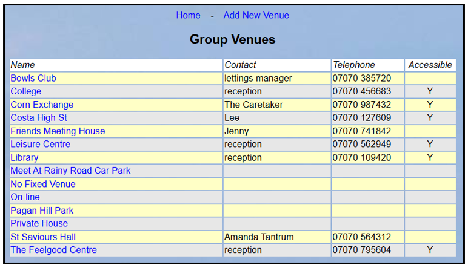
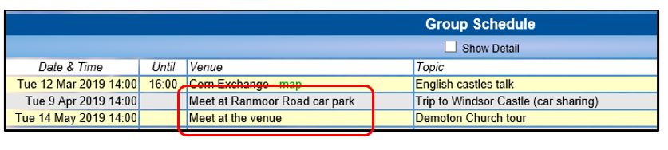
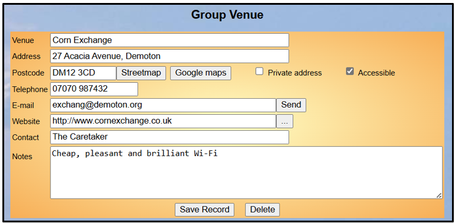
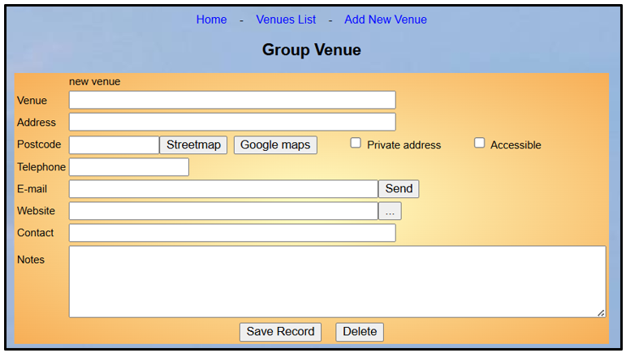

**5.7** **Group** **Venues**

> Back

Viewing the Venues List

Venues are required when creating Meetings and Events in **Group**
**Schedules** and the **Calendar**.

Click **Venues** on the Home Page to show a list of Group Venues:

Some groups may meet at one venue before travelling to a different
location. To deal with this, you may wish to create ‘meet at’ venues,
e.g. “Meet at the Railway station”.

“Meet at the venue” can be useful when a visit to a particular venue is
likely to be a one-off, or if your Group Leaders don’t have the
privilege to create Venues.

Viewing & Editing a Venue Record

Click a blue venue name on the Venues List to see the **Venue**
**Record**:

Press the buttons next to the Postcode to view a map of the venue in
either ***Streetmap*** or ***Google*** ***Maps***.

Press the **Send** button to send an email to the venue.

Press the **….** button to open the website of the venue.

After editing any of the fields press the **Save** **Record**

Press the **Delete** button to remove the venue from the Venues List.

Adding a New Venue

To create a new Venue Record, click **Add** **new** **venue** from the
**Venues** **List** or an existing **Venue** **Record**:

All fields in a Venue Record are optional except **Venue**.

**Private** **address** should be ticked if the venue is a private
residence or somewhere else for which the details should not be
displayed in the public domain (such as in online Group information).

**Accessible** may be ticked to indicate that the venue is fully
accessible for wheelchairs, etc.

Press the **Save** **Record** button to create the new Venue.

Revision History

||
||
||
||
