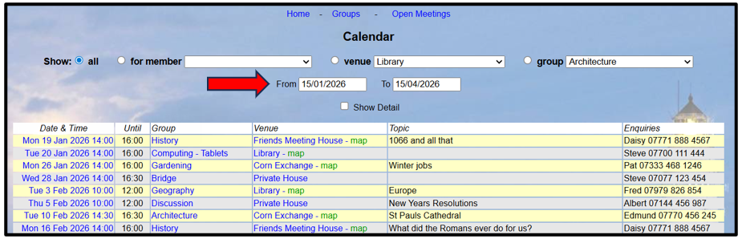
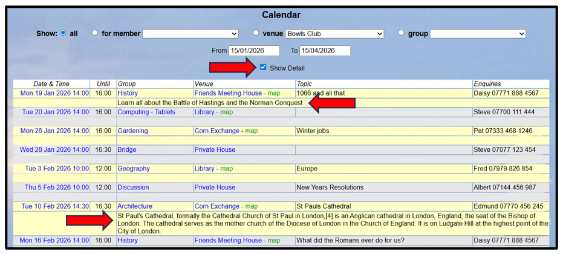
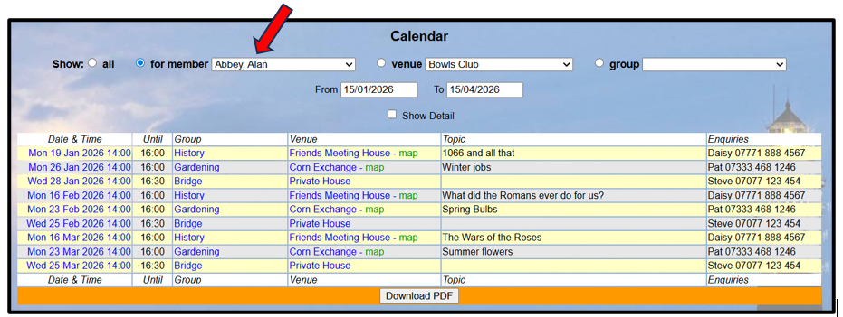
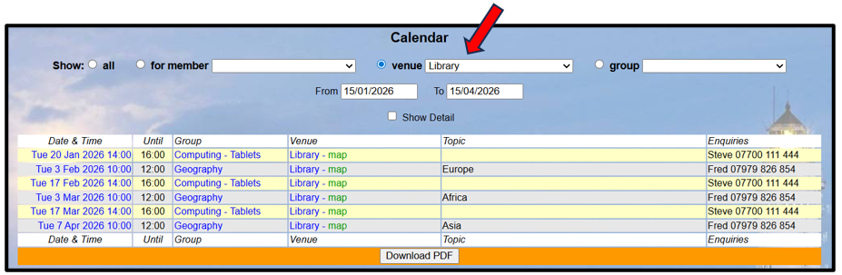
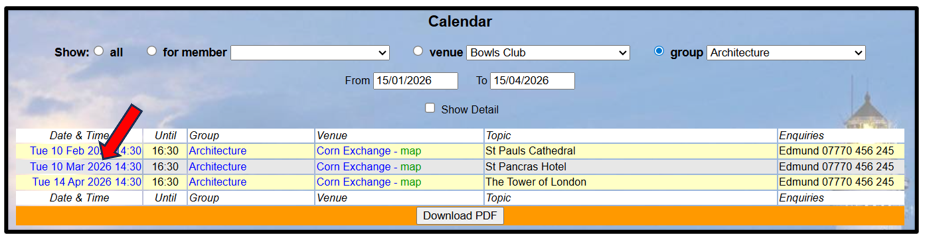
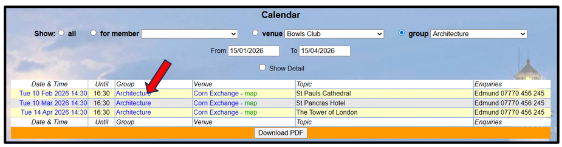
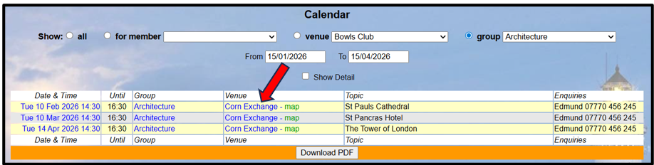
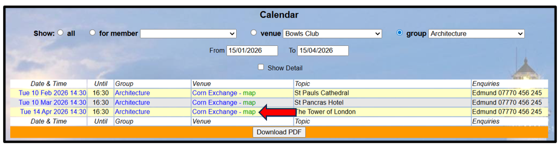
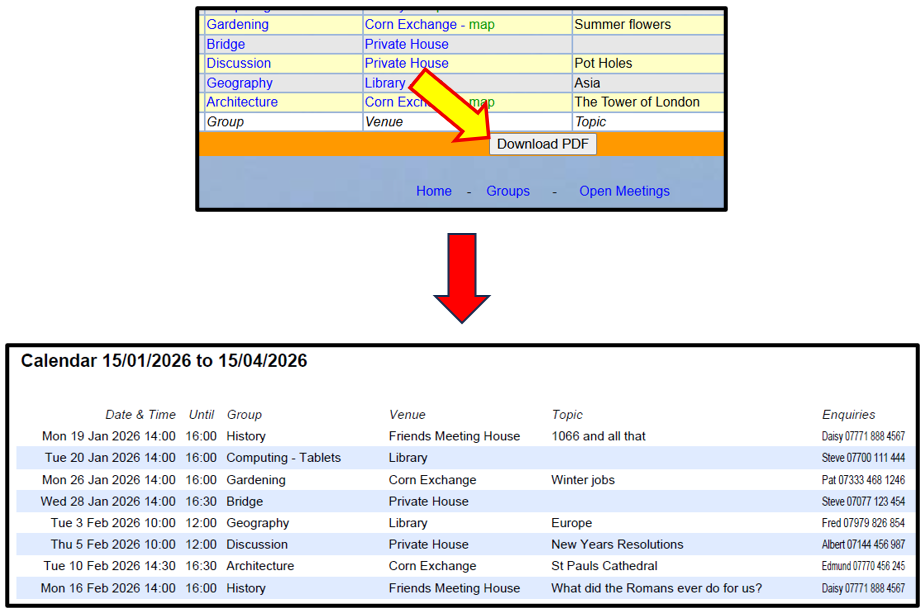
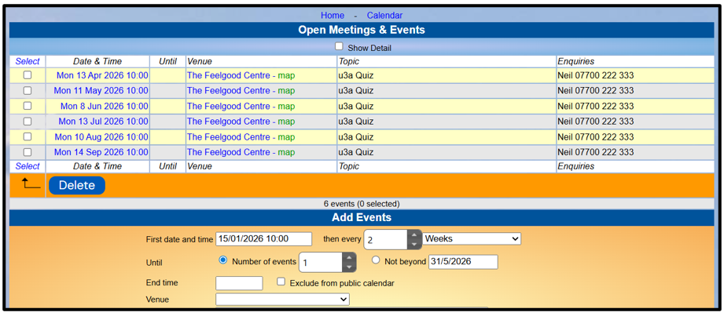

[u3a Beacon](https://u3abeacon.zendesk.com/hc/en-gb) \> [User
Guide](https://u3abeacon.zendesk.com/hc/en-gb/categories/360001240017-User-Guide)
\> [5.
Groups](https://u3abeacon.zendesk.com/hc/en-gb/sections/360002083037-5-Groups)
Search

**Articles** **in** **this** **section**

**5.9** **The** **Calendar**

>  style="width:0.41667in;height:0.41667in" /> style="width:0.15625in;height:0.15625in" />Graeme Bunting Follow 2
> months ago · Updated

Viewing the Calendar

The **Calendar** is a chronological list of meetings and events. All
events from the Group Schedules are incorporated automatically into the
calendar. In addition, it is possible to add ‘**Open**’ meetings.

*Note:* *The* *things* *that* *you* *can* *view* *and* *the*
*operations* *that* *you* *can* *perform* *may* *differ* *from* *those*
*described* *below,* *according* *to* *the* *System* *Access* *and*
*Privileges* *allocated* *to* *your* *Role* *by* *your* *U3A*
*Committee.*

The calendar shows events between the displayed dates, which defaults to
the next 3 months. You may change the dates in the **From** and **To**
fields:

By ticking **Show** **Detail**, you will see additional information if
this has been added to the Event:

>  style="width:1.125in;height:0.47892in" />**Help**

At the top of the page you can choose to:

> Show **all** **events** between the displayed dates, or
>
> Show events for groups that a chosen **Member** belongs to
>
>  style="width:7.02083in;height:2.29167in" />Show events that take place
> at a selected **Venue**
>
> You may go directly to an **Event** **Record** (to edit it) by tapping
> the event's date/time in the list style="width:7.02083in;height:1.83333in" /> style="width:7.02083in;height:1.83333in" /> style="width:7.02083in;height:1.78125in" /> style="width:7.02083in;height:1.85417in" />
>
> You may go to a **Group** **Record** by tapping the Group name
>
> You may go to a **Venue** **Record** by tapping the Venue name
>
> Where a Venue's postcode is recorded, a **map** link will display a
> map of the location in *Streetmap*
>
> Downloading the Calendar

Tap **Download** **PDF** at the bottom of the calendar to download the
displayed events.

Open Meetings

Open Meetings are those not related to a specific Group.

Tap **Open** **Meetings** at the top or bottom of the Calendar page to
open a list of open meetings. The display is similar to that for Group
Events ([see
5.3)](https://u3abeacon.zendesk.com/hc/en-gb/articles/360007367858-5-3-Group-Record-Schedule).

You may add, edit and remove Open Meetings in the same way as for Group
Events ([see
5.3](https://u3abeacon.zendesk.com/hc/en-gb/articles/360007367858-5-3-Group-Record-Schedule)).

Note that role privilege
**Group** **records** **(all)** is needed to make the **Open**
**Meetings** menu available. This is set by default for Group
Coordinator but not Group Leader.

Revision History

||
||
||
||

> Was this article helpful?
>
> Yes No
>
> 0 out of 0 found this helpful
>
> Have more questions? [<u>Submit a
> request</u>](https://u3abeacon.zendesk.com/hc/en-gb/requests/new)

Return to top

**Recently** **viewed** **articles** [5.8 Group
Faculties](https://u3abeacon.zendesk.com/hc/en-gb/articles/360007376138-5-8-Group-Faculties)

[5.7 Group
Venues](https://u3abeacon.zendesk.com/hc/en-gb/articles/360007304237-5-7-Group-Venues)

[5.5 Group Record:
Ledger](https://u3abeacon.zendesk.com/hc/en-gb/articles/360007367898-5-5-Group-Record-Ledger)

[5.3 Group Record:
Schedule](https://u3abeacon.zendesk.com/hc/en-gb/articles/360007367858-5-3-Group-Record-Schedule)

[4.9
Statistics](https://u3abeacon.zendesk.com/hc/en-gb/articles/360007304617-4-9-Statistics)

**Related** **articles**

[5.3 Group Record:
Schedule](https://u3abeacon.zendesk.com/hc/en-gb/related/click?data=BAh7CjobZGVzdGluYXRpb25fYXJ0aWNsZV9pZGwrCLJ8HNJTADoYcmVmZXJyZXJfYXJ0aWNsZV9pZGwrCEaJHNJTADoLbG9jYWxlSSIKZW4tZ2IGOgZFVDoIdXJsSSI%2BL2hjL2VuLWdiL2FydGljbGVzLzM2MDAwNzM2Nzg1OC01LTMtR3JvdXAtUmVjb3JkLVNjaGVkdWxlBjsIVDoJcmFua2kG--d04d09e8d70788e77682af2d17b837790199f16b)

[5.10 Dealing with a waiting
list](https://u3abeacon.zendesk.com/hc/en-gb/related/click?data=BAh7CjobZGVzdGluYXRpb25fYXJ0aWNsZV9pZGwrCCYV4tJTADoYcmVmZXJyZXJfYXJ0aWNsZV9pZGwrCEaJHNJTADoLbG9jYWxlSSIKZW4tZ2IGOgZFVDoIdXJsSSJFL2hjL2VuLWdiL2FydGljbGVzLzM2MDAyMDMxNzQ3OC01LTEwLURlYWxpbmctd2l0aC1hLXdhaXRpbmctbGlzdAY7CFQ6CXJhbmtpBw%3D%3D--b9ddd3afa21ec4d02913223e12ffbe0873186880)

[5.11 Groups for one-off
events](https://u3abeacon.zendesk.com/hc/en-gb/related/click?data=BAh7CjobZGVzdGluYXRpb25fYXJ0aWNsZV9pZGwrCOaOHNJTADoYcmVmZXJyZXJfYXJ0aWNsZV9pZGwrCEaJHNJTADoLbG9jYWxlSSIKZW4tZ2IGOgZFVDoIdXJsSSJDL2hjL2VuLWdiL2FydGljbGVzLzM2MDAwNzM3MjUxOC01LTExLUdyb3Vwcy1mb3Itb25lLW9mZi1ldmVudHMGOwhUOglyYW5raQg%3D--35b88da6a1c09b94ef5746fd5095f0310d5cc8bc)

[10.2.3 Viewing your
Calendar](https://u3abeacon.zendesk.com/hc/en-gb/related/click?data=BAh7CjobZGVzdGluYXRpb25fYXJ0aWNsZV9pZGwrCB0gdGhwCToYcmVmZXJyZXJfYXJ0aWNsZV9pZGwrCEaJHNJTADoLbG9jYWxlSSIKZW4tZ2IGOgZFVDoIdXJsSSJDL2hjL2VuLWdiL2FydGljbGVzLzEwMzc4MzkzNDI3OTk3LTEwLTItMy1WaWV3aW5nLXlvdXItQ2FsZW5kYXIGOwhUOglyYW5raQk%3D--4936070f0525153f2a3f94cd1bee42f6c1b8806d)

[4.2.1 Deleting Duplicate
Members](https://u3abeacon.zendesk.com/hc/en-gb/related/click?data=BAh7CjobZGVzdGluYXRpb25fYXJ0aWNsZV9pZGwrCBaE2NJTADoYcmVmZXJyZXJfYXJ0aWNsZV9pZGwrCEaJHNJTADoLbG9jYWxlSSIKZW4tZ2IGOgZFVDoIdXJsSSJFL2hjL2VuLWdiL2FydGljbGVzLzM2MDAxOTY5MDUxOC00LTItMS1EZWxldGluZy1EdXBsaWNhdGUtTWVtYmVycwY7CFQ6CXJhbmtpCg%3D%3D--d134f8a0e2d990119c16c8c78d1806e022425486)

**Comments** 0 comments

Please [<u>sign
in</u>](https://u3abeacon.zendesk.com/access?locale=en-gb&brand_id=360000694158&return_to=https%3A%2F%2Fu3abeacon.zendesk.com%2Fhc%2Fen-gb%2Farticles%2F360007371078-5-9-The-Calendar)
to leave a comment.

[u3a Beacon](https://u3abeacon.zendesk.com/hc/en-gb)

> [<u>Powered by
> Zendesk</u>](https://www.zendesk.co.uk/service/help-center/?utm_source=helpcenter&utm_medium=poweredbyzendesk&utm_campaign=text&utm_content=u3a+Beacon+Support)
