**6.** **Some** **tips** **when** **using**
**Beacon**

> Back

Videos

You will find a number of short explanatory videos within the Beacon
User Guide. [<u>Click for tips on how to get the
most</u>](https://u3abeacon.zendesk.com/hc/en-gb/articles/4414104898705)
[<u>from watching these
videos</u>](https://u3abeacon.zendesk.com/hc/en-gb/articles/4414104898705).

The following video demonstrates the tips that are described below, as
well as some additional information to help you find your way around the
Beacon system:

>  style="width:0.70833in;height:0.49975in" />[**Beacon** **Basic**
> **Tips** **v2**
> **2021-12-15**](https://www.youtube.com/watch?v=IafZ1R34RyM)

Links and Buttons

Words in blue are links which when clicked usually take you to a
different page. This will usually replace the current page. However, if
you hold down the **Ctrl** key when clicking a link or when pressing a
button, the new page will appear in a new tab. This is a very useful
facility and can be used to look up or edit other information without
closing the current page.

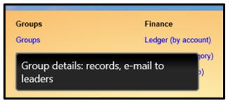If you are unsure what a link
or button does, hover the mouse over it and a ‘tooltip’ will often give
you an explanation. After a while tooltips close themselves. You can
speed this up by clicking on an empty part of the page.

Page Layout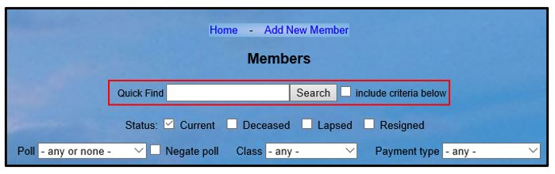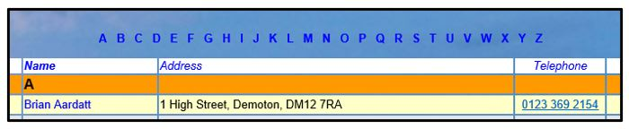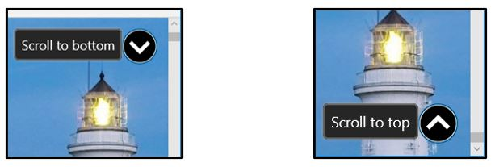

Links appear at the top of most pages and at the bottom of longer pages.
Clicking one of these links takes you to a different page (or sometimes
an empty record of the same type as the present page. Filters to change
the data that you see are usually near the top of a page, under the
links.

Table Lists

Many lists have the letters of the alphabet in a row above the list.
Clicking on one these letters will jump to the first item in the main
column (such as a member's surname or group name) starting with that
letter.

Clicking the large black arrows in circles in the top right and bottom
right corners of some pages will quickly scroll to the bottom and top of
the page.

Clicking the up and down arrows at the top of each section in some
tables will jump straight to the top or bottom of the table.

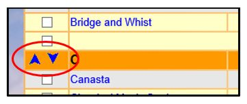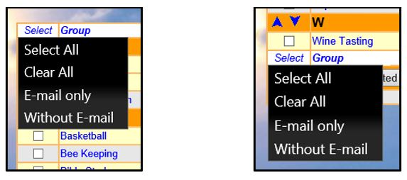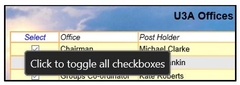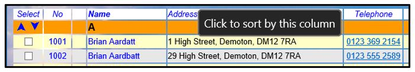

To select items in a table prior to performing an operation with the
selected members/groups, you may either tick the boxes in the **Select**
column individually or you may click the **Select** column header or
footer to bring up a sub-menu with various selection options, e.g.
members with or without email addresses.

In some tables, clicking the **Select** column header has a different
function - it will toggle the state of all the check boxes in the column
from ticked to unticked and vice-versa. The column tooltip will clarify
the function.

Some table lists have titles in the header row shown in blue. By
clicking on these links, the list will be reordered, sorted by the
selected column.

Drop-down Lists

If a drop-down list is long, you can jump quickly to the first entry
starting with any particular letter(s) by focusing the list (just click
on it) and then pressing the letter(s) on the keyboard.

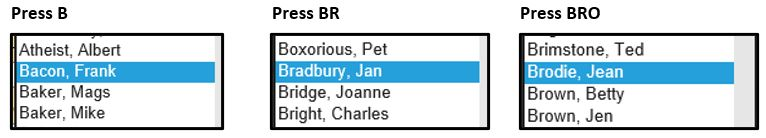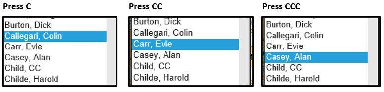

Successive presses of the same letter will step through the list one
entry at a time. This can sometimes be quicker than scrolling through
the list.

The order in which your drop-down lists are displayed can be changed in
your **Personal** **Preferences** ([<u>see
9.1</u>](https://u3abeacon.zendesk.com/hc/en-gb/articles/360007368098)).

Calendar Controls

Where there are fields in Beacon that require you to enter a date and
time, click in the field to display the ‘Calendar Control’.

> 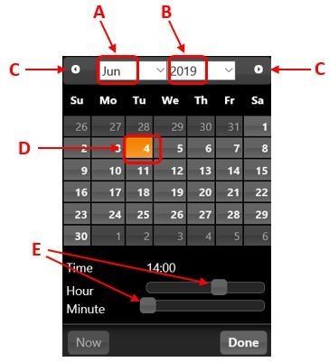 style="width:3.79167in;height:4.17708in" />Click on the drop-down
> lists to change the **Month** **\[A\]** and **Year** **\[B\]**,
>
> or use the right and left arrows **\[C\]** to go forward or back by
> one month at a time.
>
> Click to select the required **Day** **\[D\]**.
>
> The **Hour** and **Minute** can be changed by dragging the sliders
> **\[E\]** to the left or right.
>
> When the required date and time have been chosen, press the **Done**
> button.

**Revision** **History**

||
||
||
||
