**6.1.1** **Sending** **Emails**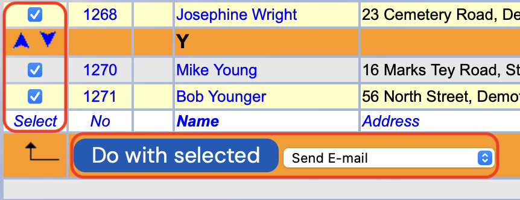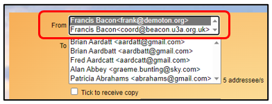

> Back

The video below gives guidance on sending emails.

*Note:* *the* *video* *was* *created* *in* *2022,* *so* *does* *not*
*include* *any* *of* *the* *enhancements* *made* *since* *then.*

> [**Sending** **email**
> **2022-06-22**](https://www.youtube.com/watch?v=z1WtX9D2ZVw)

To send an email

From any list of members, select the names that you wish to send an
email to.

Choose **Send** **E-mail** from the drop-down list below the table and
press the **Do** **with** **selected** button.

'From' and 'To' addresses

The **From** address is taken from your Member Record.

If you are also assigned to an **Office** [(<u>see
9.3</u>)](https://u3abeacon.zendesk.com/hc/en-gb/articles/360007368118-9-3-U3A-Officers),
the Office email address will also be displayed in the **From**
drop-down list and you can choose the address that you want to use.

The list of recipients is for information only, they cannot be changed
here. If you wish to remove or add recipients, you will need to cancel
the email by clicking your internet browser’s **back** arrow to return
to the previous page.

There is a tick box where you can select to receive a copy of the email,
although this is not necessary if you are one of the names selected in
the list of members. A copy sent to self by ticking the box will not
have the personalised details created from the **Tokens** described
below.

Composing the email

Enter a **Subject** for your message and then type your message in the
blank area below.

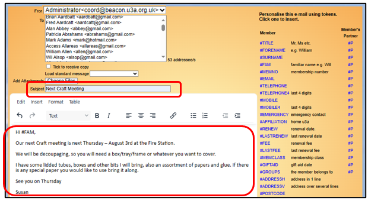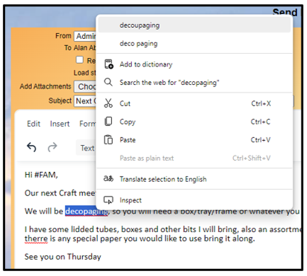

**<u>Spell Check</u>**

Potential spelling mistakes are underlined in red. Right clicking such a
word will bring up a sub-menu from which suggested alternative spellings
can be selected or the word can be added to the dictionary:

**<u>Line Spacin</u>g**

You can vary the line spacing in the message by using hard or soft
returns:

A Hard Return (using Enter) gives a full line space before the next line
of text.

A Soft Return (using Shift+Enter) will put the following words on a
separate line immediately below the preceding text.

**<u>Text Formatting</u>**

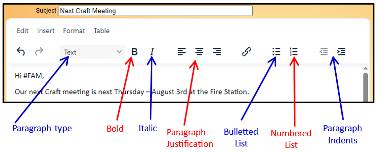Basic text formatting can be
done by highlighting the text and clicking the buttons above the main
body of the email:

Additional formatting is available via the **Edit**, **Insert**,
**Format** and **Table** sub-menus. These are similar to the options
available in word processor apps such as Microsoft
Word.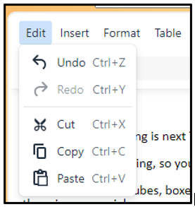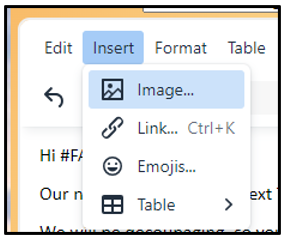

**<u>Edit menu</u>**

Here you can **Undo** the previous action or **Redo** the previous Undo.

**Cutting**, **Copying** and **Pasting** may not be available depending
on the type of browser that you are using – if not, you can use the
highlighted keyboard short cuts, such as pressing the **Ctrl** and **C**
keys at the same time to copy.

**<u>Insert menu</u>**

Here you can insert **Images**, **Hyperlinks**, **Emojis** and
**Tables**:

**<u>Format menu</u>**

Here you can change highlighted text to:

Bold, Italic, Underline

Strikethrough, Superscript, Subscript Change Font type and size

Change Text and Background Colour Change Text Alignment

Clear Formatting

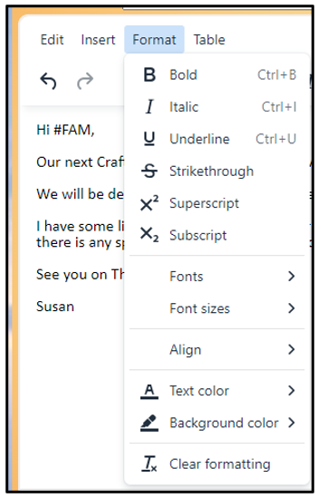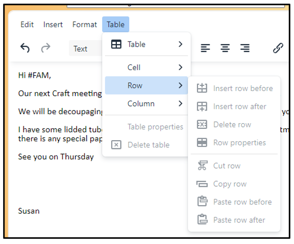

**<u>Table menu</u>**

Here you can:

Insert a new Table

Edit the Properties of an existing Table

Edit Cells, Rows and Columns in an existing Table

Tokens

Clicking the blue links on the right side of the browser will insert a
**Token** that can be used to personalise your email. For example,
**\#FAM** customises every email with the member’s **Familiar**
**Name**. Some Tokens have **Partner** **versions** that are shown as
**\#P** to the right of the main Token.

Tokens can be typed directly in the text and are not case sensitive,
i.e. \#FAM, \#fam, \#Fam, \#fAM, etc. will all work.

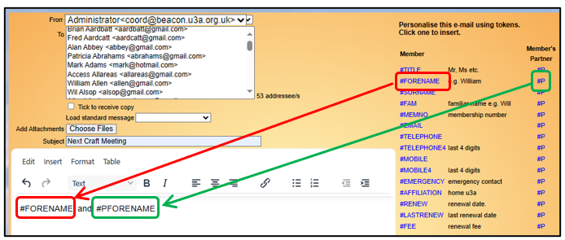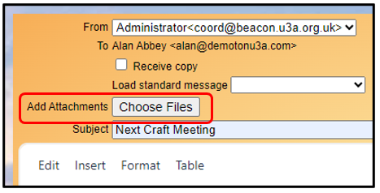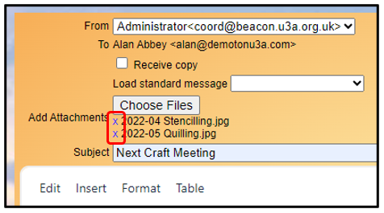

**Tips:-**

On most occasions you will use the Tokens on the **right** side of the
lists **not** **the** **\#P** **ones**. Tokens also work in the subject
line

Be aware some Tokens disclose personal data such as **\#TELEPHONE**

**\#FORENAME** will only use the **first** **name** in the field. If you
use **\#FAM** and there is no Familiar Name for the member it will
include all the names in the Forename field.

Be aware that where there is no partner the partner versions of tokens
will be replaced with blank text. For example, avoid 'Dear **\#FAM** and
**\#PFAM**,'. Consider something like 'Dear **\#FAM**, **\#PFAM'**
instead.

There is a list of all available Tokens with an explanation of what they
do at the end of this article.

Attachments

If you wish to send one or more attachments with the message, press the
**Choose** **Files** button (the format may vary between browsers) and
select each file in turn:

To remove a file from the message, click on the small **X** before the
filename:

The ‘Choose Files’ button may be replaced by a box to click in when
using Apple computers and some types of tablet or smart phone.

It is recommended that attached files don’t have long names or names
that contain special characters such as brackets because these can
sometimes cause delivery problems.

There is no practical limit to the number of attachments you can send
with Beacon, but many email servers impose limits on the number or size
of attachments that recipients can receive. It is wise, therefore, not
to send more than a few attachments with any one message and to minimise
attachment size. Also, to reduce the likelihood of emails being flagged
as spam, it is recommended that attachments are not used when sending to
a large number of recipients (over 50).

There is an absolute total limit of 20MB that can be uploaded. If this
is exceeded the error message is “*413* *Request* *Entity* *Too*
*Large*”.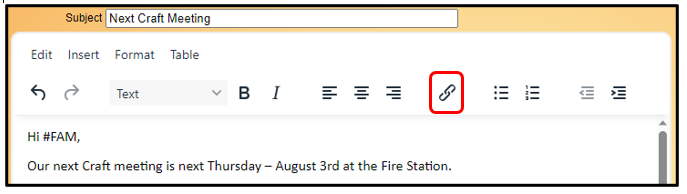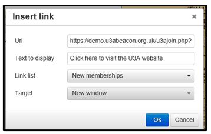

External Links

To include a link to a website in your message, put the cursor at the
position where the link is required and click the **Chain** icon in the
top menu or in the **Insert** sub-menu:

In the resulting dialog box, enter the full website **URL** (including
the http or https prefix) and the **Text** **to** **Display** in the
email (this should be a meaningful description of the webpage you are
linking to, rather than a copy of the URL).

By selecting from the **Link** **list**, you can insert the following
links if they are configured for your u3a ([<u>see 9.4 Public
Links</u>](https://u3abeacon.zendesk.com/hc/en-gb/articles/360007304537)).

**Renewals** for a link to the Members Portal sign in page from where
the member will be able to sign in to the Portal and renew their
membership if it is during the membership renewal period and your u3a
has enabled online renewals ([<u>see 10.2.1 Online
Renewals</u>](https://u3abeacon.zendesk.com/hc/en-gb/articles/360007368158)).

**New** **Memberships** for a link to the New Membership application
page ([<u>see 10.1 Online
Joining</u>](https://u3abeacon.zendesk.com/hc/en-gb/articles/360007304577)).
This can be useful for forwarding on to prospective new members.

**Groups** for a link to the public version of your u3a's Groups List

**Calendar** for a link to the public version of your u3a's Calendar

Sending the Email

When the email is ready to go, click the **Send** button.

Sometimes you may be presented with a **CAPTCHA** screen (Completely
Automated Public Turing Test to tell Computers and Humans Apart) which
will ask you to tick a box to demonstrate that you are not a robot.

For additional recommendations about sending emails see [<u>6.1.5 Tips
for Sendin</u>g <u>Emails from
Beacon</u>.](https://u3abeacon.zendesk.com/hc/en-gb/articles/360007431577)

As a result of changes to Cloudflare who front some of the Beacon
operations have just introduced new more stringent rules around
attachments. This means that when sending an email you may see a
Cloudflare message and sometime a Captcha verification test.

*Note:* *a* *user* *can* *exceed* *their* *Beacon* *timeout* *period*
*(which* *defaults* *to* *20* *minutes)* *while* *composing* *a* *long*
*email.* *If* *the* *user* *clicks* *to* *send* *after* *their*
*timeout* *is* *exceeded,* *Beacon* *still* *sends* *the* *email* *but*
*as* *soon* *as* *the* *user* *navigate* *to* *the* *Home* *page* *they*
*timeout.*

Sending email with a secondary email address

When Beacon is used to send an email then the "From" address will be the
email address held in the sender's Member Record. If a receiver of the
email replies it will automatically be dispatched to this
address.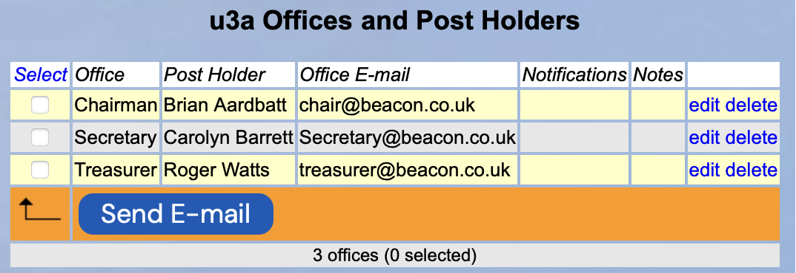

Some u3a's will have registered a domain (e.g. demotonu3a.org.uk) and
operate email addresses such as memsec@demotonu3a.org.uk. Others create
secondary addresses like memsecdemotonu3a@gmail.com. These addresses can
be set up in Beacon by adding **u3a** **Officers**.

In this example, when the Chair sends an email from Beacon they will see
a drop-down list for the **From** entry enabling them to select either
their personal email or the Chair's email chair@demotonu3a.org.uk

While this section is called **u3a** **Officers** it has no formal
status. There is no reason why Group Leaders/Conveners can't be put in
the **u3a** **Officers** section with an **Office** **E-mail** of their
choice.

Email Delivery

You can check upon the progress of emails sent by clicking **Email**
**delivery** on the Home page as described in [<u>section
6.1.3</u>.](https://u3abeacon.zendesk.com/hc/en-gb/articles/360007318757)

List of Tokens

||
||
||
||
||
||
||
||
||
||
||
||
||
||
||
||
||
||
||
||
||
||
||
||
||
||

||
||
||
||
||
||

Revision History

||
||
||
||
||
||
||
||
||
||
||
||
||
||
||
||
||
||
||
||
