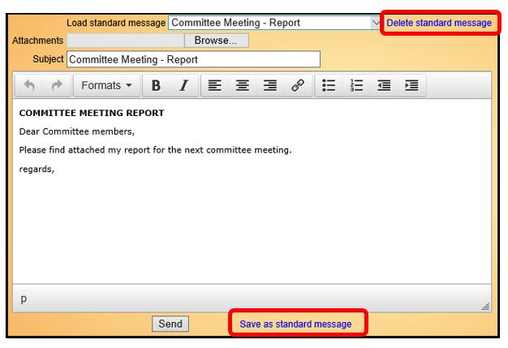
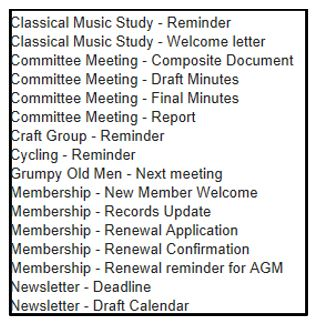

**6.1.2** **Standard** **Email**
**Messages**

> Back

If you send similar messages regularly they can be saved as standard
message templates and recalled for use again later. In that way you do
not have to compose them each time.

To create a standard message, compose the message and then click on
**Save** **as** **standard** **message**.

When saving, you will be asked to give the message a name. Your u3a
should specify a standard naming convention to make it easier to find
Standard Messages in the **Load** **Standard** **Message** drop-down
list.

Note that attachments and images are not saved, only the text of the
message.

To re-use a standard Message, select from the **Load** **standard**
**message** drop-down list. You may edit the message before sending it
(that does not affect the template).

Old Standard Messages that are no longer required should be deleted to
keep the list tidy (select it in the drop-down list and click on
**Delete** **Standard** **Message**).

Email Footers and Unsubscribing from Emails

Beacon does not have a facility for unsubscribing from receiving emails,
so you may wish to consider including some text as a footer at the end
of your Standard Messages giving details of who to contact should a
member wish to unsubscribe.

Such a footer could also be used for showing your u3a's Charity Number,
names of key officers or who to contact for further information.

Templates for Copying

The text below can be copied and pasted when creating Standard email
templates for **New** **Member** **Welcome** and **Renewal**
**Confirmation**:

**WELCOME** **TO** **(***add* *your* *u3a* *name***)** **u3a**

Dear \#FAM,

We would like to welcome you as a new member of \#U3ANAME.

Please check that your details shown below are correct and let us know
by return email if any changes are required or if there is any
additional information that can be added.

You can find out more about \#U3ANAME on the **<u>xxx website (add
link)</u>**

If you go to the **<u>xxx page in the website (add link)</u>** you will
see details of how you can log in to the **Members** **Portal** where
you can update your personal details and view additional Groups &
Calendar information that is not available to the general public.

We look forward to seeing you at our future meetings and events,

Best regards,

The Membership Team

\#U3ANAME

**-----------------------------------------------------**

**Name:** \#TITLE \#FORENAME \#SURNAME

**Familiar** **name:** \#FAM

**Address:** \#ADDRESSV

**Email** **address:** \#EMAIL

**Home** **phone:** \#TELEPHONE

**Mobile** **Phone:** \#MOBILE

**Emergency** **Contact:** \#EMERGENCY

**Membership** **number:** \#MEMNO

**Affiliation:** \#AFFILIATION

**Membership** **Class:** \#MEMCLASS

**Membership** **Renewal** **Date:** \#RENEW

**MEMBERSHIP** **RENEWAL** **CONFIRMATION**

Dear \#FAM,

Thank you for renewing your membership of \#U3ANAME. Please check the
details about you below and let us know by return email if any changes
are required or if there is any additional information that can be
added.

Best regards,

The Membership Team \#U3ANAME

**-----------------------------------------------------**

**Name:** \#TITLE \#FORENAME \#SURNAME

**Familiar** **name:** \#FAM

**Address:** \#ADDRESSV

**Email** **address:** \#EMAIL

**Home** **phone:** \#TELEPHONE

**Mobile** **phone:** \#MOBILE

**Emergency** **contact:** \#EMERGENCY

**Membership** **class:** **\#MEMCLASS**

**Membership** **number:** \#MEMNO

**Affiliation:** \#AFFILIATION

**Next** **renewal** **date:** \#RENEW

**Revision** **History**

||
||
||
||
||
