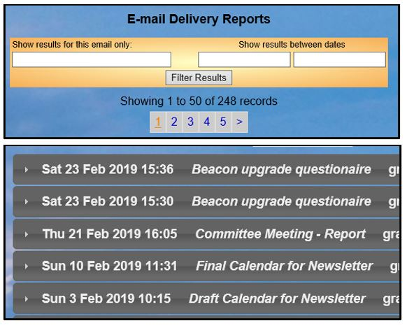
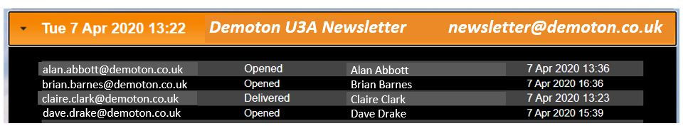

**6.1.3** **Email** **Delivery**

> Back

You can check upon the progress of emails sent by clicking **Email**
**delivery** on the Home page

A list is displayed of the last 50 messages sent by you (or by all users
in the case of a Site Administrator).

Earlier messages can be seen by clicking in the block of blue numbers or
the list can be filtered between specific dates and times. Site
Administrators may also search for emails sent to a specific email
address.

Click to check the status of
an individual message. A list of all recipients will be displayed
showing the message status for each of them

Delivery statuses

**Despatched** **by** **Beacon**

The message has been sent to our email agent.

**Processed**

The message has been received by our email agent but not yet forwarded
on.

**Invalid**

An invalid status occurs when our mail agent believes the email address
is formatted in a manner that does not meet Internet email format
standards. Examples include addresses that include certain special
characters and/or spaces.

It can also mean the email does not exist on the recipient's mail
server, although most mail servers will respond with **Bounced**.

**Deferred**

Our email agent is unable to establish communication with the
recipient's email provider in order to forward the message on. The
sending of Deferred messages is automatically retried at intervals over
a day or more until repeated failures cause the message to be rejected.

**Dropped**

The message has been rejected by our email agent. This is either because
the email address was in an invalid format, or because a previous email
to this address was Bounced or Reported as Spam. Such an email address
is blocked (blacklisted) by our email agent and can only be unblocked by
your Site Administrator.

**Delivered**

The message has been accepted by the recipient's email provider, though
it may have gone to the recipient’s spam folder rather than their inbox.
Note that some email providers may silently bin the email without
delivering it to a spam folder if the software guesses it is probably
spam. Hotmail is particularly fierce in this regard.

**Bounced**

Our email agent distinguishes two sorts of delivery error. One it calls
‘Bounced’ and the other ‘Blocked’. Bounced means that the message has
been rejected by the recipient's email provider, usually because the
address is incorrect, disabled or no longer valid. The error message
returned is displayed in red and should be examined. Invalid email
addresses should be removed from Beacon.

**Blocked**

Also called "Soft Bounce" by many people. For example MailChimp says:

*Soft* *bounces* *typically* *indicate* *a* *temporary* *delivery*
*issue* *to* *an* *address* *and* *are* *handled* *differently* *than*
*hard* *bounces.* *While* *there* *are* *many* *reasons* *an* *email*
*address* *may* *soft* *bounce,* *below* *are* *some* *common* *reasons*
*this* *could* *happen:*

Mailbox is full (over quota).

Recipient email server is down or offline (an example is orange.net
which is no longer an active mail system) Email message is too large.

Our email agent thinks that a ‘Block’ may be only temporary and does not
add the recipient's address to the blacklist, so the email unblocker
does not work these emails. Beacon doesn't email the sender and the Site
Administrator about blocked emails but does flag them up in the email
delivery log.

**Reported** **as** **SPAM**

Reported by the recipient or their mail software as spam or junk email.
This does not necessarily mean the recipient doesn't see the email.

**Opened** and **Clicked**

Since March 2021 these statuses are no longer supported. This tracking
of emails is not considered GDPR best practice and reliability varies
depending on the recipients email settings and their ISP.

On historical logs Opened means the recipient read the email and viewed
images. Clicked means a url link in the email was opened.

Blacklisted Email Addresses

Some delivery failures result in the email address being **blacklisted**
– both the sender and the System Administrator will be notified by email
when this happens. No further Beacon emails can be sent to the recipient
until the address is verified as being correct and ‘unblocked’ by the
System Administrator as described in [**<u>section
6.1.4</u>**.](https://u3abeacon.zendesk.com/hc/en-gb/articles/360007380498-6-1-4-Email-Unblocker)

The Beacon email agent

Beacon uses a commercial email agent called ***SendGrid*** to dispatch
messages and to provide details about progress.

Beacon has a dedicated IP address so that messages are not rejected
because of misuse of the system by another party. However, all u3as
using Beacon share this dedicated IP address, and a transgression by a
user of one u3a could still affect everyone else.

Therefore all u3as must ensure that the system is used responsibly and
in particular ensure that messages that could be construed as spam are
not sent. Click for tips about [**<u>6.1.5 Email tips, duplicates and
sender
issues</u>**](https://u3abeacon.zendesk.com/hc/en-gb/articles/360007431577)
[**<u>sending</u>**](https://u3abeacon.zendesk.com/hc/en-gb/articles/360007431577-Tips-for-Sending-Emails-from-Beacon).

Recognising emails sent by Beacon

All messages sent by Beacon have a 'From' address of
**noreply@u3abeacon.org.uk** and recipients will see them as having come
from (for example) **John** **Smith** **via** **MyTown** **u3a**.

Replying to emails sent by Beacon

Ordinarily, recipients can reply directly to the sender (such as by
pressing a 'Reply' button) as the 'Reply-To' header in the email is set
to the user's own address. However, a few mail programs may not do this.

Monitoring delivery progress

As well as monitoring the delivery log as described above, where
messages have bounced, been dropped or are the subject of spam reports,
an email will be sent to the sender and to the Site Administrator naming
the offending email address and describing why the address has been
blacklisted.

**All** **message** **failure** **reports** **should** **be**
**treated** **seriously**. Rejected email addresses should be verified,
(most of them are simple spelling errors) and corrected or removed from
Beacon as soon as possible if not proven to be valid.

Rejected addresses are added to a **Blacklist** and any further attempt
to send to these addresses will be rejected (with a 'dropped' error).
Your Site Administrator is able to remove an email address from the
blacklist once it has been demonstrated to be a genuine address.

You can check upon the progress of emails sent, to see if they have been
delivered but as noted above this does not imply they have been opened
and read, or indeed been passed to the recipient by their email
provider.

Particularly when sending a message to many members, a check should be
made that they have not bounced due to invalid email addresses that do
not comply with the SMTP format of userid@domain and top level domain.
Common causes are:

Userid - no userid, userid too long, userid uses unsupported special
characters or the rules for the use of special characters have been
broken.

No '@' separating userid and domain.

Domain - No Domain, no top level domain or missing separator '.' between
domain and top level domain.

Undeliverable emails

Sometimes the email agent that is used by Beacon (***SendGrid***) is not
able to deliver an email. There are five ways that this may be shown
(more details above):

> **Bounced:**
>
> **SpamReport:**
>
> **Blocked/expired:**
>
> **Dropped:**
>
> **Delivered:**

Bounced as undeliverable

Reported by the recipient or their mail software as spam (but sometimes
the recipient still sees the email)

Not been able to be delivered by our mail agent

Dropped by our mail agent

> Silently dropped by the recipient's mail server as likely to be spam

The first four are reported back to Beacon and shown in red on the email
delivery reports.

The fifth is undetectable and will be reported as delivered. Only the
first two cause the Beacon mail agent to "**blacklist**" the recipient
email address, and whilst blacklisted, further emails to that address
will be dropped by *SendGrid*.

In all four detectable undeliverable cases, Beacon will send an email
message back to the sender and to the Site Administrator, explaining the
type of error, and including the reporting system error code. The email
will typically say:

The message to *\[member* *name\]* *\[email* *address\]* from u3a Beacon
*\[site* *name\]* on date *"yyyy-mm-dd"* at time *"hh:mm:ss"* with
subject "*xxxxx*" has been dropped by our mail agent.

The error report is:

*'Spam* *Reporting* *Address'*

A dropped error often indicates that the address is blacklisted due to a
bounce or spam report rejection of an earlier email to this address.
Your Beacon Site Administrator will have been notified of such
rejections and is responsible for dealing with them.

Receiving emails and email providers

This information may help your members using popular email providers
receive Beacon emails reliably.

Beacon emails are sometimes flagged as Spam by your email provider and
may go into your Spam or Junk folder. This can usually be dealt with by
right clicking and picking from the available options like **Not**
**spam** or **Never** **block** **sender**. This will add the sender’s
email address to a **Safe** **Senders** **List** and stop future emails
from that sender going into Spam or Junk folders.

Please Note that before following this advice you should refer to the
guidance on Beacon e-mail appears to have been sent by the wrong person
here: [6.1.5 Email Tips, duplicates and sender
issues](https://u3abeacon.zendesk.com/hc/en-gb/articles/360007431577)

Members should also check that the sender’s email address is not on a
**Banned** **Senders** **list**.

The method of changing Junk/Spam settings varies depending on who the
email provider is and whether it is accessed via a website or via an
email application such as Microsoft Outlook. Details for some of the
more commonly used email providers and applications are shown below.

Apple Products

There are no junk mail settings on iPads, iPhones and Macs apps, or at
least those supplied by Apple by default. Users need to log in via their
email provider’s website and adjust the settings there.

The situation is similar for **Android** smartphones and tablets.

Outlook.com (including Hotmail)

Log in to Outlook.com and have a look in your **Junk** **mail**
**folder**. If there are any u3a emails in there right-click the email
and choose **Not** **junk**. The email will be moved to your inbox.

Click on the gear wheel icon (top right) to open the **Settings** menu
and click **Options**. Under Junk email, click **Blocked** **senders**.
If there are any u3a addresses in the list, select them and then click
the dustbin icon to remove them from the Blocked Senders list.

Click **Safe** **Senders** (under Junk email). Type
*noreply@u3abeacon.org.uk* in the box and click on the plus sign to add
that email address to the Safe Senders list.

Sky/Yahoo Email

If an email arrives in the Spam folder, click **More** (or right click)
followed by **Not** **spam**. This will move the email to the Inbox.

To check what is on your Banned Addresses list, click the gear (cog)
icon, followed by **Settings** and then **Banned** **addresses**.

Microsoft Outlook

If an email arrives in in the Junk folder, right click and select
**Junk,** followed by **Not** **Junk**.

This will move the email to the inbox and advise you that

“*Outlook* *will* *not* *block* *future* *emails* *from*
*noreply@u3abeacon.org.uk*”.

Alternatively, you can click the Junk icon in the top menu or right
click the email and select either **Never** **block** **sender** or
**Never** **block** **sender’s** **domain**.

To add the u3a email address to your safe senders list, click the
**Junk** icon in the top menu, followed by **Junk** **email**
**options**. Click the **Add** button on the Safe senders tab and enter
*noreply@* *u3abeacon.org.uk* in the box.

**Revision** **History**

||
||
||
||

||
||
||
||
||
