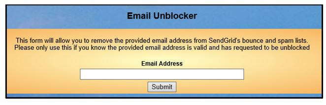

**6.1.4** **Email** **unblocker**

> Back

The Email unblocker utility is accessible only to the Site Admin on the
Home page. Note that only one System Administrator can be the Site Admin
as indicated by a YES in column 4 of the [System
Users](https://u3abeacon.zendesk.com/hc/en-gb/articles/360007368078)
page.

Beacon emails are delivered by SendGrid, a specialist email service
provider. The "unblocker" allows removal of the provided email address
from SendGrid's bounce and spam lists. Please only use this if you know
the provided email address is valid and the owner has indicated that it
can be "unblocked".

Note that if an email appears in in the E-mail delivery report (rather
confusingly) as "Blocked" then it is quite likely the problem is
temporary and SendGrid will try sending the email again at intervals for
72 hours. In this case check the log at a later time before using the
"unblocker" utility.

Enter the email address reported as bounced/spam and a confirmation
message will be displayed to confirm that the email address is not in
the bounce or spam lists.

Do check that the email address is typed correctly - copy/paste is
recommended. Beacon does not check that the email exists in your u3a's
data.

**Revision** **History**

||
||
||
||
