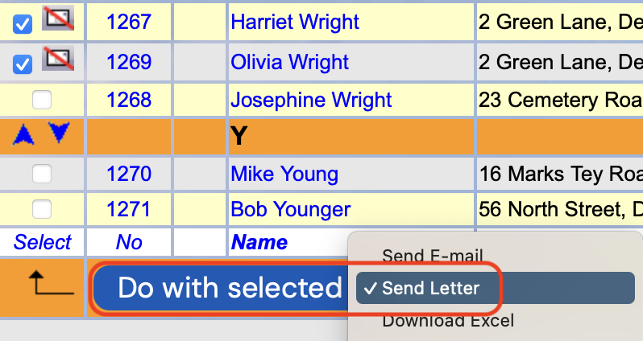
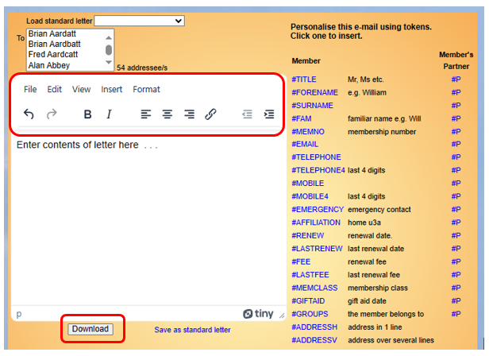

**6.2.1** **Composing** **Letters**

> Back

From any list of members, select the ones that you wish to create a
Letter for. Choose **Send** **Letter** from the drop-down list below the
table and press the **Do** **with** **selected** button.

Basic text formatting can be done using the buttons above the main body
of the Letter.

The list of recipients is for information only, they cannot be changed
here. If you wish to remove or add recipients, you will need to cancel
the letter by clicking your internet browser’s **back** arrow to return
to the previous page.

The **Tokens** listed on the right side of the browser can be used in
the text to personalise the letter, as described in the **Email**
section ([<u>see
6.1.1</u>)](https://u3abeacon.zendesk.com/hc/en-gb/articles/360007380438-6-1-1-Sending-Emails).

Website links can be inserted by clicking the **Chain** icon, as
described in the **Email** section [(<u>see
6.1.1</u>](https://u3abeacon.zendesk.com/hc/en-gb/articles/360007380438-6-1-1-Sending-Emails)).

You can vary the line spacing in the letter by using hard or soft
returns:

A Hard Return (using Enter) gives a full line space before the next line
of text.

A Soft Return (using Shift+Enter) will put the following words on a
separate line immediately below the preceding text.

You can vary the font size of any part of the letter including \#TOKENS
by selecting Format/Font size and choosing the required size.

After you have finished composing the letter press **Download** to
generate the letters in a pdf file (one page per member).

Standard Letter Templates

If you create letters regularly they can be saved as standard templates
and recalled for use again later as described in [<u>section
6.2.2</u>](https://u3abeacon.zendesk.com/hc/en-gb/articles/360007380578-6-2-2-Standard-Letters).

**Revision** **History**

||
||
||
||
||
