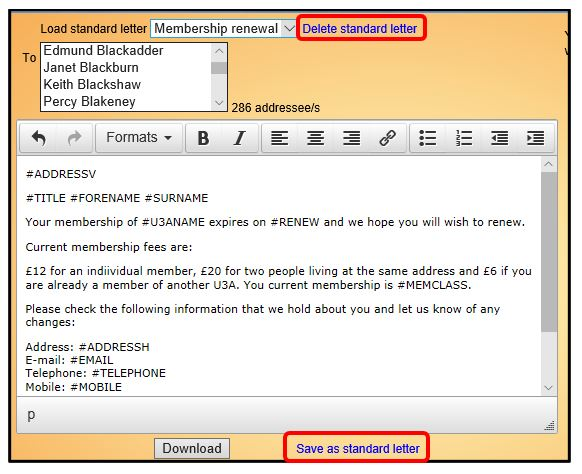

**6.2.2** **Standard** **Letters**

> Back

If you create letters regularly they can be saved as standard templates
and recalled for use again later. In that way you do not have to compose
them each time.

To create a Standard Letter, compose the letter and then click on
**Save** **as** **standard** **letter**. Your U3A should specify a
standard naming convention to make it easier to find Standard Letters in
the **Load** **Standard** **Letter** drop-down list.

To re-use a Standard Letter, select it from the **Load** **standard**
**letter** drop-down list. You may edit the Letter before downloading it
(that does not affect the template).

To remove a Standard Letter, select it from the drop-down list and click
**Delete** **standard** **letter**.

Template for Copying

A Standard Letter template for a **Membership** **Renewal** **Form**
that can be copied and pasted into Beacon can be found in [**<u>6.1.2
Standard Email
Messages</u>**](https://u3abeacon.zendesk.com/hc/en-gb/articles/360007318777)

**Revision** **History**

||
||
||
