[u3a Beacon](https://u3abeacon.zendesk.com/hc/en-gb) \> [User
Guide](https://u3abeacon.zendesk.com/hc/en-gb/categories/360001240017-User-Guide)
\> [7.
Finance](https://u3abeacon.zendesk.com/hc/en-gb/sections/360002102798-7-Finance)
Search

**Articles** **in** **this** **section**

**7.1** **Financial** **Ledger**

>  style="width:0.41667in;height:0.41667in" /> style="width:0.15625in;height:0.15625in" />Graeme Bunting Follow 1
> month ago · Updated

*Note:* *The* *information* *on* *this* *page* *reflects* *Beacon*
*functionality* *for* *u3a's* *that* *have* *not* *enabled*
*"**Opening*** ***Balance*** ***for*** ***Groups"*** *or*
*"**Refunds"**,* *which* *are* *described* *on* *the* *following*
*pages:*

> [*7.10.6 Opening Balance for
> Groups*](https://u3abeacon.zendesk.com/hc/en-gb/articles/19232714658461)
>
> [*7.10.7
> Refunds*](https://u3abeacon.zendesk.com/hc/en-gb/articles/21268054883613)

a\) Overview of the Ledger

Beacon's Financial Ledger is a collection of transactions showing all
monies received or paid. All transactions are associated with an
**Account**. These can mirror bank account(s), PayPal accounts, Cash in
hand or be transitory accounts to represent unbanked cheques and cash.
Refer to [7.10
Financial](https://u3abeacon.zendesk.com/hc/en-gb/articles/360007368058)
[Approaches](https://u3abeacon.zendesk.com/hc/en-gb/articles/360007368058)
for guidance on how to configure your Beacon Accounts.

All Transactions are assigned to one or more **Financial**
**Categories** in order to group together similar expenditure and income
for analysis and reporting.

The **Ledger** may be displayed by **Account**, **Category** or
**Group** by selecting the appropriate option on the Home Page. All
options produce a similar listing. The **Account**, **Category** or
**Group** is selected at the top of the page together with the Financial
Year. By default, the current financial year is shown. The Ledger may be
sorted by clicking any of the column headings that are in blue text.

*Note:* *While* *any* *Transaction* *can* *be* *associated* *with* *a*
*Group,* *the* *Transactions* *in* *the* *main* *Ledger* *described*
*below* *are* *completely* *separate* *to* *those* *in* *the*
*individual* *Group* *Ledgers* *[(see 5.5 Group Record:
Ledger](https://u3abeacon.zendesk.com/hc/en-gb/articles/360007367898)).*

b) Ledger by Account

Click **Ledger** **(by** **account)** on the Home page:

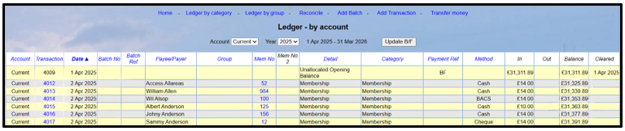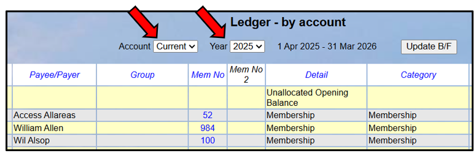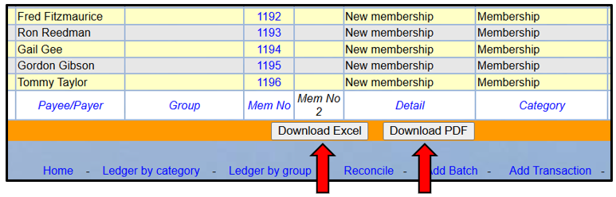

Choose the **Account** and the **Year** to be viewed.

To download the Ledger in **Excel** or **pdf** format, click one the
appropriate button below the table:

There are example Excel and pdf downloads at the bottom of this page.

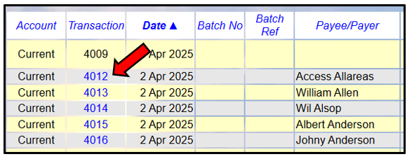Click a **Transaction**
**number** in the left column to view details of the Transaction:

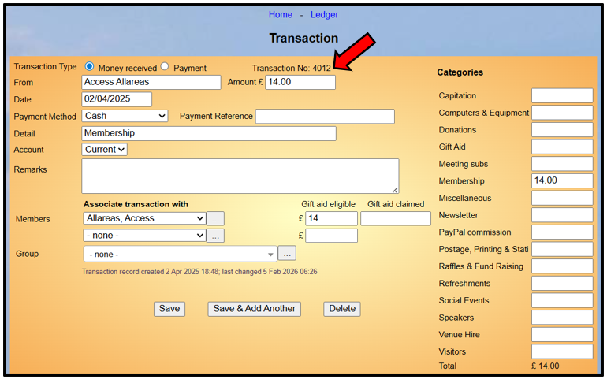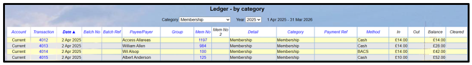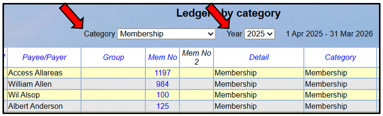

c\) Ledger by Category

Click **Ledger** **(by** **category)** on the Home page:

> Choose the **Category** and the **Year** to be viewed:

The operations available from the **Ledger** **by** **Category** page
are similar to those described above for **Ledger** **by** **Account**.

d\) Ledger by Group

Click **Ledger** **(by** **group)** on the Home page:

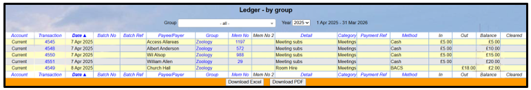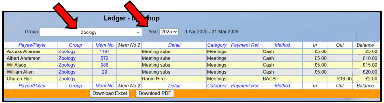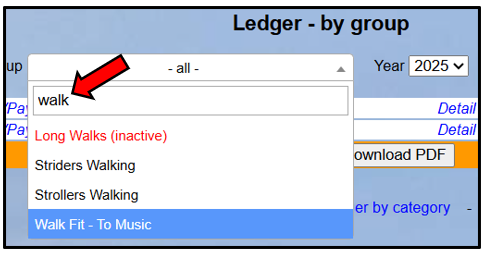

> Choose the **Year** to be viewed and the **Group** (or select **all**
> to see all Groups):

The **Group** drop-down list is searchable - for example Typing "Walk"
will filter the list to only show Groups that contain the letters
"walk".

Inactive Groups are shown in red with a suffix (inactive).

The operations available from the **Ledger** **by** **Group** page are
similar to those described above for **Ledger** **by** **Account**.

*Note:* *While* *the* ***Ledger*** ***by*** ***Account*** *and*
***Ledger*** ***by*** ***Category*** *pages* *are* *typically* *only*
*available* *to* *Treasurers,* *the* ***Ledger*** ***by*** ***Group***
*page* *can* *be* *viewed* *(but* *not* *edited)* *by* *any* *Group*
*Leader* *that* *has* *been* *given* *the* *privilege* *to* *view*
***Group*** ***Ledger*** ***(as*** ***Leader)**.*

*Group* *Leaders* *can* *only* *view* *transactions* *related* *to*
*the* *groups* *for* *which* *they* *are* *the* *Leader.*

e\) Updating the Brought Forward

When the financial year rolls over, a **Brought** **Forward** for each
account is calculated automatically by Beacon. However, it could be that
at the end of a financial year not all of last year's Transactions have
been entered, or it may be necessary to subsequently change one or more
Transactions in the previous year.

To update the Brought Forward amount, press the **Update** **B/F**
button at the top of the Ledger by account page.

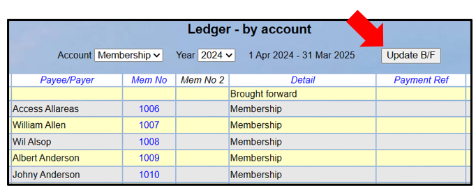

**Note** **1:** The **Update** **B/F** button is only present when the
current year's Ledger is displayed. It is not possible to change the
brought forward to any year except the present. It is therefore
important that the user does update the current year’s B/F before the
financial year-end if changes have been made to last year’s data.

**Note** **2:** The function operates only on the currently displayed
account. To update other accounts, they must be displayed individually
and updated.

**Note** **3:** B/F is always dated the first day of the year. For each
active Account, the B/F is automatically calculated at the start of the
year, within the Rollover function. Note that the Rollover function does
various jobs and runs once a day, currently during the first login of
any user for the specific u3a.

f\) Transaction Records

Refer to [7.2 Transaction
Record](https://u3abeacon.zendesk.com/hc/en-gb/articles/360007367978-7-2-Transaction-Record)
for details of how to create and edit a Transaction.

g\) Transferring Money

> Refer to [7.3 Transfer
> Money](https://u3abeacon.zendesk.com/hc/en-gb/articles/360007304257-7-3-Transfer-Money)
> for details of how to transfer money between Accounts.

h\) Credit Batches

When several payments (cheques and cash) are paid into a bank at the
same time, it is usual for a bank statement to record only the total
amount, not each individual cheque. This can make it difficult to
reconcile the statement against individual transactions.

Credit Batches are a facility to make reconciliation simpler. All
cheques and cash paid in at one time are each assigned to a Credit Batch
and the batch will then appear in the reconciliation listing. When the
bank statement entry is reconciled against the Credit Batch, the
component Transactions are reconciled automatically.

Refer to [<u>7.4 Credit
Batches</u>](https://u3abeacon.zendesk.com/hc/en-gb/articles/360007367998-7-4-Credit-Batches)
for further details.

j\) Reconciling

Reconciliation is the process of ensuring that Beacon's Ledger and your
u3a’s bank statements are synchronised, enabling any discrepancies to be
identified.

Refer to [7.5 Reconcile
Account](https://u3abeacon.zendesk.com/hc/en-gb/articles/360007304277-7-5-Reconcile-Account)
for further details.

k\) Financial statement

Refer to [7.6 Financial
Statement](https://u3abeacon.zendesk.com/hc/en-gb/articles/360007304357-7-6-Financial-Statement)
for details of how to download a Financial Statement for any year or
account.

m\) Groups Statement

Refer to [7.7 Groups
Statement](https://u3abeacon.zendesk.com/hc/en-gb/articles/360007304377-7-7-Groups-Statement)
for details of how to view a summary of every Group's accounts (as held
in the Group Ledgers, see [5.5 Group Record:
Ledger)](https://u3abeacon.zendesk.com/hc/en-gb/articles/360007367898).

n\) Gift Aid

As registered charities, u3a's are eligible to claim Gift Aid relief on
membership subscriptions and donations. Refer to [7.8 Gift
Aid](https://u3abeacon.zendesk.com/hc/en-gb/articles/360007304397-7-8-Gift-Aid)
for further details.

q\) PayPal

To accept payment online for members joining or renewing their
membership, your u3a will need to set up its own PayPal account and
register as a charity with PayPal. Refer to [section
7.9](https://u3abeacon.zendesk.com/hc/en-gb/articles/360007368038-7-9-Working-with-PayPal)
for further details.

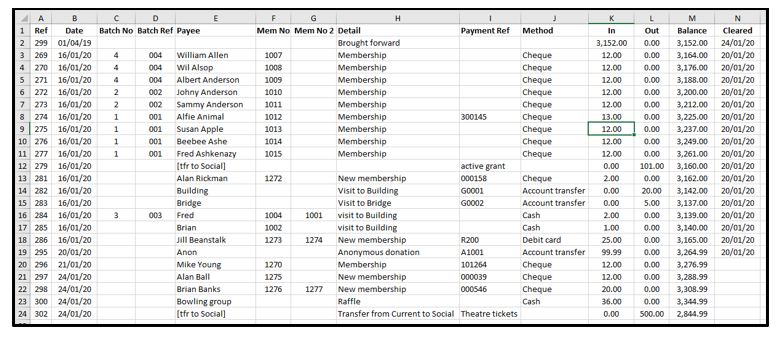r) Example Excel Download

s\) Example pdf Download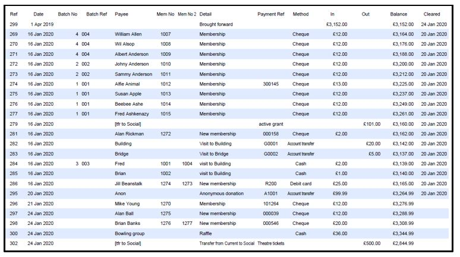

Revision History

||
||
||
||
||
||
||
||
||
||

>  style="width:0.1875in;height:0.18726in" />4
>
> Was this article helpful?
>
> Yes No
>
> 3 out of 4 found this helpful style="width:0.1467in;height:0.15625in" /> style="width:0.1467in;height:0.15625in" />
>
> Have more questions? [<u>Submit a
> request</u>](https://u3abeacon.zendesk.com/hc/en-gb/requests/new)

Return to top

**Recently** **viewed** **articles** [8.6 Finance
Set-up](https://u3abeacon.zendesk.com/hc/en-gb/articles/360007304477-8-6-Finance-Set-up)

[8.2 System
Users](https://u3abeacon.zendesk.com/hc/en-gb/articles/360007368078-8-2-System-Users)

[8.1 The Site
Administrator](https://u3abeacon.zendesk.com/hc/en-gb/articles/360007445138-8-1-The-Site-Administrator)

[2. Logging in as a System
User](https://u3abeacon.zendesk.com/hc/en-gb/articles/360007072538-2-Logging-in-as-a-System-User)

[8 Set-Up
Operations](https://u3abeacon.zendesk.com/hc/en-gb/articles/360007304417-8-Set-Up-Operations)

**Comments** 4 comments

>  style="width:0.41667in;height:0.41667in" />Derek Gant

**Related** **articles** [7.2 Transaction
Record](https://u3abeacon.zendesk.com/hc/en-gb/related/click?data=BAh7CjobZGVzdGluYXRpb25fYXJ0aWNsZV9pZGwrCCp9HNJTADoYcmVmZXJyZXJfYXJ0aWNsZV9pZGwrCBZ9HNJTADoLbG9jYWxlSSIKZW4tZ2IGOgZFVDoIdXJsSSI7L2hjL2VuLWdiL2FydGljbGVzLzM2MDAwNzM2Nzk3OC03LTItVHJhbnNhY3Rpb24tUmVjb3JkBjsIVDoJcmFua2kG--5630f22cac574ce5cf0050c553668f395303f738)

[7.10 Financial
Approaches](https://u3abeacon.zendesk.com/hc/en-gb/related/click?data=BAh7CjobZGVzdGluYXRpb25fYXJ0aWNsZV9pZGwrCHp9HNJTADoYcmVmZXJyZXJfYXJ0aWNsZV9pZGwrCBZ9HNJTADoLbG9jYWxlSSIKZW4tZ2IGOgZFVDoIdXJsSSI%2BL2hjL2VuLWdiL2FydGljbGVzLzM2MDAwNzM2ODA1OC03LTEwLUZpbmFuY2lhbC1BcHByb2FjaGVzBjsIVDoJcmFua2kH--ca6be0fd9b246bca7c8eeb42bcce40df60758ca4)

[7.5 Reconcile
Account](https://u3abeacon.zendesk.com/hc/en-gb/related/click?data=BAh7CjobZGVzdGluYXRpb25fYXJ0aWNsZV9pZGwrCFWEG9JTADoYcmVmZXJyZXJfYXJ0aWNsZV9pZGwrCBZ9HNJTADoLbG9jYWxlSSIKZW4tZ2IGOgZFVDoIdXJsSSI6L2hjL2VuLWdiL2FydGljbGVzLzM2MDAwNzMwNDI3Ny03LTUtUmVjb25jaWxlLUFjY291bnQGOwhUOglyYW5raQg%3D--a29b937e0582e29f22488d46595ad01ae0e3e82f)

[7.8 Gift
Aid](https://u3abeacon.zendesk.com/hc/en-gb/related/click?data=BAh7CjobZGVzdGluYXRpb25fYXJ0aWNsZV9pZGwrCM2EG9JTADoYcmVmZXJyZXJfYXJ0aWNsZV9pZGwrCBZ9HNJTADoLbG9jYWxlSSIKZW4tZ2IGOgZFVDoIdXJsSSIxL2hjL2VuLWdiL2FydGljbGVzLzM2MDAwNzMwNDM5Ny03LTgtR2lmdC1BaWQGOwhUOglyYW5raQk%3D--2dc98d1fa2dbc2aec520844d2a4462c9151e0f1b)

[7.7 Groups
Statement](https://u3abeacon.zendesk.com/hc/en-gb/related/click?data=BAh7CjobZGVzdGluYXRpb25fYXJ0aWNsZV9pZGwrCLmEG9JTADoYcmVmZXJyZXJfYXJ0aWNsZV9pZGwrCBZ9HNJTADoLbG9jYWxlSSIKZW4tZ2IGOgZFVDoIdXJsSSI5L2hjL2VuLWdiL2FydGljbGVzLzM2MDAwNzMwNDM3Ny03LTctR3JvdXBzLVN0YXRlbWVudAY7CFQ6CXJhbmtpCg%3D%3D--d4513bb0f793ef1c3131d935b99e1bbfd131216e)

> Sort by

5 years ago

> 0

Is it possible to order the ledger by Detail please as it used to be.

>  style="width:0.41667in;height:0.41667in" /> style="width:0.15625in;height:0.15625in" />Graham Tigg 5 years ago
>
> 0

I suggest you raise this as a
Support Ticket if you want a formal response. This is not something the
volunteer team can answer.

For a workround you can export the ledger to a spreadsheet.

>  style="width:0.41667in;height:0.41667in" />Derek Gant 5 years ago
>
> 0

Hi Graham, how do I "raise a support ticket" please

>  style="width:0.41667in;height:0.41667in" /> style="width:0.15625in;height:0.15625in" />Graham Tigg 5 years
> ago style="width:0.1467in;height:0.15625in" />
>
> 0

Go to the landing page here
[<u>https://u3abeacon.zendesk.com</u>](https://u3abeacon.zendesk.com/)
and click on the "Help" rectangle.

Please [<u>sign
in</u>](https://u3abeacon.zendesk.com/access?locale=en-gb&brand_id=360000694158&return_to=https%3A%2F%2Fu3abeacon.zendesk.com%2Fhc%2Fen-gb%2Farticles%2F360007367958-7-1-Financial-Ledger)
to leave a comment.

[u3a Beacon](https://u3abeacon.zendesk.com/hc/en-gb)

> [<u>Powered b</u>y
> <u>Zendesk</u>](https://www.zendesk.co.uk/service/help-center/?utm_source=helpcenter&utm_medium=poweredbyzendesk&utm_campaign=text&utm_content=u3a+Beacon+Support)
