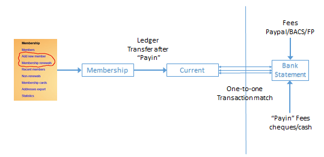

**7.10** **Financial** **Approaches**

> Back

Key statement

The following does includes handling payments in advance and accruals.
The vast majority of u3as work using Cash Accounting so there is no
standard need or method to handle payments in or out in the "wrong"
financial year.

a\) Introduction

This section assumes a u3a is either considering how to use the Beacon’s
Finance facilities, or looking to make more effective use of them.

How and whether a u3a uses Beacon for Financial Accounting is down to
individual u3as, their Treasurer and the standard of detail required as
determined by their level of income. Some are fortunate in having a
Treasurer with a finance background and they will usually adopt a
methodology they are familiar with.

This guide is aimed at Treasurers with no formal Financial or Accounting
background. It suggests, with a rationale, ways to set up and work with
Beacon. It should also give those with experience in Finance an insight
into Beacon’s capabilities.

b\) Default Beacon

Unless additional accounts are specified when a site is set-up, Beacon
will have two accounts **Current** and **Membership**. On set-up all
income and payments will be recorded against **Current** by default with
the exception of membership fees (and donations made when fees are paid)
that are posted to the **Membership** account.

If you site is older than around 2020, or a previous Treasurer has made
changes, it could be that all membership related fees go to **Current.**

Membership fees are given the financial category **Membership**. If a
fee is paid that is higher than that assigned to their membership class,
the excess is given the category **Donation**. This is why these two
categories cannot be changed or deleted.

If no other financial action is taken Beacon will still record
membership fees and donations received during the financial year,
obviously insufficient to produce a set of accounts. However, if Gift
Aid is enabled Beacon will be able to generate Gift Aid declarations for
those fees and donations.

c\) Suggested approaches – one account

Beacon can be used to record all monies using solely the in-built
**Current** account plus a **Paypal** account if that is enabled. Income
and expenditure will need to be recorded in Beacon by manually adding
*all* non-membership transactions - see 7.2 Transaction Record. From
time to time, the Beacon **Current** account will need to be reconciled
with bank statements to ensure they are aligned - see 7.5 Reconcile
Account.

Anyone who has worked with accounts will lament that reconciling
accounts more often than not never goes smoothly and requires time and
much frustration to track down discrepancies. To help with this, income
transactions can be batched so that the total of the amounts batched
matches an individual bank credit. An example is paying in 10 membership
cheques for £20. This shows on the bank statement as a single entry for
£200. To help with the reconciliation process group these 10 payments
into a single credit batch (see 7.4 Credit Batches).

At the end of the Financial Year a financial statement will need to be
produced - see 7.6 Financial Statement.

d\) One account disadvantages This approach has drawbacks, even for
smaller u3as.

There may be more than one bank account. Many u3as operate a separate
account for the Membership Secretary to cover membership fees and
associated Donations.

Reconciling the bank account (despite adopting credit batches) can be
frustrating because cheques and cash can take a while to be banked.

While reconciled (cleared) transactions can now be un-cleared it can
still be messy having all transactions in one account.

It does not help identify adjustments that need to made because of
accruals (see the **Glossary** below).

e\) Use multiple accounts

Consider having three main Financial Accounts **Current**,
**Membership**. Keep to the Golden rule that nothing is recorded in the
Beacon **Current** account unless it mirrors the bank statement
transaction for transaction. The advantages of this approach are that it
eliminates the need to reconcile and to create credit batches by taking
an alternative approach as follows.

Use a **Membership\*** account for Beacon to record all membership fees
(cash or cheques) received by the Membership Secretary. When Membership
fees are banked use the “Transfer Money” option on the “Ledger (by
account)” screen
([**<u>see</u>**](https://u3abeacon.zendesk.com/hc/en-gb/articles/360007304257-7-3-Transfer-Money)
[**<u>7.3 Transfer
Money</u>**)](https://u3abeacon.zendesk.com/hc/en-gb/articles/360007304257-7-3-Transfer-Money)
to move the amount banked from **Membership** to **Current**. The
balance showing at the bottom of the **Membership** Ledger display will
be the cash and cheques the Membership Secretary is holding that have
yet to be paid into the bank. Note that cheques and cash for membership
fees need to be paid in separately to any other income.

If PayPal is enabled, then all online PayPal payments go direct to the
**PayPal** account and are eventually transferred to **Current**. Any
membership payments by BACS/Faster Payments go direct to the **Current**
account and this is how it shows on the bank statement, thus maintaining
the one-to-one relationship between **Current** and the bank.

At the end of the financial year arrange for all cheques and cash to be
banked in good time to ensure both **Membership** and **Cash** have a
balance of zero.

Adopt the same mechanism for other cases where cheques and cash are
banked in batches. For example, when collecting deposits or payments for
a trip or holiday. Each individual payment will be added to this account
as a single

transaction so it can be associated with a member. When money is banked
do a transfer to **Current** for the banked
sum.

The following illustrates the relationship between **Membership**,
**Current** and the bank account.

---------------------------------------------------------------------------------------

\* u3as already on Beacon can set up **Membership** account, but need to
contact the Help Desk to make **Membership** the default for membership
fees. New u3as can ask their Data Migration Supporter to set this up.

Please note that the default is to provide a **Membership** account and
to make this the default for Membership payments.

f\) Accruals

Beacon does not provide support for accrual accounting – see the
**Glossary** below for a description. For most u3as, performing accruals
accounting is not a requirement. However, all u3as need to know at the
end of their year whether they are running a surplus or deficit.

The most likely areas where discrepancies arise between financial years
are membership fees, money banked to pay for future events, and delays
in payment of annual bills.

**Membership** **fees** (excluding rolling membership) – u3as usually
don’t have a Financial year that ends during their renewals period.
However, most u3as allow members to renew early and many of these will
have their membership and financial years aligned or perhaps just a
month apart. This results in membership fees from early renewals ending
up in the previous Financial year’s accounts.

For example, the financial and membership years start on 1st April 2020.
Members can renew or join in advance from 1st January 2020 onwards. The
money from those who pay from January to March will appear in the
accounts for the 2019-20 Financial year rather than 2020-21.

This can be expected to even out to a degree because, using the example
given, renewals would have been lost to the 2019-20 Financial year from
the period January to March 2019 (and so on back in time). However, in
practice external factors such as weather, timing of reminders or just
chance can generate significant variations.

To make a manual adjustment, or see if this an issue for your u3a,
download to a spreadsheet the Beacon “Ledger by

category” for two consecutive full financial years. In both downloads
add up the amounts for the months that fall outside the financial year
(January to March for the example above) and compare them.

**Future** **events** – payments from members for, say, a trip or
holiday will be banked in advance. If the payment to, say, a travel
agent is made during the next financial year, then without any
adjustment the first year will have a more flattering balance sheet than
the subsequent year.

Create an account called, say, **Trip** **Accruals** and record the
money received there with a Finance category such as **Trips**. As
described above, money can be transferred when it shows on the bank
statement. At year-end check the amounts credited to **Current** have
corresponding payment(s). If not, then adjust your figure for
surplus/deficit in your annual Financial report.

**Delayed** **payments** – paying an annual bill late for some reason
one year, but paying on time the next, could result in two lots of fees
in one financial year and none in the previous. The accounts will
obviously be distorted, although this can only be mentioned in a
Financial report if spotted.

**Glossary**

**Account** – used to record transactions. Accounts can mirror bank
account(s), a PayPal account (if enabled), Cash in hand or be transitory
accounts to represent unbanked cheques and cash such as **Membership**.

**Accruals** – easiest to describe using examples. A u3a organises a
holiday and banks £££s from members but payment for the holiday occurs
in the next financial year. Perhaps a u3a pays their TAT fees late one
year and go out of the bank in the next financial year. In both cases
the u3a will have *accrued* a flattering amount of money in their bank
at the year-end, yet there is a commitment to pay it. Accountants call
these accruals. Without adjusting for accruals it is harder for a u3a to
see, from year to year, whether their finances are in credit or deficit.

**Category** – without categories the ledger would look like one or more
bank statements. A u3a would have no idea how much income was from
membership, donations etc. and how much was spent on stationary, room
hire, speaker fees etc.

**Ledger** – manages all the accounts for, in this case, a u3a. If a u3a
only has one account (**Current**) then that is all the ledger will
hold. The name comes from from having a big book in which all financial
transactions are entered. On a computer a ledger can be viewed in a
number of ways – by account, by category, by date etc. On the Beacon
menu those items that start with “Ledger” display the ledger in various
ways.

**Revision** **History**

||
||
||
||
||
||
||
