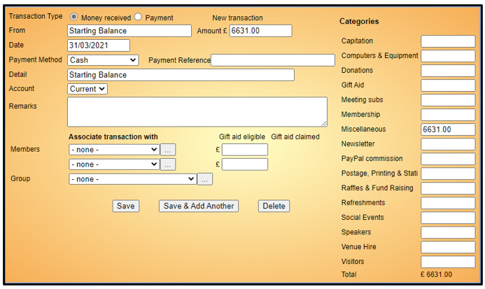
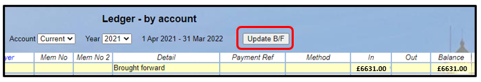

[u3a Beacon](https://u3abeacon.zendesk.com/hc/en-gb) \> [User
Guide](https://u3abeacon.zendesk.com/hc/en-gb/categories/360001240017-User-Guide)
\> [7.
Finance](https://u3abeacon.zendesk.com/hc/en-gb/sections/360002102798-7-Finance)
Search

**Articles** **in** **this** **section**

**7.10.2** **Setting** **up** **Beacon** **Finance**

>  style="width:0.41667in;height:0.41667in" /> style="width:0.15625in;height:0.15625in" />Graeme Bunting Follow 7
> months ago · Updated

Introduction

How and whether a u3a uses Beacon for Financial Accounting is down to
the individual u3a, though adopting it is strongly recommended in order
to fully benefit from the Beacon System. For guidance on things to
consider before implementing Beacon’s Finance (BF) refer to [**7.10
Financial
Approaches**](https://u3abeacon.zendesk.com/hc/en-gb/articles/360007368058).

This article is aimed at u3a's that are considering using BF facilities
for the first time, either when going live or at a later time. If Beacon
was previously used for Finance more than a year in the past there are
special considerations as described in [**7.10.3 Resetting Finance after
a period of
non-use**<u>.</u>](https://u3abeacon.zendesk.com/hc/en-gb/articles/9876880477981)

If you adopt BF in the middle of your Financial Year (FY) then you can
either manually add transactions from the start of the FY or wait until
the end of the FY - see scenario b) Starting to use BF at a later date
below.

Starting to use BF it is likely to be one of the following two
scenarios:

a\) Using BF from Day 1

If your u3a wishes to use use BF as soon as the site goes live (or soon
after), it is ideal that migration is timed to correspond with the start
of your Financial Year (FY). You should discuss this with your Supporter
prior to migration and one option may be to load historical
transactions.

Check that your required **Finance** **Accounts** and **Finance**
**Categories** were set up by your Migration Supporter as specified in
your Migration Template. If you need to amend these refer to [**8.6
Finance
Set-up.**](https://u3abeacon.zendesk.com/hc/en-gb/articles/360007304477)

The first thing to do is to
adjust the starting balances for each Account such that the balance on
the first day of the current Financial Year is the same as that in the
corresponding bank account. This is done by adding a Transaction with
the date being the last day of the previous financial year and the
**Detail** shown as **Starting** **Balance**. Refer to [**7.2
Transaction
Record**](https://u3abeacon.zendesk.com/hc/en-gb/articles/360007367978).

Then go to **Ledger** **-** **by** **account** and for each Account in
turn, update the **Brought** **Forward** amount by pressing the
**Update** **B/F** button.

If there have been subsequent payments in or out of any of the accounts
since the start of the current Financial Year, these will need to be
replicated as Transactions in the Beacon Accounts.

*Note:* *if* *your* *u3a* *is* *using* *a* *"Membership"* *Account,*
*this* *will* *have* *all* *the* *membership* *fees* *recorded* *since*
*going* *live.*

b\) Starting to use BF at a later date

If a u3a doesn't use BF initially and decides to start using it later,
it is recommended that the start date should correspond with the start
of the u3a's Financial Year.

You will first need to create your **Finance** **Categories** and a
**Finance** **Account** to correspond with each bank account, and
possibly ones for "Membership" and "Cash" too, as described in [**8.6
Finance
Set-up**](https://u3abeacon.zendesk.com/hc/en-gb/articles/360007304477)

After creating the Finance Accounts, adjust the starting balance for
each as described in a) above.

Note that Beacon will always record all the payments received from new
members or members renewing. If you are not using BF this can provide a
useful cross-check against your accounts.[<u>7.10.4 Resetting Finance
if</u>](https://u3abeacon.zendesk.com/hc/en-gb/articles/9876880477981)
[<u>you have never used Beacon Finance
before</u>.](https://u3abeacon.zendesk.com/hc/en-gb/articles/9876880477981)

This takes you through step by step in resetting your accounts so you
have the correct Opening Balance.

If your system has historical records from years before you started
using Beacon Finance then you should study
article:

Gift Aid

Even if you are not intending using BF for recording non-membership
transactions, you can still use Beacon to generate Gift Aid claims on
Membership payments. Please be aware that Gift Aid cannot be claimed
retrospectively on payments made before the system was configured for
Gift Aid claims; refer to [**7.8
Gift**](https://u3abeacon.zendesk.com/hc/en-gb/articles/360007304397)
[**Aid**
f](https://u3abeacon.zendesk.com/hc/en-gb/articles/360007304397)or
further information.

Revision History

||
||
||
||
||

> Was this article helpful?
>
> Yes No
>
> 0 out of 0 found this helpful
>
> Have more questions? [<u>Submit a
> request</u>](https://u3abeacon.zendesk.com/hc/en-gb/requests/new)

Return to top

**Recently** **viewed** **articles** [7.10.1 Changing your Financial
Year](https://u3abeacon.zendesk.com/hc/en-gb/articles/360019616158-7-10-1-Changing-your-Financial-Year)

[7.10 Financial
Approaches](https://u3abeacon.zendesk.com/hc/en-gb/articles/360007368058-7-10-Financial-Approaches)

[7.9.1 Setting up Online Membership
Payments](https://u3abeacon.zendesk.com/hc/en-gb/articles/360007430537-7-9-1-Setting-up-Online-Membership-Payments)

[7.9 Working with
PayPal](https://u3abeacon.zendesk.com/hc/en-gb/articles/360007368038-7-9-Working-with-PayPal)

**Related** **articles** [8.6 Finance
Set-up](https://u3abeacon.zendesk.com/hc/en-gb/related/click?data=BAh7CjobZGVzdGluYXRpb25fYXJ0aWNsZV9pZGwrCB2FG9JTADoYcmVmZXJyZXJfYXJ0aWNsZV9pZGwrCJHgDDUBBDoLbG9jYWxlSSIKZW4tZ2IGOgZFVDoIdXJsSSI3L2hjL2VuLWdiL2FydGljbGVzLzM2MDAwNzMwNDQ3Ny04LTYtRmluYW5jZS1TZXQtdXAGOwhUOglyYW5raQY%3D--2f157b4dfd08fa4135105d9f8fb2c21c7ebd555b)

[7.10.4 Resetting Finance if you have never
used](https://u3abeacon.zendesk.com/hc/en-gb/related/click?data=BAh7CjobZGVzdGluYXRpb25fYXJ0aWNsZV9pZGwrCB3P86P7CDoYcmVmZXJyZXJfYXJ0aWNsZV9pZGwrCJHgDDUBBDoLbG9jYWxlSSIKZW4tZ2IGOgZFVDoIdXJsSSJrL2hjL2VuLWdiL2FydGljbGVzLzk4NzY4ODA0Nzc5ODEtNy0xMC00LVJlc2V0dGluZy1GaW5hbmNlLWlmLXlvdS1oYXZlLW5ldmVyLXVzZWQtQmVhY29uLUZpbmFuY2UtYmVmb3JlBjsIVDoJcmFua2kH--b406c11fa7fce79df1825d1077381ff9a01f456a)
[Beacon Finance
before](https://u3abeacon.zendesk.com/hc/en-gb/related/click?data=BAh7CjobZGVzdGluYXRpb25fYXJ0aWNsZV9pZGwrCB3P86P7CDoYcmVmZXJyZXJfYXJ0aWNsZV9pZGwrCJHgDDUBBDoLbG9jYWxlSSIKZW4tZ2IGOgZFVDoIdXJsSSJrL2hjL2VuLWdiL2FydGljbGVzLzk4NzY4ODA0Nzc5ODEtNy0xMC00LVJlc2V0dGluZy1GaW5hbmNlLWlmLXlvdS1oYXZlLW5ldmVyLXVzZWQtQmVhY29uLUZpbmFuY2UtYmVmb3JlBjsIVDoJcmFua2kH--b406c11fa7fce79df1825d1077381ff9a01f456a)

[7.10 Financial
Approaches](https://u3abeacon.zendesk.com/hc/en-gb/related/click?data=BAh7CjobZGVzdGluYXRpb25fYXJ0aWNsZV9pZGwrCHp9HNJTADoYcmVmZXJyZXJfYXJ0aWNsZV9pZGwrCJHgDDUBBDoLbG9jYWxlSSIKZW4tZ2IGOgZFVDoIdXJsSSI%2BL2hjL2VuLWdiL2FydGljbGVzLzM2MDAwNzM2ODA1OC03LTEwLUZpbmFuY2lhbC1BcHByb2FjaGVzBjsIVDoJcmFua2kI--890cbb33338ba5d7c651e960b428421585e57643)

[7.8 Gift
Aid](https://u3abeacon.zendesk.com/hc/en-gb/articles/360007304397-7-8-Gift-Aid)
[7.10.3 Resetting Finance after a period of
non-use](https://u3abeacon.zendesk.com/hc/en-gb/related/click?data=BAh7CjobZGVzdGluYXRpb25fYXJ0aWNsZV9pZGwrCBGrjCwBBDoYcmVmZXJyZXJfYXJ0aWNsZV9pZGwrCJHgDDUBBDoLbG9jYWxlSSIKZW4tZ2IGOgZFVDoIdXJsSSJYL2hjL2VuLWdiL2FydGljbGVzLzQ0MDMwODg4OTQ3MzctNy0xMC0zLVJlc2V0dGluZy1GaW5hbmNlLWFmdGVyLWEtcGVyaW9kLW9mLW5vbi11c2UGOwhUOglyYW5raQk%3D--d09446c647a08e85eea25dce20191eef84f712ac)

> [7.2 Transaction
> Record](https://u3abeacon.zendesk.com/hc/en-gb/related/click?data=BAh7CjobZGVzdGluYXRpb25fYXJ0aWNsZV9pZGwrCCp9HNJTADoYcmVmZXJyZXJfYXJ0aWNsZV9pZGwrCJHgDDUBBDoLbG9jYWxlSSIKZW4tZ2IGOgZFVDoIdXJsSSI7L2hjL2VuLWdiL2FydGljbGVzLzM2MDAwNzM2Nzk3OC03LTItVHJhbnNhY3Rpb24tUmVjb3JkBjsIVDoJcmFua2kK--466afd53489b87e5037b3d2c56be59120babb332)

**Comments** 0 comments

Please [<u>sign
in</u>](https://u3abeacon.zendesk.com/access?locale=en-gb&brand_id=360000694158&return_to=https%3A%2F%2Fu3abeacon.zendesk.com%2Fhc%2Fen-gb%2Farticles%2F4403231514769-7-10-2-Setting-up-Beacon-Finance)
to leave a comment.

[u3a Beacon](https://u3abeacon.zendesk.com/hc/en-gb)

> [<u>Powered by
> Zendesk</u>](https://www.zendesk.co.uk/service/help-center/?utm_source=helpcenter&utm_medium=poweredbyzendesk&utm_campaign=text&utm_content=u3a+Beacon+Support)
