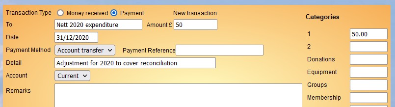

**7.10.3** **Resetting** **Finance** **after** **a** **period** **of**
**non-use**

> Back

**Introduction**

This article covers a fairly rare situation where a u3a has used Beacon
Finance in the past, stops using it for more than a year and then starts
to use it again. Refer to [7.10.2 Setting up Beacon
Finance](https://u3abeacon.zendesk.com/hc/en-gb/articles/4403231514769)
for help on setting up Beacon Finance for the first time.

If there is a gap in the use of Beacon Finance for a whole financial
year or more then the ledgers need to reset before starting afresh with
the current Financial Year (FY).

The process is more complex than just setting an opening balance(s) for
the current FY as it ensures that account reconciliation works
correctly. While your u3a may not reconcile some or all of your accounts
bear in mind that a future Treasurer may do so. For an explanation of
this see Understanding Beacon reconciliation and Balance B/F below.

Start by reviewing existing Beacon Finance Accounts (**Finance**
**accounts** on the home page) and delete or make inactive any that
won't be needed.

For each account do the following: -

> 1\. Decide on the opening balance for each account. For bank
> account(s) this will be the balance at the start of the current FY.
>
> 2\. To ensure that if transactions are reconciled they match the
> opening balance a balance difference needs to be calculated.
> “Reconcile” the account (see [7.5 Reconcile
> Account](https://u3abeacon.zendesk.com/hc/en-gb/articles/360007304277))
> using the opening balance for the **Statement** **End** **Balance**
> and the last day of the previous FY as the **Statement** **End**
> **Date**. Clear any historical transactions that are displayed and
> make a note of the **Balance** **Difference**
>
> 3\. If the **Balance** **Difference** is £0 skip this step.
>
>  style="width:7.87931in;height:2.13378in" />Go to the **Ledger**,
> select the account and then **Add** **Transaction**. If the balance
> difference is -ve then the "**Transaction** **Type**" needs to be
> "Money received" and for a +ve balance it will be "Payment". Make the
> date of the transaction the last day of the previous FY. Use the
> Detail and Remarks fields to explain your actions i.e. ensuring the
> account reconciles to the new re-start balance. Assign the amount to
> any Category or create one especially for this purpose.
>
> 4\. Now that the account will reconcile the opening balance needs to
> be updated for the current FY by creating a temporary transaction.
> View the Ledger and click "Update B/F". Make a note of the “Brought
> forward” balance minus the opening balance required (from step 1).
>
> 5\. Use **Add** **Transaction** again and as in 3 above. If “Brought
> forward” minus balance required is -ve then the "Transaction Type"
> needs to be "Money received" and if +ve make it "Payment". Set the
> date of the transaction to the last day of the previous FY. Assign the
> amount to any Category.
>
> 6\. Having added the transaction click "Update B/F". Make sure the new
> the “Brought forward” balance matches the balance required. If it
> doesn’t then the adjusting transaction can be edited to change the
> amount.
>
> 7\. Now the adjusting transaction just created needs to be deleted so
> that future reconciliation of the account is not thrown out of kilter.
> Do not use "Update B/F" for the current FY again.
>
> 8\. Repeat the above for all the accounts that will be used.

Beacon can now be used for Finance for the current FY.

Consider consulting article [7.10 Financial
Approaches](https://u3abeacon.zendesk.com/hc/en-gb/articles/360007368058)
that describes a way of working to avoid the need to reconcile the
Current account and still keep it in step with bank statements.

**Understanding** **reconciliation** **and** **Balance** **B/F**

Beacon reconciliation works by starting from the oldest non-reconciled
transaction in the ledger for an account. In the case of an account that
has never been reconciled this will be the oldest transaction. Note that
the “Brought forward” amount at the start of each FY is ignored, it is a
baseline for a running balance at the start of a FY and not a
transaction.

A “Brought forward” balance is automatically created at the start of
each FY. After that, and only for the next 12 months, it can only be
changed manually using the “Update B/F” button.

It is more than likely that transactions will have been modified or even
added/deleted to the previous FY to correct oversights. If “Update B/F”
was *not* done after corrections were made to the previous FY it will be
out of step with all the previous transactions and hence reconciliation.
Given that use of Beacon finance was suspended this is quite likely.

So, while it might seem all that is needed to re-start accounts is a
single transaction that simply adjusts the balance at the end of the
previous FY, there is more to it as this table shows.

||
||
||
||
||
||

\* “Update B/F” was not applied

\*\* Payment transaction created, then “Update B/F” applied for 2021,
then transaction deleted.

In the example above Beacon was not used for Finance in 2020. A
correction of £100 payment was made to 2019 but the Balance Forward (BF)
for 2020 was not updated.

When accounts were re-started in 2021 a payment of £50 was needed to
reconcile Beacon with the bank balance (£450 was paid out with only £400
received).

When the £50 is applied to 2021 (“Update B/F”) the Beacon balance is
£100 more than the bank because the £100 payment from 2019 was not
brought forward.

Creating a payment transaction of £100 in 2020 and then doing “Update
B/F” corrects the balance but throws reconciliation out by £100.
However, deleting the transaction and NOT doing “Update B/F” keeps
things aligned.

Revision History

||
||
||
||
||
