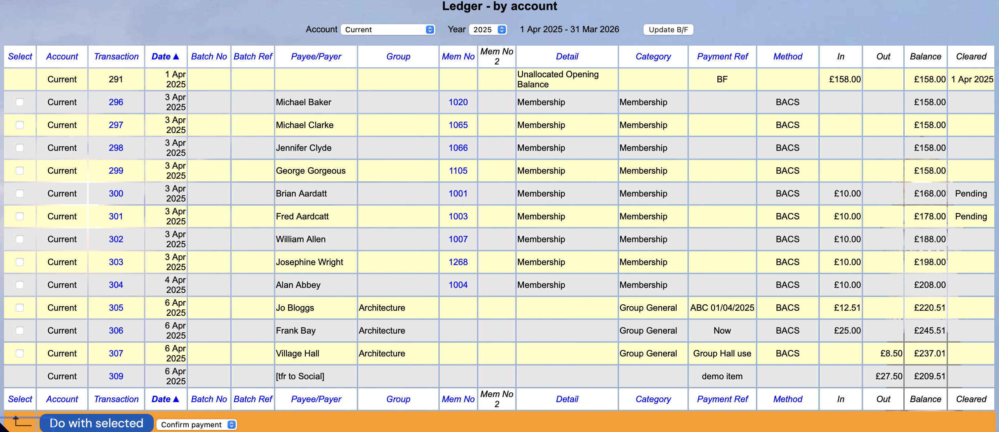
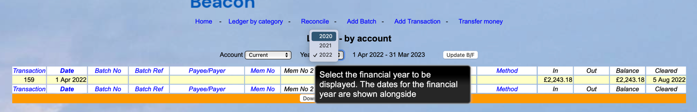
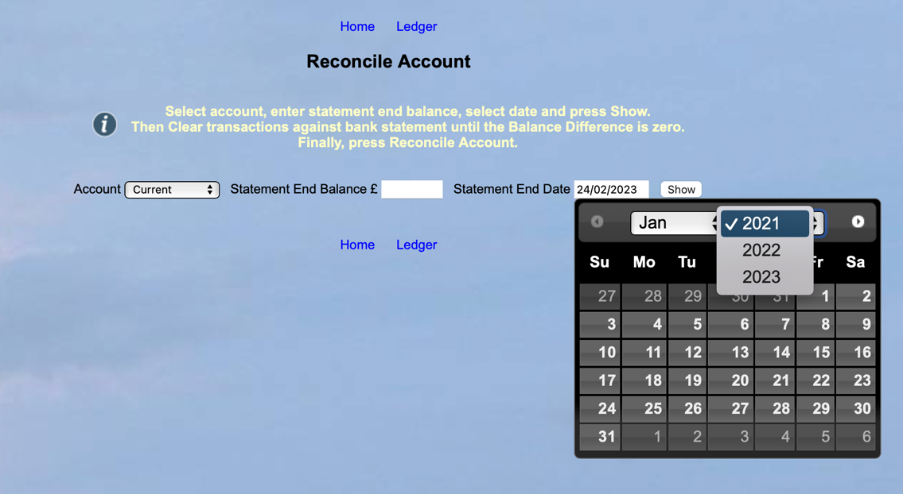
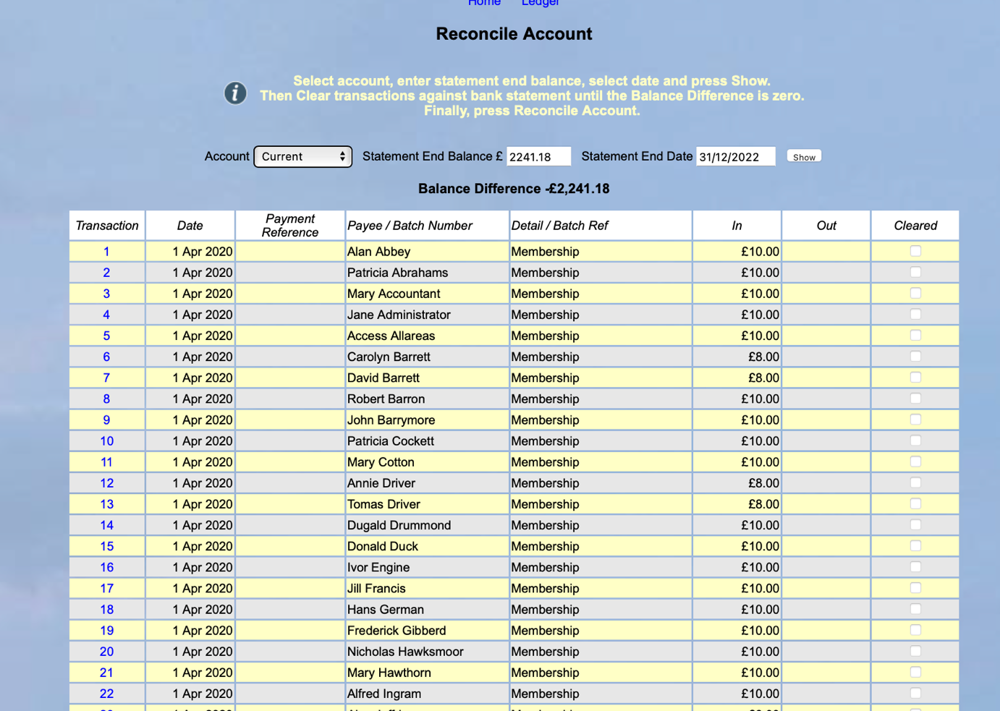
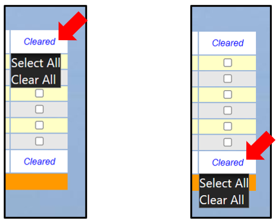
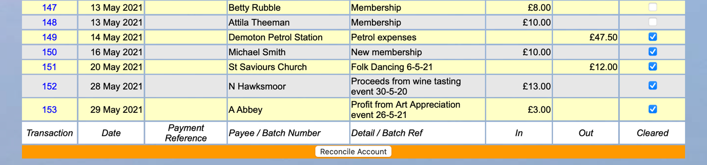

[u3a Beacon](https://u3abeacon.zendesk.com/hc/en-gb) \> [User
Guide](https://u3abeacon.zendesk.com/hc/en-gb/categories/360001240017-User-Guide)
\> [7.
Finance](https://u3abeacon.zendesk.com/hc/en-gb/sections/360002102798-7-Finance)
Search

**Articles** **in** **this** **section**

**7.10.4** **Resetting** **Finance** **if** **you** **have** **never**
**used** **Beacon** **Finance** **before**

>  style="width:0.41667in;height:0.41667in" />John Alexander Follow 10
> months ago · Updated

This is for Beacon Sites that have been using their system for some time
and now want to use Finance.

The system automatically puts membership renewals and new members money
in the ledger. This results in lots of entries and these will impact on
future use of the finance system.

Fig 1

In this example Fig 1 you can see a typical example and includes the
Pending option.

The aim**l**of this process is
to ensure your ledgers are correct for the start of your financial year.
You will also need to reconcile the accounts to remove, from the
display, these historical transactions. If you don’t do this

then they will clutter up the screen when reconciling your account(s) in
the future.

**Note** we strongly recommend that you start using finance at the start
of your financial year.

While this process may seem complex, we suggest that you just work
through this step by step.

This process is using a Financial Year starting 1st January. If your
financial year is different then you will need to change the dates used to
match it.

You may have multiple accounts to adjust so you should perform these
actions on each one in turn. The illustration following shows the
process on the current account.

**Step** **1**

**Current** **Account**

First you need to go to Reconcile and check the earliest date that you
can work on. In this illustration it is : 2020. See Fig 2

> Fig 2

You will need to reconcile this earlier year although the ledger shows
2020 (see fig. 2) the Reconciliation only goes back to 2021. (see fig. 3)

Fig 3

**Step** **2**

Go to the ledger for 2021 financial year and note down the End of Year
figure: £ 2241.18

Fig 4

You now go to Reconcile and enter the earliest year possible 2022 and
the figure at the end of the financial year ending in 2022. (in our
example £ 2241.18).

**Press** **Show.**

You will now see all transactions from this end date 31/12/2022, back to
when the system was first used. This could be a very long list.

You need to tick each one until you have done them all. You can see
below how you can Select All. The Balance Difference will by £ 0.00.

You can now go to the foot of the page and reconcile account.

Warning this display and ticking of historical transactions can take
some time and it appears as if the system is going slowly. This can be
due to the size of file that is necessary for all of the transactions.

See below for this :

Fig 5

As long as the balance difference is Zero this will have removed these
ticked transactions from your list. They remain in the ledger but cannot
be removed or edited except from modifying the apportionment in the
Analysis categories. Please see Reconciliation section as you can now
edit these transactions. [<u>7.5
Reconcile</u>](https://u3abeacon.zendesk.com/hc/en-gb/articles/360007304277)
[<u>Account</u>](https://u3abeacon.zendesk.com/hc/en-gb/articles/360007304277)

**Step3**

Your End of Year balance should be correct but if not put in on last day
of that financial year a correction transaction (Contra transaction). If
your End-of-Year figure is too high, you put in a Payment Transaction of
the amount necessary to make the End-of- Year correct.

If it is too low do the opposite. The details in the transaction should
define what you are doing in terms of End of Year correction. You need to
make sure it is taking the balance to the correct figure and should be
analysed to an appropriate category. You might want to set one up for
End of Year Correction.

Once you have carried this out for all accounts, you will need to select
Update B/F on each account for the current year. Note if you get this
wrong you can use it multiple times.

This will set the start of year to the correct figure.

You can now start the new financial year.

Revision History

||
||
||
||
||
||

> Was this article helpful?
>
> Yes No
>
> 0 out of 0 found this helpful
>
> Have more questions? [<u>Submit a
> request</u>](https://u3abeacon.zendesk.com/hc/en-gb/requests/new)

Return to top

**Recently** **viewed** **articles**

[7.10.3 Resetting Finance after a period of
non-use](https://u3abeacon.zendesk.com/hc/en-gb/articles/4403088894737-7-10-3-Resetting-Finance-after-a-period-of-non-use)

[7.10.2 Setting up Beacon
Finance](https://u3abeacon.zendesk.com/hc/en-gb/articles/4403231514769-7-10-2-Setting-up-Beacon-Finance)

[7.10.1 Changing your Financial
Year](https://u3abeacon.zendesk.com/hc/en-gb/articles/360019616158-7-10-1-Changing-your-Financial-Year)

[7.10 Financial
Approaches](https://u3abeacon.zendesk.com/hc/en-gb/articles/360007368058-7-10-Financial-Approaches)

[7.9.1 Setting up Online Membership
Payments](https://u3abeacon.zendesk.com/hc/en-gb/articles/360007430537-7-9-1-Setting-up-Online-Membership-Payments)

**Related** **articles** [7.1 Financial
Ledger](https://u3abeacon.zendesk.com/hc/en-gb/related/click?data=BAh7CjobZGVzdGluYXRpb25fYXJ0aWNsZV9pZGwrCBZ9HNJTADoYcmVmZXJyZXJfYXJ0aWNsZV9pZGwrCB3P86P7CDoLbG9jYWxlSSIKZW4tZ2IGOgZFVDoIdXJsSSI5L2hjL2VuLWdiL2FydGljbGVzLzM2MDAwNzM2Nzk1OC03LTEtRmluYW5jaWFsLUxlZGdlcgY7CFQ6CXJhbmtpBg%3D%3D--e8d59c30e9d8d9870df8c85a959fa9389e0de3f9)

[7.10.2 Setting up Beacon
Finance](https://u3abeacon.zendesk.com/hc/en-gb/related/click?data=BAh7CjobZGVzdGluYXRpb25fYXJ0aWNsZV9pZGwrCJHgDDUBBDoYcmVmZXJyZXJfYXJ0aWNsZV9pZGwrCB3P86P7CDoLbG9jYWxlSSIKZW4tZ2IGOgZFVDoIdXJsSSJGL2hjL2VuLWdiL2FydGljbGVzLzQ0MDMyMzE1MTQ3NjktNy0xMC0yLVNldHRpbmctdXAtQmVhY29uLUZpbmFuY2UGOwhUOglyYW5raQc%3D--4c46754dc7b6de702310dd79a4c1f90aa98f7c7c)

[7.10.5 Pending
Transactions](https://u3abeacon.zendesk.com/hc/en-gb/related/click?data=BAh7CjobZGVzdGluYXRpb25fYXJ0aWNsZV9pZGwrCB3bV%2BllEDoYcmVmZXJyZXJfYXJ0aWNsZV9pZGwrCB3P86P7CDoLbG9jYWxlSSIKZW4tZ2IGOgZFVDoIdXJsSSJCL2hjL2VuLWdiL2FydGljbGVzLzE4MDI5ODkyNTkwMzY1LTctMTAtNS1QZW5kaW5nLVRyYW5zYWN0aW9ucwY7CFQ6CXJhbmtpCA%3D%3D--76bf51f4bde008aad765698b101d0484d6e2fa1a)

[7.6.1 Calculate a true
surplus/deficit](https://u3abeacon.zendesk.com/hc/en-gb/related/click?data=BAh7CjobZGVzdGluYXRpb25fYXJ0aWNsZV9pZGwrCEkX1dJTADoYcmVmZXJyZXJfYXJ0aWNsZV9pZGwrCB3P86P7CDoLbG9jYWxlSSIKZW4tZ2IGOgZFVDoIdXJsSSJLL2hjL2VuLWdiL2FydGljbGVzLzM2MDAxOTQ2NjA1Ny03LTYtMS1DYWxjdWxhdGUtYS10cnVlLXN1cnBsdXMtZGVmaWNpdAY7CFQ6CXJhbmtpCQ%3D%3D--fd3e8140e39da66915bfeb63122e282654fbeb93)

[7.10.3 Resetting Finance after a period of
non-use](https://u3abeacon.zendesk.com/hc/en-gb/related/click?data=BAh7CjobZGVzdGluYXRpb25fYXJ0aWNsZV9pZGwrCBGrjCwBBDoYcmVmZXJyZXJfYXJ0aWNsZV9pZGwrCB3P86P7CDoLbG9jYWxlSSIKZW4tZ2IGOgZFVDoIdXJsSSJYL2hjL2VuLWdiL2FydGljbGVzLzQ0MDMwODg4OTQ3MzctNy0xMC0zLVJlc2V0dGluZy1GaW5hbmNlLWFmdGVyLWEtcGVyaW9kLW9mLW5vbi11c2UGOwhUOglyYW5raQo%3D--555961dc6fdf94b5e49b6850f83ca751161b264a)

**Comments** 0 comments

Please [<u>sign
in</u>](https://u3abeacon.zendesk.com/access?locale=en-gb&brand_id=360000694158&return_to=https%3A%2F%2Fu3abeacon.zendesk.com%2Fhc%2Fen-gb%2Farticles%2F9876880477981-7-10-4-Resetting-Finance-if-you-have-never-used-Beacon-Finance-before)
to leave a comment.

[u3a Beacon](https://u3abeacon.zendesk.com/hc/en-gb)

> [<u>Powered by
> Zendesk</u>](https://www.zendesk.co.uk/service/help-center/?utm_source=helpcenter&utm_medium=poweredbyzendesk&utm_campaign=text&utm_content=u3a+Beacon+Support)
