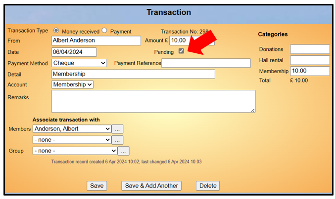
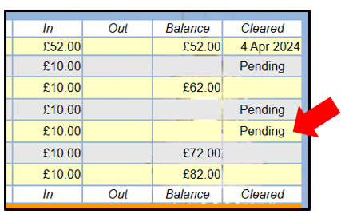
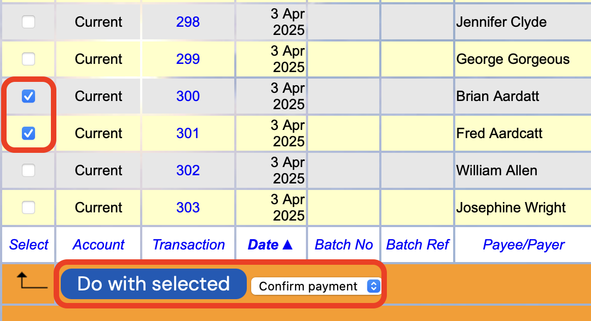
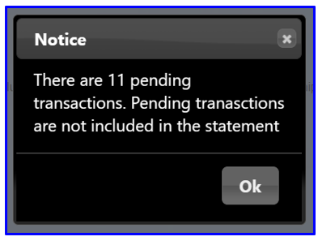

[u3a Beacon](https://u3abeacon.zendesk.com/hc/en-gb) \> [User
Guide](https://u3abeacon.zendesk.com/hc/en-gb/categories/360001240017-User-Guide)
\> [7.
Finance](https://u3abeacon.zendesk.com/hc/en-gb/sections/360002102798-7-Finance)
Search

**Articles** **in** **this** **section**

**7.10.5** **Pending** **Transactions**

>  style="width:0.41667in;height:0.41667in" /> style="width:0.15625in;height:0.15625in" />Graeme Bunting Follow 4
> months ago · Updated

**Background**

This function can be left with the default setting in which case it will
work as the system does originally.

This new functionality was introduced in May 2024 is to support
**Pending** **Transactions** and was followed by **Refunds.** **see**
**here:** [**<u>7.10.7
Refunds</u>**](https://u3abeacon.zendesk.com/hc/en-gb/articles/21268054883613)

Typical examples of when Transactions could be shown as Pending are:

> When members have promised to make payments by BACS
>
> Cash or cheques have been received, but not yet paid into the bank
> account.

The Transactions would be changed to ‘Not Pending’ by the Treasurer
after payments have been banked.

Special rules can be set for Membership **Joining** and **Renewal**
payments. For example, if the default Finance Account is set to
**Membership** and the payment method is **BACS**, then you can only opt
for the money to go to the Membership account. If you change the payment
method to anything else you can choose a different account.

Using the Pending Transactions option can complement, or even be an
alternative to **Clearing** Transactions.

**Set-up**

If the Treasurer wants to use these facilities then a number of setting
are necessary.

New transactions can be set to:

> **Always** **be** **created** **as** **Pending** by default, or
> **Optionally** **Pending**, i.e. can be set by the
> user. style="width:7.05208in;height:4.19792in" /> style="width:3.72917in;height:2.34375in" />

The enabling of Pending Transactions is done on an account by account
basis, [see 8.6 Finance
Set-up.](https://u3abeacon.zendesk.com/hc/en-gb/articles/360007304477)

**Managing** **Pending** **Transactions**

Pending Transactions are denoted by a tick box on the Transaction
Record:

. . . and are shown as **Pending** in the **Cleared** column of the "By
Account" and "By Group" ledgers, with the balance figure for that line
being surpressed:

Individual payments can be changed from Pending to Confirmed (or
vice-versa) by unticking or ticking the Pending tick box in the
Transaction Record.

Multiple payments can be changed from Pending to Confirmed (or
vice-versa) by ticking the Transactions in the left column of the ledger
and choosing **Confirm** **Payment** or **Make** **pending** from the
drop-down list

below the table, before pressing **Do** **with**
**selected**.

Bulk action tick-boxes are only present on Transactions that are:

> Not part of a Credit Batch Have not been Cleared
>
> Are not in the Current financial year \*

**\*** **This** **means** **that** **the** **Treasurer** **needs**
**to** **confirm** **Pending** **for** **Transactions** **that** **are**
**outside** **the** **current** **financial** **year** **by**
**opening** **them** **and** **potentially** **unticking** **Pending.**

A Pending Transaction processed by a Financial Statement will generate a
warning when the Financial Statement is generated, but otherwise can be
ignored but it is sensible to sort it out. The exception is a Transfer
between accounts that is made Pending. As the money is in the process of
being transferred it will not necessarily be evident in both Ledgers.
(The original and destination account).

**Revision** **History**

||
||
||

||
||
||
||
||
||
||

> Was this article helpful?
>
> Yes No
>
> 1 out of 2 found this helpful
>
> Have more questions? [<u>Submit a
> request</u>](https://u3abeacon.zendesk.com/hc/en-gb/requests/new)

Return to top

**Recently** **viewed** **articles**

[7.10.4 Resetting Finance if you have never
used](https://u3abeacon.zendesk.com/hc/en-gb/articles/9876880477981-7-10-4-Resetting-Finance-if-you-have-never-used-Beacon-Finance-before)
[Beacon Finance
before](https://u3abeacon.zendesk.com/hc/en-gb/articles/9876880477981-7-10-4-Resetting-Finance-if-you-have-never-used-Beacon-Finance-before)

[7.10.3 Resetting Finance after a period of
non-use](https://u3abeacon.zendesk.com/hc/en-gb/articles/4403088894737-7-10-3-Resetting-Finance-after-a-period-of-non-use)

[7.10.2 Setting up Beacon
Finance](https://u3abeacon.zendesk.com/hc/en-gb/articles/4403231514769-7-10-2-Setting-up-Beacon-Finance)

[7.10.1 Changing your Financial
Year](https://u3abeacon.zendesk.com/hc/en-gb/articles/360019616158-7-10-1-Changing-your-Financial-Year)

[7.10 Financial
Approaches](https://u3abeacon.zendesk.com/hc/en-gb/articles/360007368058-7-10-Financial-Approaches)

**Related** **articles** [8.6 Finance
Set-up](https://u3abeacon.zendesk.com/hc/en-gb/related/click?data=BAh7CjobZGVzdGluYXRpb25fYXJ0aWNsZV9pZGwrCB2FG9JTADoYcmVmZXJyZXJfYXJ0aWNsZV9pZGwrCB3bV%2BllEDoLbG9jYWxlSSIKZW4tZ2IGOgZFVDoIdXJsSSI3L2hjL2VuLWdiL2FydGljbGVzLzM2MDAwNzMwNDQ3Ny04LTYtRmluYW5jZS1TZXQtdXAGOwhUOglyYW5raQY%3D--03a5c5c0061a492130c1560e19206385a2ba75aa)

[7.10.6 Opening Balance for
Groups](https://u3abeacon.zendesk.com/hc/en-gb/related/click?data=BAh7CjobZGVzdGluYXRpb25fYXJ0aWNsZV9pZGwrCJ0SIPd9EToYcmVmZXJyZXJfYXJ0aWNsZV9pZGwrCB3bV%2BllEDoLbG9jYWxlSSIKZW4tZ2IGOgZFVDoIdXJsSSJIL2hjL2VuLWdiL2FydGljbGVzLzE5MjMyNzE0NjU4NDYxLTctMTAtNi1PcGVuaW5nLUJhbGFuY2UtZm9yLUdyb3VwcwY7CFQ6CXJhbmtpBw%3D%3D--7d0dbc8227c22f9c2e03bde2385f8ba1db2a0916)

[7.1 Financial
Ledger](https://u3abeacon.zendesk.com/hc/en-gb/related/click?data=BAh7CjobZGVzdGluYXRpb25fYXJ0aWNsZV9pZGwrCBZ9HNJTADoYcmVmZXJyZXJfYXJ0aWNsZV9pZGwrCB3bV%2BllEDoLbG9jYWxlSSIKZW4tZ2IGOgZFVDoIdXJsSSI5L2hjL2VuLWdiL2FydGljbGVzLzM2MDAwNzM2Nzk1OC03LTEtRmluYW5jaWFsLUxlZGdlcgY7CFQ6CXJhbmtpCA%3D%3D--22b9973e09536351555a5153088fe077f4f157bf)

[7.9.1 Setting up Online Membership
Payments](https://u3abeacon.zendesk.com/hc/en-gb/related/click?data=BAh7CjobZGVzdGluYXRpb25fYXJ0aWNsZV9pZGwrCIlxHdJTADoYcmVmZXJyZXJfYXJ0aWNsZV9pZGwrCB3bV%2BllEDoLbG9jYWxlSSIKZW4tZ2IGOgZFVDoIdXJsSSJQL2hjL2VuLWdiL2FydGljbGVzLzM2MDAwNzQzMDUzNy03LTktMS1TZXR0aW5nLXVwLU9ubGluZS1NZW1iZXJzaGlwLVBheW1lbnRzBjsIVDoJcmFua2kJ--3d5ca4a1f3d2e5108d0d54cd1fbec07cd7c04898)

[7.10.4 Resetting Finance if you have never
used](https://u3abeacon.zendesk.com/hc/en-gb/related/click?data=BAh7CjobZGVzdGluYXRpb25fYXJ0aWNsZV9pZGwrCB3P86P7CDoYcmVmZXJyZXJfYXJ0aWNsZV9pZGwrCB3bV%2BllEDoLbG9jYWxlSSIKZW4tZ2IGOgZFVDoIdXJsSSJrL2hjL2VuLWdiL2FydGljbGVzLzk4NzY4ODA0Nzc5ODEtNy0xMC00LVJlc2V0dGluZy1GaW5hbmNlLWlmLXlvdS1oYXZlLW5ldmVyLXVzZWQtQmVhY29uLUZpbmFuY2UtYmVmb3JlBjsIVDoJcmFua2kK--cf25cfc91fe6cc9ece1eed671d92c50ab090e885)
[Beacon Finance
before](https://u3abeacon.zendesk.com/hc/en-gb/related/click?data=BAh7CjobZGVzdGluYXRpb25fYXJ0aWNsZV9pZGwrCB3P86P7CDoYcmVmZXJyZXJfYXJ0aWNsZV9pZGwrCB3bV%2BllEDoLbG9jYWxlSSIKZW4tZ2IGOgZFVDoIdXJsSSJrL2hjL2VuLWdiL2FydGljbGVzLzk4NzY4ODA0Nzc5ODEtNy0xMC00LVJlc2V0dGluZy1GaW5hbmNlLWlmLXlvdS1oYXZlLW5ldmVyLXVzZWQtQmVhY29uLUZpbmFuY2UtYmVmb3JlBjsIVDoJcmFua2kK--cf25cfc91fe6cc9ece1eed671d92c50ab090e885)

**Comments** 0 comments

Please [<u>sign
in</u>](https://u3abeacon.zendesk.com/access?locale=en-gb&brand_id=360000694158&return_to=https%3A%2F%2Fu3abeacon.zendesk.com%2Fhc%2Fen-gb%2Farticles%2F18029892590365-7-10-5-Pending-Transactions)
to leave a comment.

[u3a Beacon](https://u3abeacon.zendesk.com/hc/en-gb)

> [<u>Powered by
> Zendesk</u>](https://www.zendesk.co.uk/service/help-center/?utm_source=helpcenter&utm_medium=poweredbyzendesk&utm_campaign=text&utm_content=u3a+Beacon+Support)
