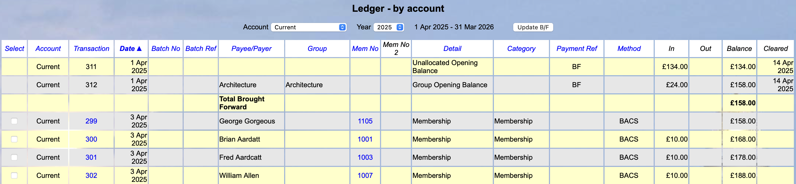
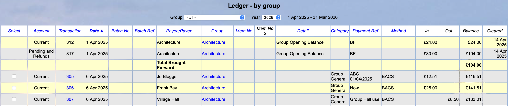

[u3a Beacon](https://u3abeacon.zendesk.com/hc/en-gb) \> [User
Guide](https://u3abeacon.zendesk.com/hc/en-gb/categories/360001240017-User-Guide)
\> [7.
Finance](https://u3abeacon.zendesk.com/hc/en-gb/sections/360002102798-7-Finance)
Search

**Articles** **in** **this** **section**

**7.10.6** **Opening** **Balance** **for** **Groups**

>  style="width:0.41667in;height:0.41667in" /> style="width:0.15625in;height:0.15625in" />Graeme Bunting Follow 10
> months ago · Updated

This article describes changes introduced in June 2024 to enable
managing of the Groups expenditure that needs to be included in
financial reporting, specifically as part of the total income for a u3a.

A new tick box on the **Finance** **Accounts** screen [(see
8.6)](https://u3abeacon.zendesk.com/hc/en-gb/articles/360007304477)
enables the creation of **Group** **Brought** **Forward** (B/F)
transactions for all Groups that have transactions associated with them
in the previous Financial Year (not counting any initial Group B/F
transaction).

> If the Group Balances tick-box is never ticked then Beacon behaves as
> previous.
>
> The B/F transactions will not be created/updated until either the
> **Update** **B/F** button is clicked, or when the Financial Year rolls
> over.
>
> Clearing the tick-box has no immediate effect until the user performs
> **Update** **B/F** or the Financial Year rolls over. **Update**
> **B/F** will remove all the Group B/F transactions and a Financial
> Year rollover behaves as previous with no Group B/F transactions
> generated.

**Ledger** **by** **Account**

In the **Ledger** **(by** **Account)** page the main B/F (excluding
Groups) is shown first, followed by each Group B/F and then the Balance
(**Total** **Brought** **Forward**) in bold.

Note than when sorting, by clicking a blue column heading, the B/F
transactions are excluded so always appear first.

>  style="width:1.125in;height:0.47892in" />**Help**

**Ledger** **by** **Group**

In the **Ledger** **(by** **Group)** page the balance for each Group and
each Account at the year start is shown. The Main B/F transaction is not
shown.

Note that for a Group that has transactions in more than one Account a
Group B/F transaction will be listed for each Account.

When sorting, by clicking a blue column heading, the B/F transactions
are excluded so always appear first.

**1.** **Updating** **B/F** **and** **Financial** **Year** **roll-over**

The Financial Year roll-over creates what is called here the Main B/F
transaction for each Account. This is the balance of the account at the
end of what is now the previous Financial Year.

With Group balances enabled, then Group B/F transactions need to be
generated. This occurs when the user clicks **Update** **B/F** (for a
single account) or the Financial Year rolls over (all enabled accounts).

For each Account all Groups that are associated with a transaction will
need a Group B/F transaction generated with the balance as of the end of
the previous financial year. The only exception to this is where the
only transaction is a Group B/F transaction at the start of the year
(previous Financial Year in the case of Financial Year roll-over) and
that Group B/F transaction is for £zero.

**2.** **Previous** **year** **transaction** **updates** **introducing**
**a** **new** **Group**

If a transaction in the previous year is added or updated and introduces
a new Group, this will have no effect until **Update** **B/F** is
clicked. The process checks if a new Group B/F transaction needs to be
created because transaction(s) for that Group have been created in the
previous year since the last update.

It also removes any Group B/F transactions that now have £zero and no
transactions in the previous Financial Year (there will only be a Group
B/F balance of £zero from the start of last year that remains in
place).

**3.** **Deleting** **a** **Group**

If a Group is deleted then any transactions associated with that Group
become transactions that are no longer associated with a Group.

However, if there is a Group B/F transaction for the deleted Group it
will remain until **Update** **B/F** is performed. Amounts for the
deleted Group will then be included in the Main B/F transaction.

In this case a Group B/F transaction’s Group can be identified from the
**Detail** field.

Any Group B/F balances for previous years remain in place for the
deleted Group. They will be identified by the **Detail** column.

**Revision** **History**

||
||
||
||

> Was this article helpful?
>
> Yes No
>
> 0 out of 0 found this helpful
>
> Have more questions? [<u>Submit a
> request</u>](https://u3abeacon.zendesk.com/hc/en-gb/requests/new)

Return to top

**Recently** **viewed** **articles** [7.10.5 Pending
Transactions](https://u3abeacon.zendesk.com/hc/en-gb/articles/18029892590365-7-10-5-Pending-Transactions)

[7.10.4 Resetting Finance if you have never
used](https://u3abeacon.zendesk.com/hc/en-gb/articles/9876880477981-7-10-4-Resetting-Finance-if-you-have-never-used-Beacon-Finance-before)
[Beacon Finance
before](https://u3abeacon.zendesk.com/hc/en-gb/articles/9876880477981-7-10-4-Resetting-Finance-if-you-have-never-used-Beacon-Finance-before)

[7.10.3 Resetting Finance after a period of
non-use](https://u3abeacon.zendesk.com/hc/en-gb/articles/4403088894737-7-10-3-Resetting-Finance-after-a-period-of-non-use)

[7.10.2 Setting up Beacon
Finance](https://u3abeacon.zendesk.com/hc/en-gb/articles/4403231514769-7-10-2-Setting-up-Beacon-Finance)

[7.10.1 Changing your Financial
Year](https://u3abeacon.zendesk.com/hc/en-gb/articles/360019616158-7-10-1-Changing-your-Financial-Year)

**Related** **articles** [8.6 Finance
Set-up](https://u3abeacon.zendesk.com/hc/en-gb/related/click?data=BAh7CjobZGVzdGluYXRpb25fYXJ0aWNsZV9pZGwrCB2FG9JTADoYcmVmZXJyZXJfYXJ0aWNsZV9pZGwrCJ0SIPd9EToLbG9jYWxlSSIKZW4tZ2IGOgZFVDoIdXJsSSI3L2hjL2VuLWdiL2FydGljbGVzLzM2MDAwNzMwNDQ3Ny04LTYtRmluYW5jZS1TZXQtdXAGOwhUOglyYW5raQY%3D--699c5497a02dbe50301d36f18fbfd108c5a7580c)

[7.1 Financial
Ledger](https://u3abeacon.zendesk.com/hc/en-gb/related/click?data=BAh7CjobZGVzdGluYXRpb25fYXJ0aWNsZV9pZGwrCBZ9HNJTADoYcmVmZXJyZXJfYXJ0aWNsZV9pZGwrCJ0SIPd9EToLbG9jYWxlSSIKZW4tZ2IGOgZFVDoIdXJsSSI5L2hjL2VuLWdiL2FydGljbGVzLzM2MDAwNzM2Nzk1OC03LTEtRmluYW5jaWFsLUxlZGdlcgY7CFQ6CXJhbmtpBw%3D%3D--810884146958ee8a6fa00057e93f0f3761cc9795)

[5.5 Group Record:
Ledger](https://u3abeacon.zendesk.com/hc/en-gb/related/click?data=BAh7CjobZGVzdGluYXRpb25fYXJ0aWNsZV9pZGwrCNp8HNJTADoYcmVmZXJyZXJfYXJ0aWNsZV9pZGwrCJ0SIPd9EToLbG9jYWxlSSIKZW4tZ2IGOgZFVDoIdXJsSSI8L2hjL2VuLWdiL2FydGljbGVzLzM2MDAwNzM2Nzg5OC01LTUtR3JvdXAtUmVjb3JkLUxlZGdlcgY7CFQ6CXJhbmtpCA%3D%3D--a5d8f7224b610d66227d85001b4054927dbf5470)

[7.2 Transaction
Record](https://u3abeacon.zendesk.com/hc/en-gb/related/click?data=BAh7CjobZGVzdGluYXRpb25fYXJ0aWNsZV9pZGwrCCp9HNJTADoYcmVmZXJyZXJfYXJ0aWNsZV9pZGwrCJ0SIPd9EToLbG9jYWxlSSIKZW4tZ2IGOgZFVDoIdXJsSSI7L2hjL2VuLWdiL2FydGljbGVzLzM2MDAwNzM2Nzk3OC03LTItVHJhbnNhY3Rpb24tUmVjb3JkBjsIVDoJcmFua2kJ--92c625808bfde58c15be2d49d3e8f55b61c15a7d)

[7.10.5 Pending
Transactions](https://u3abeacon.zendesk.com/hc/en-gb/related/click?data=BAh7CjobZGVzdGluYXRpb25fYXJ0aWNsZV9pZGwrCB3bV%2BllEDoYcmVmZXJyZXJfYXJ0aWNsZV9pZGwrCJ0SIPd9EToLbG9jYWxlSSIKZW4tZ2IGOgZFVDoIdXJsSSJCL2hjL2VuLWdiL2FydGljbGVzLzE4MDI5ODkyNTkwMzY1LTctMTAtNS1QZW5kaW5nLVRyYW5zYWN0aW9ucwY7CFQ6CXJhbmtpCg%3D%3D--c02a16526458c038c925e9ac6cb2e49f15472b2e)

**Comments** 0 comments

Please [<u>sign
in</u>](https://u3abeacon.zendesk.com/access?locale=en-gb&brand_id=360000694158&return_to=https%3A%2F%2Fu3abeacon.zendesk.com%2Fhc%2Fen-gb%2Farticles%2F19232714658461-7-10-6-Opening-Balance-for-Groups)
to leave a comment.

[u3a Beacon](https://u3abeacon.zendesk.com/hc/en-gb)

> [<u>Powered by
> Zendesk</u>](https://www.zendesk.co.uk/service/help-center/?utm_source=helpcenter&utm_medium=poweredbyzendesk&utm_campaign=text&utm_content=u3a+Beacon+Support)
