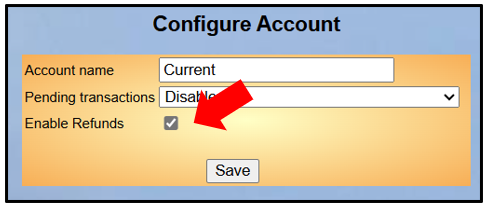
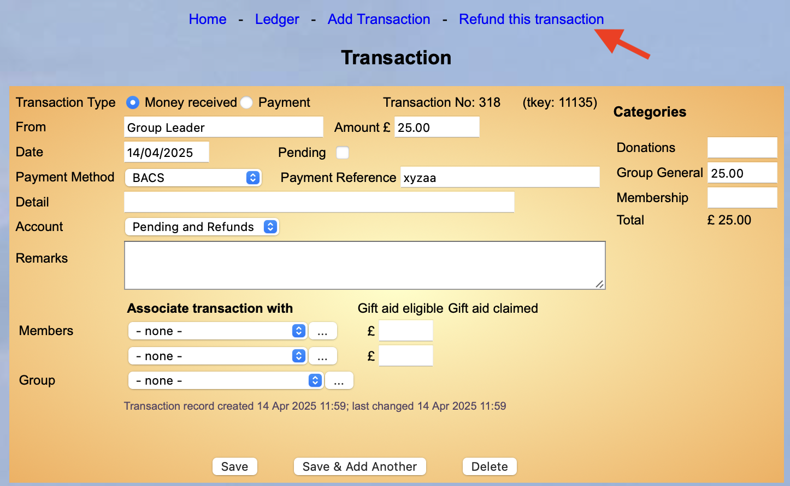
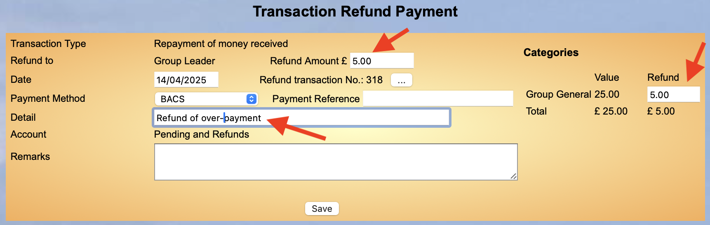
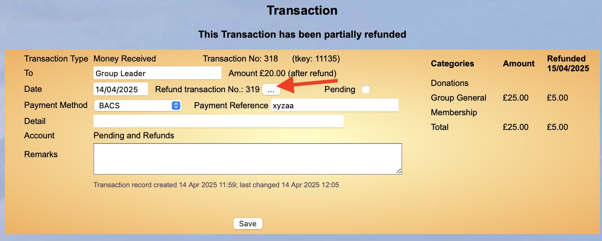
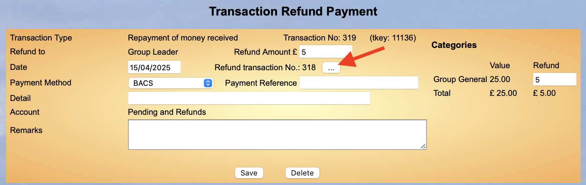
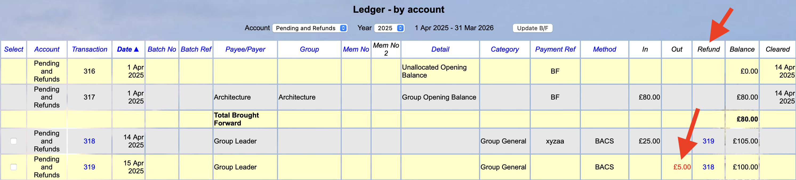

[u3a Beacon](https://u3abeacon.zendesk.com/hc/en-gb) \> [User
Guide](https://u3abeacon.zendesk.com/hc/en-gb/categories/360001240017-User-Guide)
\> [7.
Finance](https://u3abeacon.zendesk.com/hc/en-gb/sections/360002102798-7-Finance)
Search

**Articles** **in** **this** **section**

**7.10.7** **Refunds**

>  style="width:0.41667in;height:0.41667in" /> style="width:0.15625in;height:0.15625in" />Graeme Bunting Follow 10
> months ago · Updated

***An*** ***option*** ***was*** ***added*** ***to*** ***Beacon***
***in*** ***Autumn*** ***2024*** is to be able to configure individual
Finance Accounts to enable Refunds. This ensures that the original
Transaction and the Refund are not included as Income/Expenditure in the
Financial Statement.

For details of how to configure a Finance Account to allow Refunds see
[8.6 Finance
Set-up](https://u3abeacon.zendesk.com/hc/en-gb/articles/360007304477).

**1.** **Background**

If a Transaction is created to perform a Refund the net outcome in the
Financial Statement includes the original amount and refunded amount as
additional Income and Expenditure.

With this new facility Refunds are excluded from the Financial Statement
and are linked to the original Transaction. Refunds also address
Transactions allocated to multiple Finance Categories e.g. ‘Room Hire’
and ‘Catering’.

Refunds are usually made to return money received, but they can also be
made against payments.

Refunds can be partial and made
against different Finance Categories. **Help**

**2.** **Refund** **Behaviours** **and** **Rules**

The behaviour of Beacon Finance by default does not change unless the
Beacon Admin or Treasurer takes action to allow Refunds on selected
Accounts.

A Refund generates a Transaction that negates an earlier Transaction. It
is linked to the Transaction it refunds and may be a partial Refund
against one or more Categories. The elements of this are:

> For a Finance Account where Refunds are enabled, then when a
> Transaction is viewed there is a new option, **Refund** **this**
> **transaction**.
>
> The Refund process creates a new **Refund** **Transaction** that
> reciprocally links to the original Transaction with a new field,
> **Refund** **Reference**.
>
> A Refund Transaction must have a date that is more recent, by at least
> a day, than the original Transaction being refunded. The date must be
> in the Financial Year of the Transaction being refunded. In other
> words a Transaction and it’s Refund cannot staddle Financial Years.
>
> Transactions with a Refund Reference value instigate special
> calculations when producing a Financial Statement (the net value is
> reported).
>
> When **Refund** **this** **Transaction** is clicked a Refund screen is
> displayed. This is similar to the Transaction screen.
>
> When the Refund screen is completed and submitted, a new Transaction
> is created that counters the original Transaction with the reciprocal
> Refund Reference field populated with the Transaction number of its
> pair.
>
> The original Transaction shows the amount refunded and text added to
> highlight this.
>
> A Transaction that has a Refund against it can be **Cleared**, as can
> the Refund Transaction itself.
>
> If the Transaction is associated with a Member then the Refund is
> included in the **Member** **Record** screen (bottom right).
>
> If an account that is configured to implement Refunds has the feature
> revoked, then no new Refunds can be made on that account.

**2.1** **Original** **Transaction**

When a Transaction is refunded there are restrictions on how the
original Transaction can be edited over and above the current rules.

The user can easily navigate between a Transaction and the refunding
Transaction it is paired with. This uses the ‘three dots’ link mechanism
that Beacon uses for paired members with shared addresses.

**2.2** **Correcting** **Errors**

> The refunding Transaction can be deleted if the original Transaction
> hasn’t been cleared.
>
> When a Refund Transaction is deleted the Refund reference is cleared
> on the original transaction. The means the Refund can be made again
> and is the way to correct errors.
>
> The original Transaction cannot be amended. To correct an error the
> user must delete the Refund Transaction, edit the original and apply
> the Refund again.
>
> It follows that when a Transaction has been refunded then it cannot be
> deleted. The Refund Transaction needs to be deleted first.

**2.3** **Excluded** **Transactions**

> A Transaction older than the previous Financial Year cannot be
> refunded. style="width:7.4375in;height:4.59375in" />
>
> A Cleared Transaction cannot be refunded (but it can be un-cleared
> first as long as it is in the current or previous Financial Year).
>
> The **Refund** **this** **Transaction** menu option is not available
> if there are **Gift** **Aid** eligible amounts that have already been
> claimed.
>
> If there are unclaimed Gift Aid amounts then the user will need to
> clear these first before the Transaction can be refunded.
>
> A Transaction that has been refunded cannot have another Refund made
> against it. Amend the existing refund instead.

**3** **Applying** **a** **Refund**

To refund a Transaction, click the **Refund** **this** **Transaction**
link:

Enter the amount in the
**Refund** **Amount** **£** and **Refund** **Category** boxes before
pressing **Save**:

Additional information entered in the Detail and Payment Reference boxes
will be displayed in the Ledger.

The number of the refunded Transaction is referenced in the Refund
Transaction and vice-versa, along with a button with 3 dots that can be
pressed to navigate to the related Transaction:

**<u>Original Transaction</u>**

**<u>Refund</u>**

Related Transaction numbers are also shown in a new **Refund** column in
the Ledger. Refunds show in red text in the Ledger:

**Revision** **History**

||
||
||
||
||
||

> Was this article helpful?
>
> Yes No
>
> 0 out of 0 found this helpful
>
> Have more questions? [<u>Submit a
> request</u>](https://u3abeacon.zendesk.com/hc/en-gb/requests/new)

Return to top

**Recently** **viewed** **articles** [7.10.6 Opening Balance for
Groups](https://u3abeacon.zendesk.com/hc/en-gb/articles/19232714658461-7-10-6-Opening-Balance-for-Groups)

[7.10.5 Pending
Transactions](https://u3abeacon.zendesk.com/hc/en-gb/articles/18029892590365-7-10-5-Pending-Transactions)

[7.10.4 Resetting Finance if you have never
used](https://u3abeacon.zendesk.com/hc/en-gb/articles/9876880477981-7-10-4-Resetting-Finance-if-you-have-never-used-Beacon-Finance-before)
[Beacon Finance
before](https://u3abeacon.zendesk.com/hc/en-gb/articles/9876880477981-7-10-4-Resetting-Finance-if-you-have-never-used-Beacon-Finance-before)

[7.10.3 Resetting Finance after a period of
non-use](https://u3abeacon.zendesk.com/hc/en-gb/articles/4403088894737-7-10-3-Resetting-Finance-after-a-period-of-non-use)

[7.10.2 Setting up Beacon
Finance](https://u3abeacon.zendesk.com/hc/en-gb/articles/4403231514769-7-10-2-Setting-up-Beacon-Finance)

**Related** **articles** [8.6 Finance
Set-up](https://u3abeacon.zendesk.com/hc/en-gb/related/click?data=BAh7CjobZGVzdGluYXRpb25fYXJ0aWNsZV9pZGwrCB2FG9JTADoYcmVmZXJyZXJfYXJ0aWNsZV9pZGwrCB0929pXEzoLbG9jYWxlSSIKZW4tZ2IGOgZFVDoIdXJsSSI3L2hjL2VuLWdiL2FydGljbGVzLzM2MDAwNzMwNDQ3Ny04LTYtRmluYW5jZS1TZXQtdXAGOwhUOglyYW5raQY%3D--a8dc458388a99a866c66fe622697c13ebe062abf)

[7.1 Financial
Ledger](https://u3abeacon.zendesk.com/hc/en-gb/related/click?data=BAh7CjobZGVzdGluYXRpb25fYXJ0aWNsZV9pZGwrCBZ9HNJTADoYcmVmZXJyZXJfYXJ0aWNsZV9pZGwrCB0929pXEzoLbG9jYWxlSSIKZW4tZ2IGOgZFVDoIdXJsSSI5L2hjL2VuLWdiL2FydGljbGVzLzM2MDAwNzM2Nzk1OC03LTEtRmluYW5jaWFsLUxlZGdlcgY7CFQ6CXJhbmtpBw%3D%3D--2b47fe314df826e65ac748ec2508350eb12e2eb8)

[7.2 Transaction
Record](https://u3abeacon.zendesk.com/hc/en-gb/related/click?data=BAh7CjobZGVzdGluYXRpb25fYXJ0aWNsZV9pZGwrCCp9HNJTADoYcmVmZXJyZXJfYXJ0aWNsZV9pZGwrCB0929pXEzoLbG9jYWxlSSIKZW4tZ2IGOgZFVDoIdXJsSSI7L2hjL2VuLWdiL2FydGljbGVzLzM2MDAwNzM2Nzk3OC03LTItVHJhbnNhY3Rpb24tUmVjb3JkBjsIVDoJcmFua2kI--76c9258874aa182e316cf1e5ee3fb6abb1b6fb08)

[7.3 Transfer
Money](https://u3abeacon.zendesk.com/hc/en-gb/related/click?data=BAh7CjobZGVzdGluYXRpb25fYXJ0aWNsZV9pZGwrCEGEG9JTADoYcmVmZXJyZXJfYXJ0aWNsZV9pZGwrCB0929pXEzoLbG9jYWxlSSIKZW4tZ2IGOgZFVDoIdXJsSSI3L2hjL2VuLWdiL2FydGljbGVzLzM2MDAwNzMwNDI1Ny03LTMtVHJhbnNmZXItTW9uZXkGOwhUOglyYW5raQk%3D--448a7e6f80a00ab3399f08cd9aa00b722924e689)

[8.1 The Site
Administrator](https://u3abeacon.zendesk.com/hc/en-gb/related/click?data=BAh7CjobZGVzdGluYXRpb25fYXJ0aWNsZV9pZGwrCJKqHdJTADoYcmVmZXJyZXJfYXJ0aWNsZV9pZGwrCB0929pXEzoLbG9jYWxlSSIKZW4tZ2IGOgZFVDoIdXJsSSI%2FL2hjL2VuLWdiL2FydGljbGVzLzM2MDAwNzQ0NTEzOC04LTEtVGhlLVNpdGUtQWRtaW5pc3RyYXRvcgY7CFQ6CXJhbmtpCg%3D%3D--9fb4cf1572588f52dd8d945e3e71ec5860e75b72)

**Comments** 0 comments

Please [<u>sign
in</u>](https://u3abeacon.zendesk.com/access?locale=en-gb&brand_id=360000694158&return_to=https%3A%2F%2Fu3abeacon.zendesk.com%2Fhc%2Fen-gb%2Farticles%2F21268054883613-7-10-7-Refunds)
to leave a comment.

[u3a Beacon](https://u3abeacon.zendesk.com/hc/en-gb)

> [<u>Powered by
> Zendesk</u>](https://www.zendesk.co.uk/service/help-center/?utm_source=helpcenter&utm_medium=poweredbyzendesk&utm_campaign=text&utm_content=u3a+Beacon+Support)
