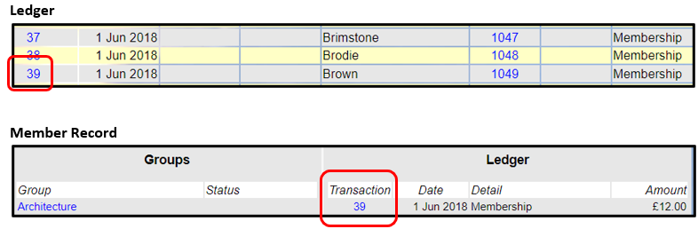
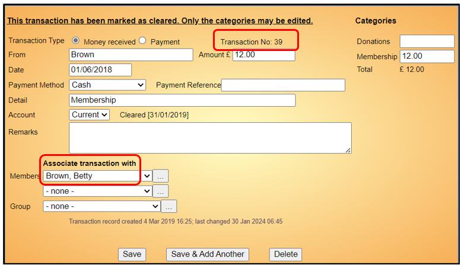
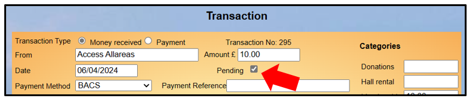
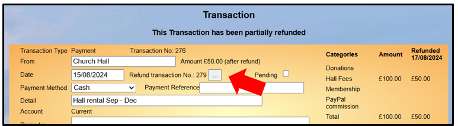
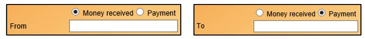
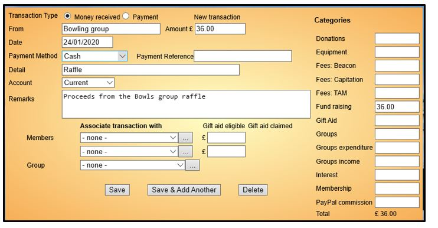
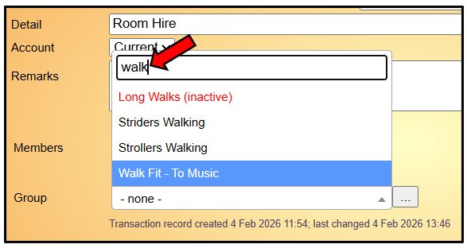
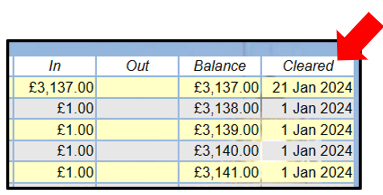
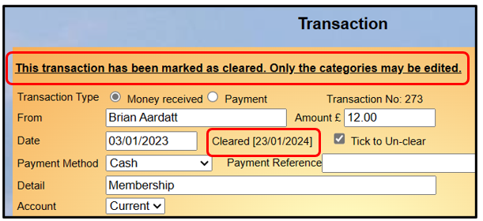

[u3a Beacon](https://u3abeacon.zendesk.com/hc/en-gb) \> [User
Guide](https://u3abeacon.zendesk.com/hc/en-gb/categories/360001240017-User-Guide)
\> [7.
Finance](https://u3abeacon.zendesk.com/hc/en-gb/sections/360002102798-7-Finance)
Search

**Articles** **in** **this** **section**

**7.2** **Transaction** **Record**

>  style="width:0.41667in;height:0.41667in" /> style="width:0.15625in;height:0.15625in" />Graeme Bunting Follow 1
> month ago · Updated

1\. Transactions Overview

A **Transaction** records money paid **In** or **Out** of an Account.

Transactions normally have the date on which they are created, but this
and most other details about a Transaction can be edited, including
setting the date in the past or the future.

Each Transaction has a Transaction Number, starting at 1 which is
displayed in the **Ledger**. Each transaction also has a unique **tkey**
which is a unique identifier in the Beacon database and is shown in some
Excel downloads.

You may view a Transaction Record by clicking on the Transaction number
in the Ledger and from other places where Transaction numbers are
displayed:

Transactions for **New** **Memberships** and **Membership** **Renewals**
are automatically added to the Ledger and are associated with the
member(s):

>  style="width:1.125in;height:0.47892in" />**Help**

1.1 Pending Transactions

There is an option to configure Finance Accounts such that that
Transactions can be shown as Pending. Any account so configured has a
Pending tick box below the Amount:

See [7.10.5 Pending
Transactions](https://u3abeacon.zendesk.com/hc/en-gb/articles/18029892590365)
for further details.

1.2 Refunds

There is an option to configure Finance Accounts such that that
Transactions can be fully or part refunded. Transactions that have been
refunded show the amount refunded and have a button with 3 dots that can
be clicked to view the Refund Transaction:

See [7.10.7
Refunds](https://u3abeacon.zendesk.com/hc/en-gb/articles/21268054883613)
for further details.

2\. Adding Transactions

To create a Transaction that is not associated with a Membership
payment, click **Add** **transaction** from the Home page or the Ledger.

Select either **Money** **received** or **Payment**. The field below
will toggle between **From** and **To** accordingly.

> Enter the person (or body) **From** whom the money has been received
> or **To** whom it has been paid. The **Amount** should always be a
> positive figure.
>
> The **Date** may be changed by clicking in the date box and selecting
> the required date from the calendar.
>
> Select a **Payment** **Method** from the drop-down list and
> (optionally) add a cheque number or other reference in the **Payment**
> **Reference**.
>
> **Detail** (which will be shown in the Ledger) should give a concise
> reason for the payment. Additional information can be entered in
> **Remarks**.
>
> Transactions may be linked to 1 or 2 **Members** and/or a **Group** by
> selecting from the **Associate** **transaction** **with** drop-down
> lists.
>
> The **Group** drop-down list is searchable - for example Typing "Walk"
> will filter the list to only show Groups that contain the letters
> "walk". Inactive Groups are shown in red with a suffix (inactive).

> On the right side is a list of defined financial **Categories**. You
> must assign the money paid or received to one or more categories such
> that the total of the categories equals the **Amount**. You will not
> be able to save the transaction if this is not the case.
>
> Normally categories are positive amounts for a payment or receipt. An
> exception is Paypal Commission for an online membership transaction
> which is shown as a negative amount.

When all is complete, press the **Save** button to commit the
Transaction. If you press the **Save** **&** **Add** **Another** button,
a new form will be shown to enable a succession of transactions to be
entered efficiently. Otherwise the saved Transaction is re-displayed as
confirmation.

2.1 Transferring Between Accounts

There is a special type of Transaction that is used for transferring
money between Finance Accounts; [see
7.3](https://u3abeacon.zendesk.com/hc/en-gb/articles/360007304257)
[Transfer
Money](https://u3abeacon.zendesk.com/hc/en-gb/articles/360007304257) for
further information.

3\. Changing and Deleting Transactions

After changing any fields in a Transaction, press the **Save** button to
commit the changes.

Ordinarily, for reasons of financial integrity, Transactions should
***<u>not</u>*** be deleted. Instead another Transaction should be added
that negates the first Transaction, or (if the Refund functionality has
been enabled for your u3a) the Transaction should be refunded; see
[7.10.7
Refunds](https://u3abeacon.zendesk.com/hc/en-gb/articles/21268054883613).

However, if a genuine mistake has been made that is recognised straight
away (a Transaction being entered twice, for example) it may be deleted
by pressing the **Delete** button.

*Notes:*

> *All* *changes* *to* *data* *throughout* *Beacon* *are* *audited*
>
> *Transactions* *that* *have* *been* ***Cleared*** *cannot* *be*
> *deleted* *or* *changed,* *except* *that* *the* *figures* *in* *the*
> *Category* *fields* *may* *be* *edited* *and* *Transactions* *in*
> *the* *current* *or* *previous* *financial* *year* *can* *be*
> ***Un-cleared**;* *[see 7.5 Reconcile
> Account](https://u3abeacon.zendesk.com/hc/en-gb/articles/360007304277-7-5-Reconcile-Account).*
>
> Cleared Transactions can be recognised by a ‘Cleared date’ in the last
> column of the Ledger.

Cleared Transaction Records display a note saying that the Transaction
has been cleared, the cleared date and a tick box to Un-clear the
Transaction if it relates to the current or previous financial year.

4\. Transactions related to Deleted Groups

When a Group is deleted the links to any Transactions associated with
the Group is removed.

The deletion process appends a dated comment to the **Remark** box for
each Transaction that includes the name of the Group.

*Note* *it* *is* *strongly* *recommended* *that* *all* *Transactions*
*associated* *with* *a* *Group* *use* *the* ***Details*** *box* *to*
*note* *the* *name* *of* *the* *group* *and* *reason* *for*
*payment/money* *received.*

Revision History

||
||
||
||
||
||
||
||
||

> Was this article helpful?
>
> Yes No
>
> 2 out of 2 found this helpful
>
> Have more questions? [<u>Submit a
> request</u>](https://u3abeacon.zendesk.com/hc/en-gb/requests/new)

Return to top

**Recently** **viewed** **articles** [7.1 Financial
Ledger](https://u3abeacon.zendesk.com/hc/en-gb/articles/360007367958-7-1-Financial-Ledger)

[8.6 Finance
Set-up](https://u3abeacon.zendesk.com/hc/en-gb/articles/360007304477-8-6-Finance-Set-up)

[8.2 System
Users](https://u3abeacon.zendesk.com/hc/en-gb/articles/360007368078-8-2-System-Users)

[8.1 The Site
Administrator](https://u3abeacon.zendesk.com/hc/en-gb/articles/360007445138-8-1-The-Site-Administrator)

[2. Logging in as a System
User](https://u3abeacon.zendesk.com/hc/en-gb/articles/360007072538-2-Logging-in-as-a-System-User)

**Related** **articles** [7.3 Transfer
Money](https://u3abeacon.zendesk.com/hc/en-gb/related/click?data=BAh7CjobZGVzdGluYXRpb25fYXJ0aWNsZV9pZGwrCEGEG9JTADoYcmVmZXJyZXJfYXJ0aWNsZV9pZGwrCCp9HNJTADoLbG9jYWxlSSIKZW4tZ2IGOgZFVDoIdXJsSSI3L2hjL2VuLWdiL2FydGljbGVzLzM2MDAwNzMwNDI1Ny03LTMtVHJhbnNmZXItTW9uZXkGOwhUOglyYW5raQY%3D--99378123c9b0c4022ddb97ff51a59ecc77ac69cd)

[7.1 Financial
Ledger](https://u3abeacon.zendesk.com/hc/en-gb/related/click?data=BAh7CjobZGVzdGluYXRpb25fYXJ0aWNsZV9pZGwrCBZ9HNJTADoYcmVmZXJyZXJfYXJ0aWNsZV9pZGwrCCp9HNJTADoLbG9jYWxlSSIKZW4tZ2IGOgZFVDoIdXJsSSI5L2hjL2VuLWdiL2FydGljbGVzLzM2MDAwNzM2Nzk1OC03LTEtRmluYW5jaWFsLUxlZGdlcgY7CFQ6CXJhbmtpBw%3D%3D--1d1720e3288b39916ac890c0129e9b5c766b5d30)

[7.5 Reconcile
Account](https://u3abeacon.zendesk.com/hc/en-gb/related/click?data=BAh7CjobZGVzdGluYXRpb25fYXJ0aWNsZV9pZGwrCFWEG9JTADoYcmVmZXJyZXJfYXJ0aWNsZV9pZGwrCCp9HNJTADoLbG9jYWxlSSIKZW4tZ2IGOgZFVDoIdXJsSSI6L2hjL2VuLWdiL2FydGljbGVzLzM2MDAwNzMwNDI3Ny03LTUtUmVjb25jaWxlLUFjY291bnQGOwhUOglyYW5raQg%3D--9b64c4038215a17412013fc00a3582ea309fd96f)

[7.10.5 Pending
Transactions](https://u3abeacon.zendesk.com/hc/en-gb/related/click?data=BAh7CjobZGVzdGluYXRpb25fYXJ0aWNsZV9pZGwrCB3bV%2BllEDoYcmVmZXJyZXJfYXJ0aWNsZV9pZGwrCCp9HNJTADoLbG9jYWxlSSIKZW4tZ2IGOgZFVDoIdXJsSSJCL2hjL2VuLWdiL2FydGljbGVzLzE4MDI5ODkyNTkwMzY1LTctMTAtNS1QZW5kaW5nLVRyYW5zYWN0aW9ucwY7CFQ6CXJhbmtpCQ%3D%3D--b2fa3ff9731cbd6a303a587dd372fc252e4618a3)

[8.6 Finance
Set-up](https://u3abeacon.zendesk.com/hc/en-gb/related/click?data=BAh7CjobZGVzdGluYXRpb25fYXJ0aWNsZV9pZGwrCB2FG9JTADoYcmVmZXJyZXJfYXJ0aWNsZV9pZGwrCCp9HNJTADoLbG9jYWxlSSIKZW4tZ2IGOgZFVDoIdXJsSSI3L2hjL2VuLWdiL2FydGljbGVzLzM2MDAwNzMwNDQ3Ny04LTYtRmluYW5jZS1TZXQtdXAGOwhUOglyYW5raQo%3D--4547ef006376f0fd904779ab86645778f66589d0)

**Comments** 0 comments

Please [<u>sign
in</u>](https://u3abeacon.zendesk.com/access?locale=en-gb&brand_id=360000694158&return_to=https%3A%2F%2Fu3abeacon.zendesk.com%2Fhc%2Fen-gb%2Farticles%2F360007367978-7-2-Transaction-Record)
to leave a comment.

[u3a Beacon](https://u3abeacon.zendesk.com/hc/en-gb)

> [<u>Powered by
> Zendesk</u>](https://www.zendesk.co.uk/service/help-center/?utm_source=helpcenter&utm_medium=poweredbyzendesk&utm_campaign=text&utm_content=u3a+Beacon+Support)
