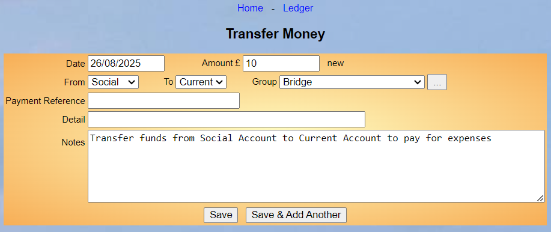

**7.3** **Transfer** **Money**

> Back

To transfer money between accounts, select **Transfer** **money** from
the Home Page or the Ledger.

Insert the **Date** and **Amount**

Select the **From** and **To** accounts from the drop-down lists.

**Payment** **Reference** **&** **Detail** (which will be displayed in
the Ledger) and **Notes** are optional. If appropriate add Group to be
associated to the transfer

> Press the **Save** button to commit the transfer or **Save** **&**
> **Add** **Another** to save this transfer and add another.

Transactions (with different numbers) will be added to the Ledger for
both associated Accounts:

**Social** **Account**

**Current** **Account**

Deleting either Transaction will delete the other one too.

**Note** **1:** some sites will be set up so that Membership fees are
credited to a Membership account. When these fees are banked the amount
needs to be transferred to the account reflecting the bank account -
usually Current.

**Note** **2:** Transfers are used to record moving money from one
Account to another and are represented by a pair of Transactions, one in
each Account. Each Transaction has a “**transfer_tkey**” which holds the
'tkey' of its paired transaction in the other account. Here is an
example of such a pair of Transactions:

||
||
||
||
||

Transfers can be edited, and the associated Transactions are modified in
the database as a pair.

Transfer Complication

We have come across a complication that you might need to be aware of.
If money comes into an account (e.g. Current) but you want to analyse it
against a Group which has all of its funds recorded in a different
account (e.g. Travel Account) then you cannot simply do a Transfer. If
you do it means the Group Rollover at Year End has transactions recorded
in the incorrect account. (e.g. Current account)

What you need to do is do a transaction for the funds from Current
Account and then a Credit transaction into the Travel Account and
associate this to the Group.

Revision History

||
||
||
||
||
||
||
||
